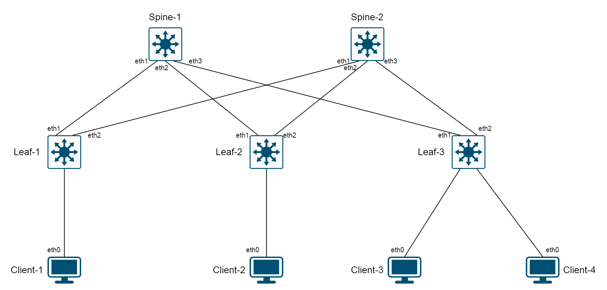
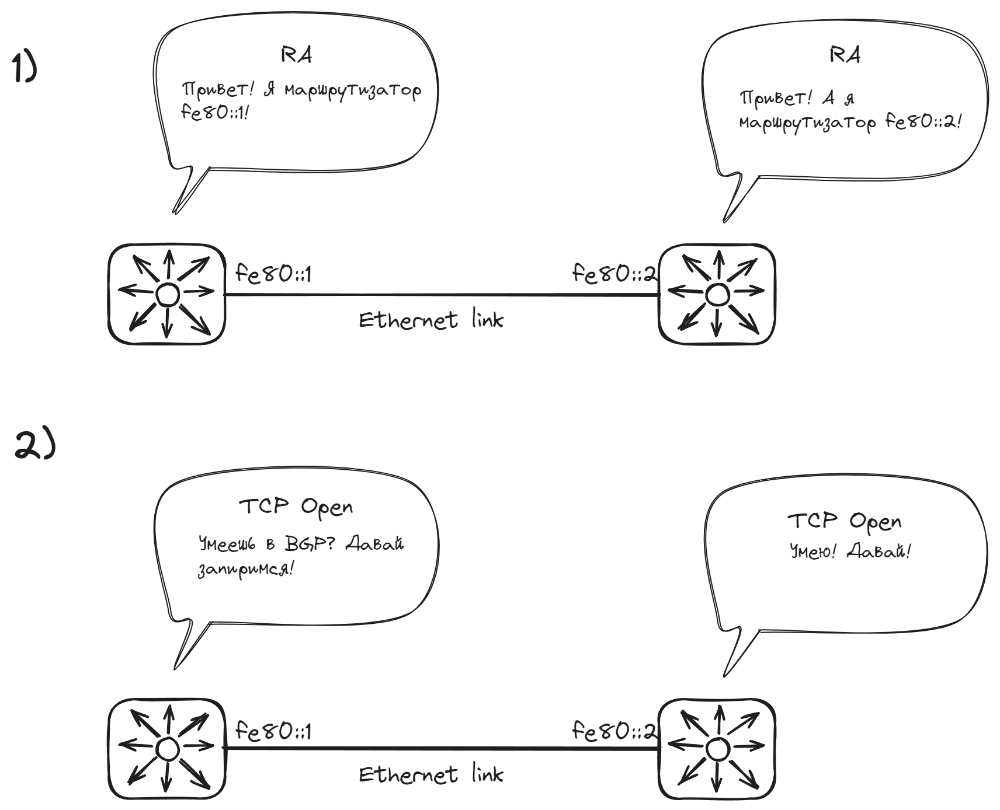

# Топология и IP-план
В качестве самого первого шага, еще раз взглянем на топологию и набросаем какой-то IP-план, которого мы будем придерживаться :).


Выделим IP-адреса для Loopback'ов и номера автономных систем для наших коммутаторов:

| Устройство | Loopback | ASN   |
| ---------- | -------- | ----- |
| Spine-1    | 10.1.0.1 | 65100 |
| Spine-2    | 10.1.0.2 | 65100 |
| Leaf-1     | 10.1.1.1 | 65001 |
| Leaf-2     | 10.1.1.2 | 65002 |
| Leaf-3     | 10.1.1.3 | 65003 | 

Спайны будут иметь общий номер AS, каждому лифу, наоборот, будет назначен уникальный номер.

Интересной особенностью нашей настройки underlay будет использование модели, описанной в [RFC 5549](https://datatracker.ietf.org/doc/html/rfc5549): Advertising IPv4 Network Layer Reachability Information with an IPv6 Next Hop, или анонсирование маршрутизационной информации для IPv4-префиксов с использованием IPv6-некстхопа. Что здесь имеется в виду?

Смысл такой схемы настройки состоит в том, чтобы уйти в underlay-сети от необходимости адресации BGP-соседей с использованием статически заданных стыковочных сетей.
То есть по сути мы можем просто указать процессу BGP на конкретный интерфейс и сказать - пирься!. :) Маршрутизаторы периодически отправляют в стыковочный линк сообщения IPv6 RA (Router Advertisment), объявляя себя роутерами. Эта информация и позволяет им узнавать о существовании на линке друг друга, а затем и устанавливать друг с другом BGP-сессию.

Еще раз замечу - никакой IPv4-адресации на стыковочных интерфейсах у нас не будет вообще. IPv4-сети (в данном случае /32 IPvLoopback-адреса) будут анонсироваться сIPv6-некстхопами.

Конечно, мы настроим аутентификацию для BGP. Использовать будем самый обычный MD5-алгоритм. Аутентификация нашей в доверенной сети нам нужна не для того, чтобы помешать какому-либо злоумышленнику порушить нашу сеть, а скорее для защиты от BGP speaker'а, внезапно и случайно оказавшегося в стыковочном широковещательном домене и запирившегося с нашими устройствами. Что там может прилететь от него и как поведет себя сеть - совершенно неясно, поэтому лучше перестраховаться от таких ситуаций и настроить хотя бы минимальную аутентификацию.

⚠️ Важное замечание! Достижимости между Loopback'ами спайнов у нас не будет, так как они не будут устанавливать анонсы Loopback друг от друга из-за того, что в AS-PATH будет присутствовать собственная AS. Это механизм предотвращения образования петель в eBGP. Данное ограничение можно обойти через использование команды "allowas-in" в настройках пир-группы. Однако так, как в нашей сети никакой нужды Spine'ам общаться между собой нет, мы не будем использовать эту команду.



Давайте уже начнем настраивать. Помним, что конечная наша цель - обеспечить связность между IPv4-лупбэками на каждом устройстве (за исключением пары Spine-Spine).

# Настройка
## Настройка Spine-1
### Базовые настройки
В первую очередь, перед тем, как начинать что-либо настраивать, мы переключимся на новый маршрутизационный движок ArBGP или, как его еще называют, режим "multi-agent". 

Без этого режима схему BGP Unnumbered построить на удастся. Точнее, BGP настроить получится, и мы даже установим нужные нам маршруты в FIB, но фактически трафик с использованием IPv6-некстхопа ходить не будет.

Активировать ArBGP можно с помощью команды `service routing protocols model multi-agent`, отданной в режиме глобальной конфигурации:
```
localhost(config)# service routing protocols model multi-agent
! Change will take effect only after switch reboot
```
Команда фактически применится после перезагрузки, но не беда. Идем пока дальше.

Установим hostname:
```
localhost(config)# hostname Spine-1
```

Включим IPv4- и IPv6-маршрутизацию. IPv6-маршрутизация нам необходима для реализации схемы BGP Unnumbered. Также включаем маршрутизацию IPv4 через IPv6-интерфейсы (что так же необходимо для работы по RFC 5549):
```
Spine-1(config)# ip routing ipv6 interfaces
Spine-1(config)# ipv6 unicast-routing 
```

Настроим Loopback-интерфейс. Пропишем на нем IP-адрес.
```
Spine-1(config)# interface loopback 0
Spine-1(config-if-Lo0)# ip address 10.1.0.1/32
```

Настроим интерфейсы, смотрящие в сторону Leaf'ов. Здесь мы переводим их в routed-режим, пишем осмысленное описание и включаем IPv6 на интерфейсе (нужно для генерации Link-local адресов):
```
Spine-1(config)# interface ethernet 1
Spine-1(config-if-Et1)# description Link_to_Leaf-1
Spine-1(config-if-Et1)# no switchport
Spine-1(config-if-Et1)# ipv6 enable

Spine-1(config)# interface ethernet 2
Spine-1(config-if-Et2)# description Link_to_Leaf-2
Spine-1(config-if-Et2)# no switchport
Spine-1(config-if-Et2)# ipv6 enable

Spine-1(config)# interface ethernet 3
Spine-1(config-if-Et3)# description Link_to_Leaf-3
Spine-1(config-if-Et3)# no switchport
Spine-1(config-if-Et3)# ipv6 enable
```

Остальные доступные интерфейсы отключим от греха подальше:
```
Spine-1(config)#interface ethernet 4-7
Spine-1(config-if-Et4-7)#shutdown
```

На этом основную настройку можно считать завершенной. Переходим к конфигурации протокола BGP.

### Настройка BGP
Первым шагом, еще до создания роутингового процесса, давайте создадим маршрутную карту и фильтрационный список AS.

Маршрутная карта, которую мы здесь создадим, позволит нам отфильтровать интерфейсы, сети которых мы будем редистрибьютить в BGP. Ведь нам необходимо анонсировать в BGP только адрес Loopback, а всему остальному там присутствовать не нужно. Данной маршрутной картой мы отловим только интерфейс Loopback0, все остальное попадет в deny.
```
Spine-1(config)# route-map BGP_REDISTRIBUTE_CONNECTED permit 10
Spine-1(config-route-map-BGP_REDISTRIBUTE_CONNECTED)# match interface Loopback0
```

Теперь фильтрационный список. Данный фильтрационный список позволит нам задать диапазон AS. Его мы будем использовать при настройке BGP-соседей для того, чтобы не указывать AS для каждого пира вручную. Более того, мы здесь оставим запас из трех AS для будущих Leaf'ов, которых у нас сейчас нет (ну так, на всякий случай). Таким образом при подключении новых коммутаторов не придется для них настраивать пиринг BGP отдельно. Данный список разрешает диапазон AS 65001-65006, все остальное в него не попадает.
```
Spine-1(config)# peer-filter LEAFS
Spine-1(config-peer-filter-LEAFS)# 10 match as-range 65001-65006 result accept
```

Теперь перейдем к настройке непосредственно BGP. Создадим процесс для автономной системы 65100 (AS наших Spine'ов):
```
Spine-1(config)# router bgp 65100
```

Включим ECMP для BGP. Возьмем некоторое число с запасом. Ну, пусть будет 64.
```
Spine-1(config-router-bgp)# maximum-paths 64
```

Создадим пир-группу CLOS. Она будет содержать все BGP-настройки, которые одинаковы для наших соседей. Таким образом, не придется набивать одно и то же для каждого соседа по отдельности.
```
Spine-1(config-router-bgp)# neighbor CLOS peer group
```

Отключим задержку перед уведомлением BGP-соседа об изменениях в нашей таблице маршрутизации. В нашей маленькой закрытой ЦОД-сети она не так актуальна, как в Большом Интернете:
```
Spine-1(config-router-bgp)# neighbor CLOS out-delay 0
```

Активируем для соседа BFD:
```
Spine-1(config-router-bgp)# neighbor CLOS bfd
```

Подкрутим Keepalive- и Hold-таймеры в сторону уменьшения. Это позволит уменьшить время сходимости.
```
Spine-1(config-router-bgp)# neighbor CLOS timers 3 9
```

Включим аутентификацию с помощью MD5-алгоритма. Это позволит защититься от теоретически внезапно могущих появиться "левых" BGP-спикеров на наших стыковочных каналах. Пароль установим "OTUS".
```
Spine-1(config-router-bgp)# neighbor CLOS password OTUS
```

Включим редистрибьюцию IPv4-маршрутов в наш BGP. Тут мы применяем ту самую маршрутную карту, которую мы создали ранее. Это позволит нам анонсировать в BGP исключительно подсети интерфейса Loopback0.
```
Spine-1(config-router-bgp)# redistribute connected route-map BGP_REDISTRIBUTE_CONNECTED
```

Объявляем наших "нейборов". А точнее, указываем интерфейсы, на которых мы хотим пириться с соседями. В нашем случае это Ethernet1-3, на которых расположены наши Leaf'ы, а также интерфейсы Ethernet 3-6, на которых в будущем могут разместиться новые Leaf-коммутаторы. :) Также применяем наш фильтрационный список AS, согласно которому пириться мы будем только с теми BGP speaker'ами, чьи AS совпадают с нашим списком (65001-65006). Соседство будет установлено с помощью IPv6 Link-Local адресов.
```
Spine-1(config-router-bgp)# neighbor interface Et1-6 peer-group CLOS peer-filter LEAFS
```

Активируем семейство адресов IPv4 Unicast для нашей группы CLOS и указываем, что в качестве next-hop'а для наших анонсов будут использоваться link-local адреса IPv6:
```
Spine-1(config-router-bgp)# address-family ipv4
Spine-1(config-router-bgp-af)# neighbor CLOS activate
Spine-1(config-router-bgp-af)# neighbor CLOS next-hop address-family ipv6 originate
```

На этом настройку нашего Spine-1 можно считать законченной. Приведем полную распечатку команд, которые мы вводили, для наглядности (и для более удобного копипастинга в Spine-2) :)

```
service routing protocols model multi-agent
!
hostname Spine-1
!
interface Ethernet1
   description Link_to_Leaf-1
   no switchport
   ipv6 enable
!
interface Ethernet2
   description Link_to_Leaf-2
   no switchport
   ipv6 enable
!
interface Ethernet3
   description Link_to_Leaf-3
   no switchport
   ipv6 enable
!
interface Ethernet4
   shutdown
!
interface Ethernet5
   shutdown
!
interface Ethernet6
   shutdown
!
interface Ethernet7
   shutdown
!
interface Loopback0
   ip address 10.1.0.1/32
!
ip routing ipv6 interfaces
ipv6 unicast-routing
!
route-map BGP_REDISTRIBUTE_CONNECTED permit 10
   match interface Loopback0
!
peer-filter LEAFS
   10 match as-range 65001-65006 result accept
!
router bgp 65100
   maximum-paths 64
   neighbor CLOS peer group
   neighbor CLOS out-delay 0
   neighbor CLOS bfd
   neighbor CLOS timers 3 9
   neighbor CLOS password OTUS
   redistribute connected route-map BGP_REDISTRIBUTE_CONNECTED
   neighbor interface Et1-6 peer-group CLOS peer-filter LEAFS
   !
   address-family ipv4
      neighbor CLOS activate
      neighbor CLOS next-hop address-family ipv6 originate
```

Теперь перезагрузим устройство, чтобы активировать режим "multi-agent".
```
Spine-1# reload now 
```

## Настройка Spine-2

Здесь всё так же, как и для Spine-1. Меняется только адрес loopback и hostname.
```
service routing protocols model multi-agent
!
hostname Spine-2
!
interface Ethernet1
   description Link_to_Leaf-1
   no switchport
   ipv6 enable
!
interface Ethernet2
   description Link_to_Leaf-2
   no switchport
   ipv6 enable
!
interface Ethernet3
   description Link_to_Leaf-3
   no switchport
   ipv6 enable
!
interface Ethernet4
   shutdown
!
interface Ethernet5
   shutdown
!
interface Ethernet6
   shutdown
!
interface Ethernet7
   shutdown
!
interface Loopback0
   ip address 10.1.0.2/32
!
ip routing ipv6 interfaces
!
ipv6 unicast-routing
!
route-map BGP_REDISTRIBUTE_CONNECTED permit 10
   match interface Loopback0
!
peer-filter LEAFS
   10 match as-range 65001-65006 result accept
!
router bgp 65100
   maximum-paths 64
   neighbor CLOS peer group
   neighbor CLOS out-delay 0
   neighbor CLOS bfd
   neighbor CLOS timers 3 9
   neighbor CLOS password OTUS
   redistribute connected route-map BGP_REDISTRIBUTE_CONNECTED
   neighbor interface Et1-6 peer-group CLOS peer-filter LEAFS
   !
   address-family ipv4
      neighbor CLOS activate
      neighbor CLOS next-hop address-family ipv6 originate
```

Закопипастим всё это хозяйство в Spine-2, сделаем `write` и `reload now`.

## Настройка Leaf-1

Здесь у нас будут небольшие различия в плане настройки по сравнению со Spine-ами.
Во-первых, так как AS Spine'ов у нас одна, то и фильтрационный список мы указывать не будем, а явно зададим "remote-as 65100". Во-вторых, локальная AS для каждого Leaf у нас уникальна. В остальном все то же самое, если не считать мелочи, вроде описаний интерфейсов и количества аплинков.

Приведу просто готовую простыню для копипастинга, без пояснения по каждой команде отдельно, так как нового здесь ничего нет.
```
service routing protocols model multi-agent
!
hostname Leaf-1
!
interface Ethernet1
   description Link_to_Spine-1
   no switchport
   ipv6 enable
!
interface Ethernet2
   description Link_to_Spine-2
   no switchport
   ipv6 enable
!
interface Ethernet3
   shutdown
!
interface Ethernet4
   shutdown
!
interface Ethernet5
   shutdown
!
interface Ethernet6
   shutdown
!
interface Ethernet7
   shutdown
!
interface Loopback0
   ip address 10.1.1.1/32
!
ip routing ipv6 interfaces
!
ipv6 unicast-routing
!
route-map BGP_REDISTRIBUTE_CONNECTED permit 10
   match interface Loopback0
!
router bgp 65001
   maximum-paths 64
   neighbor CLOS peer group
   neighbor CLOS out-delay 0
   neighbor CLOS bfd
   neighbor CLOS timers 3 9
   neighbor CLOS password OTUS
   redistribute connected route-map BGP_REDISTRIBUTE_CONNECTED
   neighbor interface Et1-2 peer-group CLOS remote-as 65100
   !
   address-family ipv4
      neighbor CLOS activate
      neighbor CLOS next-hop address-family ipv6 originate
!
end
```

Делаем `write` и `reload now`.

## Настройка Leaf-2

Всё то же самое, что и для Leaf-1. Другой IP на Loopback, другая локальная AS (65002).
```
service routing protocols model multi-agent
!
hostname Leaf-2
!
interface Ethernet1
   description Link_to_Spine-1
   no switchport
   ipv6 enable
!
interface Ethernet2
   description Link_to_Spine-2
   no switchport
   ipv6 enable
!
interface Ethernet3
   shutdown
!
interface Ethernet4
   shutdown
!
interface Ethernet5
   shutdown
!
interface Ethernet6
   shutdown
!
interface Ethernet7
   shutdown
!
interface Loopback0
   ip address 10.1.1.2/32
!
ip routing ipv6 interfaces
!
ipv6 unicast-routing
!
route-map BGP_REDISTRIBUTE_CONNECTED permit 10
   match interface Loopback0
!
router bgp 65002
   maximum-paths 64
   neighbor CLOS peer group
   neighbor CLOS out-delay 0
   neighbor CLOS bfd
   neighbor CLOS timers 3 9
   neighbor CLOS password OTUS
   redistribute connected route-map BGP_REDISTRIBUTE_CONNECTED
   neighbor interface Et1-2 peer-group CLOS remote-as 65100
   !
   address-family ipv4
      neighbor CLOS activate
      neighbor CLOS next-hop address-family ipv6 originate
```

Делаем `write` и `reload now`.

## Настройка Leaf-3

Всё то же самое, что и для Leaf-1 и Leaf-2. Другой IP на Loopback, другая локальная AS (65003).
```
service routing protocols model multi-agent
!
hostname Leaf-3
!
interface Ethernet1
   description Link_to_Spine-1
   no switchport
   ipv6 enable
!
interface Ethernet2
   description Link_to_Spine-2
   no switchport
   ipv6 enable
!
interface Ethernet3
   shutdown
!
interface Ethernet4
   shutdown
!
interface Ethernet5
   shutdown
!
interface Ethernet6
   shutdown
!
interface Ethernet7
   shutdown
!
interface Loopback0
   ip address 10.1.1.3/32
!
ip routing ipv6 interfaces
!
ipv6 unicast-routing
!
route-map BGP_REDISTRIBUTE_CONNECTED permit 10
   match interface Loopback0
!
router bgp 65003
   maximum-paths 64
   neighbor CLOS peer group
   neighbor CLOS out-delay 0
   neighbor CLOS bfd
   neighbor CLOS timers 3 9
   neighbor CLOS password OTUS
   redistribute connected route-map BGP_REDISTRIBUTE_CONNECTED
   neighbor interface Et1-2 peer-group CLOS remote-as 65100
   !
   address-family ipv4
      neighbor CLOS activate
      neighbor CLOS next-hop address-family ipv6 originate
```

Делаем `write` и `reload now`.

# Проверки

## Проверка Spine-1

Во-первых, проверим IPv4- и IPv6-адресации:
```
Spine-1# show ip interface brief
                                                                        Address
Interface        IP Address       Status      Protocol           MTU    Owner  
---------------- ---------------- ----------- ------------- ----------- -------
Ethernet1        unassigned       up          up                1500           
Ethernet2        unassigned       up          up                1500           
Ethernet3        unassigned       up          up                1500           
Loopback0        10.1.0.1/32      up          up               65535           
Management1      unassigned       down        down              1500           
```
```
Spine-1# show ipv6 interface brief
Interface  Status   MTU  IPv6 Address                   Addr State  Addr Source
---------- ------- ----- ----------------------------- ------------ -----------
Et1        up      1500  fe80::523c:3aff:fe3f:d9d7/64   up          link local 
Et2        up      1500  fe80::523c:3aff:fe3f:d9d7/64   up          link local 
Et3        up      1500  fe80::523c:3aff:fe3f:d9d7/64   up          link local 
```
Все выглядит в порядке. Link-local адреса на месте, IPv4-loopback присутствует.

Проверим, что список ASN и маршрутная карта созданы корректно:
```
Spine-1# show peer-filter LEAFS
peer-filter LEAFS
      10 match as-range 65001-65006 result accept
```
```
Spine-1# show route-map BGP_REDISTRIBUTE_CONNECTED
route-map BGP_REDISTRIBUTE_CONNECTED permit 10
  Description:
  Match clauses:
    match interface Loopback0
  SubRouteMap:
  Set clauses:
```

Проверим состояние наших сессий и самую общую информацию о BGP:
```
Spine-1# show bgp summary
BGP summary information for VRF default
Router identifier 10.1.0.1, local AS number 65100
Neighbor                               AS Session State AFI/SAFI                AFI/SAFI State   NLRI Rcd   NLRI Acc
----------------------------- ----------- ------------- ----------------------- -------------- ---------- ----------
fe80::5208:f9ff:fe4a:bd4a%Et3       65003 Established   IPv4 Unicast            Negotiated              1          1
fe80::52af:28ff:fef4:a836%Et2       65002 Established   IPv4 Unicast            Negotiated              1          1
fe80::52cb:f9ff:fea2:93cf%Et1       65001 Established   IPv4 Unicast            Negotiated              1          1
```
Видим BGP-соседства в состоянии Up на все трех downlink-интерфейсах (т.е. интерфейсах в сторону лифов), AFI IPv4 включена, Router-ID корректный, локальный номер автономки - тоже.

Проверим BGP RIB:
```
Spine-1# show bgp ipv4 unicast
BGP routing table information for VRF default
Router identifier 10.1.0.1, local AS number 65100
Route status codes: s - suppressed contributor, * - valid, > - active, E - ECMP head, e - ECMP
                    S - Stale, c - Contributing to ECMP, b - backup, L - labeled-unicast
                    % - Pending BGP convergence
Origin codes: i - IGP, e - EGP, ? - incomplete
RPKI Origin Validation codes: V - valid, I - invalid, U - unknown
AS Path Attributes: Or-ID - Originator ID, C-LST - Cluster List, LL Nexthop - Link Local Nexthop

          Network                Next Hop              Metric  AIGP       LocPref Weight  Path
 * >      10.1.0.1/32            -                     -       -          -       0       i
 * >      10.1.1.1/32            fe80::52cb:f9ff:fea2:93cf%Et1 0       -          100     0       65001 i
 * >      10.1.1.2/32            fe80::52af:28ff:fef4:a836%Et2 0       -          100     0       65002 i
 * >      10.1.1.3/32            fe80::5208:f9ff:fe4a:bd4a%Et3 0       -          100     0       65003 i
```
Здесь мы видим маршруты до каждого Loopback'а, кроме Spine-2. Маршруты к Loopback'ам лифов имеют Link-local некст-хопы на нужных интерфейсах. Маршрут Loopback для Spine-2 мы отвергли из-за того, что наша AS (65100) присутствует в его AS-PATH. Но не беда, связанность между Loopback'ами спайнов нам не нужна.

Посмотрим в таблицу маршрутизации:
```
Spine-1#show ip route

VRF: default
Codes: C - connected, S - static, K - kernel, 
       O - OSPF, IA - OSPF inter area, E1 - OSPF external type 1,
       E2 - OSPF external type 2, N1 - OSPF NSSA external type 1,
       N2 - OSPF NSSA external type2, B - Other BGP Routes,
       B I - iBGP, B E - eBGP, R - RIP, I L1 - IS-IS level 1,
       I L2 - IS-IS level 2, O3 - OSPFv3, A B - BGP Aggregate,
       A O - OSPF Summary, NG - Nexthop Group Static Route,
       V - VXLAN Control Service, M - Martian,
       DH - DHCP client installed default route,
       DP - Dynamic Policy Route, L - VRF Leaked,
       G  - gRIBI, RC - Route Cache Route

Gateway of last resort is not set

 C        10.1.0.1/32 [0/0]
           via Loopback0, directly connected
 B E      10.1.1.1/32 [200/0]
           via fe80::52cb:f9ff:fea2:93cf, Ethernet1
 B E      10.1.1.2/32 [200/0]
           via fe80::52af:28ff:fef4:a836, Ethernet2
 B E      10.1.1.3/32 [200/0]
           via fe80::5208:f9ff:fe4a:bd4a, Ethernet3
```
Маршруты в FIB установлены.

В последнюю очередь проверим состояние наших BFD-сессий:
```
Spine-1#show bfd peers
VRF name: default
-----------------
DstAddr                        MyDisc    YourDisc  Interface/Transport    Type 
-------------------------- ----------- ----------- -------------------- -------
fe80::5208:f9ff:fe4a:bd4a  2501702570  2092330032        Ethernet3(15)  normal 
fe80::52af:28ff:fef4:a836  1783835714   771289564        Ethernet2(14)  normal 
fe80::52cb:f9ff:fea2:93cf  1326818095  2311906316        Ethernet1(13)  normal 

           LastUp       LastDown            LastDiag    State
-------------------- -------------- ------------------- -----
   07/02/24 14:49             NA       No Diagnostic       Up
   07/02/24 14:48             NA       No Diagnostic       Up
   07/02/24 14:49             NA       No Diagnostic       Up
```
Все выглядит в порядке.

## Проверка Spine-2

Быстренько пробежимся по Spine-2

```
Spine-2# show ip interface brief
                                                                        Address
Interface        IP Address       Status      Protocol           MTU    Owner  
---------------- ---------------- ----------- ------------- ----------- -------
Ethernet1        unassigned       up          up                1500           
Ethernet2        unassigned       up          up                1500           
Ethernet3        unassigned       up          up                1500           
Loopback0        10.1.0.2/32      up          up               65535           
Management1      unassigned       down        down              1500           
```
```
Spine-2# show ipv6 interface brief
Interface  Status   MTU  IPv6 Address                   Addr State  Addr Source
---------- ------- ----- ----------------------------- ------------ -----------
Et1        up      1500  fe80::5234:ceff:fe1e:87c9/64   up          link local 
Et2        up      1500  fe80::5234:ceff:fe1e:87c9/64   up          link local 
Et3        up      1500  fe80::5234:ceff:fe1e:87c9/64   up          link local 
```

```
Spine-2# show bgp summary
BGP summary information for VRF default
Router identifier 10.1.0.2, local AS number 65100
Neighbor                               AS Session State AFI/SAFI                AFI/SAFI State   NLRI Rcd   NLRI Acc
----------------------------- ----------- ------------- ----------------------- -------------- ---------- ----------
fe80::5208:f9ff:fe4a:bd4a%Et3       65003 Established   IPv4 Unicast            Negotiated              1          1
fe80::52af:28ff:fef4:a836%Et2       65002 Established   IPv4 Unicast            Negotiated              1          1
fe80::52cb:f9ff:fea2:93cf%Et1       65001 Established   IPv4 Unicast            Negotiated              1          1
```

Проверим BGP RIB:
```
Spine-2# show bgp ipv4 unicast
BGP routing table information for VRF default
Router identifier 10.1.0.2, local AS number 65100
Route status codes: s - suppressed contributor, * - valid, > - active, E - ECMP head, e - ECMP
                    S - Stale, c - Contributing to ECMP, b - backup, L - labeled-unicast
                    % - Pending BGP convergence
Origin codes: i - IGP, e - EGP, ? - incomplete
RPKI Origin Validation codes: V - valid, I - invalid, U - unknown
AS Path Attributes: Or-ID - Originator ID, C-LST - Cluster List, LL Nexthop - Link Local Nexthop

          Network                Next Hop              Metric  AIGP       LocPref Weight  Path
 * >      10.1.0.2/32            -                     -       -          -       0       i
 * >      10.1.1.1/32            fe80::52cb:f9ff:fea2:93cf%Et1 0       -          100     0       65001 i
 * >      10.1.1.2/32            fe80::52af:28ff:fef4:a836%Et2 0       -          100     0       65002 i
 * >      10.1.1.3/32            fe80::5208:f9ff:fe4a:bd4a%Et3 0       -          100     0       65003 i
```

Посмотрим в таблицу маршрутизации:
```
Spine-2# show ip route

VRF: default
Codes: C - connected, S - static, K - kernel, 
       O - OSPF, IA - OSPF inter area, E1 - OSPF external type 1,
       E2 - OSPF external type 2, N1 - OSPF NSSA external type 1,
       N2 - OSPF NSSA external type2, B - Other BGP Routes,
       B I - iBGP, B E - eBGP, R - RIP, I L1 - IS-IS level 1,
       I L2 - IS-IS level 2, O3 - OSPFv3, A B - BGP Aggregate,
       A O - OSPF Summary, NG - Nexthop Group Static Route,
       V - VXLAN Control Service, M - Martian,
       DH - DHCP client installed default route,
       DP - Dynamic Policy Route, L - VRF Leaked,
       G  - gRIBI, RC - Route Cache Route

Gateway of last resort is not set

 C        10.1.0.2/32 [0/0]
           via Loopback0, directly connected
 B E      10.1.1.1/32 [200/0]
           via fe80::52cb:f9ff:fea2:93cf, Ethernet1
 B E      10.1.1.2/32 [200/0]
           via fe80::52af:28ff:fef4:a836, Ethernet2
 B E      10.1.1.3/32 [200/0]
           via fe80::5208:f9ff:fe4a:bd4a, Ethernet3
```

```
Spine-2# show bfd peers
VRF name: default
-----------------
DstAddr                        MyDisc    YourDisc  Interface/Transport    Type 
-------------------------- ----------- ----------- -------------------- -------
fe80::5208:f9ff:fe4a:bd4a  3261913082  3785822788        Ethernet3(15)  normal 
fe80::52af:28ff:fef4:a836  3776431152   813053071        Ethernet2(14)  normal 
fe80::52cb:f9ff:fea2:93cf   847058750    61814022        Ethernet1(13)  normal 

           LastUp       LastDown            LastDiag    State
-------------------- -------------- ------------------- -----
   07/02/24 14:45             NA       No Diagnostic       Up
   07/02/24 14:45             NA       No Diagnostic       Up
   07/02/24 14:41             NA       No Diagnostic       Up
```

Все выглядит в порядке. Перейдем к лифам.

## Проверка Leaf-1

```
Leaf-1# show ip interface brief
                                                                        Address
Interface        IP Address       Status      Protocol           MTU    Owner  
---------------- ---------------- ----------- ------------- ----------- -------
Ethernet1        unassigned       up          up                1500           
Ethernet2        unassigned       up          up                1500           
Loopback0        10.1.1.1/32      up          up               65535           
Management1      unassigned       down        down              1500           
```
```
Leaf-1# show ipv6 interface brief
Interface  Status   MTU  IPv6 Address                   Addr State  Addr Source
---------- ------- ----- ----------------------------- ------------ -----------
Et1        up      1500  fe80::52cb:f9ff:fea2:93cf/64   up          link local 
Et2        up      1500  fe80::52cb:f9ff:fea2:93cf/64   up          link local 
```

```
Leaf-1# show bgp summary
BGP summary information for VRF default
Router identifier 10.1.1.1, local AS number 65001
Neighbor                               AS Session State AFI/SAFI                AFI/SAFI State   NLRI Rcd   NLRI Acc
----------------------------- ----------- ------------- ----------------------- -------------- ---------- ----------
fe80::5234:ceff:fe1e:87c9%Et2       65100 Established   IPv4 Unicast            Negotiated              3          3
fe80::523c:3aff:fe3f:d9d7%Et1       65100 Established   IPv4 Unicast            Negotiated              3          3
```
BGP-сессии установлены только со Spine-ами.

Проверим BGP RIB:
```
Leaf-1# show bgp ipv4 unicast
BGP routing table information for VRF default
Router identifier 10.1.1.1, local AS number 65001
Route status codes: s - suppressed contributor, * - valid, > - active, E - ECMP head, e - ECMP
                    S - Stale, c - Contributing to ECMP, b - backup, L - labeled-unicast
                    % - Pending BGP convergence
Origin codes: i - IGP, e - EGP, ? - incomplete
RPKI Origin Validation codes: V - valid, I - invalid, U - unknown
AS Path Attributes: Or-ID - Originator ID, C-LST - Cluster List, LL Nexthop - Link Local Nexthop

          Network                Next Hop              Metric  AIGP       LocPref Weight  Path
 * >      10.1.0.1/32            fe80::523c:3aff:fe3f:d9d7%Et1 0       -          100     0       65100 i
 * >      10.1.0.2/32            fe80::5234:ceff:fe1e:87c9%Et2 0       -          100     0       65100 i
 * >      10.1.1.1/32            -                     -       -          -       0       i
 * >Ec    10.1.1.2/32            fe80::5234:ceff:fe1e:87c9%Et2 0       -          100     0       65100 65002 i
 *  ec    10.1.1.2/32            fe80::523c:3aff:fe3f:d9d7%Et1 0       -          100     0       65100 65002 i
 * >Ec    10.1.1.3/32            fe80::5234:ceff:fe1e:87c9%Et2 0       -          100     0       65100 65003 i
 *  ec    10.1.1.3/32            fe80::523c:3aff:fe3f:d9d7%Et1 0       -          100     0       65100 65003 i
```

Посмотрим в таблицу маршрутизации:
```
Leaf-1# show ip route

VRF: default
Codes: C - connected, S - static, K - kernel, 
       O - OSPF, IA - OSPF inter area, E1 - OSPF external type 1,
       E2 - OSPF external type 2, N1 - OSPF NSSA external type 1,
       N2 - OSPF NSSA external type2, B - Other BGP Routes,
       B I - iBGP, B E - eBGP, R - RIP, I L1 - IS-IS level 1,
       I L2 - IS-IS level 2, O3 - OSPFv3, A B - BGP Aggregate,
       A O - OSPF Summary, NG - Nexthop Group Static Route,
       V - VXLAN Control Service, M - Martian,
       DH - DHCP client installed default route,
       DP - Dynamic Policy Route, L - VRF Leaked,
       G  - gRIBI, RC - Route Cache Route

Gateway of last resort is not set

 B E      10.1.0.1/32 [200/0]
           via fe80::523c:3aff:fe3f:d9d7, Ethernet1
 B E      10.1.0.2/32 [200/0]
           via fe80::5234:ceff:fe1e:87c9, Ethernet2
 C        10.1.1.1/32 [0/0]
           via Loopback0, directly connected
 B E      10.1.1.2/32 [200/0]
           via fe80::523c:3aff:fe3f:d9d7, Ethernet1
           via fe80::5234:ceff:fe1e:87c9, Ethernet2
 B E      10.1.1.3/32 [200/0]
           via fe80::523c:3aff:fe3f:d9d7, Ethernet1
           via fe80::5234:ceff:fe1e:87c9, Ethernet2
```

```
Leaf-1# show bfd peers
VRF name: default
-----------------
DstAddr                        MyDisc    YourDisc  Interface/Transport    Type 
-------------------------- ----------- ----------- -------------------- -------
fe80::5234:ceff:fe1e:87c9    61814022   847058750        Ethernet2(14)  normal 
fe80::523c:3aff:fe3f:d9d7  2311906316  1326818095        Ethernet1(13)  normal 

           LastUp       LastDown            LastDiag    State
-------------------- -------------- ------------------- -----
   07/02/24 14:41             NA       No Diagnostic       Up
   07/02/24 14:49             NA       No Diagnostic       Up
```

Все выглядит в порядке.

## Проверка Leaf-2

```
Leaf-2# show ip interface brief
                                                                        Address
Interface        IP Address       Status      Protocol           MTU    Owner  
---------------- ---------------- ----------- ------------- ----------- -------
Ethernet1        unassigned       up          up                1500           
Ethernet2        unassigned       up          up                1500           
Loopback0        10.1.1.2/32      up          up               65535           
Management1      unassigned       down        down              1500           
```
```
Leaf-2# show ipv6 interface brief
Interface  Status   MTU  IPv6 Address                   Addr State  Addr Source
---------- ------- ----- ----------------------------- ------------ -----------
Et1        up      1500  fe80::52af:28ff:fef4:a836/64   up          link local 
Et2        up      1500  fe80::52af:28ff:fef4:a836/64   up          link local 
```

```
Leaf-2# show bgp summary
BGP summary information for VRF default
Router identifier 10.1.1.2, local AS number 65002
Neighbor                               AS Session State AFI/SAFI                AFI/SAFI State   NLRI Rcd   NLRI Acc
----------------------------- ----------- ------------- ----------------------- -------------- ---------- ----------
fe80::5234:ceff:fe1e:87c9%Et2       65100 Established   IPv4 Unicast            Negotiated              3          3
fe80::523c:3aff:fe3f:d9d7%Et1       65100 Established   IPv4 Unicast            Negotiated              3          3
```

```
Leaf-2# show bgp ipv4 unicast
BGP routing table information for VRF default
Router identifier 10.1.1.2, local AS number 65002
Route status codes: s - suppressed contributor, * - valid, > - active, E - ECMP head, e - ECMP
                    S - Stale, c - Contributing to ECMP, b - backup, L - labeled-unicast
                    % - Pending BGP convergence
Origin codes: i - IGP, e - EGP, ? - incomplete
RPKI Origin Validation codes: V - valid, I - invalid, U - unknown
AS Path Attributes: Or-ID - Originator ID, C-LST - Cluster List, LL Nexthop - Link Local Nexthop

          Network                Next Hop              Metric  AIGP       LocPref Weight  Path
 * >      10.1.0.1/32            fe80::523c:3aff:fe3f:d9d7%Et1 0       -          100     0       65100 i
 * >      10.1.0.2/32            fe80::5234:ceff:fe1e:87c9%Et2 0       -          100     0       65100 i
 * >Ec    10.1.1.1/32            fe80::5234:ceff:fe1e:87c9%Et2 0       -          100     0       65100 65001 i
 *  ec    10.1.1.1/32            fe80::523c:3aff:fe3f:d9d7%Et1 0       -          100     0       65100 65001 i
 * >      10.1.1.2/32            -                     -       -          -       0       i
 * >Ec    10.1.1.3/32            fe80::5234:ceff:fe1e:87c9%Et2 0       -          100     0       65100 65003 i
 *  ec    10.1.1.3/32            fe80::523c:3aff:fe3f:d9d7%Et1 0       -          100     0       65100 65003 i
```

```
Leaf-2# show ip route

VRF: default
Codes: C - connected, S - static, K - kernel, 
       O - OSPF, IA - OSPF inter area, E1 - OSPF external type 1,
       E2 - OSPF external type 2, N1 - OSPF NSSA external type 1,
       N2 - OSPF NSSA external type2, B - Other BGP Routes,
       B I - iBGP, B E - eBGP, R - RIP, I L1 - IS-IS level 1,
       I L2 - IS-IS level 2, O3 - OSPFv3, A B - BGP Aggregate,
       A O - OSPF Summary, NG - Nexthop Group Static Route,
       V - VXLAN Control Service, M - Martian,
       DH - DHCP client installed default route,
       DP - Dynamic Policy Route, L - VRF Leaked,
       G  - gRIBI, RC - Route Cache Route

Gateway of last resort is not set

 B E      10.1.0.1/32 [200/0]
           via fe80::523c:3aff:fe3f:d9d7, Ethernet1
 B E      10.1.0.2/32 [200/0]
           via fe80::5234:ceff:fe1e:87c9, Ethernet2
 B E      10.1.1.1/32 [200/0]
           via fe80::523c:3aff:fe3f:d9d7, Ethernet1
           via fe80::5234:ceff:fe1e:87c9, Ethernet2
 C        10.1.1.2/32 [0/0]
           via Loopback0, directly connected
 B E      10.1.1.3/32 [200/0]
           via fe80::523c:3aff:fe3f:d9d7, Ethernet1
           via fe80::5234:ceff:fe1e:87c9, Ethernet2
```

```
Leaf-2# show bfd peers
VRF name: default
-----------------
DstAddr                       MyDisc    YourDisc  Interface/Transport     Type 
-------------------------- ---------- ----------- -------------------- --------
fe80::5234:ceff:fe1e:87c9  813053071  3776431152        Ethernet2(14)   normal 
fe80::523c:3aff:fe3f:d9d7  771289564  1783835714        Ethernet1(13)   normal 

           LastUp       LastDown            LastDiag    State
-------------------- -------------- ------------------- -----
   07/02/24 14:45             NA       No Diagnostic       Up
   07/02/24 14:48             NA       No Diagnostic       Up
```

Все выглядит в порядке.

## Проверка Leaf-3

```
Leaf-3# show ip interface brief
                                                                        Address
Interface        IP Address       Status      Protocol           MTU    Owner  
---------------- ---------------- ----------- ------------- ----------- -------
Ethernet1        unassigned       up          up                1500           
Ethernet2        unassigned       up          up                1500           
Loopback0        10.1.1.3/32      up          up               65535           
Management1      unassigned       down        down              1500           
```
```
Leaf-3# show ipv6 interface brief
Interface  Status   MTU  IPv6 Address                   Addr State  Addr Source
---------- ------- ----- ----------------------------- ------------ -----------
Et1        up      1500  fe80::5208:f9ff:fe4a:bd4a/64   up          link local 
Et2        up      1500  fe80::5208:f9ff:fe4a:bd4a/64   up          link local 
```

```
Leaf-3# show bgp summary
BGP summary information for VRF default
Router identifier 10.1.1.3, local AS number 65003
Neighbor                               AS Session State AFI/SAFI                AFI/SAFI State   NLRI Rcd   NLRI Acc
----------------------------- ----------- ------------- ----------------------- -------------- ---------- ----------
fe80::5234:ceff:fe1e:87c9%Et2       65100 Established   IPv4 Unicast            Negotiated              3          3
fe80::523c:3aff:fe3f:d9d7%Et1       65100 Established   IPv4 Unicast            Negotiated              3          3
```

```
Leaf-3# show bgp ipv4 unicast
BGP routing table information for VRF default
Router identifier 10.1.1.3, local AS number 65003
Route status codes: s - suppressed contributor, * - valid, > - active, E - ECMP head, e - ECMP
                    S - Stale, c - Contributing to ECMP, b - backup, L - labeled-unicast
                    % - Pending BGP convergence
Origin codes: i - IGP, e - EGP, ? - incomplete
RPKI Origin Validation codes: V - valid, I - invalid, U - unknown
AS Path Attributes: Or-ID - Originator ID, C-LST - Cluster List, LL Nexthop - Link Local Nexthop

          Network                Next Hop              Metric  AIGP       LocPref Weight  Path
 * >      10.1.0.1/32            fe80::523c:3aff:fe3f:d9d7%Et1 0       -          100     0       65100 i
 * >      10.1.0.2/32            fe80::5234:ceff:fe1e:87c9%Et2 0       -          100     0       65100 i
 * >Ec    10.1.1.1/32            fe80::5234:ceff:fe1e:87c9%Et2 0       -          100     0       65100 65001 i
 *  ec    10.1.1.1/32            fe80::523c:3aff:fe3f:d9d7%Et1 0       -          100     0       65100 65001 i
 * >Ec    10.1.1.2/32            fe80::5234:ceff:fe1e:87c9%Et2 0       -          100     0       65100 65002 i
 *  ec    10.1.1.2/32            fe80::523c:3aff:fe3f:d9d7%Et1 0       -          100     0       65100 65002 i
 * >      10.1.1.3/32            -                     -       -          -       0       i
```

```
Leaf-3# show ip route

VRF: default
Codes: C - connected, S - static, K - kernel, 
       O - OSPF, IA - OSPF inter area, E1 - OSPF external type 1,
       E2 - OSPF external type 2, N1 - OSPF NSSA external type 1,
       N2 - OSPF NSSA external type2, B - Other BGP Routes,
       B I - iBGP, B E - eBGP, R - RIP, I L1 - IS-IS level 1,
       I L2 - IS-IS level 2, O3 - OSPFv3, A B - BGP Aggregate,
       A O - OSPF Summary, NG - Nexthop Group Static Route,
       V - VXLAN Control Service, M - Martian,
       DH - DHCP client installed default route,
       DP - Dynamic Policy Route, L - VRF Leaked,
       G  - gRIBI, RC - Route Cache Route

Gateway of last resort is not set

 B E      10.1.0.1/32 [200/0]
           via fe80::523c:3aff:fe3f:d9d7, Ethernet1
 B E      10.1.0.2/32 [200/0]
           via fe80::5234:ceff:fe1e:87c9, Ethernet2
 B E      10.1.1.1/32 [200/0]
           via fe80::523c:3aff:fe3f:d9d7, Ethernet1
           via fe80::5234:ceff:fe1e:87c9, Ethernet2
 B E      10.1.1.2/32 [200/0]
           via fe80::523c:3aff:fe3f:d9d7, Ethernet1
           via fe80::5234:ceff:fe1e:87c9, Ethernet2
 C        10.1.1.3/32 [0/0]
           via Loopback0, directly connected
```

```
Leaf-3# show bfd peers
VRF name: default
-----------------
DstAddr                        MyDisc    YourDisc  Interface/Transport    Type 
-------------------------- ----------- ----------- -------------------- -------
fe80::5234:ceff:fe1e:87c9  3785822788  3261913082        Ethernet2(14)  normal 
fe80::523c:3aff:fe3f:d9d7  2092330032  2501702570        Ethernet1(13)  normal 

           LastUp       LastDown            LastDiag    State
-------------------- -------------- ------------------- -----
   07/02/24 14:45             NA       No Diagnostic       Up
   07/02/24 14:49             NA       No Diagnostic       Up
```

Все выглядит в порядке.

## Проверка связанности между Loopback'ами
Теперь у нас underlay полностью настроен и пинги между Loopback'ами должны проходить на каждом устройстве. Проверим!

### Spine-1
ping Leaf-1
```
Spine-1# ping 10.1.1.1 repeat 3
PING 10.1.1.1 (10.1.1.1) 72(100) bytes of data.
80 bytes from 10.1.1.1: icmp_seq=1 ttl=65 time=9.12 ms
80 bytes from 10.1.1.1: icmp_seq=2 ttl=65 time=3.55 ms
80 bytes from 10.1.1.1: icmp_seq=3 ttl=65 time=3.33 ms

--- 10.1.1.1 ping statistics ---
3 packets transmitted, 3 received, 0% packet loss, time 17ms
rtt min/avg/max/mdev = 3.330/5.334/9.122/2.680 ms, ipg/ewma 8.660/7.788 ms
```

ping Leaf-2
```
Spine-1# ping 10.1.1.2 repeat 3
PING 10.1.1.2 (10.1.1.2) 72(100) bytes of data.
80 bytes from 10.1.1.2: icmp_seq=1 ttl=65 time=7.83 ms
80 bytes from 10.1.1.2: icmp_seq=2 ttl=65 time=3.46 ms
80 bytes from 10.1.1.2: icmp_seq=3 ttl=65 time=3.47 ms

--- 10.1.1.2 ping statistics ---
3 packets transmitted, 3 received, 0% packet loss, time 15ms
rtt min/avg/max/mdev = 3.461/4.922/7.830/2.056 ms, ipg/ewma 7.510/6.808 ms
```

ping Leaf-3
```
Spine-1# ping 10.1.1.3 repeat 3
PING 10.1.1.3 (10.1.1.3) 72(100) bytes of data.
80 bytes from 10.1.1.3: icmp_seq=1 ttl=65 time=8.00 ms
80 bytes from 10.1.1.3: icmp_seq=2 ttl=65 time=3.99 ms
80 bytes from 10.1.1.3: icmp_seq=3 ttl=65 time=3.93 ms

--- 10.1.1.3 ping statistics ---
3 packets transmitted, 3 received, 0% packet loss, time 16ms
rtt min/avg/max/mdev = 3.933/5.310/8.004/1.906 ms, ipg/ewma 8.143/7.056 ms
```

### Spine-2
ping Leaf-1
```
Spine-2# ping 10.1.1.1 repeat 3
PING 10.1.1.1 (10.1.1.1) 72(100) bytes of data.
80 bytes from 10.1.1.1: icmp_seq=1 ttl=65 time=7.86 ms
80 bytes from 10.1.1.1: icmp_seq=2 ttl=65 time=3.11 ms
80 bytes from 10.1.1.1: icmp_seq=3 ttl=65 time=3.98 ms

--- 10.1.1.1 ping statistics ---
3 packets transmitted, 3 received, 0% packet loss, time 15ms
rtt min/avg/max/mdev = 3.114/4.985/7.860/2.063 ms, ipg/ewma 7.551/6.856 ms
```

ping Leaf-2
```
Spine-2# ping 10.1.1.2 repeat 3
PING 10.1.1.2 (10.1.1.2) 72(100) bytes of data.
80 bytes from 10.1.1.2: icmp_seq=1 ttl=65 time=5.62 ms
80 bytes from 10.1.1.2: icmp_seq=2 ttl=65 time=3.39 ms
80 bytes from 10.1.1.2: icmp_seq=3 ttl=65 time=4.62 ms

--- 10.1.1.2 ping statistics ---
3 packets transmitted, 3 received, 0% packet loss, time 11ms
rtt min/avg/max/mdev = 3.399/4.551/5.625/0.910 ms, ipg/ewma 5.501/5.257 ms
```

ping Leaf-3
```
Spine-2# ping 10.1.1.3 repeat 3
PING 10.1.1.3 (10.1.1.3) 72(100) bytes of data.
80 bytes from 10.1.1.3: icmp_seq=1 ttl=65 time=6.53 ms
80 bytes from 10.1.1.3: icmp_seq=2 ttl=65 time=3.27 ms
80 bytes from 10.1.1.3: icmp_seq=3 ttl=65 time=3.30 ms

--- 10.1.1.3 ping statistics ---
3 packets transmitted, 3 received, 0% packet loss, time 13ms
rtt min/avg/max/mdev = 3.279/4.374/6.536/1.528 ms, ipg/ewma 6.502/5.776 ms
```

На лифах проверим только связность между лифами, так как связность в парах Leaf-Spine мы уже проверили.
### Leaf-1
ping Leaf-2
```
Leaf-1# ping 10.1.1.2 repeat 3
PING 10.1.1.2 (10.1.1.2) 72(100) bytes of data.
80 bytes from 10.1.1.2: icmp_seq=1 ttl=64 time=12.4 ms
80 bytes from 10.1.1.2: icmp_seq=2 ttl=64 time=7.31 ms
80 bytes from 10.1.1.2: icmp_seq=3 ttl=64 time=6.85 ms

--- 10.1.1.2 ping statistics ---
3 packets transmitted, 3 received, 0% packet loss, time 22ms
rtt min/avg/max/mdev = 6.859/8.868/12.432/2.528 ms, pipe 2, ipg/ewma 11.277/11.175 ms
```

ping Leaf-3
```
Leaf-1# ping 10.1.1.3 repeat 3
PING 10.1.1.3 (10.1.1.3) 72(100) bytes of data.
80 bytes from 10.1.1.3: icmp_seq=1 ttl=64 time=11.2 ms
80 bytes from 10.1.1.3: icmp_seq=2 ttl=64 time=6.83 ms
80 bytes from 10.1.1.3: icmp_seq=3 ttl=64 time=6.93 ms

--- 10.1.1.3 ping statistics ---
3 packets transmitted, 3 received, 0% packet loss, time 21ms
rtt min/avg/max/mdev = 6.835/8.322/11.201/2.037 ms, ipg/ewma 10.686/10.189 ms
```

### Leaf-2
ping Leaf-1
```
Leaf-2# ping 10.1.1.1 repeat 3
PING 10.1.1.1 (10.1.1.1) 72(100) bytes of data.
80 bytes from 10.1.1.1: icmp_seq=1 ttl=64 time=9.06 ms
80 bytes from 10.1.1.1: icmp_seq=2 ttl=64 time=6.70 ms
80 bytes from 10.1.1.1: icmp_seq=3 ttl=64 time=7.02 ms

--- 10.1.1.1 ping statistics ---
3 packets transmitted, 3 received, 0% packet loss, time 18ms
rtt min/avg/max/mdev = 6.707/7.599/9.065/1.049 ms, ipg/ewma 9.129/8.552 ms
```

ping Leaf-3
```
Leaf-2# ping 10.1.1.3 repeat 3
PING 10.1.1.3 (10.1.1.3) 72(100) bytes of data.
80 bytes from 10.1.1.3: icmp_seq=1 ttl=64 time=12.7 ms
80 bytes from 10.1.1.3: icmp_seq=2 ttl=64 time=7.94 ms
80 bytes from 10.1.1.3: icmp_seq=3 ttl=64 time=6.80 ms

--- 10.1.1.3 ping statistics ---
3 packets transmitted, 3 received, 0% packet loss, time 22ms
rtt min/avg/max/mdev = 6.809/9.161/12.734/2.568 ms, pipe 2, ipg/ewma 11.179/11.469 ms
```

### Leaf-3
ping Leaf-1
```
Leaf-3# ping 10.1.1.1 repeat 3
PING 10.1.1.1 (10.1.1.1) 72(100) bytes of data.
80 bytes from 10.1.1.1: icmp_seq=1 ttl=64 time=8.70 ms
80 bytes from 10.1.1.1: icmp_seq=2 ttl=64 time=7.25 ms
80 bytes from 10.1.1.1: icmp_seq=3 ttl=64 time=6.88 ms

--- 10.1.1.1 ping statistics ---
3 packets transmitted, 3 received, 0% packet loss, time 18ms
rtt min/avg/max/mdev = 6.883/7.613/8.705/0.792 ms, ipg/ewma 9.006/8.318 ms
```

ping Leaf-2
```
Leaf-3# ping 10.1.1.2 repeat 3
PING 10.1.1.2 (10.1.1.2) 72(100) bytes of data.
80 bytes from 10.1.1.2: icmp_seq=1 ttl=64 time=11.8 ms
80 bytes from 10.1.1.2: icmp_seq=2 ttl=64 time=8.48 ms
80 bytes from 10.1.1.2: icmp_seq=3 ttl=64 time=7.12 ms

--- 10.1.1.2 ping statistics ---
3 packets transmitted, 3 received, 0% packet loss, time 21ms
rtt min/avg/max/mdev = 7.121/9.146/11.831/1.980 ms, pipe 2, ipg/ewma 10.967/10.876 ms
```

# Заключение
Связность между Loopback'ами достигнута. Underlay у нас работает и теперь мы можем переходить к следующей главе - настройке L2 EVPN/VXLAN.