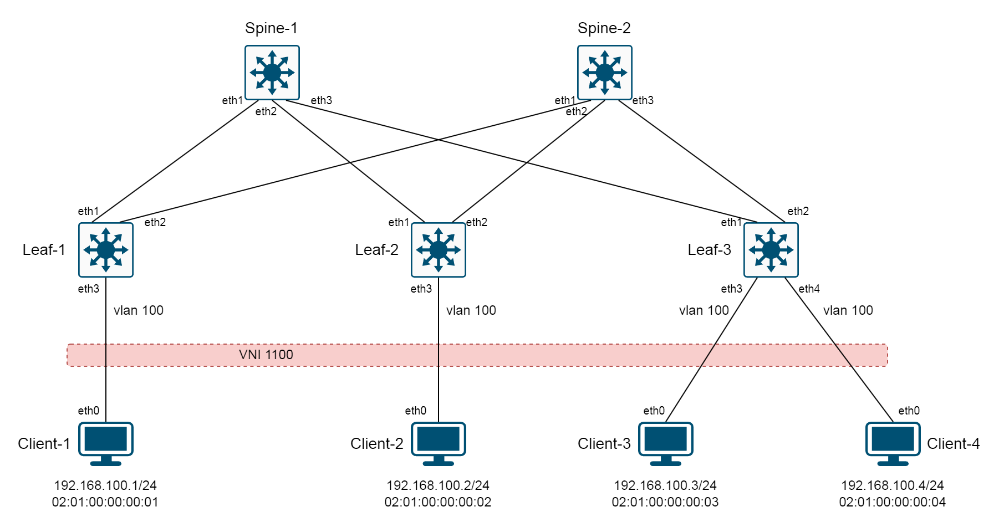

Итак, мы разобрались с underlay-сетью. Давайте приступим к настройке самого интересного - EVPN.

Отдельных нейборов для BGP-сессий для EVPN мы прописывать не будем, а просто активируем AFI L2VPN, SAFI EVPN в рамках уже установленных IPv4-BGP-сессий, которые мы создавали для underlay.
Таким образом и Underlay и EVPN будут работать в рамках одной и той же сессии и с одними и теми же соседями.

RFC 8365 описываем две модели сервиса, или, если сказать проще - о двух способах маппинга EVPN Instance на VLAN'ы. Первый способ - VLAN-Based, когда на каждый отдельный VLAN на устройстве создается отдельный инстанс EVPN и, следовательно, отдельная таблица MAC-VRF. Таким образом Route target в EVPN будет идентифицировать конкретный L2-домен.
Второй способ - VLAN-Aware Bundle, когда множество VLAN'ов мапятся на один EVPN-инстанс. Route target уже идентифицирует не L2-домен, а тенанта. MAC-VRF разбивается на подтаблицы, которые содержат MAC-адреса конкретных VNI. Для идентификации конкретного L2-домена в маршрутах EVPN заполняется поле Ethernet Tag ID, в которое и подставляется номер VNI.
Подробнее о моделях сервиса можно прочитать здесь: [RFC 8365](https://datatracker.ietf.org/doc/html/rfc8365#section-5.1.2).

Что же нам выбрать?

VLAN-Based:
- За: Простая и наглядная конфигурация, маппинг 1 к 1 всего: VLAN -> VNI -> MAC-VRF -> RD/RT. Очень наглядно и удобно.
- Против: На каждый VLAN создается собственный MAC-VRF. Конфигурация уникальных RD/RT на каждый L2-домен (ну RD ладно, он и автоматически неплохо прописывается). RT же лучше задавать вручную - во-первых, нам важно какое-то осмысленное значение, во-вторых могут быть сюрпризы с автоназначением RT, если железки будут их генерировать в разном формате. Меньше всего хочется траблшутить проблемы, вызванные какими-то несовпадениями RT. Вообщем, RT лучше задать вручную.
- Против: Из первого пункта вытекает (потенциально) большая загруженность плоскости управления из-за необходимости обработки целой кучи отдельных EVI (MAC-VRF). Например, тысяча VLAN'ов будет равняться тысяче MAC-VRF.
- За: С другой стороны, это спорный вопрос, да и в любом случае, на современном железе это вряд ли актуально, и тут скорее вопрос какой подход вам лично больше нравится.

VLAN-Aware:
- за: На все VLAN'ы конкретного клиента мы создаем один MAC-VRF, один RD и один RT. VLAN'ы отделяются друг от друга внутри MAC-VRF с помощью под-таблиц. Плоскость управления обрабатывается проще (в теории). Плоскость управления понимает, какой подтаблице принадлежит маршрут (MAC) с помощью поля Ethernet Tag ID в маршруте, в которое помещается значение VNI. На плоскости данных принадлежность определяется номером VNI.
- против: VTEP'ы будут принимать маршруты даже для тех VLAN'ов тенанта, которые на них не настроены (RT-то совпадает!). Но большой ли это минус? К сожалению, не готов ответить. Будем считать, что он просто есть, а его значительность определит каждый для себя лично.

Лично мне больше симпатичен и нагляден подход VLAN-Based, поэтому его и будем настраивать.

BUM-трафик будем рассылать с помощью механизма Ingress Replication (копируем BUM-пакеты и рассылаем их юникастом на нужные удаленные VTEP). Таким образом нам не понадобится дополнительно организовывать маршрутизацию мультикаст-трафика в underlay-сети.

Определимся с адресацией для клиентов. В рамках нашего L2-сервиса мы поместим всех наших клиентов в один широковещательный домен, то есть обеспечим им связность друг с другом на 2-ом уровне. Помним, что линки между коммутаторами у нас L3, а, следовательно, без VXLAN-туннелирования нам не обойтись.

Каждый клиент будет находиться в VLAN 100 на своем коммутаторе.

| Клиент   | MAC               | IP/Mask          |
| -------- | ----------------- | ---------------- |
| Client-1 | 02:01:00:00:00:01 | 192.168.100.1/24 |
| Client-2 | 02:01:00:00:00:02 | 192.168.100.2/24 |
| Client-3 | 02:01:00:00:00:03 | 192.168.100.3/24 |
| Client-4 | 02:01:00:00:00:04 | 192.168.100.4/24 |

Ассоциация VLAN:VNI

| VLAN | VNI  |
| ---- | ---- |
| 100  | 1100 |

Конечная цель нашей настройки состоит в том, чтобы каждый клиент смог обменяться пингами с остальными клиентами.

Топология:


# Настройка
Я подробно опишу конфигурацию только для Spine-1 и Leaf-1. Все остальные коммутаторы будут настроены максимально похоже и для них будут приведены лишь распечатки нужных команд.

## Настройка Spine-1
В принципе, вся настройка на Spine сведется к активации address-family EVPN и включению поддержки расширенных комьюнити, которые нам необходимы для передачи route-target'ов, которые из себя и представляют эти самые расширенные комьюнити. Без Route target'ов ни один Leaf не установит информацию о хостах в свой MAC-VRF, так как именно по RT определяется, какому MAC-VRF должна принадлежать данная маршрутная информация.

```
Spine-1(config)# router bgp 65100
Spine-1(config-router-bgp)# neighbor CLOS send-community extended
Spine-1(config-router-bgp)# address-family evpn
Spine-1(config-router-bgp-af)# neighbor CLOS activate
```

Сразу получаем в консоль сообщение, как ресетнулись наши BGP-сессии:
```
Jul  2 15:31:15 Spine-1 Bgp: %BGP-3-NOTIFICATION: sent to neighbor fe80::52af:28ff:fef4:a836%Et2 (VRF default AS 65002) 6/6 (Cease/other configuration change <Hard Reset>) 0 bys
Jul  2 15:31:15 Spine-1 Bgp: %BGP-3-NOTIFICATION: sent to neighbor fe80::5208:f9ff:fe4a:bd4a%Et3 (VRF default AS 65003) 6/6 (Cease/other configuration change <Hard Reset>) 0 bytes
Jul  2 15:31:15 Spine-1 Bgp: %BGP-3-NOTIFICATION: sent to neighbor fe80::52cb:f9ff:fea2:93cf%Et1 (VRF default AS 65001) 6/6 (Cease/other configuration change <Hard Reset>) 0 bytes
```

Ну и на этом настройка Spine-1 закончена. Переходим к Spine-2 :)

## Настройка Spine-2
Все ровно то же самое.
```
Spine-2(config)# router bgp 65100
Spine-2(config-router-bgp)# neighbor CLOS send-community extended
Spine-2(config-router-bgp)# address-family evpn
Spine-2(config-router-bgp-af)# neighbor CLOS activate
```

## Настройка Leaf-1

А вот тут уже начинается интересное.

Во-первых, создадим VLAN 100, где сидит Client-1:
```
Leaf-1(config)# vlan 100
Leaf-1(config-vlan-100)# name Clients
```

Теперь настроим физический порт, в который подключен клиент. Здесь мы задаем описание порта и указываем, что порт принадлежит VLAN 100, и трафик должен отправляться и приниматься нетегированным. Также мы включаем интерфейс (до этого он был административно отключен).
```
Leaf-1(config)# interface Ethernet 3
Leaf-1(config-if-Et3)# description Link_to_Client-1
Leaf-1(config-if-Et3)# switchport access vlan 100
Leaf-1(config-if-Et3)# no shutdown
```

Теперь настроим интерфейс VXLAN. Здесь мы указываем, что VTEP Source IP-адрес нужно брать с интерфейса Loopback0 (помните, тот самый 10.1.1.1, который мы анонсируем в underlay). Этот IP-адрес будет использоваться как внешний Source IP в VXLAN-пакетах. Далее мы задаем соответствие VLAN 100 к VNI 1100, как бы соединяя их перемычкой или мостом. Трафик из VLAN 100 при выходе из VXLAN-интерфейса должен инкапсулироваться в VNI 1100 и наоборот, при получении пакета из overlay-сети, мы декапсулируем его из VXLAN и направляем в порты VLAN'а 100.
```
Leaf-1(config)# interface vxlan 1
Leaf-1(config-if-Vx1)# vxlan source-interface Loopback0
Leaf-1(config-if-Vx1)# vxlan vlan 100 vni 1100
```

Теперь настроим нашу MAC-VRF:
```
Leaf-1(config)# router bgp 65001
Leaf-1(config-router-bgp)# vlan 100
Leaf-1(config-macvrf-100)# rd auto
Leaf-1(config-macvrf-100)# route-target both 100:100
Leaf-1(config-macvrf-100)# redistribute learned
```
Немножко пояснения. Значение RD (Route Distinguisher) нужно для того, чтобы зауникалить маршруты к одному и тому же префиксу, но которые принадлежат разным VRF. Чтобы BGP не пытался выбрать какой-то один из них как best path и установить только его в FIB, мы и делаем эти маршруты уникальными с помощью задания значения RD. RD можно задавать в нескольких форматах, и они описаны в RFC, но, по сути, BGP не парсит эту информацию и не пытается разобрать структуру RD - для него это просто некое значение, делающее конкретный маршрут уникальным.

Route target'ы нужны для того, чтобы принимающий VTEP знал, в какой VRF установить ту или иную маршрутную информацию. Политика экспорта из VRF на анонсирующем VTEP должна совпадать с политикой импорта в VRF назначения на принимающем VTEP. Например VTEP1 анонсирует маршруты некоего EVI с RT 1:1. VTEP2 установит их в VRF, на который настроена политика импорта RT 1:1.

Здесь мы настраиваем MAC-VRF для VLAN 100. Route Distinguisher зададим как auto, потому что механизм генерации RD у аристы по умолчанию нас вполне устраивает (LoopbackIP:VID). Далее мы задаем route-target как 100:100 (как на импорт, так и на экспорт), таким образов уникально обозначив конкретный MAC-VRF в пределах нашей фабрики. Ну и напоследок даем указание распространять в EVPN информацию о всех изученных локально хостах в данном VLAN.

Теперь включим AF EVPN в настройках процесса BGP и активируем отсылку расширенных комьюнити:
```
Leaf-1(config)# router bgp 65001
Leaf-1(config-router-bgp)# neighbor CLOS send-community extended
Leaf-1(config-router-bgp)# address-family evpn
Leaf-1(config-router-bgp-af)# neighbor CLOS activate
```

Общий вид наших настроек EVPN:
```
vlan 100
   name Clients
!
interface Ethernet3
   description Link_to_Client-1
   switchport access vlan 100
   no shutdown
!
interface Vxlan1
   vxlan source-interface Loopback0
   vxlan vlan 100 vni 1100
!
router bgp 65001
   neighbor CLOS send-community extended
   vlan 100
      rd auto
      route-target both 100:100
      redistribute learned
   !
   address-family evpn
      neighbor CLOS activate   
```

Всё. Остальные коммутаторы Leaf настраиваем по тому же принципу. Буду приводить только распечатку настроек EVPN для Leaf-2 и Leaf-3.

## Настройка Leaf-2
```
vlan 100
   name Clients
!
interface Ethernet3
   description Link_to_Client-2
   switchport access vlan 100
   no shutdown
!
interface Vxlan1
   vxlan source-interface Loopback0
   vxlan vlan 100 vni 1100
!
router bgp 65002
   neighbor CLOS send-community extended 
   vlan 100
      rd auto
      route-target both 100:100
      redistribute learned
   !
   address-family evpn
      neighbor CLOS activate
end
```

## Настройка Leaf-3
```
vlan 100
   name Clients
!
interface Ethernet3
   description Link_to_Client-3
   switchport access vlan 100
   no shutdown
!
interface Ethernet4
   description Link_to_Client-4
   switchport access vlan 100
   no shutdown
!
interface Vxlan1
   vxlan source-interface Loopback0
   vxlan vlan 100 vni 1100
!
router bgp 65003
   neighbor CLOS send-community extended 
   vlan 100
      rd auto
      route-target both 100:100
      redistribute learned
   !
   address-family evpn
      neighbor CLOS activate
end
```
На этом настройку можно считать законченной. Сейчас все клиенты должны иметь связность друг с другом на 2-ом уровне.

# Проверки
На коммутаторах посмотрим, правильно ли применились наши настройки, все ли маршруты в наличии.
Также мы должны убедиться, что все клиенты видят друг друга на 2-ом уровне. Чтобы это сделать, проверим связность клиентов пингами и посмотрим ARP-таблицы.

## Проверка Spine-1

Посмотрим общее состояние BGP:
```
Spine-1# show bgp summary 
BGP summary information for VRF default
Router identifier 10.1.0.1, local AS number 65100
Neighbor                               AS Session State AFI/SAFI                AFI/SAFI State   NLRI Rcd   NLRI Acc
----------------------------- ----------- ------------- ----------------------- -------------- ---------- ----------
fe80::5208:f9ff:fe4a:bd4a%Et3       65003 Established   IPv4 Unicast            Negotiated              1          1
fe80::5208:f9ff:fe4a:bd4a%Et3       65003 Established   L2VPN EVPN              Negotiated              3          3
fe80::52af:28ff:fef4:a836%Et2       65002 Established   IPv4 Unicast            Negotiated              1          1
fe80::52af:28ff:fef4:a836%Et2       65002 Established   L2VPN EVPN              Negotiated              2          2
fe80::52cb:f9ff:fea2:93cf%Et1       65001 Established   IPv4 Unicast            Negotiated              1          1
fe80::52cb:f9ff:fea2:93cf%Et1       65001 Established   L2VPN EVPN              Negotiated              2          2
```
Все в порядке. С каждым соседом у нас установилась сессия в L2VPN EVPN.

Проверим, какие маршруты мы получаем в AFI EVPN:
```
Spine-1# show bgp evpn 
BGP routing table information for VRF default
Router identifier 10.1.0.1, local AS number 65100
Route status codes: * - valid, > - active, S - Stale, E - ECMP head, e - ECMP
                    c - Contributing to ECMP, % - Pending BGP convergence
Origin codes: i - IGP, e - EGP, ? - incomplete
AS Path Attributes: Or-ID - Originator ID, C-LST - Cluster List, LL Nexthop - Link Local Nexthop

          Network                Next Hop              Metric  LocPref Weight  Path
 * >      RD: 10.1.1.1:100 mac-ip 0201.0000.0001
                                 10.1.1.1              -       100     0       65001 i
 * >      RD: 10.1.1.2:100 mac-ip 0201.0000.0002
                                 10.1.1.2              -       100     0       65002 i
 * >      RD: 10.1.1.3:100 mac-ip 0201.0000.0003
                                 10.1.1.3              -       100     0       65003 i
 * >      RD: 10.1.1.3:100 mac-ip 0201.0000.0004
                                 10.1.1.3              -       100     0       65003 i
 * >      RD: 10.1.1.1:100 imet 10.1.1.1
                                 10.1.1.1              -       100     0       65001 i
 * >      RD: 10.1.1.2:100 imet 10.1.1.2
                                 10.1.1.2              -       100     0       65002 i
 * >      RD: 10.1.1.3:100 imet 10.1.1.3
                                 10.1.1.3              -       100     0       65003 i
```
Что мы тут видим? Во-первых, от каждого лифа мы получаем по одному IMET RT-3 маршруту. RT-3 генерируется для каждого VNI отдельно и дает понять остальным EVPN-пирам в фабрике, что данный VTEP заинтересован получать BUM-трафик для конкретного VNI (который указывается в IMET-маршруте). Мы получаем по одному RT-3 маршруту от каждого лифа.

Также мы видим четыре маршрута MAC/IP RT-2, которые используются для анонсирования информации о достижимости хостов в overlay-сети. MAC-адреса здесь - адреса наших клиентов.

Посмотрим на них подробнее, сначала на RT-3:
```
Spine-1# show bgp evpn route-type imet detail 
BGP routing table information for VRF default
Router identifier 10.1.0.1, local AS number 65100
BGP routing table entry for imet 10.1.1.1, Route Distinguisher: 10.1.1.1:100
 Paths: 1 available
  65001
    10.1.1.1 from fe80::52cb:f9ff:fea2:93cf%Et1 (10.1.1.1)
      Origin IGP, metric -, localpref 100, weight 0, tag 0, valid, external, best
      Extended Community: Route-Target-AS:100:100 TunnelEncap:tunnelTypeVxlan
      VNI: 1100
      PMSI Tunnel: Ingress Replication, MPLS Label: 1100, Leaf Information Required: false, Tunnel ID: 10.1.1.1
BGP routing table entry for imet 10.1.1.2, Route Distinguisher: 10.1.1.2:100
 Paths: 1 available
  65002
    10.1.1.2 from fe80::52af:28ff:fef4:a836%Et2 (10.1.1.2)
      Origin IGP, metric -, localpref 100, weight 0, tag 0, valid, external, best
      Extended Community: Route-Target-AS:100:100 TunnelEncap:tunnelTypeVxlan
      VNI: 1100
      PMSI Tunnel: Ingress Replication, MPLS Label: 1100, Leaf Information Required: false, Tunnel ID: 10.1.1.2
BGP routing table entry for imet 10.1.1.3, Route Distinguisher: 10.1.1.3:100
 Paths: 1 available
  65003
    10.1.1.3 from fe80::5208:f9ff:fe4a:bd4a%Et3 (10.1.1.3)
      Origin IGP, metric -, localpref 100, weight 0, tag 0, valid, external, best
      Extended Community: Route-Target-AS:100:100 TunnelEncap:tunnelTypeVxlan
      VNI: 1100
      PMSI Tunnel: Ingress Replication, MPLS Label: 1100, Leaf Information Required: false, Tunnel ID: 10.1.1.3
```
Каждый VTEP выказал свою заинтересованность в получении BUM-трафика для VNI 1100.

И по MAC/IP RT-2 маршрутам:
```
Spine-1# show bgp evpn route-type mac-ip detail 
BGP routing table information for VRF default
Router identifier 10.1.0.1, local AS number 65100
BGP routing table entry for mac-ip 0201.0000.0001, Route Distinguisher: 10.1.1.1:100
 Paths: 1 available
  65001
    10.1.1.1 from fe80::52cb:f9ff:fea2:93cf%Et1 (10.1.1.1)
      Origin IGP, metric -, localpref 100, weight 0, tag 0, valid, external, best
      Extended Community: Route-Target-AS:100:100 TunnelEncap:tunnelTypeVxlan
      VNI: 1100 ESI: 0000:0000:0000:0000:0000
BGP routing table entry for mac-ip 0201.0000.0002, Route Distinguisher: 10.1.1.2:100
 Paths: 1 available
  65002
    10.1.1.2 from fe80::52af:28ff:fef4:a836%Et2 (10.1.1.2)
      Origin IGP, metric -, localpref 100, weight 0, tag 0, valid, external, best
      Extended Community: Route-Target-AS:100:100 TunnelEncap:tunnelTypeVxlan
      VNI: 1100 ESI: 0000:0000:0000:0000:0000
BGP routing table entry for mac-ip 0201.0000.0003, Route Distinguisher: 10.1.1.3:100
 Paths: 1 available
  65003
    10.1.1.3 from fe80::5208:f9ff:fe4a:bd4a%Et3 (10.1.1.3)
      Origin IGP, metric -, localpref 100, weight 0, tag 0, valid, external, best
      Extended Community: Route-Target-AS:100:100 TunnelEncap:tunnelTypeVxlan
      VNI: 1100 ESI: 0000:0000:0000:0000:0000
BGP routing table entry for mac-ip 0201.0000.0004, Route Distinguisher: 10.1.1.3:100
 Paths: 1 available
  65003
    10.1.1.3 from fe80::5208:f9ff:fe4a:bd4a%Et3 (10.1.1.3)
      Origin IGP, metric -, localpref 100, weight 0, tag 0, valid, external, best
      Extended Community: Route-Target-AS:100:100 TunnelEncap:tunnelTypeVxlan
      VNI: 1100 ESI: 0000:0000:0000:0000:0000
```
Все принадлежат VNI 1100, Route Target тот, который мы настроили: 100:100, благодаря чему наши Leaf'ы смогут импортировать маршруты в нужный MAC-VRF.

## Проверка Spine-2
Вкратце пробежимся по Spine-2. Тут мы должны увидеть примерно то же самое, что и на Spine-1

Посмотрим общее состояние BGP:
```
Spine-2# show bgp summary 
BGP summary information for VRF default
Router identifier 10.1.0.2, local AS number 65100
Neighbor                               AS Session State AFI/SAFI                AFI/SAFI State   NLRI Rcd   NLRI Acc
----------------------------- ----------- ------------- ----------------------- -------------- ---------- ----------
fe80::5208:f9ff:fe4a:bd4a%Et3       65003 Established   IPv4 Unicast            Negotiated              1          1
fe80::5208:f9ff:fe4a:bd4a%Et3       65003 Established   L2VPN EVPN              Negotiated              3          3
fe80::52af:28ff:fef4:a836%Et2       65002 Established   IPv4 Unicast            Negotiated              1          1
fe80::52af:28ff:fef4:a836%Et2       65002 Established   L2VPN EVPN              Negotiated              2          2
fe80::52cb:f9ff:fea2:93cf%Et1       65001 Established   IPv4 Unicast            Negotiated              1          1
fe80::52cb:f9ff:fea2:93cf%Et1       65001 Established   L2VPN EVPN              Negotiated              2          2
```
Все в порядке. С каждым соседом у нас установилась сессия в L2VPN EVPN.

Проверим, какие маршруты мы получаем в AFI EVPN:
```
Spine-2# show bgp evpn 
BGP routing table information for VRF default
Router identifier 10.1.0.2, local AS number 65100
Route status codes: * - valid, > - active, S - Stale, E - ECMP head, e - ECMP
                    c - Contributing to ECMP, % - Pending BGP convergence
Origin codes: i - IGP, e - EGP, ? - incomplete
AS Path Attributes: Or-ID - Originator ID, C-LST - Cluster List, LL Nexthop - Link Local Nexthop

          Network                Next Hop              Metric  LocPref Weight  Path
 * >      RD: 10.1.1.1:100 mac-ip 0201.0000.0001
                                 10.1.1.1              -       100     0       65001 i
 * >      RD: 10.1.1.2:100 mac-ip 0201.0000.0002
                                 10.1.1.2              -       100     0       65002 i
 * >      RD: 10.1.1.3:100 mac-ip 0201.0000.0003
                                 10.1.1.3              -       100     0       65003 i
 * >      RD: 10.1.1.3:100 mac-ip 0201.0000.0004
                                 10.1.1.3              -       100     0       65003 i
 * >      RD: 10.1.1.1:100 imet 10.1.1.1
                                 10.1.1.1              -       100     0       65001 i
 * >      RD: 10.1.1.2:100 imet 10.1.1.2
                                 10.1.1.2              -       100     0       65002 i
 * >      RD: 10.1.1.3:100 imet 10.1.1.3
                                 10.1.1.3              -       100     0       65003 i
```

## Проверка Leaf-1

Общая информация:
```
Leaf-1# show bgp summary 
BGP summary information for VRF default
Router identifier 10.1.1.1, local AS number 65001
Neighbor                               AS Session State AFI/SAFI                AFI/SAFI State   NLRI Rcd   NLRI Acc
----------------------------- ----------- ------------- ----------------------- -------------- ---------- ----------
fe80::5234:ceff:fe1e:87c9%Et2       65100 Established   IPv4 Unicast            Negotiated              3          3
fe80::5234:ceff:fe1e:87c9%Et2       65100 Established   L2VPN EVPN              Negotiated              5          5
fe80::523c:3aff:fe3f:d9d7%Et1       65100 Established   IPv4 Unicast            Negotiated              3          3
fe80::523c:3aff:fe3f:d9d7%Et1       65100 Established   L2VPN EVPN              Negotiated              5          5
```

Маршруты BGP для EVPN:
```
Leaf-1# show bgp evpn 
BGP routing table information for VRF default
Router identifier 10.1.1.1, local AS number 65001
Route status codes: * - valid, > - active, S - Stale, E - ECMP head, e - ECMP
                    c - Contributing to ECMP, % - Pending BGP convergence
Origin codes: i - IGP, e - EGP, ? - incomplete
AS Path Attributes: Or-ID - Originator ID, C-LST - Cluster List, LL Nexthop - Link Local Nexthop

          Network                Next Hop              Metric  LocPref Weight  Path
 * >      RD: 10.1.1.1:100 mac-ip 0201.0000.0001
                                 -                     -       -       0       i
 * >Ec    RD: 10.1.1.2:100 mac-ip 0201.0000.0002
                                 10.1.1.2              -       100     0       65100 65002 i
 *  ec    RD: 10.1.1.2:100 mac-ip 0201.0000.0002
                                 10.1.1.2              -       100     0       65100 65002 i
 * >Ec    RD: 10.1.1.3:100 mac-ip 0201.0000.0003
                                 10.1.1.3              -       100     0       65100 65003 i
 *  ec    RD: 10.1.1.3:100 mac-ip 0201.0000.0003
                                 10.1.1.3              -       100     0       65100 65003 i
 * >Ec    RD: 10.1.1.3:100 mac-ip 0201.0000.0004
                                 10.1.1.3              -       100     0       65100 65003 i
 *  ec    RD: 10.1.1.3:100 mac-ip 0201.0000.0004
                                 10.1.1.3              -       100     0       65100 65003 i
 * >      RD: 10.1.1.1:100 imet 10.1.1.1
                                 -                     -       -       0       i
 * >Ec    RD: 10.1.1.2:100 imet 10.1.1.2
                                 10.1.1.2              -       100     0       65100 65002 i
 *  ec    RD: 10.1.1.2:100 imet 10.1.1.2
                                 10.1.1.2              -       100     0       65100 65002 i
 * >Ec    RD: 10.1.1.3:100 imet 10.1.1.3
                                 10.1.1.3              -       100     0       65100 65003 i
 *  ec    RD: 10.1.1.3:100 imet 10.1.1.3
                                 10.1.1.3              -       100     0       65100 65003 i
```
Обратите внимание на AS-PATH - трафик пойдет через Spine, а затем к конечному лифу.

Проверим наш EVI:
```
Leaf-1# show bgp evpn instance 
EVPN instance: VLAN 100
  Route distinguisher: 0:0
  Route target import: Route-Target-AS:100:100
  Route target export: Route-Target-AS:100:100
  Service interface: VLAN-based
  Local VXLAN IP address: 10.1.1.1
  VXLAN: enabled
  MPLS: disabled
```
Здесь мы видим важную строчку - Local VXLAN IP address, а именно тот IP-адрес, который будет служить Source IP для VXLAN-пакетов.

```
Leaf-1# show vxlan vni
VNI to VLAN Mapping for Vxlan1
VNI        VLAN       Source       Interface       802.1Q Tag
---------- ---------- ------------ --------------- ----------
1100       100        static       Ethernet3       untagged  
                                   Vxlan1          100       

VNI to dynamic VLAN Mapping for Vxlan1
VNI       VLAN       VRF       Source       
--------- ---------- --------- ------------ 
```
Видим маппинг VLAN 100 на VNI 1100.

```
Leaf-1# show vxlan control-plane
   VLAN       Control Plane       Direction    Source       
---------- ------------------- --------------- -------------
   100        EVPN                both         configuration
```
Видим, что плоскость управления для VXLAN у нас - EVPN.

Видим IP-адреса удаленных VTEP'ов, с которыми у нас построены туннели. Это Leaf'ы Leaf-2 и Leaf-3. Помним, что туннели мы строим VTEP<->VTEP (то есть Leaf-Leaf), а не как в BGP - Leaf-Spine.
```
Leaf-1# show vxlan vtep
Remote VTEPS for Vxlan1:

VTEP           Tunnel Type(s)
-------------- --------------
10.1.1.2       flood, unicast
10.1.1.3       flood, unicast

Total number of remote VTEPS:  2
```

Проверим L2-таблицу форвардинга:
```
Leaf-1# show l2Rib input all
0201.0000.0001, VLAN 100, seq 1, pref 16, learnedDynamicMac, source: Local Dynamic
   Ethernet3
0201.0000.0002, VLAN 100, seq 1, pref 16, evpnDynamicRemoteMac, source: BGP
   VTEP 10.1.1.2
0201.0000.0004, VLAN 100, seq 1, pref 16, evpnDynamicRemoteMac, source: BGP
   VTEP 10.1.1.3
0201.0000.0003, VLAN 100, seq 1, pref 16, evpnDynamicRemoteMac, source: BGP
   VTEP 10.1.1.3
```
Здесь мы видим, что Leaf-1 знает, как добраться до остальных клиентских хостов.

## Проверка Leaf-2

Общая информация:
```
Leaf-2# show bgp summary 
BGP summary information for VRF default
Router identifier 10.1.1.2, local AS number 65002
Neighbor                               AS Session State AFI/SAFI                AFI/SAFI State   NLRI Rcd   NLRI Acc
----------------------------- ----------- ------------- ----------------------- -------------- ---------- ----------
fe80::5234:ceff:fe1e:87c9%Et2       65100 Established   IPv4 Unicast            Negotiated              3          3
fe80::5234:ceff:fe1e:87c9%Et2       65100 Established   L2VPN EVPN              Negotiated              5          5
fe80::523c:3aff:fe3f:d9d7%Et1       65100 Established   IPv4 Unicast            Negotiated              3          3
fe80::523c:3aff:fe3f:d9d7%Et1       65100 Established   L2VPN EVPN              Negotiated              5          5
```

Маршруты BGP для EVPN:
```
Leaf-2# show bgp evpn 
BGP routing table information for VRF default
Router identifier 10.1.1.2, local AS number 65002
Route status codes: * - valid, > - active, S - Stale, E - ECMP head, e - ECMP
                    c - Contributing to ECMP, % - Pending BGP convergence
Origin codes: i - IGP, e - EGP, ? - incomplete
AS Path Attributes: Or-ID - Originator ID, C-LST - Cluster List, LL Nexthop - Link Local Nexthop

          Network                Next Hop              Metric  LocPref Weight  Path
 * >Ec    RD: 10.1.1.1:100 mac-ip 0201.0000.0001
                                 10.1.1.1              -       100     0       65100 65001 i
 *  ec    RD: 10.1.1.1:100 mac-ip 0201.0000.0001
                                 10.1.1.1              -       100     0       65100 65001 i
 * >      RD: 10.1.1.2:100 mac-ip 0201.0000.0002
                                 -                     -       -       0       i
 * >Ec    RD: 10.1.1.3:100 mac-ip 0201.0000.0003
                                 10.1.1.3              -       100     0       65100 65003 i
 *  ec    RD: 10.1.1.3:100 mac-ip 0201.0000.0003
                                 10.1.1.3              -       100     0       65100 65003 i
 * >Ec    RD: 10.1.1.3:100 mac-ip 0201.0000.0004
                                 10.1.1.3              -       100     0       65100 65003 i
 *  ec    RD: 10.1.1.3:100 mac-ip 0201.0000.0004
                                 10.1.1.3              -       100     0       65100 65003 i
 * >Ec    RD: 10.1.1.1:100 imet 10.1.1.1
                                 10.1.1.1              -       100     0       65100 65001 i
 *  ec    RD: 10.1.1.1:100 imet 10.1.1.1
                                 10.1.1.1              -       100     0       65100 65001 i
 * >      RD: 10.1.1.2:100 imet 10.1.1.2
                                 -                     -       -       0       i
 * >Ec    RD: 10.1.1.3:100 imet 10.1.1.3
                                 10.1.1.3              -       100     0       65100 65003 i
 *  ec    RD: 10.1.1.3:100 imet 10.1.1.3
                                 10.1.1.3              -       100     0       65100 65003 i
```

```
Leaf-2# show bgp evpn instance 
EVPN instance: VLAN 100
  Route distinguisher: 0:0
  Route target import: Route-Target-AS:100:100
  Route target export: Route-Target-AS:100:100
  Service interface: VLAN-based
  Local VXLAN IP address: 10.1.1.2
  VXLAN: enabled
  MPLS: disabled
```

```
Leaf-2# show vxlan vni
VNI to VLAN Mapping for Vxlan1
VNI        VLAN       Source       Interface       802.1Q Tag
---------- ---------- ------------ --------------- ----------
1100       100        static       Ethernet3       untagged  
                                   Vxlan1          100       

VNI to dynamic VLAN Mapping for Vxlan1
VNI       VLAN       VRF       Source       
--------- ---------- --------- ------------ 
```

```
Leaf-2# show vxlan control-plane
   VLAN       Control Plane       Direction    Source       
---------- ------------------- --------------- -------------
   100        EVPN                both         configuration
```

```
Leaf-2# show vxlan vtep
Remote VTEPS for Vxlan1:

VTEP           Tunnel Type(s)
-------------- --------------
10.1.1.1       flood, unicast
10.1.1.3       flood, unicast

Total number of remote VTEPS:  2
```

```
Leaf-2# show l2Rib input all
0201.0000.0002, VLAN 100, seq 1, pref 16, learnedDynamicMac, source: Local Dynamic
   Ethernet3
0201.0000.0004, VLAN 100, seq 1, pref 16, evpnDynamicRemoteMac, source: BGP
   VTEP 10.1.1.3
0201.0000.0003, VLAN 100, seq 1, pref 16, evpnDynamicRemoteMac, source: BGP
   VTEP 10.1.1.3
0201.0000.0001, VLAN 100, seq 1, pref 16, evpnDynamicRemoteMac, source: BGP
   VTEP 10.1.1.1
```

Все выглядит в порядке.

## Проверка Leaf-3

```
Leaf-3# show bgp summary 
BGP summary information for VRF default
Router identifier 10.1.1.3, local AS number 65003
Neighbor                               AS Session State AFI/SAFI                AFI/SAFI State   NLRI Rcd   NLRI Acc
----------------------------- ----------- ------------- ----------------------- -------------- ---------- ----------
fe80::5234:ceff:fe1e:87c9%Et2       65100 Established   IPv4 Unicast            Negotiated              3          3
fe80::5234:ceff:fe1e:87c9%Et2       65100 Established   L2VPN EVPN              Negotiated              4          4
fe80::523c:3aff:fe3f:d9d7%Et1       65100 Established   IPv4 Unicast            Negotiated              3          3
fe80::523c:3aff:fe3f:d9d7%Et1       65100 Established   L2VPN EVPN              Negotiated              4          4
```

```
Leaf-3# show bgp evpn 
BGP routing table information for VRF default
Router identifier 10.1.1.3, local AS number 65003
Route status codes: * - valid, > - active, S - Stale, E - ECMP head, e - ECMP
                    c - Contributing to ECMP, % - Pending BGP convergence
Origin codes: i - IGP, e - EGP, ? - incomplete
AS Path Attributes: Or-ID - Originator ID, C-LST - Cluster List, LL Nexthop - Link Local Nexthop

          Network                Next Hop              Metric  LocPref Weight  Path
 * >Ec    RD: 10.1.1.1:100 mac-ip 0201.0000.0001
                                 10.1.1.1              -       100     0       65100 65001 i
 *  ec    RD: 10.1.1.1:100 mac-ip 0201.0000.0001
                                 10.1.1.1              -       100     0       65100 65001 i
 * >Ec    RD: 10.1.1.2:100 mac-ip 0201.0000.0002
                                 10.1.1.2              -       100     0       65100 65002 i
 *  ec    RD: 10.1.1.2:100 mac-ip 0201.0000.0002
                                 10.1.1.2              -       100     0       65100 65002 i
 * >      RD: 10.1.1.3:100 mac-ip 0201.0000.0003
                                 -                     -       -       0       i
 * >      RD: 10.1.1.3:100 mac-ip 0201.0000.0004
                                 -                     -       -       0       i
 * >Ec    RD: 10.1.1.1:100 imet 10.1.1.1
                                 10.1.1.1              -       100     0       65100 65001 i
 *  ec    RD: 10.1.1.1:100 imet 10.1.1.1
                                 10.1.1.1              -       100     0       65100 65001 i
 * >Ec    RD: 10.1.1.2:100 imet 10.1.1.2
                                 10.1.1.2              -       100     0       65100 65002 i
 *  ec    RD: 10.1.1.2:100 imet 10.1.1.2
                                 10.1.1.2              -       100     0       65100 65002 i
 * >      RD: 10.1.1.3:100 imet 10.1.1.3
                                 -                     -       -       0       i
```

```
Leaf-3# show bgp evpn instance 
EVPN instance: VLAN 100
  Route distinguisher: 0:0
  Route target import: Route-Target-AS:100:100
  Route target export: Route-Target-AS:100:100
  Service interface: VLAN-based
  Local VXLAN IP address: 10.1.1.3
  VXLAN: enabled
  MPLS: disabled
```

```
Leaf-3# show vxlan vni
VNI to VLAN Mapping for Vxlan1
VNI        VLAN       Source       Interface       802.1Q Tag
---------- ---------- ------------ --------------- ----------
1100       100        static       Ethernet3       untagged  
                                   Ethernet4       untagged  
                                   Vxlan1          100       

VNI to dynamic VLAN Mapping for Vxlan1
VNI       VLAN       VRF       Source       
--------- ---------- --------- ------------ 
```

```
Leaf-3# show vxlan control-plane
   VLAN       Control Plane       Direction    Source       
---------- ------------------- --------------- -------------
   100        EVPN                both         configuration
```

```
Leaf-3# show vxlan vtep
Remote VTEPS for Vxlan1:

VTEP           Tunnel Type(s)
-------------- --------------
10.1.1.1       flood, unicast
10.1.1.2       flood, unicast

Total number of remote VTEPS:  2
```

```
Leaf-3# show l2Rib input all
0201.0000.0004, VLAN 100, seq 1, pref 16, learnedDynamicMac, source: Local Dynamic
   Ethernet4
0201.0000.0003, VLAN 100, seq 1, pref 16, learnedDynamicMac, source: Local Dynamic
   Ethernet3
0201.0000.0002, VLAN 100, seq 1, pref 16, evpnDynamicRemoteMac, source: BGP
   VTEP 10.1.1.2
0201.0000.0001, VLAN 100, seq 1, pref 16, evpnDynamicRemoteMac, source: BGP
   VTEP 10.1.1.1
```

Тоже все выглядит в порядке :)

## Проверка связности между клиентами
Проверять будем таким образом. Сначала мы на клиенте делаем пинг другого клиента (физически находящегося за другим Leaf'ом). Затем смотрим в tcpdump и проверяем, что трафик действительно уходит и приходит инкапсулированным в VNI 1100.

На всякий случай приведу настройки каждого клиента:
```
Client-1:~# cat /etc/network/interfaces 
auto lo
iface lo inet loopback

auto eth0
iface eth0 inet static
        address 192.168.100.1
        netmask 255.255.255.0
        hwaddress 02:01:00:00:00:01
```

```
Client-2:~# cat /etc/network/interfaces 
auto lo
iface lo inet loopback

auto eth0
iface eth0 inet static
        address 192.168.100.2
        netmask 255.255.255.0
        hwaddress 02:01:00:00:00:02
```

```
Client-3:~# cat /etc/network/interfaces 
auto lo
iface lo inet loopback

auto eth0
iface eth0 inet static
        address 192.168.100.3
        netmask 255.255.255.0
        hwaddress 02:01:00:00:00:03
```

```
Client-4:~# cat /etc/network/interfaces 
auto lo
iface lo inet loopback

auto eth0
iface eth0 inet static
        address 192.168.100.4
        netmask 255.255.255.0
        hwaddress 02:01:00:00:00:04
```

Запустим пинг с Client-1 до Client-4.
Вот как будет это выглядеть на топологии:

```
Client-1:~# ping 192.168.100.4
PING 192.168.100.4 (192.168.100.4): 56 data bytes
64 bytes from 192.168.100.4: seq=0 ttl=64 time=18.270 ms
64 bytes from 192.168.100.4: seq=1 ttl=64 time=13.329 ms
64 bytes from 192.168.100.4: seq=2 ttl=64 time=16.038 ms
64 bytes from 192.168.100.4: seq=3 ttl=64 time=15.094 ms
```

Захватываем трафик в Wireshark и смотрим, в каком виде ходят пакеты.
На интерфейсе eth3 на Leaf-1 (к которому подключен Client-1), пакеты ICMP Request и ICMP Reply выглядят так:
```
Frame 1: 98 bytes on wire (784 bits), 98 bytes captured (784 bits)
Ethernet II, Src: 02:01:00:00:00:01, Dst: 02:01:00:00:00:02
Internet Protocol Version 4, Src: 192.168.100.1, Dst: 192.168.100.2
Internet Control Message Protocol

Frame 2: 98 bytes on wire (784 bits), 98 bytes captured (784 bits)
Ethernet II, Src: 02:01:00:00:00:02, Dst: 02:01:00:00:00:01
Internet Protocol Version 4, Src: 192.168.100.2, Dst: 192.168.100.1
Internet Control Message Protocol
```
Запрос:  
SRC_MAC - MAC Client-1, DST_MAC - MAC Client-2.  
SRC_IP - IP Client-1, DST_IP - IP Client-2

Ответ:  
SRC_MAC - MAC Client-2, DST_MAC - MAC Client-1.  
SRC_IP - IP Client-2, DST_IP - IP Client-1

Обычный IP-трафик, без каких-либо инкапсуляций.

А теперь посмотрим на интерфейс Ethernet1 на Leaf-1, который смотрит в Spine-1. В каком виде здесь мы увидим наш ICMP-обмен?
```
Frame 1: 148 bytes on wire (1184 bits), 148 bytes captured (1184 bits)
Ethernet II, Src: 50:9d:63:e5:aa:eb, Dst: 50:76:0b:69:9e:fa
Internet Protocol Version 4, Src: 10.1.1.1, Dst: 10.1.1.2
User Datagram Protocol, Src Port: 771, Dst Port: 4789
Virtual eXtensible Local Area Network
    Flags: 0x0800, VXLAN Network ID (VNI)
    Group Policy ID: 0
    VXLAN Network Identifier (VNI): 1100
    Reserved: 0
Ethernet II, Src: 02:01:00:00:00:01, Dst: 02:01:00:00:00:02
Internet Protocol Version 4, Src: 192.168.100.1, Dst: 192.168.100.2
Internet Control Message Protocol
```

Тут мы уже видим инкапсуляцию в VNI 1100 - это VNI.  
Разберем первый кадр.  
OUTER_SRC_MAC: аппаратный MAC Leaf-1, OUTER_DST_MAC: MAC-адрес Spine-1.  
OUTER_SRC_IP: Loopback-адрес Leaf-1 (он же VTEP IP), OUTER_DST_IP: Loopback-адрес Leaf-2 (он же VTEP IP).  
OUTER_DST_UDP_PORT: 4789 - well-known порт VXLAN.  
VNI: 1100: VXLAN VNI L2-домена, в котором живут клиенты, обменивающиеся ICMP-трафиком.  
INNER_SRC_MAC: MAC Client-1.  
INNER_DST_MAC: MAC Client-2.  
INNER_SRC_IP: IP-адрес Client-1.  
INNER_DST_IP: IP-адрес Client-2.  

```
Frame 2: 148 bytes on wire (1184 bits), 148 bytes captured (1184 bits)
Ethernet II, Src: 50:76:0b:69:9e:fa, Dst: 50:9d:63:e5:aa:eb
Internet Protocol Version 4, Src: 10.1.1.2, Dst: 10.1.1.1
User Datagram Protocol, Src Port: 771, Dst Port: 4789
Virtual eXtensible Local Area Network
    Flags: 0x0800, VXLAN Network ID (VNI)
    Group Policy ID: 0
    VXLAN Network Identifier (VNI): 1100
    Reserved: 0
Ethernet II, Src: 02:01:00:00:00:02, Dst: 02:01:00:00:00:01
Internet Protocol Version 4, Src: 192.168.100.2, Dst: 192.168.100.1
Internet Control Message Protocol
```

Разберем второй кадр (с ответом).  
OUTER_SRC_MAC: аппаратный MAC Spine-1, OUTER_DST_MAC: MAC-адрес Leaf-1.  
OUTER_SRC_IP: Loopback-адрес Leaf-2 (он же VTEP IP), OUTER_DST_IP: Loopback-адрес Leaf-1 (он же VTEP IP).  
OUTER_DST_UDP_PORT: 4789 - well-known порт VXLAN.  
VNI: 1100: VXLAN VNI L2-домена, в котором живут клиенты, обменивающиеся ICMP-трафиком.  
INNER_SRC_MAC: MAC Client-2.  
INNER_DST_MAC: MAC Client-1.  
INNER_SRC_IP: IP-адрес Client-2.  
INNER_DST_IP: IP-адрес Client-1.

На интерфейсе Ethernet1 на Leaf-2 мы видим, что пакеты приходят инкапсулированными:
```
root@pnetlab:~# tcpdump -i vunl3_1
tcpdump: verbose output suppressed, use -v or -vv for full protocol decode
listening on vunl3_1, link-type EN10MB (Ethernet), capture size 262144 bytes
20:55:43.259157 IP 10.1.1.1.771 > 10.1.1.2.4789: VXLAN, flags [I] (0x08), vni 1100
IP 192.168.100.1 > 192.168.100.2: ICMP echo request, id 2162, seq 611, length 64
20:55:43.264287 IP 10.1.1.2.771 > 10.1.1.1.4789: VXLAN, flags [I] (0x08), vni 1100
IP 192.168.100.2 > 192.168.100.1: ICMP echo reply, id 2162, seq 611, length 64
```

А на интерфейсе Ethernet3, в который подключен Client-2, пакеты декапсулируются и идут как стандартный IP:
```
root@pnetlab:~# tcpdump -i vunl3_3
tcpdump: verbose output suppressed, use -v or -vv for full protocol decode
listening on vunl3_3, link-type EN10MB (Ethernet), capture size 262144 bytes
20:56:38.317802 IP 192.168.100.1 > 192.168.100.2: ICMP echo request, id 2162, seq 666, length 64
20:56:38.318032 IP 192.168.100.2 > 192.168.100.1: ICMP echo reply, id 2162, seq 666, length 64
20:56:39.320312 IP 192.168.100.1 > 192.168.100.2: ICMP echo request, id 2162, seq 667, length 64
20:56:39.320588 IP 192.168.100.2 > 192.168.100.1: ICMP echo reply, id 2162, seq 667, length 64
```

Мы убедились, что пинги ходят инкапсулированными в VXLAN с VNI 1100.

Кратко проверим связность между остальными клиентами:

Client-1 -> Client-2
```
Client-1:~# ping 192.168.100.2 -c 1
PING 192.168.100.2 (192.168.100.2): 56 data bytes
64 bytes from 192.168.100.2: seq=0 ttl=64 time=14.553 ms

--- 192.168.100.2 ping statistics ---
1 packets transmitted, 1 packets received, 0% packet loss
round-trip min/avg/max = 14.553/14.553/14.553 ms
```
Client-1 -> Client-3
```
Client-1:~# ping 192.168.100.3 -c 1
PING 192.168.100.3 (192.168.100.3): 56 data bytes
64 bytes from 192.168.100.3: seq=0 ttl=64 time=20.936 ms

--- 192.168.100.3 ping statistics ---
1 packets transmitted, 1 packets received, 0% packet loss
round-trip min/avg/max = 20.936/20.936/20.936 ms
```
Client-2 -> Client-1
```
Client-2:~# ping 192.168.100.1 -c 1
PING 192.168.100.1 (192.168.100.1): 56 data bytes
64 bytes from 192.168.100.1: seq=0 ttl=64 time=14.425 ms

--- 192.168.100.1 ping statistics ---
1 packets transmitted, 1 packets received, 0% packet loss
round-trip min/avg/max = 14.425/14.425/14.425 ms
```
Client-2 -> Client-3
```
Client-2:~# ping 192.168.100.3 -c 1
PING 192.168.100.3 (192.168.100.3): 56 data bytes
64 bytes from 192.168.100.3: seq=0 ttl=64 time=51.167 ms

--- 192.168.100.3 ping statistics ---
1 packets transmitted, 1 packets received, 0% packet loss
round-trip min/avg/max = 51.167/51.167/51.167 ms
```
Client-2 -> Client-4
```
Client-2:~# ping 192.168.100.4 -c 1
PING 192.168.100.4 (192.168.100.4): 56 data bytes
64 bytes from 192.168.100.4: seq=0 ttl=64 time=30.113 ms

--- 192.168.100.4 ping statistics ---
1 packets transmitted, 1 packets received, 0% packet loss
round-trip min/avg/max = 30.113/30.113/30.113 ms
```
Client-3 -> Client-1
```
Client-3:~# ping 192.168.100.1 -c 1
PING 192.168.100.1 (192.168.100.1): 56 data bytes
64 bytes from 192.168.100.1: seq=0 ttl=64 time=18.138 ms

--- 192.168.100.1 ping statistics ---
1 packets transmitted, 1 packets received, 0% packet loss
round-trip min/avg/max = 18.138/18.138/18.138 ms
```
Client-3 -> Client-2
```
Client-3:~# ping 192.168.100.2 -c 1
PING 192.168.100.2 (192.168.100.2): 56 data bytes
64 bytes from 192.168.100.2: seq=0 ttl=64 time=16.653 ms

--- 192.168.100.2 ping statistics ---
1 packets transmitted, 1 packets received, 0% packet loss
round-trip min/avg/max = 16.653/16.653/16.653 ms
```
Client-3 -> Client-4
```
Client-3:~# ping 192.168.100.4 -c 1
PING 192.168.100.4 (192.168.100.4): 56 data bytes
64 bytes from 192.168.100.4: seq=0 ttl=64 time=4.094 ms

--- 192.168.100.4 ping statistics ---
1 packets transmitted, 1 packets received, 0% packet loss
round-trip min/avg/max = 4.094/4.094/4.094 ms
```
Client-4 -> Client-1
```
Client-4:~# ping 192.168.100.1 -c 1
PING 192.168.100.1 (192.168.100.1): 56 data bytes
64 bytes from 192.168.100.1: seq=0 ttl=64 time=14.816 ms

--- 192.168.100.1 ping statistics ---
1 packets transmitted, 1 packets received, 0% packet loss
round-trip min/avg/max = 14.816/14.816/14.816 ms
```
Client-4 -> Client-2
```
Client-4:~# ping 192.168.100.2 -c 1
PING 192.168.100.2 (192.168.100.2): 56 data bytes
64 bytes from 192.168.100.2: seq=0 ttl=64 time=19.555 ms

--- 192.168.100.2 ping statistics ---
1 packets transmitted, 1 packets received, 0% packet loss
round-trip min/avg/max = 19.555/19.555/19.555 ms
```
Client-4 -> Client-3
```
Client-4:~# ping 192.168.100.3 -c 1
PING 192.168.100.3 (192.168.100.3): 56 data bytes
64 bytes from 192.168.100.3: seq=0 ttl=64 time=3.991 ms

--- 192.168.100.3 ping statistics ---
1 packets transmitted, 1 packets received, 0% packet loss
round-trip min/avg/max = 3.991/3.991/3.991 ms
```

И проверим ARP-таблицы:
```
Client-1:~# ip nei
192.168.100.4 dev eth0 lladdr 02:01:00:00:00:04 ref 1 used 0/0/0 probes 1 REACHABLE
192.168.100.3 dev eth0 lladdr 02:01:00:00:00:03 ref 1 used 0/0/0 probes 1 REACHABLE
192.168.100.2 dev eth0 lladdr 02:01:00:00:00:02 ref 1 used 0/0/0 probes 1 REACHABLE
```

```
Client-2:~# ip nei
192.168.100.1 dev eth0 lladdr 02:01:00:00:00:01 ref 1 used 0/0/0 probes 1 REACHABLE
192.168.100.4 dev eth0 lladdr 02:01:00:00:00:04 ref 1 used 0/0/0 probes 1 REACHABLE
192.168.100.3 dev eth0 lladdr 02:01:00:00:00:03 ref 1 used 0/0/0 probes 1 REACHABLE
```

```
Client-3:~# ip nei
192.168.100.2 dev eth0 lladdr 02:01:00:00:00:02 ref 1 used 0/0/0 probes 1 REACHABLE
192.168.100.4 dev eth0 lladdr 02:01:00:00:00:04 ref 1 used 0/0/0 probes 1 REACHABLE
192.168.100.1 dev eth0 lladdr 02:01:00:00:00:01 ref 1 used 0/0/0 probes 1 REACHABLE
```

```
Client-4:~# ip nei
192.168.100.1 dev eth0 lladdr 02:01:00:00:00:01 ref 1 used 0/0/0 probes 1 REACHABLE
192.168.100.3 dev eth0 lladdr 02:01:00:00:00:03 ref 1 used 0/0/0 probes 1 REACHABLE
192.168.100.2 dev eth0 lladdr 02:01:00:00:00:02 ref 1 used 0/0/0 probes 1 REACHABLE
```

Мы убедились, что клиенты видят друг друга на 2-ом уровне. Можем переходить к настройке маршрутизации между VNI :).