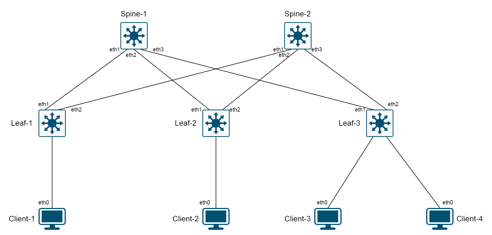

# Содержание
1. [Настройка underlay - BGP Unnumbered](1_underlay.md)
2. [Настройка L2VXLAN](2_l2vxlan.md)

Всем привет! В данной статье я хочу рассказать и показать, как можно настроить основную функциональность EVPN/VXLAN на оборудовании Arista в рамках стандартной Clos-топологии, состоящей из нескольких Spine- и Leaf-коммутаторов.

Я буду исходить из предположения, что некоторое представление о том, как устроены и как работают EVPN и VXLAN вы уже имеете, поэтому сильно вдаваться в теоретические рассуждения я не буду, чтобы не утомлять читатателя лишней водой. Будем считать эту статью неким практическим "туториалом", с помощью которого, даже впервые встретившись с продукцией Arista, вы смогли бы быстро и без труда разобраться в общих принципах настройки EVPN/VXLAN на оборудовании данного производителя, а затем адаптировать полученный опыт под свою конкретную ситуацию. Для долгих и нудных рассуждений добро пожаловать в RFC и вендорскую документацию :).

Сразу приведем список RFC, которые нас интересуют в рамках данной статьи, и к которым можно будет обратиться за дополнительной информацией:
1. [RFC 5549](https://datatracker.ietf.org/doc/html/rfc5549): Advertising IPv4 Network Layer Reachability Information with an IPv6 Next Hop.
2. [RFC 7432](https://datatracker.ietf.org/doc/html/rfc7432): BGP MPLS-Based Ethernet VPN
3. [RFC 8365](https://datatracker.ietf.org/doc/html/rfc8365): A Network Virtualization Overlay Solution Using Ethernet VPN (EVPN).
4. [RFC 9135](https://datatracker.ietf.org/doc/html/rfc9135): Integrated Routing and Bridging in Ethernet VPN (EVPN)
5. [RFC 9136](https://datatracker.ietf.org/doc/html/rfc9136): IP Prefix Advertisement in Ethernet VPN (EVPN)
RFC 5549 описывает метод передачи IPv4-префиксов, используя IPv6-некстхопы. Это нам потребуется при построении underlay-сети для того, чтобы не настраивать никакие IP-адреса на стыковочных линках между коммутаторами, и, тем не менее, получить полноценную связность между loopback-адресами.

RFC 7432 является основным документом, описывающим технологию EVPN. Несмотря на то, что в нем рассматривается EVPN с использованием MPLS в качестве технологии плоскости данных, многие (или даже большинство) концепций и положений оттуда применимы и к EVPN/VXLAN.

RFC 8365 основывается на RFC 7432 и описывает адаптацию EVPN под VXLAN (строго говоря, не только под VXLAN, но нас будет интересовать именно этот протокол).

RFC 9135 описывает реализацию L3-функциональности в EVPN. Изначально в EVPN не было никакого L3, и даже AFI, к которой он принадлежит, описывает L2VPN'ы. Однако спустя какое-то время было решено, что негоже, и функциональность третьего уровня для EVPN была представлена в виде RFC 9135 с интересным названием Integrated Routing and Bridging, или "интегрированные маршрутизация и коммутация", (знаю, что коммутация здесь - не совсем корректное слово, но, мне кажется, оно в данном контексте наиболее подходящее).

RFC 9136 описывает передачу IP-префиксов внутри EVPN-сети. Как уже было сказано выше, EVPN изначально был разработан как чисто L2-решение, поэтому ни о какой передаче IP-префиксов никто не задумывался. Однако, спустя какое-то время, оказалось, что такая функциональность всё-таки востребована широкими народными массами, вследствие чего и был разработан соответствующий RFC. :)

Итак, заниматься настройкой мы будем поэтапно, переходя от фундамента к более "высокоуровневой" или, по-другому, "опциональной" функциональности.

В самом начале мы настроим подлежащую, или underlay-сеть, с помощью которой мы обеспечим связность между Loopback-адресами для всех наших коммутаторов, а затем займемся настройкой непосредственно наложенной overlay-сети в несколько этапов:
1) Сначала мы настроим базовую модель L2VXLAN, где обеспечим связность между клиентами в пределах одного широковещательного домена.
2) Вторым этапом мы настроим маршрутизацию между VNI, включив функциональность 3-его уровня в нашей фабрике. Таким образом, клиенты смогут выходить за пределы своего L2-домена и общаться с системами, расположенными в других VNI.
3) Третьим этапом мы рассмотрим настройку EVPN Multihoming (он же ESI LAG), чтобы обеспечить резервируемость подключения для клиентов.
4) Последним этапом мы настроим инжектирование внешних маршрутов в нашу фабрику для того, чтобы обеспечить нашим клиентам доступ во внешние сети (банальный случай - прокинуть маршрут по умолчанию для доступа в Интернет). При этом мы разделим наш EVPN-домен на два VRF и обеспечим связность между VRF с помощью внешнего маршрутизатора.

Окинем пытливым взором поля будущих сражений, или просто - нашу физическую топологию. Она будет служить основой для всей нашей работы.

Вот такая простая схема будет использоваться, как основа для всех наших настроек. В последующем она будет претерпевать некоторые небольшие изменения, но сама Clos, как модель, будет оставаться неизменной.

Коммутаторы будут работать на образе Arista vEOS 4.29.2F. Клиентские компьютеры - Alpine Linux 3.18. Сама топология собрана в EVE-NG.