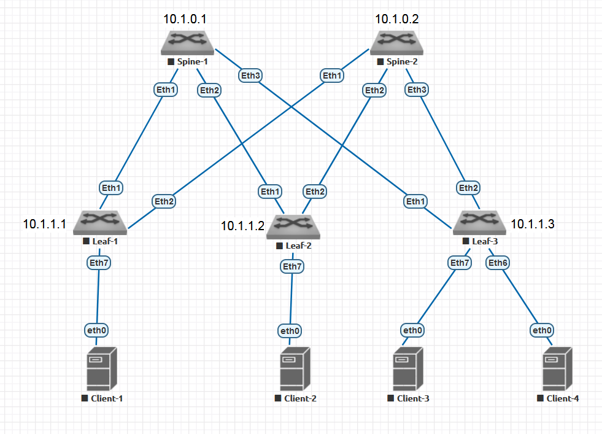

# Домашнее задание 1 (Основы проектирования сети)

## Топология


## Общая схема
IP-адреса выделяются из диапазона 10.0.0.0/8 по следующей схеме:

### Инфраструктура
| Сеть           | Назначение         |
| -------------- | ------------------ |
| 10.0.0.0/10    | ЦОД-1              |
| 10.64.0.0/10   | Reserved           |
| 10.128.0.0/10  | Reserved           |
| 10.192.0.0/10  | Reserved           |

| Сеть           | Назначение         |
| -------------- | ------------------ |
| 192.168.0.0/16 | Клиентские системы | 

Внутри ЦОД выделенный диапазон разбивается по следующей схеме (на примере 10.0.0.0/10):
10.Pn.Fn.X, где:
Pn: PoD Number
Fn: функциональный номер (Loopbacks, P2P)
X: значение.

## ЦОД-1 (10.0.0.0/10)
| Сеть         | Назначение |
| ------------ | ---------- |
| 10.0.0.0/16  | Inter-PoD  |
| 10.1.0.0/16  | PoD-1      |
| 10.2.0.0/16  | Reserved   |
| 10.3.0.0/16  | Reserved   |
| 10.4.0.0/14  | Reserved   |
| 10.8.0.0/12  | Reserved   |
| 10.16.0.0/12 | Reserved   |
| 10.32.0.0/11 | Reserved   | 

### PoD-1
| Сеть        | Назначение      |
| ----------- | --------------- |
| 10.1.0.0/24 | Spine Loopbacks |
| 10.1.1.0/24 | Leaf Loopbacks  |
| 10.1.2.0/24 | Reserved        |
| 10.1.3.0/24 | Reserved        |

P2P-соединения между Leaf'ами и Spine'ами адресуются по схеме 10.1.SnLn\[Ln\].0/30, где Sn - номер Spine в PoD'е, а Ln (опционально 2-значный) - номер Leaf в PoD'е. Последний октет для Spine всегда имеет значение "1", для Leaf - "2".

Например:
P2P-линк между Spine-1 и Leaf-1: 10.1.11.0/30. IP на Spine: 10.1.11.1/30, IP на Leaf: 10.11.1.2/30
P2P-линк между Spine-2 и Leaf-3: 10.11.23.0/30. IP на Spine: 10.1.23.1/30, IP на Leaf: 10.1.23.2/30
P2P-линк между Spine-2 и Leaf-23: 10.11.223.0/30

## Адресная схема для ДЗ

### Loopbacks
| Device  | IP       |
| ------- | -------- |
| Spine-1 | 10.1.0.1 |
| Spine-2 | 10.1.0.2 |
| Leaf-1  | 10.1.1.1 |
| Leaf-2  | 10.1.1.2 |
| Leaf-3  | 10.1.1.3 | 

### P2P Interconnections

| Link  | Subnet       |
| ----- | ------------ |
| S1-L1 | 10.1.11.0/30 |
| S1-L2 | 10.1.12.0/30 |
| S1-L3 | 10.1.13.0/30 |
| S2-L1 | 10.1.21.0/30 |
| S2-L2 | 10.1.22.0/30 |
| S2-L3 | 10.1.23.0/30 | 

## Верификация
### Spine-1
Состояние интерфейсов
```
Spine-1#show int status
Port       Name          Status       Vlan     Duplex Speed
Et1        Link_to_Leaf1 connected    routed   full   1G   
Et2        Link_to_Leaf2 connected    routed   full   1G   
Et3        Link_to_Leaf3 connected    routed   full   1G   
Et4                      disabled     1        full   1G   
Et5                      disabled     1        full   1G   
Et6                      disabled     1        full   1G   
Et7                      disabled     1        full   1G   
Ma1                      connected    routed   a-full a-1G 
```
```
Spine-1#show ip int brief
                                                                        Address
Interface        IP Address        Status      Protocol          MTU    Owner  
---------------- ----------------- ----------- ------------- ---------- -------
Ethernet1        10.1.11.1/30      up          up               1500           
Ethernet2        10.1.12.1/30      up          up               1500           
Ethernet3        10.1.13.1/30      up          up               1500           
Loopback0        10.1.0.1/32       up          up              65535           
Management1      unassigned        up          up               1500           
```
```
Spine-1#show ip route

VRF: default

Gateway of last resort is not set

 C        10.1.0.1/32 is directly connected, Loopback0
 C        10.1.11.0/30 is directly connected, Ethernet1
 C        10.1.12.0/30 is directly connected, Ethernet2
 C        10.1.13.0/30 is directly connected, Ethernet3
```
Ping Leaf-1
```
Spine-1#ping 10.1.11.2 repeat 1
PING 10.1.11.2 (10.1.11.2) 72(100) bytes of data.
80 bytes from 10.1.11.2: icmp_seq=1 ttl=64 time=4.27 ms

--- 10.1.11.2 ping statistics ---
1 packets transmitted, 1 received, 0% packet loss, time 0ms
rtt min/avg/max/mdev = 4.271/4.271/4.271/0.000 ms
Spine-1#
```
Ping Leaf-2
```
Spine-1#ping 10.1.12.2 repeat 1
PING 10.1.12.2 (10.1.12.2) 72(100) bytes of data.
80 bytes from 10.1.12.2: icmp_seq=1 ttl=64 time=4.51 ms

--- 10.1.12.2 ping statistics ---
1 packets transmitted, 1 received, 0% packet loss, time 0ms
rtt min/avg/max/mdev = 4.513/4.513/4.513/0.000 ms
```
Ping Leaf-3
```
Spine-1#ping 10.1.13.2 repeat 1
PING 10.1.13.2 (10.1.13.2) 72(100) bytes of data.
80 bytes from 10.1.13.2: icmp_seq=1 ttl=64 time=4.38 ms

--- 10.1.13.2 ping statistics ---
1 packets transmitted, 1 received, 0% packet loss, time 0ms
rtt min/avg/max/mdev = 4.383/4.383/4.383/0.000 ms
```

### Spine-2
Состояние интерфейсов
```
Spine-2#show int status
Port       Name          Status       Vlan     Duplex Speed  Type            Flags Encapsulation
Et1        Link_to_Leaf1 connected    routed   full   1G     EbraTestPhyPort                   
Et2        Link_to_Leaf2 connected    routed   full   1G     EbraTestPhyPort                   
Et3        Link_to_Leaf3 connected    routed   full   1G     EbraTestPhyPort                   
Et4                      disabled     1        full   1G     EbraTestPhyPort                   
Et5                      disabled     1        full   1G     EbraTestPhyPort                   
Et6                      disabled     1        full   1G     EbraTestPhyPort                   
Et7                      disabled     1        full   1G     EbraTestPhyPort                   
Ma1                      connected    routed   a-full a-1G   10/100/1000                       
```
Состояние IP-интерфейсов
```
Spine-2#show ip int brief
                                                                        Address
Interface        IP Address        Status      Protocol          MTU    Owner  
---------------- ----------------- ----------- ------------- ---------- -------
Ethernet1        10.1.21.1/30      up          up               1500           
Ethernet2        10.1.22.1/30      up          up               1500           
Ethernet3        10.1.23.1/30      up          up               1500           
Loopback0        10.1.0.2/32       up          up              65535           
Management1      unassigned        up          up               1500           
```
Состояние таблицы маршрутизации
```
Spine-2#show ip route

VRF: default

Gateway of last resort is not set

 C        10.1.0.2/32 is directly connected, Loopback0
 C        10.1.21.0/30 is directly connected, Ethernet1
 C        10.1.22.0/30 is directly connected, Ethernet2
 C        10.1.23.0/30 is directly connected, Ethernet3
```
Ping Leaf-1
```
Spine-2#ping 10.1.21.2 repeat 1
PING 10.1.21.2 (10.1.21.2) 72(100) bytes of data.
80 bytes from 10.1.21.2: icmp_seq=1 ttl=64 time=4.64 ms

--- 10.1.21.2 ping statistics ---
1 packets transmitted, 1 received, 0% packet loss, time 0ms
rtt min/avg/max/mdev = 4.641/4.641/4.641/0.000 ms
```
Ping Leaf-2
```
Spine-2#ping 10.1.22.2 repeat 1
PING 10.1.22.2 (10.1.22.2) 72(100) bytes of data.
80 bytes from 10.1.22.2: icmp_seq=1 ttl=64 time=4.04 ms

--- 10.1.22.2 ping statistics ---
1 packets transmitted, 1 received, 0% packet loss, time 0ms
rtt min/avg/max/mdev = 4.049/4.049/4.049/0.000 ms
```
Ping Leaf-3
```
Spine-2#ping 10.1.23.2 repeat 1
PING 10.1.23.2 (10.1.23.2) 72(100) bytes of data.
80 bytes from 10.1.23.2: icmp_seq=1 ttl=64 time=4.36 ms

--- 10.1.23.2 ping statistics ---
1 packets transmitted, 1 received, 0% packet loss, time 0ms
rtt min/avg/max/mdev = 4.367/4.367/4.367/0.000 ms
```

### Leaf-1
Состояние интерфейсов
```
Leaf-1#show int status
Port       Name            Status       Vlan     Duplex Speed  Type            Flags Encapsulation
Et1        Link_to_Spine1  connected    routed   full   1G     EbraTestPhyPort                   
Et2        Link_to_Spine2  connected    routed   full   1G     EbraTestPhyPort                   
Et3                        disabled     1        full   1G     EbraTestPhyPort                   
Et4                        disabled     1        full   1G     EbraTestPhyPort                   
Et5                        disabled     1        full   1G     EbraTestPhyPort                   
Et6                        disabled     1        full   1G     EbraTestPhyPort                   
Et7        Link_to_Client1 connected    1        full   1G     EbraTestPhyPort                   
Ma1                        connected    routed   a-full a-1G   10/100/1000                              
```
Состояние IP-интерфейсов
```
Leaf-1#show ip interface brief
                                                                        Address
Interface        IP Address        Status      Protocol          MTU    Owner  
---------------- ----------------- ----------- ------------- ---------- -------
Ethernet1        10.1.11.2/30      up          up               1500           
Ethernet2        10.1.21.2/30      up          up               1500           
Loopback0        10.1.1.1/32       up          up              65535           
Management1      unassigned        up          up               1500           
     
```
Состояние таблицы маршрутизации
```
Leaf-1#show ip route

VRF: default

Gateway of last resort is not set

 C        10.1.1.1/32 is directly connected, Loopback0
 C        10.1.11.0/30 is directly connected, Ethernet1
 C        10.1.21.0/30 is directly connected, Ethernet2

```

### Leaf-2
Состояние интерфейсов
```
Leaf-2#show int status
Port       Name            Status       Vlan     Duplex Speed  Type            Flags Encapsulation
Et1        Link_to_Spine1  connected    routed   full   1G     EbraTestPhyPort                   
Et2        Link_to_Spine2  connected    routed   full   1G     EbraTestPhyPort                   
Et3                        disabled     1        full   1G     EbraTestPhyPort                   
Et4                        disabled     1        full   1G     EbraTestPhyPort                   
Et5                        disabled     1        full   1G     EbraTestPhyPort                   
Et6                        disabled     1        full   1G     EbraTestPhyPort                   
Et7        Link_to_Client2 connected    1        full   1G     EbraTestPhyPort                   
Ma1                        connected    routed   a-full a-1G   10/100/1000                        
```
Состояние IP-интерфейсов
```
Leaf-2#show ip interface brief
                                                                        Address
Interface        IP Address        Status      Protocol          MTU    Owner  
---------------- ----------------- ----------- ------------- ---------- -------
Ethernet1        10.1.12.2/30      up          up               1500           
Ethernet2        10.1.22.2/30      up          up               1500           
Loopback0        10.1.1.2/32       up          up              65535           
Management1      unassigned        up          up               1500           
```
Состояние таблицы маршрутизации
```
Leaf-2#show ip route

VRF: default

Gateway of last resort is not set

 C        10.1.1.2/32 is directly connected, Loopback0
 C        10.1.12.0/30 is directly connected, Ethernet1
 C        10.1.22.0/30 is directly connected, Ethernet2
```

### Leaf-3
Состояние интерфейсов
```
Leaf-3#show interfaces status
Port       Name            Status       Vlan     Duplex Speed  Type            Flags Encapsulation
Et1        Link_to_Spine1  connected    routed   full   1G     EbraTestPhyPort                   
Et2        Link_to_Spine2  connected    routed   full   1G     EbraTestPhyPort                   
Et3                        disabled     1        full   1G     EbraTestPhyPort                   
Et4                        disabled     1        full   1G     EbraTestPhyPort                   
Et5                        disabled     1        full   1G     EbraTestPhyPort                   
Et6        Link_to_Client4 connected    1        full   1G     EbraTestPhyPort                   
Et7        Link_to_Client3 connected    1        full   1G     EbraTestPhyPort                   
Ma1                        connected    routed   a-full a-1G   10/100/1000        
```
Состояние IP-интерфейсов
```
Leaf-3#show ip interface brief
                                                                        Address
Interface        IP Address        Status      Protocol          MTU    Owner  
---------------- ----------------- ----------- ------------- ---------- -------
Ethernet1        10.1.13.2/30      up          up               1500           
Ethernet2        10.1.23.2/30      up          up               1500           
Loopback0        10.1.1.3/32       up          up              65535           
Management1      unassigned        up          up               1500           
```
Состояние таблицы маршрутизации
```
Leaf-3#show ip route

VRF: default

Gateway of last resort is not set

 C        10.1.1.3/32 is directly connected, Loopback0
 C        10.1.13.0/30 is directly connected, Ethernet1
 C        10.1.23.0/30 is directly connected, Ethernet2
```

## Конфигурационные файлы
[Spine-1_config.txt](Spine-1_config.txt)
[Spine-2_config.txt](Spine-2_config.txt)
[Leaf-1_config.txt](Leaf-1_config.txt)
[Leaf-2_config.txt](Leaf-2_config.txt)
[Leaf-3_config.txt](Leaf-3_config.txt)
