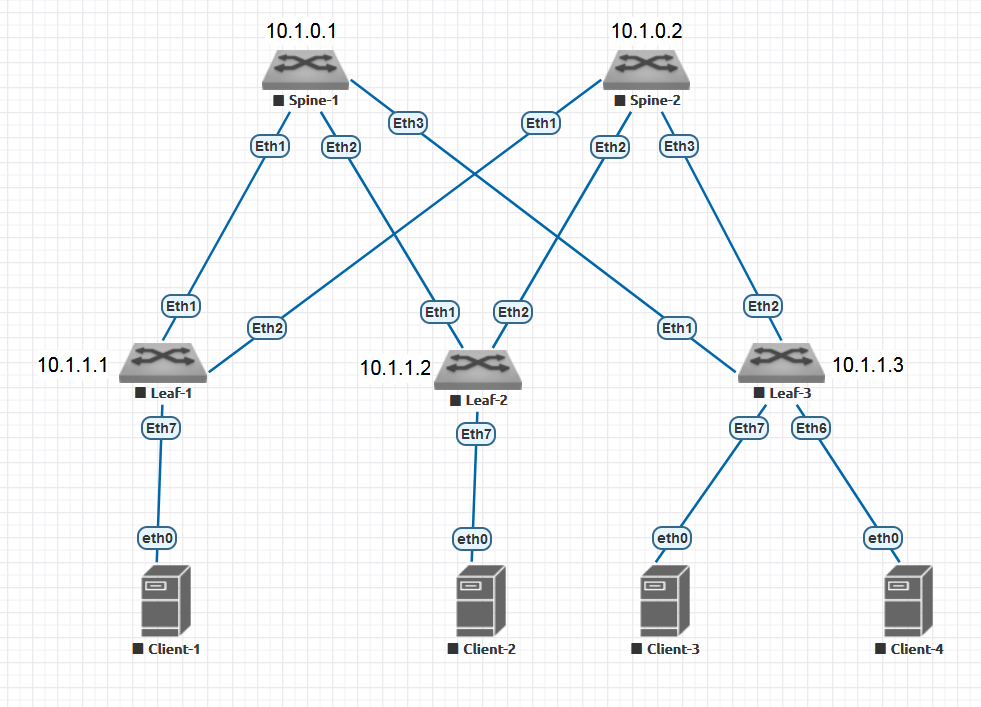

# Домашнее задание 2 (Построение Underlay сети (OSPF))

## Цель домашней работы
Построение Underlay-сети для сети ЦОД с использованием протокола OSPF в качестве протокола динамической маршрутизации.

## Задача
Обеспечить связность между Loopback-адресами для всех сетевых устройств сети (для всех Spine- и Leaf-коммутаторов).

## Топология



## IP-план
### Loopbacks

| Устройство | Loopback |
| ---------- | -------- |
| Spine-1    | 10.1.0.1 |
| Spine-2    | 10.1.0.2 |
| Leaf-1     | 10.1.1.1 |
| Leaf-2     | 10.1.1.2 |
| Leaf-3     | 10.1.1.3 |

### Leaf-Spine Interconnections

| Link  | Subnet       |
| ----- | ------------ |
| S1-L1 | 10.1.11.0/30 |
| S1-L2 | 10.1.12.0/30 |
| S1-L3 | 10.1.13.0/30 |
| S2-L1 | 10.1.21.0/30 |
| S2-L2 | 10.1.22.0/30 |
| S2-L3 | 10.1.23.0/30 |

## План работы
1. Убедиться, что стыковочные связи находятся в рабочем состоянии (ping).
2. Настроить OSPFv2 на каждом Leaf и Spine.
3. Убедиться, что OSPF-соседства между всеми устройствами установлены и находятся в состоянии FULL.
4. Убедиться, что BFD-сессии между устройствами находятся в рабочем состоянии.
5. Убедиться в достижимости каждого loopback-адреса со всех других устройств.

### Требования
* Все устройства — участники OSPF-взаимодействия находятся в единой зоне (backbone area).
* Все P2P-связи между устройствами для OSPF должны быть настроены как point-to-point.
* Loopback-интерфейсы для OSPF должны быть настроены как пассивные интерфейсы.
* OSPF-соседи должны аутентифицировать друг друга с использованием защищенного алгоритма sha256.
* ID ключа идентификации на всех устройствах должен быть "1"
* Секретная строка для аутентификации на всех устройствах должна иметь значение `OTUS`.
* Для уменьшения времени реагирования на аварии, на P2P-связях должен быть настроен и активирован в OSPF протокол BFD.

## Выполнение работы
Настройка IP-адресации на интерфейсах устройств была выполнена в ДЗ-1.
Здесь мы проверим, что стыковочные связи находятся в исправном состоянии. Проверка будет осуществлена с помощью утилиты ping. Мы сделаем ping с каждого из Spine в сторону каждого из Leaf.

### Проверка стыковочных связей
#### Spine-1
##### ping Leaf-1
```
Spine-1#ping 10.1.11.2 repeat 1
PING 10.1.11.2 (10.1.11.2) 72(100) bytes of data.
80 bytes from 10.1.11.2: icmp_seq=1 ttl=64 time=10.5 ms

--- 10.1.11.2 ping statistics ---
1 packets transmitted, 1 received, 0% packet loss, time 0ms
rtt min/avg/max/mdev = 10.553/10.553/10.553/0.000 ms
```

##### ping Leaf-2
```
Spine-1#ping 10.1.12.2 repeat 1
PING 10.1.12.2 (10.1.12.2) 72(100) bytes of data.
80 bytes from 10.1.12.2: icmp_seq=1 ttl=64 time=7.69 ms

--- 10.1.12.2 ping statistics ---
1 packets transmitted, 1 received, 0% packet loss, time 0ms
rtt min/avg/max/mdev = 7.694/7.694/7.694/0.000 ms
```
##### ping Leaf-3
```
Spine-1#ping 10.1.13.2 repeat 1
PING 10.1.13.2 (10.1.13.2) 72(100) bytes of data.
80 bytes from 10.1.13.2: icmp_seq=1 ttl=64 time=17.4 ms

--- 10.1.13.2 ping statistics ---
1 packets transmitted, 1 received, 0% packet loss, time 0ms
rtt min/avg/max/mdev = 17.467/17.467/17.467/0.000 ms
```

#### Spine-2
##### ping Leaf-1
```
Spine-2#ping 10.1.21.2 repeat 1
PING 10.1.21.2 (10.1.21.2) 72(100) bytes of data.
80 bytes from 10.1.21.2: icmp_seq=1 ttl=64 time=8.80 ms

--- 10.1.21.2 ping statistics ---
1 packets transmitted, 1 received, 0% packet loss, time 0ms
rtt min/avg/max/mdev = 8.804/8.804/8.804/0.000 ms
```

##### ping Leaf-2
```
Spine-2#ping 10.1.22.2 repeat 1
PING 10.1.22.2 (10.1.22.2) 72(100) bytes of data.
80 bytes from 10.1.22.2: icmp_seq=1 ttl=64 time=9.15 ms

--- 10.1.22.2 ping statistics ---
1 packets transmitted, 1 received, 0% packet loss, time 0ms
rtt min/avg/max/mdev = 9.152/9.152/9.152/0.000 ms
```

##### ping Leaf-3
```
Spine-2#ping 10.1.23.2 repeat 1
PING 10.1.23.2 (10.1.23.2) 72(100) bytes of data.
80 bytes from 10.1.23.2: icmp_seq=1 ttl=64 time=7.39 ms

--- 10.1.23.2 ping statistics ---
1 packets transmitted, 1 received, 0% packet loss, time 0ms
rtt min/avg/max/mdev = 7.397/7.397/7.397/0.000 ms
```

### Настройка OSPF и BFD
#### Spine-1
##### OSPF
```
router ospf 1
   router-id 10.1.0.1
   passive-interface Loopback0
!
interface Ethernet1
   ip ospf network point-to-point
   ip ospf authentication message-digest
   ip ospf area 0.0.0.0
   ip ospf message-digest-key 1 sha256 OTUS
!
interface Ethernet2
   ip ospf network point-to-point
   ip ospf authentication message-digest
   ip ospf area 0.0.0.0
   ip ospf message-digest-key 1 sha256 OTUS
!
interface Ethernet3
   ip ospf network point-to-point
   ip ospf authentication message-digest
   ip ospf area 0.0.0.0
   ip ospf message-digest-key 1 sha256 OTUS
!
interface Loopback0
   ip ospf area 0.0.0.0
!
```
##### BFD
```
interface Ethernet1
   bfd static neighbor 10.1.11.2
!
interface Ethernet2
   bfd static neighbor 10.1.12.2
!
interface Ethernet3
   bfd static neighbor 10.1.13.2

router ospf 1
   bfd default
```
#### Spine-2
##### OSPF
```
router ospf 1
   router-id 10.1.0.2
   passive-interface Loopback0
!
interface Ethernet1
   ip ospf network point-to-point
   ip ospf authentication message-digest
   ip ospf area 0.0.0.0
   ip ospf message-digest-key 1 sha256 OTUS
!
interface Ethernet2
   ip ospf network point-to-point
   ip ospf authentication message-digest
   ip ospf area 0.0.0.0
   ip ospf message-digest-key 1 sha256 OTUS
!
interface Ethernet3
   ip ospf network point-to-point
   ip ospf authentication message-digest
   ip ospf area 0.0.0.0
   ip ospf message-digest-key 1 sha256 OTUS
!
interface Loopback0
   ip ospf area 0.0.0.0
!
```
##### BFD
```
interface Ethernet1
   bfd static neighbor 10.1.21.2
!
interface Ethernet2
   bfd static neighbor 10.1.22.2
!
interface Ethernet3
   bfd static neighbor 10.1.23.2

router ospf 1
   bfd default
```
#### Leaf-1
##### OSPF
```
router ospf 1
   router-id 10.1.1.1
   passive-interface Loopback0
!
interface Ethernet1
   ip ospf network point-to-point
   ip ospf authentication message-digest
   ip ospf area 0.0.0.0
   ip ospf message-digest-key 1 sha256 OTUS
!
interface Ethernet2
   ip ospf network point-to-point
   ip ospf authentication message-digest
   ip ospf area 0.0.0.0
   ip ospf message-digest-key 1 sha256 OTUS
!
interface Loopback0
   ip ospf area 0.0.0.0
```
##### BFD
```
interface Ethernet1
   bfd static neighbor 10.1.11.1
!
interface Ethernet2
   bfd static neighbor 10.1.21.1
!
router ospf 1
   bfd default
```
#### Leaf-2
##### OSPF
```
router ospf 1
   router-id 10.1.1.2
   passive-interface Loopback0
!
interface Ethernet1
   ip ospf network point-to-point
   ip ospf authentication message-digest
   ip ospf area 0.0.0.0
   ip ospf message-digest-key 1 sha256 OTUS
!
interface Ethernet2
   ip ospf network point-to-point
   ip ospf authentication message-digest
   ip ospf area 0.0.0.0
   ip ospf message-digest-key 1 sha256 OTUS
!
interface Loopback0
   ip ospf area 0.0.0.0
```
##### BFD
```
interface Ethernet1
   bfd static neighbor 10.1.12.1
!
interface Ethernet2
   bfd static neighbor 10.1.22.1
!
router ospf 1
   bfd default
```
#### Leaf-3
##### OSPF
```
router ospf 1
   router-id 10.1.1.3
   passive-interface Loopback0
!
interface Ethernet1
   ip ospf network point-to-point
   ip ospf authentication message-digest
   ip ospf area 0.0.0.0
   ip ospf message-digest-key 1 sha256 OTUS
!
interface Ethernet2
   ip ospf network point-to-point
   ip ospf authentication message-digest
   ip ospf area 0.0.0.0
   ip ospf message-digest-key 1 sha256 OTUS
!
interface Loopback0
   ip ospf area 0.0.0.0
```
##### BFD
```
interface Ethernet1
   bfd static neighbor 10.1.13.1
!
interface Ethernet2
   bfd static neighbor 10.1.23.1
!
router ospf 1
   bfd default
```

### Верификация состояния OSPF и BFD
#### Spine-1
##### Проверка общего состояния процесса OSPF
```
Spine-1# show ip ospf summary 
OSPF instance 1 with ID 10.1.0.1, VRF default
Time since last SPF: 825 s
Max LSAs: 12000, Total LSAs: 5
Type-5 Ext LSAs: 0
ID               Type   Intf   Nbrs (full) RTR LSA NW LSA  SUM LSA ASBR LSA TYPE-7 LSA
0.0.0.0          normal 4      3    (3   ) 5       0       0       0       0      
```
##### Проверка состояния OSPF на интерфейсах
```
Spine-1#show ip ospf interface loopback 0
Loopback0 is up
  Interface Address 10.1.0.1/32, instance 1, VRF default, Area 0.0.0.0
  Network Type Broadcast, Cost: 10
  Transmit Delay is 1 sec, State DR, Priority 1
  Designated Router is 10.1.0.1
  No Backup Designated Router on this network
  Timer intervals configured, Hello 10, Dead 40, Retransmit 5
  Neighbor Count is 0 (Passive Interface)
  No authentication
  Traffic engineering is disabled

Spine-1#show ip ospf interface ethernet 1
Ethernet1 is up
  Interface Address 10.1.11.1/30, instance 1, VRF default, Area 0.0.0.0
  Network Type Point-To-Point, Cost: 10
  Transmit Delay is 1 sec, State P2P
  Interface Speed: 1000 mbps
  No Designated Router on this network
  No Backup Designated Router on this network
  Timer intervals configured, Hello 10, Dead 40, Retransmit 5
  Neighbor Count is 1
  Message-digest authentication, using key id 1
  Traffic engineering is disabled

Spine-1#show ip ospf interface ethernet 2
Ethernet2 is up
  Interface Address 10.1.12.1/30, instance 1, VRF default, Area 0.0.0.0
  Network Type Point-To-Point, Cost: 10
  Transmit Delay is 1 sec, State P2P
  Interface Speed: 1000 mbps
  No Designated Router on this network
  No Backup Designated Router on this network
  Timer intervals configured, Hello 10, Dead 40, Retransmit 5
  Neighbor Count is 1
  Message-digest authentication, using key id 1
  Traffic engineering is disabled
  
Ethernet3 is up
  Interface Address 10.1.13.1/30, instance 1, VRF default, Area 0.0.0.0
  Network Type Point-To-Point, Cost: 10
  Transmit Delay is 1 sec, State P2P
  Interface Speed: 1000 mbps
  No Designated Router on this network
  No Backup Designated Router on this network
  Timer intervals configured, Hello 10, Dead 40, Retransmit 5
  Neighbor Count is 1
  Message-digest authentication, using key id 1
  Traffic engineering is disabled
```
##### Проверка состояния соседей
```
! Leaf-1
Spine-1#show ip ospf neighbor 10.1.1.1
Neighbor 10.1.1.1, instance 1, VRF default, interface address 10.1.11.2
  In area 0.0.0.0 interface Ethernet1
  Neighbor priority is 0, State is FULL, 7 state changes
  Adjacency was established 00:37:58 ago
  Current state was established 00:37:58 ago
  DR IP Address 0.0.0.0 BDR IP Address 0.0.0.0
  Options is E
  Dead timer is due in 00:00:35
  Inactivity timer deferred 0 times
  LSAs retransmitted 3 times to this neighbor
  Bfd request is sent and the state is Up
  Graceful-restart-helper mode is Inactive
  Graceful-restart attempts: 0

! Leaf-2
Spine-1#show ip ospf neighbor 10.1.1.2
Neighbor 10.1.1.2, instance 1, VRF default, interface address 10.1.12.2
  In area 0.0.0.0 interface Ethernet2
  Neighbor priority is 0, State is FULL, 7 state changes
  Adjacency was established 00:37:53 ago
  Current state was established 00:37:53 ago
  DR IP Address 0.0.0.0 BDR IP Address 0.0.0.0
  Options is E
  Dead timer is due in 00:00:30
  Inactivity timer deferred 0 times
  LSAs retransmitted 1 time to this neighbor
  Bfd request is sent and the state is Up
  Graceful-restart-helper mode is Inactive
  Graceful-restart attempts: 0

! Leaf-3
Spine-1#show ip ospf neighbor 10.1.1.3
Neighbor 10.1.1.3, instance 1, VRF default, interface address 10.1.13.2
  In area 0.0.0.0 interface Ethernet3
  Neighbor priority is 0, State is FULL, 7 state changes
  Adjacency was established 00:37:54 ago
  Current state was established 00:37:54 ago
  DR IP Address 0.0.0.0 BDR IP Address 0.0.0.0
  Options is E
  Dead timer is due in 00:00:30
  Inactivity timer deferred 0 times
  LSAs retransmitted 2 times to this neighbor
  Bfd request is sent and the state is Up
  Graceful-restart-helper mode is Inactive
  Graceful-restart attempts: 0
```
##### Проверка статуса сессии BFD
```
Spine-1#show bfd peers
VRF name: default
-----------------
DstAddr        MyDisc    YourDisc  Interface/Transport    Type          LastUp 
---------- ----------- ----------- -------------------- ------- ---------------
10.1.11.2  2719588604    10871321        Ethernet1(13)  normal  05/17/24 18:39 
10.1.12.2  4158079012  3967298090        Ethernet2(14)  normal  05/17/24 18:41 
10.1.13.2  4155435031  3744334917        Ethernet3(15)  normal  05/17/24 18:41 

   LastDown            LastDiag    State
-------------- ------------------- -----
         NA       No Diagnostic       Up
         NA       No Diagnostic       Up
         NA       No Diagnostic       Up
```
```
Spine-1#show ip ospf neighbor 10.1.1.1 | i Bfd
  Bfd request is sent and the state is Up
  
Spine-1#show ip ospf neighbor 10.1.1.2 | i Bfd
  Bfd request is sent and the state is Up
  
Spine-1#show ip ospf neighbor 10.1.1.3 | i Bfd
  Bfd request is sent and the state is Up
```
##### Проверка таблицы маршрутизации
```
Spine-1#show ip route

VRF: default

Gateway of last resort is not set

 C        10.1.0.1/32 is directly connected, Loopback0
 O        10.1.0.2/32 [110/30] via 10.1.11.2, Ethernet1
                               via 10.1.12.2, Ethernet2
                               via 10.1.13.2, Ethernet3
 O        10.1.1.1/32 [110/20] via 10.1.11.2, Ethernet1
 O        10.1.1.2/32 [110/20] via 10.1.12.2, Ethernet2
 O        10.1.1.3/32 [110/20] via 10.1.13.2, Ethernet3
 C        10.1.11.0/30 is directly connected, Ethernet1
 C        10.1.12.0/30 is directly connected, Ethernet2
 C        10.1.13.0/30 is directly connected, Ethernet3
 O        10.1.21.0/30 [110/20] via 10.1.11.2, Ethernet1
 O        10.1.22.0/30 [110/20] via 10.1.12.2, Ethernet2
 O        10.1.23.0/30 [110/20] via 10.1.13.2, Ethernet3
```

#### Spine-2
##### Проверка общего состояния процесса OSPF
```
Spine-2#show ip ospf summary 
OSPF instance 1 with ID 10.1.0.2, VRF default
Time since last SPF: 1404 s
Max LSAs: 12000, Total LSAs: 5
Type-5 Ext LSAs: 0
ID               Type   Intf   Nbrs (full) RTR LSA NW LSA  SUM LSA ASBR LSA TYPE-7 LSA
0.0.0.0          normal 4      3    (3   ) 5       0       0       0       0
```
##### Проверка состояния OSPF на интерфейсах
```
Spine-2#show ip ospf interface loopback 0
Loopback0 is up
  Interface Address 10.1.0.2/32, instance 1, VRF default, Area 0.0.0.0
  Network Type Broadcast, Cost: 10
  Transmit Delay is 1 sec, State DR, Priority 1
  Designated Router is 10.1.0.2
  No Backup Designated Router on this network
  Timer intervals configured, Hello 10, Dead 40, Retransmit 5
  Neighbor Count is 0 (Passive Interface)
  No authentication
  Traffic engineering is disabled

Spine-2#show ip ospf interface ethernet 1
Ethernet1 is up
  Interface Address 10.1.21.1/30, instance 1, VRF default, Area 0.0.0.0
  Network Type Point-To-Point, Cost: 10
  Transmit Delay is 1 sec, State P2P
  Interface Speed: 1000 mbps
  No Designated Router on this network
  No Backup Designated Router on this network
  Timer intervals configured, Hello 10, Dead 40, Retransmit 5
  Neighbor Count is 1
  Message-digest authentication, using key id 1
  Traffic engineering is disabled

Spine-2#show ip ospf interface ethernet 2
Ethernet2 is up
  Interface Address 10.1.22.1/30, instance 1, VRF default, Area 0.0.0.0
  Network Type Point-To-Point, Cost: 10
  Transmit Delay is 1 sec, State P2P
  Interface Speed: 1000 mbps
  No Designated Router on this network
  No Backup Designated Router on this network
  Timer intervals configured, Hello 10, Dead 40, Retransmit 5
  Neighbor Count is 1
  Message-digest authentication, using key id 1
  Traffic engineering is disabled

Spine-2#show ip ospf interface ethernet 3
Ethernet3 is up
  Interface Address 10.1.23.1/30, instance 1, VRF default, Area 0.0.0.0
  Network Type Point-To-Point, Cost: 10
  Transmit Delay is 1 sec, State P2P
  Interface Speed: 1000 mbps
  No Designated Router on this network
  No Backup Designated Router on this network
  Timer intervals configured, Hello 10, Dead 40, Retransmit 5
  Neighbor Count is 1
  Message-digest authentication, using key id 1
  Traffic engineering is disabled
```
##### Проверка состояния соседей
```
! Leaf-1
Spine-2#show ip ospf neighbor 10.1.1.1
Neighbor 10.1.1.1, instance 1, VRF default, interface address 10.1.21.2
  In area 0.0.0.0 interface Ethernet1
  Neighbor priority is 0, State is FULL, 6 state changes
  Adjacency was established 00:24:36 ago
  Current state was established 00:24:36 ago
  DR IP Address 0.0.0.0 BDR IP Address 0.0.0.0
  Options is E
  Dead timer is due in 00:00:37
  Inactivity timer deferred 0 times
  LSAs retransmitted 0 times to this neighbor
  Bfd request is sent and the state is Up
  Graceful-restart-helper mode is Inactive
  Graceful-restart attempts: 0

! Leaf-2
Spine-2#show ip ospf neighbor 10.1.1.2
Neighbor 10.1.1.2, instance 1, VRF default, interface address 10.1.22.2
  In area 0.0.0.0 interface Ethernet2
  Neighbor priority is 0, State is FULL, 7 state changes
  Adjacency was established 00:24:53 ago
  Current state was established 00:24:53 ago
  DR IP Address 0.0.0.0 BDR IP Address 0.0.0.0
  Options is E
  Dead timer is due in 00:00:30
  Inactivity timer deferred 0 times
  LSAs retransmitted 1 time to this neighbor
  Bfd request is sent and the state is Up
  Graceful-restart-helper mode is Inactive
  Graceful-restart attempts: 0

! Leaf-3
Spine-2#show ip ospf neighbor 10.1.1.3
Neighbor 10.1.1.3, instance 1, VRF default, interface address 10.1.23.2
  In area 0.0.0.0 interface Ethernet3
  Neighbor priority is 0, State is FULL, 7 state changes
  Adjacency was established 00:24:49 ago
  Current state was established 00:24:49 ago
  DR IP Address 0.0.0.0 BDR IP Address 0.0.0.0
  Options is E
  Dead timer is due in 00:00:38
  Inactivity timer deferred 0 times
  LSAs retransmitted 1 time to this neighbor
  Bfd request is sent and the state is Up
  Graceful-restart-helper mode is Inactive
  Graceful-restart attempts: 0
```
##### Проверка статуса сессии BFD
```
Spine-2#show bfd peers
VRF name: default
-----------------
DstAddr        MyDisc    YourDisc  Interface/Transport    Type          LastUp 
---------- ----------- ----------- -------------------- ------- ---------------
10.1.21.2  3217395555  4007516938        Ethernet1(13)  normal  05/17/24 18:41 
10.1.22.2  1931322939  1809464487        Ethernet2(14)  normal  05/17/24 18:41 
10.1.23.2   354442453  3997769444        Ethernet3(15)  normal  05/17/24 18:41 

   LastDown            LastDiag    State
-------------- ------------------- -----
         NA       No Diagnostic       Up
         NA       No Diagnostic       Up
         NA       No Diagnostic       Up
```
```
Spine-2#show ip ospf neighbor 10.1.1.1 | i Bfd
  Bfd request is sent and the state is Up
  
Spine-2#show ip ospf neighbor 10.1.1.2 | i Bfd
  Bfd request is sent and the state is Up

Spine-2#show ip ospf neighbor 10.1.1.3 | i Bfd
  Bfd request is sent and the state is Up
```
##### Проверка таблицы маршрутизации
```
Spine-2#show ip route

VRF: default

Gateway of last resort is not set

 O        10.1.0.1/32 [110/30] via 10.1.21.2, Ethernet1
                               via 10.1.22.2, Ethernet2
                               via 10.1.23.2, Ethernet3
 C        10.1.0.2/32 is directly connected, Loopback0
 O        10.1.1.1/32 [110/20] via 10.1.21.2, Ethernet1
 O        10.1.1.2/32 [110/20] via 10.1.22.2, Ethernet2
 O        10.1.1.3/32 [110/20] via 10.1.23.2, Ethernet3
 O        10.1.11.0/30 [110/20] via 10.1.21.2, Ethernet1
 O        10.1.12.0/30 [110/20] via 10.1.22.2, Ethernet2
 O        10.1.13.0/30 [110/20] via 10.1.23.2, Ethernet3
 C        10.1.21.0/30 is directly connected, Ethernet1
 C        10.1.22.0/30 is directly connected, Ethernet2
 C        10.1.23.0/30 is directly connected, Ethernet3
```
#### Leaf-1
##### Проверка общего состояния процесса OSPF
```
Leaf-1#show ip ospf summary
OSPF instance 1 with ID 10.1.1.1, VRF default
Time since last SPF: 1698 s
Max LSAs: 12000, Total LSAs: 5
Type-5 Ext LSAs: 0
ID               Type   Intf   Nbrs (full) RTR LSA NW LSA  SUM LSA ASBR LSA TYPE-7 LSA
0.0.0.0          normal 3      2    (2   ) 5       0       0       0       0      
```
##### Проверка состояния OSPF на интерфейсах
```
Leaf-1#show ip ospf interface loopback 0
Loopback0 is up
  Interface Address 10.1.1.1/32, instance 1, VRF default, Area 0.0.0.0
  Network Type Broadcast, Cost: 10
  Transmit Delay is 1 sec, State DR, Priority 1
  Designated Router is 10.1.1.1
  No Backup Designated Router on this network
  Timer intervals configured, Hello 10, Dead 40, Retransmit 5
  Neighbor Count is 0 (Passive Interface)
  No authentication
  Traffic engineering is disabled

Leaf-1#show ip ospf interface ethernet 1
Ethernet1 is up
  Interface Address 10.1.11.2/30, instance 1, VRF default, Area 0.0.0.0
  Network Type Point-To-Point, Cost: 10
  Transmit Delay is 1 sec, State P2P
  Interface Speed: 1000 mbps
  No Designated Router on this network
  No Backup Designated Router on this network
  Timer intervals configured, Hello 10, Dead 40, Retransmit 5
  Neighbor Count is 1
  Message-digest authentication, using key id 1
  Traffic engineering is disabled

Leaf-1#show ip ospf interface ethernet 2
Ethernet2 is up
  Interface Address 10.1.21.2/30, instance 1, VRF default, Area 0.0.0.0
  Network Type Point-To-Point, Cost: 10
  Transmit Delay is 1 sec, State P2P
  Interface Speed: 1000 mbps
  No Designated Router on this network
  No Backup Designated Router on this network
  Timer intervals configured, Hello 10, Dead 40, Retransmit 5
  Neighbor Count is 1
  Message-digest authentication, using key id 1
  Traffic engineering is disabled
```
##### Проверка состояния соседей
```
! Spine-1
Leaf-1#show ip ospf neighbor 10.1.0.1
Neighbor 10.1.0.1, instance 1, VRF default, interface address 10.1.11.1
  In area 0.0.0.0 interface Ethernet1
  Neighbor priority is 0, State is FULL, 6 state changes
  Adjacency was established 00:48:06 ago
  Current state was established 00:48:06 ago
  DR IP Address 0.0.0.0 BDR IP Address 0.0.0.0
  Options is E
  Dead timer is due in 00:00:35
  Inactivity timer deferred 0 times
  LSAs retransmitted 1 time to this neighbor
  Bfd request is sent and the state is Up
  Graceful-restart-helper mode is Inactive
  Graceful-restart attempts: 0

! Spine-2
Leaf-1#show ip ospf neighbor 10.1.0.2
Neighbor 10.1.0.2, instance 1, VRF default, interface address 10.1.21.1
  In area 0.0.0.0 interface Ethernet2
  Neighbor priority is 0, State is FULL, 7 state changes
  Adjacency was established 00:29:19 ago
  Current state was established 00:29:19 ago
  DR IP Address 0.0.0.0 BDR IP Address 0.0.0.0
  Options is E
  Dead timer is due in 00:00:29
  Inactivity timer deferred 0 times
  LSAs retransmitted 0 times to this neighbor
  Bfd request is sent and the state is Up
  Graceful-restart-helper mode is Inactive
  Graceful-restart attempts: 0
```
##### Проверка статуса сессии BFD
```
Leaf-1#show bfd peers
VRF name: default
-----------------
DstAddr        MyDisc    YourDisc  Interface/Transport    Type          LastUp 
---------- ----------- ----------- -------------------- ------- ---------------
10.1.11.1    10871321  2719588604        Ethernet1(13)  normal  05/17/24 18:39 
10.1.21.1  4007516938  3217395555        Ethernet2(14)  normal  05/17/24 18:41 

   LastDown            LastDiag    State
-------------- ------------------- -----
         NA       No Diagnostic       Up
         NA       No Diagnostic       Up
```
```
Leaf-1#show ip ospf neighbor 10.1.0.1 | i Bfd
  Bfd request is sent and the state is Up
  
Leaf-1#show ip ospf neighbor 10.1.0.2 | i Bfd
  Bfd request is sent and the state is Up
```
##### Проверка таблицы маршрутизации
```
Leaf-1#show ip route

Gateway of last resort is not set

 O        10.1.0.1/32 [110/20] via 10.1.11.1, Ethernet1
 O        10.1.0.2/32 [110/20] via 10.1.21.1, Ethernet2
 C        10.1.1.1/32 is directly connected, Loopback0
 O        10.1.1.2/32 [110/30] via 10.1.11.1, Ethernet1
                               via 10.1.21.1, Ethernet2
 O        10.1.1.3/32 [110/30] via 10.1.11.1, Ethernet1
                               via 10.1.21.1, Ethernet2
 C        10.1.11.0/30 is directly connected, Ethernet1
 O        10.1.12.0/30 [110/20] via 10.1.11.1, Ethernet1
 O        10.1.13.0/30 [110/20] via 10.1.11.1, Ethernet1
 C        10.1.21.0/30 is directly connected, Ethernet2
 O        10.1.22.0/30 [110/20] via 10.1.21.1, Ethernet2
 O        10.1.23.0/30 [110/20] via 10.1.21.1, Ethernet2

 ```
#### Leaf-2
##### Проверка общего состояния процесса OSPF
```
Leaf-2#show ip ospf summary
OSPF instance 1 with ID 10.1.1.2, VRF default
Time since last SPF: 1915 s
Max LSAs: 12000, Total LSAs: 5
Type-5 Ext LSAs: 0
ID               Type   Intf   Nbrs (full) RTR LSA NW LSA  SUM LSA ASBR LSA TYPE-7 LSA
0.0.0.0          normal 3      2    (2   ) 5       0       0       0       0
```
##### Проверка состояния OSPF на интерфейсах
```
Leaf-2#show ip ospf interface Loopback 0
Loopback0 is up
  Interface Address 10.1.1.2/32, instance 1, VRF default, Area 0.0.0.0
  Network Type Broadcast, Cost: 10
  Transmit Delay is 1 sec, State DR, Priority 1
  Designated Router is 10.1.1.2
  No Backup Designated Router on this network
  Timer intervals configured, Hello 10, Dead 40, Retransmit 5
  Neighbor Count is 0 (Passive Interface)
  No authentication
  Traffic engineering is disabled

Leaf-2#show ip ospf interface ethernet 1
Ethernet1 is up
  Interface Address 10.1.12.2/30, instance 1, VRF default, Area 0.0.0.0
  Network Type Point-To-Point, Cost: 10
  Transmit Delay is 1 sec, State P2P
  Interface Speed: 1000 mbps
  No Designated Router on this network
  No Backup Designated Router on this network
  Timer intervals configured, Hello 10, Dead 40, Retransmit 5
  Neighbor Count is 1
  Message-digest authentication, using key id 1
  Traffic engineering is disabled

Leaf-2#show ip ospf interface ethernet 2
Ethernet2 is up
  Interface Address 10.1.22.2/30, instance 1, VRF default, Area 0.0.0.0
  Network Type Point-To-Point, Cost: 10
  Transmit Delay is 1 sec, State P2P
  Interface Speed: 1000 mbps
  No Designated Router on this network
  No Backup Designated Router on this network
  Timer intervals configured, Hello 10, Dead 40, Retransmit 5
  Neighbor Count is 1
  Message-digest authentication, using key id 1
  Traffic engineering is disabled
```
##### Проверка состояния соседей
```
! Spine-1
Leaf-2#show ip ospf neighbor 10.1.0.1
Neighbor 10.1.0.1, instance 1, VRF default, interface address 10.1.12.1
  In area 0.0.0.0 interface Ethernet1
  Neighbor priority is 0, State is FULL, 6 state changes
  Adjacency was established 00:51:18 ago
  Current state was established 00:51:18 ago
  DR IP Address 0.0.0.0 BDR IP Address 0.0.0.0
  Options is E
  Dead timer is due in 00:00:34
  Inactivity timer deferred 0 times
  LSAs retransmitted 1 time to this neighbor
  Bfd request is sent and the state is Up
  Graceful-restart-helper mode is Inactive
  Graceful-restart attempts: 0

! Spine-2
Leaf-2#show ip ospf neighbor 10.1.0.2
Neighbor 10.1.0.2, instance 1, VRF default, interface address 10.1.22.1
  In area 0.0.0.0 interface Ethernet2
  Neighbor priority is 0, State is FULL, 6 state changes
  Adjacency was established 00:33:06 ago
  Current state was established 00:33:06 ago
  DR IP Address 0.0.0.0 BDR IP Address 0.0.0.0
  Options is E
  Dead timer is due in 00:00:32
  Inactivity timer deferred 0 times
  LSAs retransmitted 1 time to this neighbor
  Bfd request is sent and the state is Up
  Graceful-restart-helper mode is Inactive
  Graceful-restart attempts: 0
```
##### Проверка статуса сессии BFD
```
Leaf-2#show bfd peers
VRF name: default
-----------------
DstAddr        MyDisc    YourDisc  Interface/Transport    Type          LastUp 
---------- ----------- ----------- -------------------- ------- ---------------
10.1.12.1  3967298090  4158079012        Ethernet1(13)  normal  05/17/24 18:41 
10.1.22.1  1809464487  1931322939        Ethernet2(14)  normal  05/17/24 18:41 

   LastDown            LastDiag    State
-------------- ------------------- -----
         NA       No Diagnostic       Up
         NA       No Diagnostic       Up
```
```
Leaf-2#show ip ospf neighbor 10.1.0.1 | i Bfd
  Bfd request is sent and the state is Up
  
Leaf-2#show ip ospf neighbor 10.1.0.2 | i Bfd
  Bfd request is sent and the state is Up
```
##### Проверка таблицы маршрутизации
```
Leaf-2#show ip route

VRF: default

Gateway of last resort is not set

 O        10.1.0.1/32 [110/20] via 10.1.12.1, Ethernet1
 O        10.1.0.2/32 [110/20] via 10.1.22.1, Ethernet2
 O        10.1.1.1/32 [110/30] via 10.1.12.1, Ethernet1
                               via 10.1.22.1, Ethernet2
 C        10.1.1.2/32 is directly connected, Loopback0
 O        10.1.1.3/32 [110/30] via 10.1.12.1, Ethernet1
                               via 10.1.22.1, Ethernet2
 O        10.1.11.0/30 [110/20] via 10.1.12.1, Ethernet1
 C        10.1.12.0/30 is directly connected, Ethernet1
 O        10.1.13.0/30 [110/20] via 10.1.12.1, Ethernet1
 O        10.1.21.0/30 [110/20] via 10.1.22.1, Ethernet2
 C        10.1.22.0/30 is directly connected, Ethernet2
 O        10.1.23.0/30 [110/20] via 10.1.22.1, Ethernet2
 ```
#### Leaf-3
##### Проверка общего состояния процесса OSPF
```
Leaf-3#show ip ospf summary
OSPF instance 1 with ID 10.1.1.3, VRF default
Time since last SPF: 2069 s
Max LSAs: 12000, Total LSAs: 5
Type-5 Ext LSAs: 0
ID               Type   Intf   Nbrs (full) RTR LSA NW LSA  SUM LSA ASBR LSA TYPE-7 LSA
0.0.0.0          normal 3      2    (2   ) 5       0       0       0       0      
```
##### Проверка состояния OSPF на интерфейсах
```
Leaf-3#show ip ospf interface Loopback 0
Loopback0 is up
  Interface Address 10.1.1.3/32, instance 1, VRF default, Area 0.0.0.0
  Network Type Broadcast, Cost: 10
  Transmit Delay is 1 sec, State DR, Priority 1
  Designated Router is 10.1.1.3
  No Backup Designated Router on this network
  Timer intervals configured, Hello 10, Dead 40, Retransmit 5
  Neighbor Count is 0 (Passive Interface)
  No authentication
  Traffic engineering is disabled

Leaf-3#show ip ospf interface Ethernet 1
Ethernet1 is up
  Interface Address 10.1.13.2/30, instance 1, VRF default, Area 0.0.0.0
  Network Type Point-To-Point, Cost: 10
  Transmit Delay is 1 sec, State P2P
  Interface Speed: 1000 mbps
  No Designated Router on this network
  No Backup Designated Router on this network
  Timer intervals configured, Hello 10, Dead 40, Retransmit 5
  Neighbor Count is 1
  Message-digest authentication, using key id 1
  Traffic engineering is disabled

Leaf-3#show ip ospf interface Ethernet 2
Ethernet2 is up
  Interface Address 10.1.23.2/30, instance 1, VRF default, Area 0.0.0.0
  Network Type Point-To-Point, Cost: 10
  Transmit Delay is 1 sec, State P2P
  Interface Speed: 1000 mbps
  No Designated Router on this network
  No Backup Designated Router on this network
  Timer intervals configured, Hello 10, Dead 40, Retransmit 5
  Neighbor Count is 1
  Message-digest authentication, using key id 1
  Traffic engineering is disabled
```
##### Проверка состояния соседей
```
! Spine-1
Leaf-3#show ip ospf neighbor 10.1.0.1
Neighbor 10.1.0.1, instance 1, VRF default, interface address 10.1.13.1
  In area 0.0.0.0 interface Ethernet1
  Neighbor priority is 0, State is FULL, 6 state changes
  Adjacency was established 00:53:28 ago
  Current state was established 00:53:28 ago
  DR IP Address 0.0.0.0 BDR IP Address 0.0.0.0
  Options is E
  Dead timer is due in 00:00:30
  Inactivity timer deferred 0 times
  LSAs retransmitted 1 time to this neighbor
  Bfd request is sent and the state is Up
  Graceful-restart-helper mode is Inactive
  Graceful-restart attempts: 0

! Spine-2
Leaf-3#show ip ospf neighbor 10.1.0.2
Neighbor 10.1.0.2, instance 1, VRF default, interface address 10.1.23.1
  In area 0.0.0.0 interface Ethernet2
  Neighbor priority is 0, State is FULL, 7 state changes
  Adjacency was established 00:35:20 ago
  Current state was established 00:35:20 ago
  DR IP Address 0.0.0.0 BDR IP Address 0.0.0.0
  Options is E
  Dead timer is due in 00:00:33
  Inactivity timer deferred 0 times
  LSAs retransmitted 0 times to this neighbor
  Bfd request is sent and the state is Up
  Graceful-restart-helper mode is Inactive
  Graceful-restart attempts: 0
```
##### Проверка статуса сессии BFD
```
Leaf-3#show bfd peers
VRF name: default
-----------------
DstAddr        MyDisc    YourDisc  Interface/Transport    Type          LastUp 
---------- ----------- ----------- -------------------- ------- ---------------
10.1.13.1  3744334917  4155435031        Ethernet1(13)  normal  05/17/24 18:41 
10.1.23.1  3997769444   354442453        Ethernet2(14)  normal  05/17/24 18:41 

   LastDown            LastDiag    State
-------------- ------------------- -----
         NA       No Diagnostic       Up
         NA       No Diagnostic       Up
```
```
Leaf-3#show ip ospf neighbor 10.1.0.1 | i Bfd
  Bfd request is sent and the state is Up
  
Leaf-3#show ip ospf neighbor 10.1.0.2 | i Bfd
  Bfd request is sent and the state is Up
```
##### Проверка таблицы маршрутизации
```
Leaf-3#show ip route

Gateway of last resort is not set

 O        10.1.0.1/32 [110/20] via 10.1.13.1, Ethernet1
 O        10.1.0.2/32 [110/20] via 10.1.23.1, Ethernet2
 O        10.1.1.1/32 [110/30] via 10.1.13.1, Ethernet1
                               via 10.1.23.1, Ethernet2
 O        10.1.1.2/32 [110/30] via 10.1.13.1, Ethernet1
                               via 10.1.23.1, Ethernet2
 C        10.1.1.3/32 is directly connected, Loopback0
 O        10.1.11.0/30 [110/20] via 10.1.13.1, Ethernet1
 O        10.1.12.0/30 [110/20] via 10.1.13.1, Ethernet1
 C        10.1.13.0/30 is directly connected, Ethernet1
 O        10.1.21.0/30 [110/20] via 10.1.23.1, Ethernet2
 O        10.1.22.0/30 [110/20] via 10.1.23.1, Ethernet2
 C        10.1.23.0/30 is directly connected, Ethernet2
 ```

### Проверки достижимости loopback-адресов
#### Spine-1
ping Spine-2
```
Spine-1#ping 10.1.0.2 repeat 1
PING 10.1.0.2 (10.1.0.2) 72(100) bytes of data.
80 bytes from 10.1.0.2: icmp_seq=1 ttl=63 time=6.58 ms
```

ping Leaf-1
```
Spine-1#ping 10.1.1.1 repeat 1
PING 10.1.1.1 (10.1.1.1) 72(100) bytes of data.
80 bytes from 10.1.1.1: icmp_seq=1 ttl=64 time=2.68 ms
```

ping Leaf-2
```
Spine-1#ping 10.1.1.2 repeat 1
PING 10.1.1.2 (10.1.1.2) 72(100) bytes of data.
80 bytes from 10.1.1.2: icmp_seq=1 ttl=64 time=3.34 ms
```

ping Leaf-3
```
Spine-1#ping 10.1.1.3 repeat 1
PING 10.1.1.3 (10.1.1.3) 72(100) bytes of data.
80 bytes from 10.1.1.3: icmp_seq=1 ttl=64 time=3.28 ms

```

#### Spine-2
ping Spine-1
```
Spine-2#ping 10.1.0.1 repeat 1
PING 10.1.0.1 (10.1.0.1) 72(100) bytes of data.
80 bytes from 10.1.0.1: icmp_seq=1 ttl=63 time=6.08 ms
```

ping Leaf-1
```
Spine-2#ping 10.1.1.1 repeat 1
PING 10.1.1.1 (10.1.1.1) 72(100) bytes of data.
80 bytes from 10.1.1.1: icmp_seq=1 ttl=64 time=2.94 ms
```

ping Leaf-2
```
Spine-2#ping 10.1.1.2 repeat 1
PING 10.1.1.2 (10.1.1.2) 72(100) bytes of data.
80 bytes from 10.1.1.2: icmp_seq=1 ttl=64 time=3.86 ms
```

ping Leaf-3
```
Spine-2#ping 10.1.1.3 repeat 1
PING 10.1.1.3 (10.1.1.3) 72(100) bytes of data.
80 bytes from 10.1.1.3: icmp_seq=1 ttl=64 time=4.74 ms
```

#### Leaf-1
ping Spine-1
```
Leaf-1#ping 10.1.0.1 repeat 1
PING 10.1.0.1 (10.1.0.1) 72(100) bytes of data.
80 bytes from 10.1.0.1: icmp_seq=1 ttl=64 time=7.51 ms
```

ping Spine-2
```
Leaf-1#ping 10.1.0.2 repeat 1
PING 10.1.0.2 (10.1.0.2) 72(100) bytes of data.
80 bytes from 10.1.0.2: icmp_seq=1 ttl=64 time=3.67 ms
```

ping Leaf-2
```
Leaf-1#ping 10.1.1.2 repeat 1
PING 10.1.1.2 (10.1.1.2) 72(100) bytes of data.
80 bytes from 10.1.1.2: icmp_seq=1 ttl=63 time=5.57 ms
```

ping Leaf-3
```
Leaf-1#ping 10.1.1.3 repeat 1
PING 10.1.1.3 (10.1.1.3) 72(100) bytes of data.
80 bytes from 10.1.1.3: icmp_seq=1 ttl=63 time=6.13 ms
```

#### Leaf-2
ping Spine-1
```
Leaf-2#ping 10.1.0.1 repeat 1
PING 10.1.0.1 (10.1.0.1) 72(100) bytes of data.
80 bytes from 10.1.0.1: icmp_seq=1 ttl=64 time=3.56 ms
```

ping Spine-2
```
Leaf-2#ping 10.1.0.2 repeat 1
PING 10.1.0.2 (10.1.0.2) 72(100) bytes of data.
80 bytes from 10.1.0.2: icmp_seq=1 ttl=64 time=3.23 ms
```

ping Leaf-1
```
Leaf-2#ping 10.1.1.1 repeat 1
PING 10.1.1.1 (10.1.1.1) 72(100) bytes of data.
80 bytes from 10.1.1.1: icmp_seq=1 ttl=63 time=6.71 ms
```

ping Leaf-3
```
Leaf-2#ping 10.1.1.3 repeat 1
PING 10.1.1.3 (10.1.1.3) 72(100) bytes of data.
80 bytes from 10.1.1.3: icmp_seq=1 ttl=63 time=6.76 ms
```

#### Leaf-3
ping Spine-1
```
Leaf-3#ping 10.1.0.1 repeat 1
PING 10.1.0.1 (10.1.0.1) 72(100) bytes of data.
80 bytes from 10.1.0.1: icmp_seq=1 ttl=64 time=4.45 ms
```

ping Spine-2
```
Leaf-3#ping 10.1.0.2 repeat 1
PING 10.1.0.2 (10.1.0.2) 72(100) bytes of data.
80 bytes from 10.1.0.2: icmp_seq=1 ttl=64 time=3.78 ms
```

ping Leaf-1
```
Leaf-3#ping 10.1.1.1 repeat 1
PING 10.1.1.1 (10.1.1.1) 72(100) bytes of data.
80 bytes from 10.1.1.1: icmp_seq=1 ttl=63 time=5.57 ms
```

ping Leaf-2
```
Leaf-3#ping 10.1.1.2 repeat 1
PING 10.1.1.2 (10.1.1.2) 72(100) bytes of data.
80 bytes from 10.1.1.2: icmp_seq=1 ttl=63 time=6.20 ms
```

Все Loopback-адреса доступны со всех устройств. Задание выполнено.