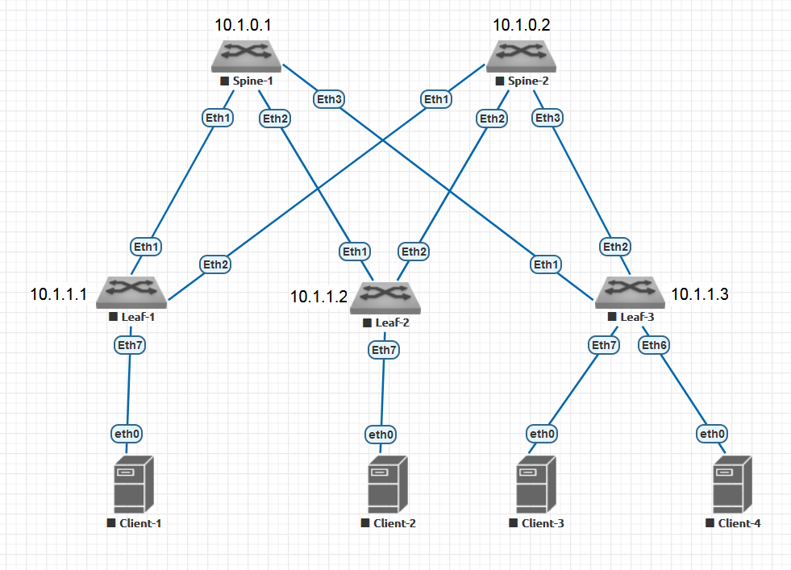

# Домашнее задание 3 (Построение Underlay-сети на базе Integrated IS-IS)

## Цель домашней работы
Построение Underlay-сети для ЦОД с использованием IGP-протокола Integrated IS-IS в качестве протокола динамической маршрутизации.

⚠️ __Примечание:__ В рамках данного документа (выполнения работы) термин IS-IS следует считать равнозначным термину Integrated IS-IS.

## Задача
Обеспечить связность между Loopback-адресами для всех Spine- и Leaf-коммутаторов.

## Топология



## IP-план
### Loopbacks

| Устройство | Loopback |
| ---------- | -------- |
| Spine-1    | 10.1.0.1 |
| Spine-2    | 10.1.0.2 |
| Leaf-1     | 10.1.1.1 |
| Leaf-2     | 10.1.1.2 |
| Leaf-3     | 10.1.1.3 |

### Leaf-Spine Interconnections

| Link  | Subnet       |
| ----- | ------------ |
| S1-L1 | 10.1.11.0/30 |
| S1-L2 | 10.1.12.0/30 |
| S1-L3 | 10.1.13.0/30 |
| S2-L1 | 10.1.21.0/30 |
| S2-L2 | 10.1.22.0/30 |
| S2-L3 | 10.1.23.0/30 |

## План работы

1. Убедиться, что стыковочные связи находятся в рабочем состоянии (ping).
2. Настроить процессы IS-IS и BFD на каждом Leaf и Spine, включить IS-IS и BFD на необходимых интерфейсах (стыки с соседями + loopback).
3. Убедиться, что IS-IS-взаимодействия между физически связанными устройствами установлены и находятся в состоянии FULL.
4. Убедиться, что BFD-сессии между устройствами находятся в рабочем состоянии и привязаны к процессу IS-IS.
5. Убедиться в достижимости каждого loopback-адреса устройства со всех других устройств.

### Требования
* В рамках underlay-сети нашей топологии должна использоваться одна L2-зона (зоны L1 использоваться не должны).
* NSAP-адреса должны использовать AFI 49, номер зоны 1.
* System ID должен быть образован из IPv4 Loopback-адреса по алгоритму XXX.XXX.XXX.XXX -> XXXX.XXXX.XXXX. При преобразовании недостающие знаки IPv4-адреса подбиваются нулями.
* Selector должен быть установлен в "00".
* Все устройства—участники IS-IS должны устанавливать друг с другом соседства 2-го уровня.
* Все стыковочные связи между устройствами в IS-IS должны быть настроены как point-to-point.
* Loopback-интерфейсы в IS-IS должны быть настроены как пассивные интерфейсы.
* Должна быть настроена domain-wide (Level-2) аутентификация.
* ID ключа идентификации на всех устройствах должен быть "1".
* Секретная строка аутентификации должна иметь значение `OTUS`.
* Для уменьшения времени реагирования на аварии, на стыковочных связях должен быть настроен и активирован для IS-IS протокол BFD.

## Выполнение работы
Настройка IP-адресации на интерфейсах устройств была выполнена в ДЗ-1.

### Шаг 1. Проверка стыковочных связей
Перед настройкой динамической маршрутизации мы проверим, что стыковочные связи находятся в исправном состоянии. Проверка будет осуществлена с помощью утилиты ping. Мы сделаем ping с каждого из Spine на стыковочный IP каждого Leaf-коммутатора.

#### Spine-1
##### ping Leaf-1
```
Spine-1#ping 10.1.11.2 repeat 1
PING 10.1.11.2 (10.1.11.2) 72(100) bytes of data.
80 bytes from 10.1.11.2: icmp_seq=1 ttl=64 time=7.33 ms
```

##### ping Leaf-2
```
Spine-1#ping 10.1.12.2 repeat 1
PING 10.1.12.2 (10.1.12.2) 72(100) bytes of data.
80 bytes from 10.1.12.2: icmp_seq=1 ttl=64 time=8.69 ms
```
##### ping Leaf-3
```
Spine-1#ping 10.1.13.2 repeat 1
PING 10.1.13.2 (10.1.13.2) 72(100) bytes of data.
80 bytes from 10.1.13.2: icmp_seq=1 ttl=64 time=7.36 ms

```

#### Spine-2
##### ping Leaf-1
```
Spine-2#ping 10.1.21.2 repeat 1
PING 10.1.21.2 (10.1.21.2) 72(100) bytes of data.
80 bytes from 10.1.21.2: icmp_seq=1 ttl=64 time=9.36 ms
```

##### ping Leaf-2
```
Spine-2#ping 10.1.22.2 repeat 1
PING 10.1.22.2 (10.1.22.2) 72(100) bytes of data.
80 bytes from 10.1.22.2: icmp_seq=1 ttl=64 time=7.96 ms
```

##### ping Leaf-3
```
Spine-2#ping 10.1.23.2 repeat 1
PING 10.1.23.2 (10.1.23.2) 72(100) bytes of data.
80 bytes from 10.1.23.2: icmp_seq=1 ttl=64 time=8.14 ms
```

### Шаг 2. Настройка IS-IS и BFD
Мы убедились, что стыковочные связи исправны. Теперь начнем настраивать непосредственно процессы IS-IS и BFD на каждом устройстве.

#### Spine-1
Шаги настройки:
1) Мы инициализируем процесс IS-IS и задаем ему имя "OTUS".
2) Мы указываем NSAP-адрес как AFI 49 (Private LAN), Area ID 1, System ID 0100.0100.0001 (преобразовано из 10.1.0.1), Selector 00.
3) Мы указываем, что Spine-1 будет маршрутизатором L2-only.
4) Мы настраиваем domain-wide (level-2) аутентификацию с использованием алгоритма sha-256, ID ключа 1 и значением ключа "OTUS".
5) Мы активируем семейство адресов IPv4 для IS-IS.
6) Мы активируем BFD для всех интерфейсов, на которых мы настраиваем IS-IS.
7) Мы активируем IS-IS на стыковочных интерфейсах и Loopback. Дополнительно для Loopback0 указываем, что интерфейс будет являться пассивным, а также отключаем на нем BFD.

```
router isis OTUS
 net 49.0001.0100.0100.0001.00
 is-type level-2
 authentication mode sha key-id 1 level-2
 authentication key-id 1 algorithm sha-256 key OTUS level-2
!
 address-family ipv4 unicast
  bfd all-interfaces
!
interface Loopback0
 isis passive
 no isis bfd
 isis enable OTUS
!
interface Ethernet1
 isis network point-to-point
 isis enable OTUS
!
interface Ethernet2
 isis network point-to-point
 isis enable OTUS
!
interface Ethernet3
 isis network point-to-point
 isis enable OTUS
```

#### Spine-2
1) Мы инициализируем процесс IS-IS и задаем ему имя "OTUS".
2) Мы указываем NSAP-адрес как AFI 49 (Private LAN), Area ID 1, System ID 0100.0100.0002 (преобразовано из 10.1.0.2), Selector 00.
3) Мы указываем, что Spine-2 будет маршрутизатором L2-only.
4) Мы настраиваем domain-wide (level-2) аутентификацию с использованием алгоритма sha-256, ID ключа 1 и значением ключа "OTUS".
5) Мы активируем семейство адресов IPv4 для IS-IS.
6) Мы активируем BFD для всех интерфейсов, на которых мы настраиваем IS-IS.
7) Мы активируем IS-IS на стыковочных интерфейсах и Loopback. Дополнительно для Loopback0 указываем, что интерфейс будет являться пассивным, а также отключаем на нем BFD.

```
router isis OTUS
 net 49.0001.0100.0100.0002.00
 is-type level-2
 authentication mode sha key-id 1 level-2
 authentication key-id 1 algorithm sha-256 key OTUS level-2
!
 address-family ipv4 unicast
  bfd all-interfaces
!
interface Loopback0
 isis passive
 no isis bfd
 isis enable OTUS
!
interface Ethernet1
 isis network point-to-point
 isis enable OTUS
!
interface Ethernet2
 isis network point-to-point
 isis enable OTUS
!
interface Ethernet3
 isis network point-to-point
 isis enable OTUS
```


#### Leaf-1
1) Мы инициализируем процесс IS-IS и задаем ему имя "OTUS".
2) Мы указываем NSAP-адрес как AFI 49 (Private LAN), Area ID 1, System ID 0100.0100.1001 (преобразовано из 10.1.1.1), Selector 00.
3) Мы указываем, что Leaf-1 будет маршрутизатором L2-only.
4) Мы настраиваем domain-wide (level-2) аутентификацию с использованием алгоритма sha-256, ID ключа 1 и значением ключа "OTUS".
5) Мы активируем семейство адресов IPv4 для IS-IS.
6) Мы активируем BFD для всех интерфейсов, на которых мы настраиваем IS-IS.
7) Мы активируем IS-IS на стыковочных интерфейсах и Loopback. Дополнительно для Loopback0 указываем, что интерфейс будет являться пассивным, а также отключаем на нем BFD.

```
router isis OTUS
 net 49.0001.0100.0100.1001.00
 is-type level-2
 authentication mode sha key-id 1 level-2
 authentication key-id 1 algorithm sha-256 key OTUS level-2
!
 address-family ipv4 unicast
  bfd all-interfaces
!
interface Loopback0
 isis passive
 no isis bfd
 isis enable OTUS
!
interface Ethernet1
 isis network point-to-point
 isis enable OTUS
!
interface Ethernet2
 isis network point-to-point
 isis enable OTUS
```

#### Leaf-2
1) Мы инициализируем процесс IS-IS и задаем ему имя "OTUS".
2) Мы указываем NSAP-адрес как AFI 49 (Private LAN), Area ID 1, System ID 0100.0100.1002 (преобразовано из 10.1.1.2), Selector 00.
3) Мы указываем, что Leaf-2 будет маршрутизатором L2-only.
4) Мы настраиваем domain-wide (level-2) аутентификацию с использованием алгоритма sha-256, ID ключа 1 и значением ключа "OTUS".
5) Мы активируем семейство адресов IPv4 для IS-IS.
6) Мы активируем BFD для всех интерфейсов, на которых мы настраиваем IS-IS.
7) Мы активируем IS-IS на стыковочных интерфейсах и Loopback. Дополнительно для Loopback0 указываем, что интерфейс будет являться пассивным, а также отключаем на нем BFD.

```
router isis OTUS
 net 49.0001.0100.0100.1002.00
 is-type level-2
 authentication mode sha key-id 1 level-2
 authentication key-id 1 algorithm sha-256 key OTUS level-2
!
 address-family ipv4 unicast
  bfd all-interfaces
!
interface Loopback0
 isis passive
 no isis bfd
 isis enable OTUS
!
interface Ethernet1
 isis network point-to-point
 isis enable OTUS
!
interface Ethernet2
 isis network point-to-point
 isis enable OTUS
```

#### Leaf-3
1) Мы инициализируем процесс IS-IS и задаем ему имя "OTUS".
2) Мы указываем NSAP-адрес как AFI 49 (Private LAN), Area ID 1, System ID 0100.0100.1003 (преобразовано из 10.1.1.3), Selector 00.
3) Мы указываем, что Leaf-3 будет маршрутизатором L2-only.
4) Мы настраиваем domain-wide (level-2) аутентификацию с использованием алгоритма sha-256, ID ключа 1 и значением ключа "OTUS".
5) Мы активируем семейство адресов IPv4 для IS-IS.
6) Мы активируем BFD для всех интерфейсов, на которых мы настраиваем IS-IS.
7) Мы активируем IS-IS на стыковочных интерфейсах и Loopback. Дополнительно для Loopback0 указываем, что интерфейс будет являться пассивным, а также отключаем на нем BFD.

```
router isis OTUS
 net 49.0001.0100.0100.1003.00
 is-type level-2
 authentication mode sha key-id 1 level-2
 authentication key-id 1 algorithm sha-256 key OTUS level-2
!
 address-family ipv4 unicast
  bfd all-interfaces
!
interface Loopback0
 isis passive
 isis enable OTUS
!
interface Ethernet1
 isis network point-to-point
 isis enable OTUS
!
interface Ethernet2
 isis network point-to-point
 isis enable OTUS
```

### Верификация состояния IS-IS и BFD
#### Spine-1
##### Проверка состояния процесса IS-IS
```
Spine-1#show isis summary
 
IS-IS Instance: OTUS VRF: default
  Instance ID: 0
  System ID: 0100.0100.0001, administratively enabled
  Router ID: IPv4: 10.1.0.1
  Hostname: Spine-1
  Multi Topology disabled, not attached
  IPv4 Preference: Level 1: 115, Level 2: 115
  IPv6 Preference: Level 1: 115, Level 2: 115
  IS-Type: Level 2, Number active interfaces: 4
  Routes IPv4 only
  LSP size maximum: Level 1: 1492, Level 2: 1492
                            Max wait(s) Initial wait(ms) Hold interval(ms)
  LSP Generation Interval:     5              50               50
  SPF Interval:                2            1000             1000
  Current SPF hold interval(ms): Level 1: 0, Level 2: 1000
  Last Level 2 SPF run 17 seconds ago
  CSNP generation interval: 10 seconds
  Dynamic Flooding: Disabled
  Authentication mode: Level 1: None, Level 2: SHA Key id: 1
  Graceful Restart: Disabled, Graceful Restart Helper: Enabled
  Area addresses: 49.0001
  level 2: number DIS interfaces: 0, LSDB size: 5
    Area Leader: None
    Overload Bit is not set. 
  Redistributed Level 1 routes: 0 limit: Not Configured
  Redistributed Level 2 routes: 0 limit: Not Configured
```
Здесь мы можем убедиться, что System ID установлен корректно, тип маршрутизатора установлен как L2, активных интерфейсов 4 штуки (три стыковочных и один loopback), включена поддержка IPv4 (Routes IPv4 only), аутентификация для Level-2 настроена - использует алгоритм SHA и ключ с ID "1". Адрес зоны 49.0001.

##### Проверка состояния IS-IS на интерфейсах
###### Loopback 0
```
Spine-1#show isis interface Loopback 0

IS-IS Instance: OTUS VRF: default

  Interface Loopback0:
    Index: 10 SNPA: 0:0:0:0:0:0
    MTU: 65532 Type: loopback
    Supported address families: IPv4
    Area proxy boundary is disabled
    BFD IPv4 is disabled
    BFD IPv6 is disabled
    Hello padding is enabled
    Level 2:
      Metric: 10 (passive interface)
      Authentication mode: None
      TI-LFA protection is disabled for IPv4
      TI-LFA protection is disabled for IPv6
```
Для Loopback0 убеждаемся, что IS-IS активен и принадлежит верному процессу (OTUS), активирована AF IPv4, BFD заглушен, интерфейс является пассивным.

###### Ethernet 1
```
Spine-1#show isis interface Ethernet 1

IS-IS Instance: OTUS VRF: default

  Interface Ethernet1:
    Index: 13 SNPA: P2P
    MTU: 1497 Type: point-to-point
    Supported address families: IPv4
    Area proxy boundary is disabled
    Speed: 1000 mbps
    BFD IPv4 is enabled
    BFD IPv6 is disabled
    Hello padding is enabled
    Level 2:
      Metric: 10, Number of adjacencies: 1
      Link-ID: 0D
      Authentication mode: None
      TI-LFA protection is disabled for IPv4
      TI-LFA protection is disabled for IPv6
```
Для Ethernet 1 мы убеждаемся, что интерфейс принадлежит верному процессу (OTUS), тип интерфейса P2P, активирована AF IPv4, BFD активирован, количество соседей 1 штука.

###### Ethernet 2
```
Spine-1#show isis interface Ethernet 2

IS-IS Instance: OTUS VRF: default

  Interface Ethernet2:
    Index: 14 SNPA: P2P
    MTU: 1497 Type: point-to-point
    Supported address families: IPv4
    Area proxy boundary is disabled
    Speed: 1000 mbps
    BFD IPv4 is enabled
    BFD IPv6 is disabled
    Hello padding is enabled
    Level 2:
      Metric: 10, Number of adjacencies: 1
      Link-ID: 0E
      Authentication mode: None
      TI-LFA protection is disabled for IPv4
      TI-LFA protection is disabled for IPv6
```
Для Ethernet 2 мы убеждаемся, что интерфейс принадлежит верному процессу (OTUS), тип интерфейса P2P, активирована AF IPv4, BFD активирован, количество соседей 1 штука.

###### Ethernet 3
```
Spine-1#show isis interface Ethernet 3

IS-IS Instance: OTUS VRF: default

  Interface Ethernet3:
    Index: 15 SNPA: P2P
    MTU: 1497 Type: point-to-point
    Supported address families: IPv4
    Area proxy boundary is disabled
    Speed: 1000 mbps
    BFD IPv4 is enabled
    BFD IPv6 is disabled
    Hello padding is enabled
    Level 2:
      Metric: 10, Number of adjacencies: 1
      Link-ID: 0F
      Authentication mode: None
      TI-LFA protection is disabled for IPv4
      TI-LFA protection is disabled for IPv6
```
Для Ethernet 3 мы убеждаемся, что интерфейс принадлежит верному процессу (OTUS), тип интерфейса P2P, активирована AF IPv4, BFD активирован, количество соседей 1 штука.

##### Проверка состояния соседей
```
Spine-1#show isis neighbors detail level-2
 
Instance  VRF      System Id        Type Interface          SNPA              State Hold time   Circuit Id          
OTUS      default  Leaf-1           L2   Ethernet1          P2P               UP    29          0D                  
  Area addresses: 49.0001
  SNPA: P2P
  Router ID: 0.0.0.0
  Advertised Hold Time: 30
  State Changed: 00:13:11 ago at 2024-05-21 16:27:49
  IPv4 Interface Address: 10.1.11.2
  IPv6 Interface Address: none
  Interface name: Ethernet1
  Graceful Restart: Supported 
  BFD IPv4 state is Up
  Supported Address Families: IPv4
  Neighbor Supported Address Families: IPv4
OTUS      default  Leaf-2           L2   Ethernet2          P2P               UP    27          0D                  
  Area addresses: 49.0001
  SNPA: P2P
  Router ID: 0.0.0.0
  Advertised Hold Time: 30
  State Changed: 00:12:20 ago at 2024-05-21 16:28:40
  IPv4 Interface Address: 10.1.12.2
  IPv6 Interface Address: none
  Interface name: Ethernet2
  Graceful Restart: Supported 
  BFD IPv4 state is Up
  Supported Address Families: IPv4
  Neighbor Supported Address Families: IPv4
OTUS      default  Leaf-3           L2   Ethernet3          P2P               UP    23          0D                  
  Area addresses: 49.0001
  SNPA: P2P
  Router ID: 0.0.0.0
  Advertised Hold Time: 30
  State Changed: 00:11:31 ago at 2024-05-21 16:29:29
  IPv4 Interface Address: 10.1.13.2
  IPv6 Interface Address: none
  Interface name: Ethernet3
  Graceful Restart: Supported 
  BFD IPv4 state is Up
  Supported Address Families: IPv4
  Neighbor Supported Address Families: IPv4
```
Здесь мы можем убедиться, что все ожидаемые соседи (Leaf-1, Leaf-2, Leaf-3) присутствуют и находятся в состоянии UP, BFD активировано, AF IPv4 активирована.

##### Проверка состояния сессий BFD
```
Spine-1#show bfd peers
VRF name: default
-----------------
DstAddr        MyDisc    YourDisc  Interface/Transport    Type          LastUp 
---------- ----------- ----------- -------------------- ------- ---------------
10.1.11.2  1738052776  3467482944        Ethernet1(13)  normal  05/21/24 16:27 
10.1.12.2  1809944655  4282966146        Ethernet2(14)  normal  05/21/24 16:28 
10.1.13.2  4038902094  3381032092        Ethernet3(15)  normal  05/21/24 16:29 

   LastDown            LastDiag    State
-------------- ------------------- -----
         NA       No Diagnostic       Up
         NA       No Diagnostic       Up
         NA       No Diagnostic       Up
```
С BFD-сессиями все в порядке.

##### Проверка таблицы маршрутизации
```
Spine-1#show ip route

VRF: default
Codes: C - connected, S - static, K - kernel, 
       O - OSPF, IA - OSPF inter area, E1 - OSPF external type 1,
       E2 - OSPF external type 2, N1 - OSPF NSSA external type 1,
       N2 - OSPF NSSA external type2, B - Other BGP Routes,
       B I - iBGP, B E - eBGP, R - RIP, I L1 - IS-IS level 1,
       I L2 - IS-IS level 2, O3 - OSPFv3, A B - BGP Aggregate,
       A O - OSPF Summary, NG - Nexthop Group Static Route,
       V - VXLAN Control Service, M - Martian,
       DH - DHCP client installed default route,
       DP - Dynamic Policy Route, L - VRF Leaked,
       G  - gRIBI, RC - Route Cache Route

Gateway of last resort is not set

 C        10.1.0.1/32 is directly connected, Loopback0
 I L2     10.1.0.2/32 [115/30] via 10.1.11.2, Ethernet1
                               via 10.1.12.2, Ethernet2
                               via 10.1.13.2, Ethernet3
 I L2     10.1.1.1/32 [115/20] via 10.1.11.2, Ethernet1
 I L2     10.1.1.2/32 [115/20] via 10.1.12.2, Ethernet2
 I L2     10.1.1.3/32 [115/20] via 10.1.13.2, Ethernet3
 C        10.1.11.0/30 is directly connected, Ethernet1
 C        10.1.12.0/30 is directly connected, Ethernet2
 C        10.1.13.0/30 is directly connected, Ethernet3
 I L2     10.1.21.0/30 [115/20] via 10.1.11.2, Ethernet1
 I L2     10.1.22.0/30 [115/20] via 10.1.12.2, Ethernet2
 I L2     10.1.23.0/30 [115/20] via 10.1.13.2, Ethernet3
```
Ожидаемые нами маршруты присутствуют (стыковочные сети Spine-2 и все loopback'и). Next-hop'ы выглядят корректными.

#### Spine-2
##### Проверка состояния процесса IS-IS
```
Spine-2#show isis summary
 
IS-IS Instance: OTUS VRF: default
  Instance ID: 0
  System ID: 0100.0100.0002, administratively enabled
  Router ID: IPv4: 10.1.0.2
  Hostname: Spine-2
  Multi Topology disabled, not attached
  IPv4 Preference: Level 1: 115, Level 2: 115
  IPv6 Preference: Level 1: 115, Level 2: 115
  IS-Type: Level 2, Number active interfaces: 4
  Routes IPv4 only
  LSP size maximum: Level 1: 1492, Level 2: 1492
                            Max wait(s) Initial wait(ms) Hold interval(ms)
  LSP Generation Interval:     5              50               50
  SPF Interval:                2            1000             1000
  Current SPF hold interval(ms): Level 1: 0, Level 2: 1000
  Last Level 2 SPF run 7:38 minutes ago
  CSNP generation interval: 10 seconds
  Dynamic Flooding: Disabled
  Authentication mode: Level 1: None, Level 2: SHA Key id: 1
  Graceful Restart: Disabled, Graceful Restart Helper: Enabled
  Area addresses: 49.0001
  level 2: number DIS interfaces: 0, LSDB size: 5
    Area Leader: None
    Overload Bit is not set. 
  Redistributed Level 1 routes: 0 limit: Not Configured
  Redistributed Level 2 routes: 0 limit: Not Configured
```
Здесь мы можем убедиться, что System ID установлен корректно, тип маршрутизатора установлен как L2, активных интерфейсов 4 штуки (три стыковочных и один loopback), включена поддержка IPv4 (Routes IPv4 only), аутентификация для Level-2 настроена - использует алгоритм SHA и ключ с ID "1". Адрес зоны 49.0001.

##### Проверка состояния IS-IS на интерфейсах
###### Loopback 0
```
Spine-2#show isis interface Loopback 0

IS-IS Instance: OTUS VRF: default

  Interface Loopback0:
    Index: 10 SNPA: 0:0:0:0:0:0
    MTU: 65532 Type: loopback
    Supported address families: IPv4
    Area proxy boundary is disabled
    BFD IPv4 is disabled
    BFD IPv6 is disabled
    Hello padding is enabled
    Level 2:
      Metric: 10 (passive interface)
      Authentication mode: None
      TI-LFA protection is disabled for IPv4
      TI-LFA protection is disabled for IPv6
```
Для Loopback0 убеждаемся, что IS-IS активен и принадлежит верному процессу (OTUS), активирована AF IPv4, BFD заглушен, интерфейс является пассивным.

###### Ethernet 1
```
Spine-2#show isis interface Ethernet 1

IS-IS Instance: OTUS VRF: default

  Interface Ethernet1:
    Index: 13 SNPA: P2P
    MTU: 1497 Type: point-to-point
    Supported address families: IPv4
    Area proxy boundary is disabled
    Speed: 1000 mbps
    BFD IPv4 is enabled
    BFD IPv6 is disabled
    Hello padding is enabled
    Level 2:
      Metric: 10, Number of adjacencies: 1
      Link-ID: 0D
      Authentication mode: None
      TI-LFA protection is disabled for IPv4
      TI-LFA protection is disabled for IPv6
```
Для Ethernet 1 мы убеждаемся, что интерфейс принадлежит верному процессу (OTUS), тип интерфейса P2P, активирована AF IPv4, BFD активирован, количество соседей 1 штука.

###### Ethernet 2
```
Spine-2#show isis interface Ethernet 2

IS-IS Instance: OTUS VRF: default

  Interface Ethernet2:
    Index: 14 SNPA: P2P
    MTU: 1497 Type: point-to-point
    Supported address families: IPv4
    Area proxy boundary is disabled
    Speed: 1000 mbps
    BFD IPv4 is enabled
    BFD IPv6 is disabled
    Hello padding is enabled
    Level 2:
      Metric: 10, Number of adjacencies: 1
      Link-ID: 0E
      Authentication mode: None
      TI-LFA protection is disabled for IPv4
      TI-LFA protection is disabled for IPv6
```
Для Ethernet 2 мы убеждаемся, что интерфейс принадлежит верному процессу (OTUS), тип интерфейса P2P, активирована AF IPv4, BFD активирован, количество соседей 1 штука.

###### Ethernet 3
```
Spine-2#show isis interface Ethernet 3

IS-IS Instance: OTUS VRF: default

  Interface Ethernet3:
    Index: 15 SNPA: P2P
    MTU: 1497 Type: point-to-point
    Supported address families: IPv4
    Area proxy boundary is disabled
    Speed: 1000 mbps
    BFD IPv4 is enabled
    BFD IPv6 is disabled
    Hello padding is enabled
    Level 2:
      Metric: 10, Number of adjacencies: 1
      Link-ID: 0F
      Authentication mode: None
      TI-LFA protection is disabled for IPv4
      TI-LFA protection is disabled for IPv6
```
Для Ethernet 3 мы убеждаемся, что интерфейс принадлежит верному процессу (OTUS), тип интерфейса P2P, активирована AF IPv4, BFD активирован, количество соседей 1 штука.

##### Проверка состояния соседей
```
Spine-2#show isis neighbors detail level-2
 
Instance  VRF      System Id        Type Interface          SNPA              State Hold time   Circuit Id          
OTUS      default  Leaf-1           L2   Ethernet1          P2P               UP    29          0E                  
  Area addresses: 49.0001
  SNPA: P2P
  Router ID: 0.0.0.0
  Advertised Hold Time: 30
  State Changed: 00:23:16 ago at 2024-05-21 16:27:48
  IPv4 Interface Address: 10.1.21.2
  IPv6 Interface Address: none
  Interface name: Ethernet1
  Graceful Restart: Supported 
  BFD IPv4 state is Up
  Supported Address Families: IPv4
  Neighbor Supported Address Families: IPv4
OTUS      default  Leaf-2           L2   Ethernet2          P2P               UP    23          0E                  
  Area addresses: 49.0001
  SNPA: P2P
  Router ID: 0.0.0.0
  Advertised Hold Time: 30
  State Changed: 00:22:23 ago at 2024-05-21 16:28:41
  IPv4 Interface Address: 10.1.22.2
  IPv6 Interface Address: none
  Interface name: Ethernet2
  Graceful Restart: Supported 
  BFD IPv4 state is Up
  Supported Address Families: IPv4
  Neighbor Supported Address Families: IPv4
OTUS      default  Leaf-3           L2   Ethernet3          P2P               UP    29          0E                  
  Area addresses: 49.0001
  SNPA: P2P
  Router ID: 0.0.0.0
  Advertised Hold Time: 30
  State Changed: 00:21:32 ago at 2024-05-21 16:29:32
  IPv4 Interface Address: 10.1.23.2
  IPv6 Interface Address: none
  Interface name: Ethernet3
  Graceful Restart: Supported 
  BFD IPv4 state is Up
  Supported Address Families: IPv4
  Neighbor Supported Address Families: IPv4
```
Здесь мы можем убедиться, что все ожидаемые соседи (Leaf-1, Leaf-2, Leaf-3) присутствуют и находятся в состоянии UP, BFD активировано, AF IPv4 активирована.

##### Проверка состояния сессий BFD
```
Spine-2#show bfd peers
VRF name: default
-----------------
DstAddr        MyDisc    YourDisc  Interface/Transport    Type          LastUp 
---------- ----------- ----------- -------------------- ------- ---------------
10.1.21.2   448674412  2981592777        Ethernet1(13)  normal  05/21/24 16:27 
10.1.22.2  2016981232  3167938056        Ethernet2(14)  normal  05/21/24 16:28 
10.1.23.2  3726369056  1079389549        Ethernet3(15)  normal  05/21/24 16:29 

   LastDown            LastDiag    State
-------------- ------------------- -----
         NA       No Diagnostic       Up
         NA       No Diagnostic       Up
         NA       No Diagnostic       Up
```
С BFD-сессиями все в порядке.

##### Проверка таблицы маршрутизации
```
Spine-2#show ip route

VRF: default
Codes: C - connected, S - static, K - kernel, 
       O - OSPF, IA - OSPF inter area, E1 - OSPF external type 1,
       E2 - OSPF external type 2, N1 - OSPF NSSA external type 1,
       N2 - OSPF NSSA external type2, B - Other BGP Routes,
       B I - iBGP, B E - eBGP, R - RIP, I L1 - IS-IS level 1,
       I L2 - IS-IS level 2, O3 - OSPFv3, A B - BGP Aggregate,
       A O - OSPF Summary, NG - Nexthop Group Static Route,
       V - VXLAN Control Service, M - Martian,
       DH - DHCP client installed default route,
       DP - Dynamic Policy Route, L - VRF Leaked,
       G  - gRIBI, RC - Route Cache Route

Gateway of last resort is not set

 I L2     10.1.0.1/32 [115/30] via 10.1.21.2, Ethernet1
                               via 10.1.22.2, Ethernet2
                               via 10.1.23.2, Ethernet3
 C        10.1.0.2/32 is directly connected, Loopback0
 I L2     10.1.1.1/32 [115/20] via 10.1.21.2, Ethernet1
 I L2     10.1.1.2/32 [115/20] via 10.1.22.2, Ethernet2
 I L2     10.1.1.3/32 [115/20] via 10.1.23.2, Ethernet3
 I L2     10.1.11.0/30 [115/20] via 10.1.21.2, Ethernet1
 I L2     10.1.12.0/30 [115/20] via 10.1.22.2, Ethernet2
 I L2     10.1.13.0/30 [115/20] via 10.1.23.2, Ethernet3
 C        10.1.21.0/30 is directly connected, Ethernet1
 C        10.1.22.0/30 is directly connected, Ethernet2
 C        10.1.23.0/30 is directly connected, Ethernet3
```
Ожидаемые нами маршруты присутствуют (стыковочные сети Spine-1 и все loopback'и). Next-hop'ы выглядят корректными.

#### Leaf-1
##### Проверка состояния процесса IS-IS
```
Leaf-1#show isis summary
 
IS-IS Instance: OTUS VRF: default
  Instance ID: 0
  System ID: 0100.0100.1001, administratively enabled
  Router ID: IPv4: 10.1.1.1
  Hostname: Leaf-1
  Multi Topology disabled, not attached
  IPv4 Preference: Level 1: 115, Level 2: 115
  IPv6 Preference: Level 1: 115, Level 2: 115
  IS-Type: Level 2, Number active interfaces: 3
  Routes IPv4 only
  LSP size maximum: Level 1: 1492, Level 2: 1492
                            Max wait(s) Initial wait(ms) Hold interval(ms)
  LSP Generation Interval:     5              50               50
  SPF Interval:                2            1000             1000
  Current SPF hold interval(ms): Level 1: 0, Level 2: 1000
  Last Level 2 SPF run 4:08 minutes ago
  CSNP generation interval: 10 seconds
  Dynamic Flooding: Disabled
  Authentication mode: Level 1: None, Level 2: SHA Key id: 1
  Graceful Restart: Disabled, Graceful Restart Helper: Enabled
  Area addresses: 49.0001
  level 2: number DIS interfaces: 0, LSDB size: 5
    Area Leader: None
    Overload Bit is not set. 
  Redistributed Level 1 routes: 0 limit: Not Configured
  Redistributed Level 2 routes: 0 limit: Not Configured
```
Здесь мы можем убедиться, что System ID установлен корректно, тип маршрутизатора установлен как L2, активных интерфейсов 3 штуки (два стыковочных и один loopback), включена поддержка IPv4 (Routes IPv4 only), аутентификация для Level-2 настроена - использует алгоритм SHA и ключ с ID "1". Адрес зоны 49.0001.

##### Проверка состояния IS-IS на интерфейсах
###### Loopback 0
```
Leaf-1#show isis interface Loopback 0

IS-IS Instance: OTUS VRF: default

  Interface Loopback0:
    Index: 10 SNPA: 0:0:0:0:0:0
    MTU: 65532 Type: loopback
    Supported address families: IPv4
    Area proxy boundary is disabled
    BFD IPv4 is disabled
    BFD IPv6 is disabled
    Hello padding is enabled
    Level 2:
      Metric: 10 (passive interface)
      Authentication mode: None
      TI-LFA protection is disabled for IPv4
      TI-LFA protection is disabled for IPv6
```
Для Loopback0 убеждаемся, что IS-IS активен и принадлежит верному процессу (OTUS), активирована AF IPv4, BFD заглушен, интерфейс является пассивным.

###### Ethernet 1
```
Leaf-1#show isis interface Ethernet 1

IS-IS Instance: OTUS VRF: default

  Interface Ethernet1:
    Index: 13 SNPA: P2P
    MTU: 1497 Type: point-to-point
    Supported address families: IPv4
    Area proxy boundary is disabled
    Speed: 1000 mbps
    BFD IPv4 is enabled
    BFD IPv6 is disabled
    Hello padding is enabled
    Level 2:
      Metric: 10, Number of adjacencies: 1
      Link-ID: 0D
      Authentication mode: None
      TI-LFA protection is disabled for IPv4
      TI-LFA protection is disabled for IPv6
```
Для Ethernet 1 мы убеждаемся, что интерфейс принадлежит верному процессу (OTUS), тип интерфейса P2P, активирована AF IPv4, BFD активирован, количество соседей 1 штука.

###### Ethernet 2
```
Leaf-1#show isis interface Ethernet 2

IS-IS Instance: OTUS VRF: default

  Interface Ethernet2:
    Index: 14 SNPA: P2P
    MTU: 1497 Type: point-to-point
    Supported address families: IPv4
    Area proxy boundary is disabled
    Speed: 1000 mbps
    BFD IPv4 is enabled
    BFD IPv6 is disabled
    Hello padding is enabled
    Level 2:
      Metric: 10, Number of adjacencies: 1
      Link-ID: 0E
      Authentication mode: None
      TI-LFA protection is disabled for IPv4
      TI-LFA protection is disabled for IPv6
```
Для Ethernet 2 мы убеждаемся, что интерфейс принадлежит верному процессу (OTUS), тип интерфейса P2P, активирована AF IPv4, BFD активирован, количество соседей 1 штука.

##### Проверка состояния соседей
```
Leaf-1#show isis neighbors detail level-2
 
Instance  VRF      System Id        Type Interface          SNPA              State Hold time   Circuit Id          
OTUS      default  Spine-1          L2   Ethernet1          P2P               UP    26          0D                  
  Area addresses: 49.0001
  SNPA: P2P
  Router ID: 0.0.0.0
  Advertised Hold Time: 30
  State Changed: 00:28:04 ago at 2024-05-21 16:27:49
  IPv4 Interface Address: 10.1.11.1
  IPv6 Interface Address: none
  Interface name: Ethernet1
  Graceful Restart: Supported 
  BFD IPv4 state is Up
  Supported Address Families: IPv4
  Neighbor Supported Address Families: IPv4
OTUS      default  Spine-2          L2   Ethernet2          P2P               UP    28          0D                  
  Area addresses: 49.0001
  SNPA: P2P
  Router ID: 0.0.0.0
  Advertised Hold Time: 30
  State Changed: 00:28:05 ago at 2024-05-21 16:27:48
  IPv4 Interface Address: 10.1.21.1
  IPv6 Interface Address: none
  Interface name: Ethernet2
  Graceful Restart: Supported 
  BFD IPv4 state is Up
  Supported Address Families: IPv4
  Neighbor Supported Address Families: IPv4
```
Здесь мы можем убедиться, что все ожидаемые соседи (оба Spine) присутствуют и находятся в состоянии UP, BFD активировано, AF IPv4 активирована.

##### Проверка состояния сессий BFD
```
Leaf-1#show bfd peers
VRF name: default
-----------------
DstAddr        MyDisc    YourDisc  Interface/Transport    Type          LastUp 
---------- ----------- ----------- -------------------- ------- ---------------
10.1.11.1  3467482944  1738052776        Ethernet1(13)  normal  05/21/24 16:27 
10.1.21.1  2981592777   448674412        Ethernet2(14)  normal  05/21/24 16:27 

   LastDown            LastDiag    State
-------------- ------------------- -----
         NA       No Diagnostic       Up
         NA       No Diagnostic       Up
```
С BFD-сессиями все в порядке.

##### Проверка таблицы маршрутизации
```
Leaf-1#show ip route

VRF: default
Codes: C - connected, S - static, K - kernel, 
       O - OSPF, IA - OSPF inter area, E1 - OSPF external type 1,
       E2 - OSPF external type 2, N1 - OSPF NSSA external type 1,
       N2 - OSPF NSSA external type2, B - Other BGP Routes,
       B I - iBGP, B E - eBGP, R - RIP, I L1 - IS-IS level 1,
       I L2 - IS-IS level 2, O3 - OSPFv3, A B - BGP Aggregate,
       A O - OSPF Summary, NG - Nexthop Group Static Route,
       V - VXLAN Control Service, M - Martian,
       DH - DHCP client installed default route,
       DP - Dynamic Policy Route, L - VRF Leaked,
       G  - gRIBI, RC - Route Cache Route

Gateway of last resort is not set

 I L2     10.1.0.1/32 [115/20] via 10.1.11.1, Ethernet1
 I L2     10.1.0.2/32 [115/20] via 10.1.21.1, Ethernet2
 C        10.1.1.1/32 is directly connected, Loopback0
 I L2     10.1.1.2/32 [115/30] via 10.1.11.1, Ethernet1
                               via 10.1.21.1, Ethernet2
 I L2     10.1.1.3/32 [115/30] via 10.1.11.1, Ethernet1
                               via 10.1.21.1, Ethernet2
 C        10.1.11.0/30 is directly connected, Ethernet1
 I L2     10.1.12.0/30 [115/20] via 10.1.11.1, Ethernet1
 I L2     10.1.13.0/30 [115/20] via 10.1.11.1, Ethernet1
 C        10.1.21.0/30 is directly connected, Ethernet2
 I L2     10.1.22.0/30 [115/20] via 10.1.21.1, Ethernet2
 I L2     10.1.23.0/30 [115/20] via 10.1.21.1, Ethernet2

```
Ожидаемые нами маршруты присутствуют (стыковочные сети, подключенные к другим Leaf'ам и все loopback'и). Next-hop'ы выглядят корректными.

#### Leaf-2
##### Проверка состояния процесса IS-IS
```
Leaf-2#show isis summary
 
IS-IS Instance: OTUS VRF: default
  Instance ID: 0
  System ID: 0100.0100.1002, administratively enabled
  Router ID: IPv4: 10.1.1.2
  Hostname: Leaf-2
  Multi Topology disabled, not attached
  IPv4 Preference: Level 1: 115, Level 2: 115
  IPv6 Preference: Level 1: 115, Level 2: 115
  IS-Type: Level 2, Number active interfaces: 3
  Routes IPv4 only
  LSP size maximum: Level 1: 1492, Level 2: 1492
                            Max wait(s) Initial wait(ms) Hold interval(ms)
  LSP Generation Interval:     5              50               50
  SPF Interval:                2            1000             1000
  Current SPF hold interval(ms): Level 1: 0, Level 2: 1000
  Last Level 2 SPF run 4:53 minutes ago
  CSNP generation interval: 10 seconds
  Dynamic Flooding: Disabled
  Authentication mode: Level 1: None, Level 2: SHA Key id: 1
  Graceful Restart: Disabled, Graceful Restart Helper: Enabled
  Area addresses: 49.0001
  level 2: number DIS interfaces: 0, LSDB size: 5
    Area Leader: None
    Overload Bit is not set. 
  Redistributed Level 1 routes: 0 limit: Not Configured
  Redistributed Level 2 routes: 0 limit: Not Configured
```
Здесь мы можем убедиться, что System ID установлен корректно, тип маршрутизатора установлен как L2, активных интерфейсов 3 штуки (два стыковочных и один loopback), включена поддержка IPv4 (Routes IPv4 only), аутентификация для Level-2 настроена - использует алгоритм SHA и ключ с ID "1". Адрес зоны 49.0001.

##### Проверка состояния IS-IS на интерфейсах
###### Loopback 0
```
Leaf-2#show isis interface Loopback 0

IS-IS Instance: OTUS VRF: default

  Interface Loopback0:
    Index: 10 SNPA: 0:0:0:0:0:0
    MTU: 65532 Type: loopback
    Supported address families: IPv4
    Area proxy boundary is disabled
    BFD IPv4 is disabled
    BFD IPv6 is disabled
    Hello padding is enabled
    Level 2:
      Metric: 10 (passive interface)
      Authentication mode: None
      TI-LFA protection is disabled for IPv4
      TI-LFA protection is disabled for IPv6
```
Для Loopback0 убеждаемся, что IS-IS активен и принадлежит верному процессу (OTUS), активирована AF IPv4, BFD заглушен, интерфейс является пассивным.

###### Ethernet 1
```
Leaf-2#show isis interface Ethernet 1

IS-IS Instance: OTUS VRF: default

  Interface Ethernet1:
    Index: 13 SNPA: P2P
    MTU: 1497 Type: point-to-point
    Supported address families: IPv4
    Area proxy boundary is disabled
    Speed: 1000 mbps
    BFD IPv4 is enabled
    BFD IPv6 is disabled
    Hello padding is enabled
    Level 2:
      Metric: 10, Number of adjacencies: 1
      Link-ID: 0D
      Authentication mode: None
      TI-LFA protection is disabled for IPv4
      TI-LFA protection is disabled for IPv6
```
Для Ethernet 1 мы убеждаемся, что интерфейс принадлежит верному процессу (OTUS), тип интерфейса P2P, активирована AF IPv4, BFD активирован, количество соседей 1 штука.

###### Ethernet 2
```
Leaf-2#show isis interface Ethernet 2

IS-IS Instance: OTUS VRF: default

  Interface Ethernet2:
    Index: 14 SNPA: P2P
    MTU: 1497 Type: point-to-point
    Supported address families: IPv4
    Area proxy boundary is disabled
    Speed: 1000 mbps
    BFD IPv4 is enabled
    BFD IPv6 is disabled
    Hello padding is enabled
    Level 2:
      Metric: 10, Number of adjacencies: 1
      Link-ID: 0E
      Authentication mode: None
      TI-LFA protection is disabled for IPv4
      TI-LFA protection is disabled for IPv6
```
Для Ethernet 2 мы убеждаемся, что интерфейс принадлежит верному процессу (OTUS), тип интерфейса P2P, активирована AF IPv4, BFD активирован, количество соседей 1 штука.

##### Проверка состояния соседей
```
Leaf-2#show isis neighbors detail level-2
 
Instance  VRF      System Id        Type Interface          SNPA              State Hold time   Circuit Id          
OTUS      default  Spine-1          L2   Ethernet1          P2P               UP    22          0E                  
  Area addresses: 49.0001
  SNPA: P2P
  Router ID: 0.0.0.0
  Advertised Hold Time: 30
  State Changed: 00:34:22 ago at 2024-05-21 16:28:39
  IPv4 Interface Address: 10.1.12.1
  IPv6 Interface Address: none
  Interface name: Ethernet1
  Graceful Restart: Supported 
  BFD IPv4 state is Up
  Supported Address Families: IPv4
  Neighbor Supported Address Families: IPv4
OTUS      default  Spine-2          L2   Ethernet2          P2P               UP    23          0E                  
  Area addresses: 49.0001
  SNPA: P2P
  Router ID: 0.0.0.0
  Advertised Hold Time: 30
  State Changed: 00:34:21 ago at 2024-05-21 16:28:40
  IPv4 Interface Address: 10.1.22.1
  IPv6 Interface Address: none
  Interface name: Ethernet2
  Graceful Restart: Supported 
  BFD IPv4 state is Up
  Supported Address Families: IPv4
  Neighbor Supported Address Families: IPv4
```
Здесь мы можем убедиться, что все ожидаемые соседи (оба Spine) присутствуют и находятся в состоянии UP, BFD активировано, AF IPv4 активирована.

##### Проверка состояния сессий BFD
```
Leaf-2#show bfd peers
VRF name: default
-----------------
DstAddr        MyDisc    YourDisc  Interface/Transport    Type          LastUp 
---------- ----------- ----------- -------------------- ------- ---------------
10.1.12.1  4282966146  1809944655        Ethernet1(13)  normal  05/21/24 16:28 
10.1.22.1  3167938056  2016981232        Ethernet2(14)  normal  05/21/24 16:28 

   LastDown            LastDiag    State
-------------- ------------------- -----
         NA       No Diagnostic       Up
         NA       No Diagnostic       Up
```
С BFD-сессиями все в порядке.

##### Проверка таблицы маршрутизации
```
Leaf-2#show ip route

VRF: default
Codes: C - connected, S - static, K - kernel, 
       O - OSPF, IA - OSPF inter area, E1 - OSPF external type 1,
       E2 - OSPF external type 2, N1 - OSPF NSSA external type 1,
       N2 - OSPF NSSA external type2, B - Other BGP Routes,
       B I - iBGP, B E - eBGP, R - RIP, I L1 - IS-IS level 1,
       I L2 - IS-IS level 2, O3 - OSPFv3, A B - BGP Aggregate,
       A O - OSPF Summary, NG - Nexthop Group Static Route,
       V - VXLAN Control Service, M - Martian,
       DH - DHCP client installed default route,
       DP - Dynamic Policy Route, L - VRF Leaked,
       G  - gRIBI, RC - Route Cache Route

Gateway of last resort is not set

 I L2     10.1.0.1/32 [115/20] via 10.1.12.1, Ethernet1
 I L2     10.1.0.2/32 [115/20] via 10.1.22.1, Ethernet2
 I L2     10.1.1.1/32 [115/30] via 10.1.12.1, Ethernet1
                               via 10.1.22.1, Ethernet2
 C        10.1.1.2/32 is directly connected, Loopback0
 I L2     10.1.1.3/32 [115/30] via 10.1.12.1, Ethernet1
                               via 10.1.22.1, Ethernet2
 I L2     10.1.11.0/30 [115/20] via 10.1.12.1, Ethernet1
 C        10.1.12.0/30 is directly connected, Ethernet1
 I L2     10.1.13.0/30 [115/20] via 10.1.12.1, Ethernet1
 I L2     10.1.21.0/30 [115/20] via 10.1.22.1, Ethernet2
 C        10.1.22.0/30 is directly connected, Ethernet2
 I L2     10.1.23.0/30 [115/20] via 10.1.22.1, Ethernet2
```
Ожидаемые нами маршруты присутствуют (стыковочные сети, подключенные к другим Leaf'ам и все loopback'и). Next-hop'ы выглядят корректными.

#### Leaf-3
##### Проверка состояния процесса IS-IS
```
Leaf-3#show isis summary
 
IS-IS Instance: OTUS VRF: default
  Instance ID: 0
  System ID: 0100.0100.1003, administratively enabled
  Router ID: IPv4: 10.1.1.3
  Hostname: Leaf-3
  Multi Topology disabled, not attached
  IPv4 Preference: Level 1: 115, Level 2: 115
  IPv6 Preference: Level 1: 115, Level 2: 115
  IS-Type: Level 2, Number active interfaces: 3
  Routes IPv4 only
  LSP size maximum: Level 1: 1492, Level 2: 1492
                            Max wait(s) Initial wait(ms) Hold interval(ms)
  LSP Generation Interval:     5              50               50
  SPF Interval:                2            1000             1000
  Current SPF hold interval(ms): Level 1: 0, Level 2: 1000
  Last Level 2 SPF run 8:39 minutes ago
  CSNP generation interval: 10 seconds
  Dynamic Flooding: Disabled
  Authentication mode: Level 1: None, Level 2: SHA Key id: 1
  Graceful Restart: Disabled, Graceful Restart Helper: Enabled
  Area addresses: 49.0001
  level 2: number DIS interfaces: 0, LSDB size: 5
    Area Leader: None
    Overload Bit is not set. 
  Redistributed Level 1 routes: 0 limit: Not Configured
  Redistributed Level 2 routes: 0 limit: Not Configured
```
Здесь мы можем убедиться, что System ID установлен корректно, тип маршрутизатора установлен как L2, активных интерфейсов 3 штуки (два стыковочных и один loopback), включена поддержка IPv4 (Routes IPv4 only), аутентификация для Level-2 настроена - использует алгоритм SHA и ключ с ID "1". Адрес зоны 49.0001.

##### Проверка состояния IS-IS на интерфейсах
###### Loopback 0
```
Leaf-3#show isis interface Loopback 0

IS-IS Instance: OTUS VRF: default

  Interface Loopback0:
    Index: 10 SNPA: 0:0:0:0:0:0
    MTU: 65532 Type: loopback
    Supported address families: IPv4
    Area proxy boundary is disabled
    BFD IPv4 is disabled
    BFD IPv6 is disabled
    Hello padding is enabled
    Level 2:
      Metric: 10 (passive interface)
      Authentication mode: None
      TI-LFA protection is disabled for IPv4
      TI-LFA protection is disabled for IPv6
```
Для Loopback0 убеждаемся, что IS-IS активен и принадлежит верному процессу (OTUS), активирована AF IPv4, BFD заглушен, интерфейс является пассивным.

###### Ethernet 1
```
Leaf-3#show isis interface Ethernet 1

IS-IS Instance: OTUS VRF: default

  Interface Ethernet1:
    Index: 13 SNPA: P2P
    MTU: 1497 Type: point-to-point
    Supported address families: IPv4
    Area proxy boundary is disabled
    Speed: 1000 mbps
    BFD IPv4 is enabled
    BFD IPv6 is disabled
    Hello padding is enabled
    Level 2:
      Metric: 10, Number of adjacencies: 1
      Link-ID: 0D
      Authentication mode: None
      TI-LFA protection is disabled for IPv4
      TI-LFA protection is disabled for IPv6
```
Для Ethernet 1 мы убеждаемся, что интерфейс принадлежит верному процессу (OTUS), тип интерфейса P2P, активирована AF IPv4, BFD активирован, количество соседей 1 штука.

###### Ethernet 2
```
Leaf-3#show isis interface Ethernet 2

IS-IS Instance: OTUS VRF: default

  Interface Ethernet2:
    Index: 14 SNPA: P2P
    MTU: 1497 Type: point-to-point
    Supported address families: IPv4
    Area proxy boundary is disabled
    Speed: 1000 mbps
    BFD IPv4 is enabled
    BFD IPv6 is disabled
    Hello padding is enabled
    Level 2:
      Metric: 10, Number of adjacencies: 1
      Link-ID: 0E
      Authentication mode: None
      TI-LFA protection is disabled for IPv4
      TI-LFA protection is disabled for IPv6
```
Для Ethernet 2 мы убеждаемся, что интерфейс принадлежит верному процессу (OTUS), тип интерфейса P2P, активирована AF IPv4, BFD активирован, количество соседей 1 штука.

##### Проверка состояния соседей
```
Leaf-3#show isis neighbors detail level-2
 
Instance  VRF      System Id        Type Interface          SNPA              State Hold time   Circuit Id          
OTUS      default  Spine-1          L2   Ethernet1          P2P               UP    30          0F                  
  Area addresses: 49.0001
  SNPA: P2P
  Router ID: 0.0.0.0
  Advertised Hold Time: 30
  State Changed: 00:38:10 ago at 2024-05-21 16:29:29
  IPv4 Interface Address: 10.1.13.1
  IPv6 Interface Address: none
  Interface name: Ethernet1
  Graceful Restart: Supported 
  BFD IPv4 state is Up
  Supported Address Families: IPv4
  Neighbor Supported Address Families: IPv4
OTUS      default  Spine-2          L2   Ethernet2          P2P               UP    27          0F                  
  Area addresses: 49.0001
  SNPA: P2P
  Router ID: 0.0.0.0
  Advertised Hold Time: 30
  State Changed: 00:38:07 ago at 2024-05-21 16:29:32
  IPv4 Interface Address: 10.1.23.1
  IPv6 Interface Address: none
  Interface name: Ethernet2
  Graceful Restart: Supported 
  BFD IPv4 state is Up
  Supported Address Families: IPv4
  Neighbor Supported Address Families: IPv4
```
Здесь мы можем убедиться, что все ожидаемые соседи (оба Spine) присутствуют и находятся в состоянии UP, BFD активировано, AF IPv4 активирована.

##### Проверка состояния сессий BFD
```
Leaf-3#show bfd peers
VRF name: default
-----------------
DstAddr        MyDisc    YourDisc  Interface/Transport    Type          LastUp 
---------- ----------- ----------- -------------------- ------- ---------------
10.1.13.1  3381032092  4038902094        Ethernet1(13)  normal  05/21/24 16:29 
10.1.23.1  1079389549  3726369056        Ethernet2(14)  normal  05/21/24 16:29 

   LastDown            LastDiag    State
-------------- ------------------- -----
         NA       No Diagnostic       Up
         NA       No Diagnostic       Up
```
С BFD-сессиями все в порядке.

##### Проверка таблицы маршрутизации
```
Leaf-3#show ip route

VRF: default
Codes: C - connected, S - static, K - kernel, 
       O - OSPF, IA - OSPF inter area, E1 - OSPF external type 1,
       E2 - OSPF external type 2, N1 - OSPF NSSA external type 1,
       N2 - OSPF NSSA external type2, B - Other BGP Routes,
       B I - iBGP, B E - eBGP, R - RIP, I L1 - IS-IS level 1,
       I L2 - IS-IS level 2, O3 - OSPFv3, A B - BGP Aggregate,
       A O - OSPF Summary, NG - Nexthop Group Static Route,
       V - VXLAN Control Service, M - Martian,
       DH - DHCP client installed default route,
       DP - Dynamic Policy Route, L - VRF Leaked,
       G  - gRIBI, RC - Route Cache Route

Gateway of last resort is not set

 I L2     10.1.0.1/32 [115/20] via 10.1.13.1, Ethernet1
 I L2     10.1.0.2/32 [115/20] via 10.1.23.1, Ethernet2
 I L2     10.1.1.1/32 [115/30] via 10.1.13.1, Ethernet1
                               via 10.1.23.1, Ethernet2
 I L2     10.1.1.2/32 [115/30] via 10.1.13.1, Ethernet1
                               via 10.1.23.1, Ethernet2
 C        10.1.1.3/32 is directly connected, Loopback0
 I L2     10.1.11.0/30 [115/20] via 10.1.13.1, Ethernet1
 I L2     10.1.12.0/30 [115/20] via 10.1.13.1, Ethernet1
 C        10.1.13.0/30 is directly connected, Ethernet1
 I L2     10.1.21.0/30 [115/20] via 10.1.23.1, Ethernet2
 I L2     10.1.22.0/30 [115/20] via 10.1.23.1, Ethernet2
 C        10.1.23.0/30 is directly connected, Ethernet2
```
Ожидаемые нами маршруты присутствуют (стыковочные сети, подключенные к другим Leaf'ам и все loopback'и). Next-hop'ы выглядят корректными.


### Проверка достижимости loopback-адресов
#### Spine-1
ping Spine-2
```
Spine-1#ping 10.1.0.2 repeat 1
PING 10.1.0.2 (10.1.0.2) 72(100) bytes of data.
80 bytes from 10.1.0.2: icmp_seq=1 ttl=63 time=8.05 ms

--- 10.1.0.2 ping statistics ---
1 packets transmitted, 1 received, 0% packet loss, time 0ms
rtt min/avg/max/mdev = 8.059/8.059/8.059/0.000 ms
```

ping Leaf-1
```
Spine-1#ping 10.1.1.1 repeat 1
PING 10.1.1.1 (10.1.1.1) 72(100) bytes of data.
80 bytes from 10.1.1.1: icmp_seq=1 ttl=64 time=4.04 ms

--- 10.1.1.1 ping statistics ---
1 packets transmitted, 1 received, 0% packet loss, time 0ms
rtt min/avg/max/mdev = 4.047/4.047/4.047/0.000 ms
```

ping Leaf-2
```
Spine-1#ping 10.1.1.2 repeat 1
PING 10.1.1.2 (10.1.1.2) 72(100) bytes of data.
80 bytes from 10.1.1.2: icmp_seq=1 ttl=64 time=3.90 ms

--- 10.1.1.2 ping statistics ---
1 packets transmitted, 1 received, 0% packet loss, time 0ms
rtt min/avg/max/mdev = 3.909/3.909/3.909/0.000 ms
```

ping Leaf-3
```
Spine-1#ping 10.1.1.3 repeat 1
PING 10.1.1.3 (10.1.1.3) 72(100) bytes of data.
80 bytes from 10.1.1.3: icmp_seq=1 ttl=64 time=4.05 ms

--- 10.1.1.3 ping statistics ---
1 packets transmitted, 1 received, 0% packet loss, time 0ms
rtt min/avg/max/mdev = 4.055/4.055/4.055/0.000 ms
```

#### Spine-2
ping Spine-1
```
Spine-2#ping 10.1.0.1 repeat 1
PING 10.1.0.1 (10.1.0.1) 72(100) bytes of data.
80 bytes from 10.1.0.1: icmp_seq=1 ttl=63 time=6.95 ms

--- 10.1.0.1 ping statistics ---
1 packets transmitted, 1 received, 0% packet loss, time 0ms
rtt min/avg/max/mdev = 6.950/6.950/6.950/0.000 ms
```

ping Leaf-1
```
Spine-2#ping 10.1.1.1 repeat 1
PING 10.1.1.1 (10.1.1.1) 72(100) bytes of data.
80 bytes from 10.1.1.1: icmp_seq=1 ttl=64 time=3.43 ms

--- 10.1.1.1 ping statistics ---
1 packets transmitted, 1 received, 0% packet loss, time 0ms
rtt min/avg/max/mdev = 3.438/3.438/3.438/0.000 ms
```

ping Leaf-2
```
Spine-2#ping 10.1.1.2 repeat 1
PING 10.1.1.2 (10.1.1.2) 72(100) bytes of data.
80 bytes from 10.1.1.2: icmp_seq=1 ttl=64 time=3.58 ms

--- 10.1.1.2 ping statistics ---
1 packets transmitted, 1 received, 0% packet loss, time 0ms
rtt min/avg/max/mdev = 3.586/3.586/3.586/0.000 ms
```

ping Leaf-3
```
Spine-2#ping 10.1.1.3 repeat 1
PING 10.1.1.3 (10.1.1.3) 72(100) bytes of data.
80 bytes from 10.1.1.3: icmp_seq=1 ttl=64 time=3.07 ms

--- 10.1.1.3 ping statistics ---
1 packets transmitted, 1 received, 0% packet loss, time 0ms
rtt min/avg/max/mdev = 3.072/3.072/3.072/0.000 ms
```

#### Leaf-1
ping Spine-1
```
Leaf-1#ping 10.1.0.1 repeat 1
PING 10.1.0.1 (10.1.0.1) 72(100) bytes of data.
80 bytes from 10.1.0.1: icmp_seq=1 ttl=64 time=3.06 ms

--- 10.1.0.1 ping statistics ---
1 packets transmitted, 1 received, 0% packet loss, time 0ms
rtt min/avg/max/mdev = 3.068/3.068/3.068/0.000 ms
```

ping Spine-2
```
Leaf-1#ping 10.1.0.2 repeat 1
PING 10.1.0.2 (10.1.0.2) 72(100) bytes of data.
80 bytes from 10.1.0.2: icmp_seq=1 ttl=64 time=9.10 ms

--- 10.1.0.2 ping statistics ---
1 packets transmitted, 1 received, 0% packet loss, time 0ms
rtt min/avg/max/mdev = 9.107/9.107/9.107/0.000 ms
```

ping Leaf-2
```
Leaf-1#ping 10.1.1.2 repeat 1
PING 10.1.1.2 (10.1.1.2) 72(100) bytes of data.
80 bytes from 10.1.1.2: icmp_seq=1 ttl=63 time=7.36 ms

--- 10.1.1.2 ping statistics ---
1 packets transmitted, 1 received, 0% packet loss, time 0ms
rtt min/avg/max/mdev = 7.362/7.362/7.362/0.000 ms
```

ping Leaf-3
```
Leaf-1#ping 10.1.1.3 repeat 1
PING 10.1.1.3 (10.1.1.3) 72(100) bytes of data.
80 bytes from 10.1.1.3: icmp_seq=1 ttl=63 time=7.18 ms

--- 10.1.1.3 ping statistics ---
1 packets transmitted, 1 received, 0% packet loss, time 0ms
rtt min/avg/max/mdev = 7.181/7.181/7.181/0.000 ms
```

#### Leaf-2
ping Spine-1
```
Leaf-2#ping 10.1.0.1 repeat 1
PING 10.1.0.1 (10.1.0.1) 72(100) bytes of data.
80 bytes from 10.1.0.1: icmp_seq=1 ttl=64 time=4.15 ms

--- 10.1.0.1 ping statistics ---
1 packets transmitted, 1 received, 0% packet loss, time 0ms
rtt min/avg/max/mdev = 4.154/4.154/4.154/0.000 ms
```

ping Spine-2
```
Leaf-2#ping 10.1.0.2 repeat 1
PING 10.1.0.2 (10.1.0.2) 72(100) bytes of data.
80 bytes from 10.1.0.2: icmp_seq=1 ttl=64 time=3.40 ms

--- 10.1.0.2 ping statistics ---
1 packets transmitted, 1 received, 0% packet loss, time 0ms
rtt min/avg/max/mdev = 3.401/3.401/3.401/0.000 ms
```

ping Leaf-1
```
Leaf-2#ping 10.1.1.1 repeat 1
PING 10.1.1.1 (10.1.1.1) 72(100) bytes of data.
80 bytes from 10.1.1.1: icmp_seq=1 ttl=63 time=6.88 ms

--- 10.1.1.1 ping statistics ---
1 packets transmitted, 1 received, 0% packet loss, time 0ms
rtt min/avg/max/mdev = 6.886/6.886/6.886/0.000 ms
```

ping Leaf-3
```
Leaf-2#ping 10.1.1.3 repeat 1
PING 10.1.1.3 (10.1.1.3) 72(100) bytes of data.
80 bytes from 10.1.1.3: icmp_seq=1 ttl=63 time=6.88 ms

--- 10.1.1.3 ping statistics ---
1 packets transmitted, 1 received, 0% packet loss, time 0ms
rtt min/avg/max/mdev = 6.887/6.887/6.887/0.000 ms
```

#### Leaf-3
ping Spine-1
```
Leaf-3#ping 10.1.0.1 repeat 1
PING 10.1.0.1 (10.1.0.1) 72(100) bytes of data.
80 bytes from 10.1.0.1: icmp_seq=1 ttl=64 time=3.29 ms

--- 10.1.0.1 ping statistics ---
1 packets transmitted, 1 received, 0% packet loss, time 0ms
rtt min/avg/max/mdev = 3.290/3.290/3.290/0.000 ms
```

ping Spine-2
```
Leaf-3#ping 10.1.0.2 repeat 1
PING 10.1.0.2 (10.1.0.2) 72(100) bytes of data.
80 bytes from 10.1.0.2: icmp_seq=1 ttl=64 time=3.44 ms

--- 10.1.0.2 ping statistics ---
1 packets transmitted, 1 received, 0% packet loss, time 0ms
rtt min/avg/max/mdev = 3.442/3.442/3.442/0.000 ms
```

ping Leaf-1
```
Leaf-3#ping 10.1.1.1 repeat 1
PING 10.1.1.1 (10.1.1.1) 72(100) bytes of data.
80 bytes from 10.1.1.1: icmp_seq=1 ttl=63 time=6.84 ms

--- 10.1.1.1 ping statistics ---
1 packets transmitted, 1 received, 0% packet loss, time 0ms
rtt min/avg/max/mdev = 6.842/6.842/6.842/0.000 ms
```

ping Leaf-2
```
Leaf-3#ping 10.1.1.2 repeat 1
PING 10.1.1.2 (10.1.1.2) 72(100) bytes of data.
80 bytes from 10.1.1.2: icmp_seq=1 ttl=63 time=6.84 ms

--- 10.1.1.2 ping statistics ---
1 packets transmitted, 1 received, 0% packet loss, time 0ms
rtt min/avg/max/mdev = 6.844/6.844/6.844/0.000 ms
```

Все Loopback-адреса доступны со всех устройств. Задание выполнено.