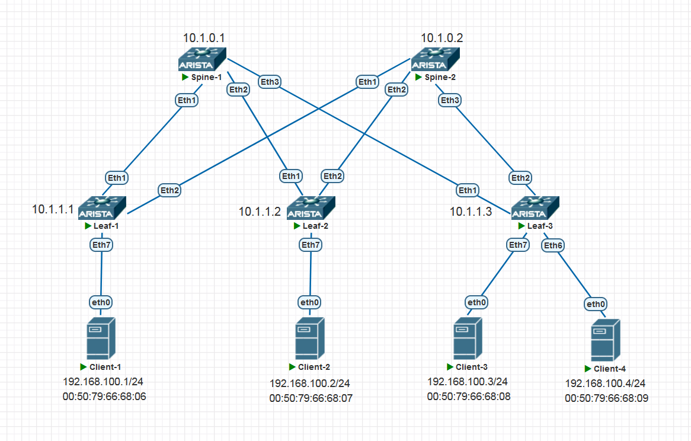
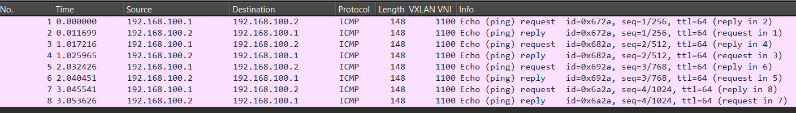

# Домашнее задание 5 (VxLAN. L2 VNI)
<!-- TOC --><a name=""></a>
## Содержание
- Домашнее задание 5 (VxLAN. L2 VNI)
   * [Содержание](#)
   * [Цель домашней работы](#-)
   * [Задача](#-1)
   * [Топология](#-2)
   * [Введение](#-3)
   * [IP-план](#ip-)
      + [Loopbacks и ASN на коммутаторах](#loopbacks-asn-)
      + [Клиенты](#-4)
      + [VXLAN-ассоциации](#vxlan-)
   * [План работы](#--1)
      + [Шаги для выполнения работы](#--2)
   * [Выполнение работы](#--3)
      + [Проверка Underlay](#-underlay)
         - [Leaf-1](#leaf-1)
         - [Leaf-2](#leaf-2)
         - [Leaf-3](#leaf-3)
      + [Настройка Spine-1](#-spine-1)
         - [Начальная конфигурация](#--4)
         - [Настройка address-family EVPN](#-address-family-evpn)
      + [Настройка Spine-2](#-spine-2)
      + [Настройка Leaf-1](#-leaf-1)
      + [Настройка Leaf-2](#-leaf-2)
      + [Настройка Leaf-3](#-leaf-3)
   * [Верификация](#-5)
      + [Верификация Spine-1](#-spine-1-1)
         - [BGP summary](#bgp-summary)
         - [BGP evpn routes](#bgp-evpn-routes)
      + [Верификация Spine-2](#-spine-2-1)
         - [BGP summary](#bgp-summary-1)
         - [BGP EVPN Routes](#bgp-evpn-routes-1)
      + [Верификация Leaf-1](#-leaf-1-1)
         - [BGP Summary](#bgp-summary-2)
         - [BGP EVPN Routes](#bgp-evpn-routes-2)
         - [VXLAN](#vxlan)
      + [Верификация Leaf-2](#-leaf-2-1)
         - [BGP Summary](#bgp-summary-3)
         - [BGP EVPN Routes](#bgp-evpn-routes-3)
         - [VXLAN](#vxlan-1)
      + [Верификация Leaf-3](#-leaf-3-1)
         - [BGP Summary](#bgp-summary-4)
         - [BGP EVPN Routes](#bgp-evpn-routes-4)
         - [VXLAN](#vxlan-2)
      + [Верификация связности между клиентами](#--5)
         - [Client-1](#client-1)
         - [Client-2](#client-2)
         - [Client-3](#client-3)
         - [Client-4](#client-4)
      + [RT-2 маршруты на коммутаторах](#rt-2-)
         - [Spine-1](#spine-1)
         - [Spine-2](#spine-2)
         - [Leaf-1](#leaf-1-1)
         - [Leaf-2](#leaf-2-1)
         - [Leaf-3](#leaf-3-1)
   * [Итого](#-6)

<!-- TOC end -->


<!-- TOC --><a name="-"></a>
## Цель домашней работы
Закрепление пройденного материала по теме VxLAN. L2 VNI.

<!-- TOC --><a name="-1"></a>
## Задача
Настроить Overlay на основе VxLAN EVPN для L2 связанности между клиентами.

<!-- TOC --><a name="-2"></a>
## Топология



<!-- TOC --><a name="-3"></a>
## Введение
В этой домашней работе нам предстоит настроить Overlay-сеть на базе технологии EVPN/VXLAN и обеспечить связность на уровне 2 между четырьмя клиентами, логически находящимися в одном широковещательном домене, но физически подключенным к разным Leaf-коммутаторам.

Настраивать будем на Arista vEOS 4.29.2F

Чтобы обеспечить связность между Leaf, нам необходимо будет использовать протокол BGP, AFI 25, SAFI 70.

Underlay-сеть мы возьмем из прошлой [домашней работы](https://github.com/v435/OTUS_Data-center-network-design/blob/main/Homework/Homework-4/README.md). То есть будет использоваться схема eBGP Unnumbered (RFC 5549). Она подразумевает, что наши коммутаторы устанавливают друг с другом BGP-соседства без использования статически заданной стыковочной IP-адресации. Соседи находят друг друга по IPv6 Link-local адресам. В конфигурации BGP мы указываем лишь интерфейсы, на которых хотим пириться с соседями.

Описывать подробно детали настройки Underlay-сети здесь не будем, она абсолютно идентична результату выполнения предыдущего задания ДЗ-4  :).

Единственное отличие underlay-конфигурации в данном ДЗ от прошлого в том, что BGP-peer группа у нас будет переименована из UNDERLAY в CLOS.

Для настройки Overlay-сети я опять же, по аналогии с предыдущим ДЗ, решил идти по пути наименьшей настройки, или по пути простейшей настройки. То есть чем меньше мы вносим изменений в дефолтную конфигурацию наших устройств, тем лучше (проще понять, проще администрировать, и так далее).

Поэтому я решил сессии EVPN установить с использованием все тех же underlay-сессий, но не в AF IPv4 Unicast, а в address-family EVPN (AFI 25, SAFI 70). То есть отдельно соседей для EVPN мы конфигурировать не будем, а просто активируем на наших underlay-ipv4 сессиях адресную семью EVPN :). Таким образом и Underlay и EVPN будут работать в рамках одной и той же сессии и с одними и теми же соседями.

Когда я пишу эти строки, я не знаю, заработает ли эта схема, поймет ли Ариста, что поле next-hop в BGP MP_REACH_NLRI нужно ставить в значение VTEP IP-адреса, а не в значение IPv6 Link-Local адреса интерфейса. Попробуем! Если не получится - сделаем EVPN-сессии отдельными нейборами на лупбэках.

Касательно модели сервиса EVPN, которую мы будем использовать. Я немного поразмышлял над этим, пытаясь выбрать из моделей VLAN-Based и VLAN-Aware Bundle. Почему мы можем выбрать то или другое? Давайте попробуем прикинуть.

VLAN-Based:
* за: Простая и наглядная конфигурация, маппинг 1 к 1 всего: VLAN -> VNI -> MAC-VRF -> RD/RT. Очень наглядно, очень удобно.
* против: На каждый VLAN создается собственный MAC-VRF. Конфигурация уникальных RD/RT на каждый L2-домен (ну RD ладно, он и автоматически неплохо прописывается). RT же лучше задавать вручную - во-первых, нам важно какое-то осмысленное значение, во-вторых в eBGP могут быть сюрпризы с автоназначением RT, если железка будет их генерировать в формате AS:NN, а ASN'ки-то у нас разные. Меньше всего хочется траблшутить проблемы, вызванные какими-то несовпадениями RT на разных устройствах. В-общем, RT лучше писать вручную, от греха подальше.
* против: Из первого пункта вытекает (потенциально) бОльшая загруженность плоскости управления из-за необходимости обработки целой кучи отдельных EVI (MAC-VRF). Например, тысяча VLAN'ов будет равняться тысяче MAC-VRF.
* за: С другой стороны, на современном железе это вряд ли актуально, и тут скорее вопрос фен-шуя.

VLAN-Aware:
* за: На все VLAN'ы тенанта мы создаем один MAC-VRF, один RD и один RT. VLAN'ы отделяются друг от друга внутри MAC-VRF с помощью под-таблиц. Плоскость управления обрабатывается проще (в теории). Плоскость управления понимает, какой подтаблице принадлежит маршрут (MAC) с помощью поля Ethernet Tag ID в маршруте. На плоскости данных принадлежность определяется тегом 802.1q (насчет этого не уверен, ни разу не настраивал VLAN-Aware, но ведь как иначе как мы определим, в какой VLAN посылать пришедший кадр, если у нас кадр нетегированный?).
* против: VTEP'ы будут принимать маршруты даже для тех VLAN'ов тенанта, которые на них не настроены (RT-то один!). Но большой ли это минус? К сожалению, не готов ответить. Будем считать, что он просто есть, а его значительность определит каждый для себя в своей конкретной ситуации.

Учитывая, что в данном ДЗ у нас всего один VLAN, то и давайте настроим как VLAN-Based. Так, мне кажется, более логично в нашей ситуации. Ну а иначе какой смысл создавать vlan-aware bundle, состоящий из одного VLAN? Это уж точно не прибавит красоты и стройности нашей конфигурации.

Итого, решено, будем настраивать VLAN-Based.

BUM-трафик будем рассылать с помощью механизма Ingress Replication (копируем BUM-пакеты и рассылаем их юникастом на нужные удаленные VTEP)

<!-- TOC --><a name="ip-"></a>
## IP-план

<!-- TOC --><a name="loopbacks-asn-"></a>
### Loopbacks и ASN на коммутаторах
Наши Loopback'и и ASN, настроенные на Underlay.

| Устройство | Loopback | ASN   |
| ---------- | -------- | ----- |
| Spine-1    | 10.1.0.1 | 65100 |
| Spine-2    | 10.1.0.2 | 65100 |
| Leaf-1     | 10.1.1.1 | 65101 |
| Leaf-2     | 10.1.1.2 | 65102 |
| Leaf-3     | 10.1.1.3 | 65103 | 

<!-- TOC --><a name="-4"></a>
### Клиенты
MAC и IP-адреса клиентов, подключенных к Leaf-устройствам.
Все клиенты на своих leaf-ах находятся в vlan 100.

| Клиент   | MAC               | IP/Mask          | 
| -------- | ----------------- | ---------------- |
| Client-1 | 00:50:79:66:68:06 | 192.168.100.1/24 |
| Client-2 | 00:50:79:66:68:07 | 192.168.100.2/24 |
| Client-3 | 00:50:79:66:68:08 | 192.168.100.3/24 |
| Client-4 | 00:50:79:66:68:09 | 192.168.100.4/24 |

<!-- TOC --><a name="vxlan-"></a>
### VXLAN-ассоциации

| VLAN | VNI  |
| ---- | ---- |
| 100  | 1100 | 


<!-- TOC --><a name="--1"></a>
## План работы

<!-- TOC --><a name="--2"></a>
### Шаги для выполнения работы
1. Проверить достижимость loopback'ов с каждого Leaf до каждого Spine и других Leaf. Все должно работать с уже настроенным Underlay.
2. На Spine в рамках процесса BGP настроить address-family EVPN.
3. На Leaf настроить клиентские порты (прописать access vlan)
4. На Leaf настроить плоскость данных VXLAN (source IP, маппинг VLAN на VNI)
5. На Leaf настроить MAC-VRF (для нужного VNI прописать RD, RT, включить распространение локально изученных MAC в EVPN).
6. Активировать address-family EVPN в процессе BGP.

<!-- TOC --><a name="--3"></a>
## Выполнение работы
Как уже говорил в введении, я подробно опишу конфигурацию только для Spine-1 и Leaf-1. Все остальные коммутаторы будут настроены максимально похоже и для них будут приведены лишь распечатки нужных команд.

<!-- TOC --><a name="-underlay"></a>
### Проверка Underlay
Давайте кратко проверим пингами работу Underlay. С каждого Leaf выполним пинг каждого Spine и соседних Leaf'ов.
<!-- TOC --><a name="leaf-1"></a>
#### Leaf-1
```
Leaf-1#ping 10.1.0.1 repeat 1
PING 10.1.0.1 (10.1.0.1) 72(100) bytes of data.
80 bytes from 10.1.0.1: icmp_seq=1 ttl=65 time=8.30 ms

Leaf-1#ping 10.1.0.2 repeat 1
PING 10.1.0.2 (10.1.0.2) 72(100) bytes of data.
80 bytes from 10.1.0.2: icmp_seq=1 ttl=65 time=7.90 ms

Leaf-1#ping 10.1.1.2 repeat 1
PING 10.1.1.2 (10.1.1.2) 72(100) bytes of data.
80 bytes from 10.1.1.2: icmp_seq=1 ttl=64 time=12.5 ms

Leaf-1#ping 10.1.1.3 repeat 1
PING 10.1.1.3 (10.1.1.3) 72(100) bytes of data.
80 bytes from 10.1.1.3: icmp_seq=1 ttl=64 time=10.6 ms
```

<!-- TOC --><a name="leaf-2"></a>
#### Leaf-2
```
Leaf-2#ping 10.1.0.1 repeat 1
PING 10.1.0.1 (10.1.0.1) 72(100) bytes of data.
80 bytes from 10.1.0.1: icmp_seq=1 ttl=65 time=5.58 ms

Leaf-2#ping 10.1.0.2 repeat 1
PING 10.1.0.2 (10.1.0.2) 72(100) bytes of data.
80 bytes from 10.1.0.2: icmp_seq=1 ttl=65 time=5.92 ms

Leaf-2#ping 10.1.1.1 repeat 1
PING 10.1.1.1 (10.1.1.1) 72(100) bytes of data.
80 bytes from 10.1.1.1: icmp_seq=1 ttl=64 time=8.98 ms

Leaf-2#ping 10.1.1.3 repeat 1
PING 10.1.1.3 (10.1.1.3) 72(100) bytes of data.
80 bytes from 10.1.1.3: icmp_seq=1 ttl=64 time=12.6 ms
```

<!-- TOC --><a name="leaf-3"></a>
#### Leaf-3
```
Leaf-3#ping 10.1.0.1 repeat 1
PING 10.1.0.1 (10.1.0.1) 72(100) bytes of data.
80 bytes from 10.1.0.1: icmp_seq=1 ttl=65 time=8.54 ms

Leaf-3#ping 10.1.0.2 repeat 1
PING 10.1.0.2 (10.1.0.2) 72(100) bytes of data.
80 bytes from 10.1.0.2: icmp_seq=1 ttl=65 time=6.04 ms

Leaf-3#ping 10.1.1.1 repeat 1
PING 10.1.1.1 (10.1.1.1) 72(100) bytes of data.
80 bytes from 10.1.1.1: icmp_seq=1 ttl=64 time=9.97 ms

Leaf-3#ping 10.1.1.2 repeat 1
PING 10.1.1.2 (10.1.1.2) 72(100) bytes of data.
80 bytes from 10.1.1.2: icmp_seq=1 ttl=64 time=10.8 ms
```

Все выглядит хорошо. Переходим к настройкам EVPN.

<!-- TOC --><a name="-spine-1"></a>
### Настройка Spine-1
<!-- TOC --><a name="--4"></a>
#### Начальная конфигурация
Приведу начальную настройку (с настроенным Underlay). Все остальные настройки будут касаться исключительно целей текущего ДЗ.
```
service routing protocols model multi-agent
!
hostname Spine-1
!
interface Ethernet1
   description Link_to_Leaf-1
   no switchport
   ipv6 enable
!
interface Ethernet2
   description Link_to_Leaf-2
   no switchport
   ipv6 enable
!
interface Ethernet3
   description Link_to_Leaf-3
   no switchport
   ipv6 enable
!
interface Ethernet4
   shutdown
!
interface Ethernet5
   shutdown
!
interface Ethernet6
   shutdown
!
interface Ethernet7
   shutdown
!
interface Loopback0
   ip address 10.1.0.1/32
!
ip routing ipv6 interfaces
!
ipv6 unicast-routing
!
route-map BGP_REDISTRIBUTE_CONNECTED permit 10
   match interface Loopback0
!
peer-filter LEAFS
   10 match as-range 65001-65006 result accept
!
router bgp 65100
   maximum-paths 64
   neighbor CLOS peer group
   neighbor CLOS out-delay 0
   neighbor CLOS bfd
   neighbor CLOS timers 3 9
   neighbor CLOS password OTUS
   redistribute connected route-map BGP_REDISTRIBUTE_CONNECTED
   neighbor interface Et1-6 peer-group CLOS peer-filter LEAFS
   !
   address-family ipv4
      neighbor CLOS activate
      neighbor CLOS next-hop address-family ipv6 originate
!
end
```

<!-- TOC --><a name="-address-family-evpn"></a>
#### Настройка address-family EVPN
В принципе, вся настройка на Spine сведется к активации address-family и включению отсылки расширенных комьюнити, которые нам необходимы для передачи route-target'ов, которые из себя и представляют эти самые extended community. Без RT ни один Leaf не установит информацию из маршрутов в свои MAC-VRF, так как именно по RT определяется, какому MAC-VRF должна принадлежать данная маршрутная информация.

```
Spine-1(config)# router bgp 65100
Spine-1(config-router-bgp)# address-family evpn
Spine-1(config-router-bgp-af)# neighbor CLOS activate
Spine-1(config-router-bgp-af)# neighbor CLOS send-community extended
```

Всё :) Настраиваем Spine-2 по такой же схеме.

<!-- TOC --><a name="-spine-2"></a>
### Настройка Spine-2
Начальная конфигурация из ДЗ-4:
```
service routing protocols model multi-agent
!
hostname Spine-2
!
interface Ethernet1
   description Link_to_Leaf-1
   no switchport
   ipv6 enable
!
interface Ethernet2
   description Link_to_Leaf-2
   no switchport
   ipv6 enable
!
interface Ethernet3
   description Link_to_Leaf-3
   no switchport
   ipv6 enable
!
interface Ethernet4
   shutdown
!
interface Ethernet5
   shutdown
!
interface Ethernet6
   shutdown
!
interface Ethernet7
   shutdown
!
interface Loopback0
   ip address 10.1.0.2/32
!
ip routing ipv6 interfaces
!
ipv6 unicast-routing
!
route-map BGP_REDISTRIBUTE_CONNECTED permit 10
   match interface Loopback0
!
peer-filter LEAFS
   10 match as-range 65001-65006 result accept
!
router bgp 65100
   maximum-paths 64
   neighbor CLOS peer group
   neighbor CLOS out-delay 0
   neighbor CLOS bfd
   neighbor CLOS timers 3 9
   neighbor CLOS password OTUS
   redistribute connected route-map BGP_REDISTRIBUTE_CONNECTED
   neighbor interface Et1-6 peer-group CLOS peer-filter LEAFS
   !
   address-family ipv4
      neighbor CLOS activate
      neighbor CLOS next-hop address-family ipv6 originate
!
end
```

Касательно настроек EVPN, здесь всё так же, как и для Spine-1. 

```
Spine-2(config)# router bgp 65100
Spine-2(config-router-bgp)# address-family evpn
Spine-2(config-router-bgp-af)# neighbor CLOS activate
Spine-2(config-router-bgp-af)# neighbor CLOS send-community extended
```

<!-- TOC --><a name="-leaf-1"></a>
### Настройка Leaf-1
Начальная конфигурация из ДЗ-4:
```
service routing protocols model multi-agent
!
hostname Leaf-1
!
interface Ethernet1
   description Link_to_Spine-1
   no switchport
   ipv6 enable
!
interface Ethernet2
   description Link_to_Spine-2
   no switchport
   ipv6 enable
!
interface Ethernet3
   shutdown
!
interface Ethernet4
   shutdown
!
interface Ethernet5
   shutdown
!
interface Ethernet6
   shutdown
!
interface Ethernet7
   shutdown
!
interface Loopback0
   ip address 10.1.1.1/32
!
ip routing ipv6 interfaces
!
ipv6 unicast-routing
!
route-map BGP_REDISTRIBUTE_CONNECTED permit 10
   match interface Loopback0
!
router bgp 65001
   maximum-paths 64
   neighbor CLOS peer group
   neighbor CLOS out-delay 0
   neighbor CLOS bfd
   neighbor CLOS timers 3 9
   neighbor CLOS password OTUS
   redistribute connected route-map BGP_REDISTRIBUTE_CONNECTED
   neighbor interface Et1-2 peer-group CLOS remote-as 65100
   !
   address-family ipv4
      neighbor CLOS activate
      neighbor CLOS next-hop address-family ipv6 originate
!
end
```

А вот с EVPN тут уже всё сложнее. Давайте пойдем по шагам, чтобы ничего не упустить.

Во-первых создадим VLAN 100, в котором будут наши клиенты:
```
Leaf-1(config)#vlan 100
Leaf-1(config-vlan-100)# name Clients
```

Теперь настроим физический порт, в который подключен наш клиент Client-1:
```
Leaf-1(config-vlan-100)# interface Ethernet7
Leaf-1(config-if-Et7)# description Link_to_Client-1
Leaf-1(config-if-Et7)# switchport access vlan 100
Leaf-1(config-if-Et7)# no shutdown
```
Здесь мы задаем описание порта и указываем, что порт принадлежит VLAN'у 100 и трафик должен отправляться и приниматься нетегированным. Также мы включаем интерфейс (до этого он был административно отключен).

Теперь настроим интерфейс VXLAN:
```
Leaf-1(config-if-Et7)# interface Vxlan1
Leaf-1(config-if-Vx1)# vxlan source-interface Loopback0
Leaf-1(config-if-Vx1)# vxlan vlan 100 vni 1100
```
Здесь мы указываем, что VTEP IP-адрес нужно брать с интерфейса Loopback0 (помните, тот самый 10.1.1.1, который мы анонсируем в underlay). Этот IP-адрес будет использоваться как внешний Source IP в VXLAN-пакетах.
Далее мы задаем соответствие VLAN 100 к VNI 1100, как бы соединяя их. Трафик из VLAN 100 при выходе из VXLAN-интерфейса должен инкапсулироваться в VNI 1100.

Теперь настроим MAC-VRF:
```
Leaf-1(config-if-Vx1)#router bgp 65001
Leaf-1(config-router-bgp)# vlan 100
Leaf-1(config-macvrf-100)# rd auto
Leaf-1(config-macvrf-100)# route-target both 100:100
Leaf-1(config-macvrf-100)# redistribute learned
```
Здесь мы настраиваем MAC-VRF для VLAN 100. Route Distinguisher зададим как auto, потому что механизм генерации RD у аристы по умолчанию нас вполне устраивает (LoopbackIP:VID).
Далее мы задаем route-target как 100:100 (как на импорт, так и на экспорт), таким образов уникально обозначив конкретный MAC-VRF в пределах нашей фабрики.
Ну и напоследок даем указание распространять в EVPN информацию о всех изученных локально клиентах в данном VLAN.

Теперь включим AF EVPN в настройках процесса BGP:
```
Leaf-1(config)# router bgp 65100
Leaf-1(config-router-bgp)# address-family evpn
Leaf-1(config-router-bgp-af)# neighbor CLOS activate
Leaf-1(config-router-bgp-af)# neighbor CLOS send-community extended
```
Как и везде, активируем AF EVPN для наших соседей и включаем отсылку расширенных комьюнити.

Общий вид настройки EVPN:
```
vlan 100
   name Clients
!
interface Ethernet7
   description Link_to_Client-1
   switchport access vlan 100
   no shutdown
!
interface Vxlan1
   vxlan source-interface Loopback0
   vxlan vlan 100 vni 1100
!
router bgp 65001
   vlan 100
      rd auto
      route-target both 100:100
      redistribute learned
   !
   address-family evpn
      neighbor CLOS activate
      neighbor CLOS send-community extended
end
```

Всё. Остальные коммутаторы Leaf настраиваем по той же схеме. Буду приводить только финальные настройки EVPN, чтобы не дублировать информацию.

<!-- TOC --><a name="-leaf-2"></a>
### Настройка Leaf-2
Начальная конфигурация:
```
service routing protocols model multi-agent
!
hostname Leaf-2
!
interface Ethernet1
   description Link_to_Spine-1
   no switchport
   ipv6 enable
!
interface Ethernet2
   description Link_to_Spine-2
   no switchport
   ipv6 enable
!
interface Ethernet3
   shutdown
!
interface Ethernet4
   shutdown
!
interface Ethernet5
   shutdown
!
interface Ethernet6
   shutdown
!
interface Ethernet7
   shutdown
!
interface Loopback0
   ip address 10.1.1.2/32
!
ip routing ipv6 interfaces
!
ipv6 unicast-routing
!
route-map BGP_REDISTRIBUTE_CONNECTED permit 10
   match interface Loopback0
!
router bgp 65002
   maximum-paths 64
   neighbor CLOS peer group
   neighbor CLOS out-delay 0
   neighbor CLOS bfd
   neighbor CLOS timers 3 9
   neighbor CLOS password OTUS
   redistribute connected route-map BGP_REDISTRIBUTE_CONNECTED
   neighbor interface Et1-2 peer-group CLOS remote-as 65100
   !
   address-family ipv4
      neighbor CLOS activate
      neighbor CLOS next-hop address-family ipv6 originate
!
end
```

Конфигурация EVPN:
```
vlan 100
   name Clients
!
interface Ethernet7
   description Link_to_Client-2
   switchport access vlan 100
   no shutdown
!
interface Vxlan1
   vxlan source-interface Loopback0
   vxlan vlan 100 vni 1100
!
router bgp 65002
   vlan 100
      rd auto
      route-target both 100:100
      redistribute learned
   !
   address-family evpn
      neighbor CLOS activate
      neighbor CLOS send-community extended 
end
```

<!-- TOC --><a name="-leaf-3"></a>
### Настройка Leaf-3
Начальная конфигурация:
```
service routing protocols model multi-agent
!
hostname Leaf-3
!
interface Ethernet1
   description Link_to_Spine-1
   no switchport
   ipv6 enable
!
interface Ethernet2
   description Link_to_Spine-2
   no switchport
   ipv6 enable
!
interface Ethernet3
   shutdown
!
interface Ethernet4
   shutdown
!
interface Ethernet5
   shutdown
!
interface Ethernet6
   shutdown
!
interface Ethernet7
   shutdown
!
interface Loopback0
   ip address 10.1.1.3/32
!
ip routing ipv6 interfaces
!
ipv6 unicast-routing
!
route-map BGP_REDISTRIBUTE_CONNECTED permit 10
   match interface Loopback0
!
router bgp 65003
   maximum-paths 64
   neighbor CLOS peer group
   neighbor CLOS out-delay 0
   neighbor CLOS bfd
   neighbor CLOS timers 3 9
   neighbor CLOS password OTUS
   redistribute connected route-map BGP_REDISTRIBUTE_CONNECTED
   neighbor interface Et1-2 peer-group CLOS remote-as 65100
   !
   address-family ipv4
      neighbor CLOS activate
      neighbor CLOS next-hop address-family ipv6 originate
!
end
```

Настройки EVPN:
```
vlan 100
   name Clients
!
interface Ethernet6
   description Link_to_Client-4
   switchport access vlan 100
   no shutdown
!
interface Ethernet7
   description Link_to_Client-3
   switchport access vlan 100
   no shutdown
!
interface Vxlan1
   vxlan source-interface Loopback0
   vxlan vlan 100 vni 1100
!
router bgp 65003
   vlan 100
      rd auto
      route-target both 100:100
      redistribute learned
   !
   address-family evpn
      neighbor CLOS activate
      neighbor CLOS send-community extended 
end
```

<!-- TOC --><a name="-5"></a>
## Верификация
На коммутаторах посмотрим, правильно ли применились наши настройки, все ли маршруты в наличии и так далее.

По условиям задания мы должны убедиться, что все клиенты видят друг друга на 2-ом уровне. Ну, проверим пингами и посмотрим ARP.


<!-- TOC --><a name="-spine-1-1"></a>
### Верификация Spine-1

<!-- TOC --><a name="bgp-summary"></a>
#### BGP summary
```
Spine-1#show bgp sum
BGP summary information for VRF default
Router identifier 10.1.0.1, local AS number 65100
Neighbor                               AS Session State AFI/SAFI                AFI/SAFI State   NLRI Rcd   NLRI Acc
----------------------------- ----------- ------------- ----------------------- -------------- ---------- ----------
fe80::5224:aaff:fee0:9f5d%Et1       65001 Established   IPv4 Unicast            Negotiated              1          1
fe80::5224:aaff:fee0:9f5d%Et1       65001 Established   L2VPN EVPN              Negotiated              1          1
fe80::5266:faff:fec3:3f46%Et3       65003 Established   IPv4 Unicast            Negotiated              1          1
fe80::5266:faff:fec3:3f46%Et3       65003 Established   L2VPN EVPN              Negotiated              1          1
fe80::52a7:bff:fea1:139f%Et2        65002 Established   IPv4 Unicast            Negotiated              1          1
fe80::52a7:bff:fea1:139f%Et2        65002 Established   L2VPN EVPN              Negotiated              1          1
```
Все в порядке. С каждым соседом у нас установлена сессия в L2VPN EVPN. На количество NLRI внимание не обращаем, соседи у нас пока не обменивались трафиком, поэтому единственные маршруты, которые мы получаем, это IMET-маршруты RT-3. Проверим, так ли это:

<!-- TOC --><a name="bgp-evpn-routes"></a>
#### BGP evpn routes
```
Spine-1#show bgp evpn detail 
BGP routing table information for VRF default
Router identifier 10.1.0.1, local AS number 65100

BGP routing table entry for imet 10.1.1.1, Route Distinguisher: 10.1.1.1:100
 Paths: 1 available
  65001
    10.1.1.1 from fe80::5224:aaff:fee0:9f5d%Et1 (10.1.1.1)
      Origin IGP, metric -, localpref 100, weight 0, tag 0, valid, external, best
      Extended Community: Route-Target-AS:100:100 TunnelEncap:tunnelTypeVxlan
      VNI: 1100
      PMSI Tunnel: Ingress Replication, MPLS Label: 1100, Leaf Information Required: false, Tunnel ID: 10.1.1.1

BGP routing table entry for imet 10.1.1.2, Route Distinguisher: 10.1.1.2:100
 Paths: 1 available
  65002
    10.1.1.2 from fe80::52a7:bff:fea1:139f%Et2 (10.1.1.2)
      Origin IGP, metric -, localpref 100, weight 0, tag 0, valid, external, best
      Extended Community: Route-Target-AS:100:100 TunnelEncap:tunnelTypeVxlan
      VNI: 1100
      PMSI Tunnel: Ingress Replication, MPLS Label: 1100, Leaf Information Required: false, Tunnel ID: 10.1.1.2

BGP routing table entry for imet 10.1.1.3, Route Distinguisher: 10.1.1.3:100
 Paths: 1 available
  65003
    10.1.1.3 from fe80::5266:faff:fec3:3f46%Et3 (10.1.1.3)
      Origin IGP, metric -, localpref 100, weight 0, tag 0, valid, external, best
      Extended Community: Route-Target-AS:100:100 TunnelEncap:tunnelTypeVxlan
      VNI: 1100
      PMSI Tunnel: Ingress Replication, MPLS Label: 1100, Leaf Information Required: false, Tunnel ID: 10.1.1.3
```
Все так. Каждый Leaf прислал по одному RT-3 маршруту, соответствующему VNI 1100, route target именно тот, который мы настроили.

BUM-трафик рассылается с помощью Ingress Replication.

Ну, будем считать, что всё работает.

<!-- TOC --><a name="-spine-2-1"></a>
### Верификация Spine-2
<!-- TOC --><a name="bgp-summary-1"></a>
#### BGP summary
```
Spine-2#show bgp summary
BGP summary information for VRF default
Router identifier 10.1.0.2, local AS number 65100
Neighbor                               AS Session State AFI/SAFI                AFI/SAFI State   NLRI Rcd   NLRI Acc
----------------------------- ----------- ------------- ----------------------- -------------- ---------- ----------
fe80::5224:aaff:fee0:9f5d%Et1       65001 Established   IPv4 Unicast            Negotiated              1          1
fe80::5224:aaff:fee0:9f5d%Et1       65001 Established   L2VPN EVPN              Negotiated              1          1
fe80::5266:faff:fec3:3f46%Et3       65003 Established   IPv4 Unicast            Negotiated              1          1
fe80::5266:faff:fec3:3f46%Et3       65003 Established   L2VPN EVPN              Negotiated              1          1
fe80::52a7:bff:fea1:139f%Et2        65002 Established   IPv4 Unicast            Negotiated              1          1
fe80::52a7:bff:fea1:139f%Et2        65002 Established   L2VPN EVPN              Negotiated              1          1
```
Все в порядке. С каждым соседом у нас установлена сессия в L2VPN EVPN. На количество NLRI внимание не обращаем, соседи у нас пока не обменивались трафиком, поэтому единственные маршруты, которые мы получаем, это IMET-маршруты RT-3. Проверим, так ли это:

<!-- TOC --><a name="bgp-evpn-routes-1"></a>
#### BGP EVPN Routes
```
Spine-2#show bgp evpn detail 
BGP routing table information for VRF default
Router identifier 10.1.0.2, local AS number 65100
BGP routing table entry for imet 10.1.1.1, Route Distinguisher: 10.1.1.1:100
 Paths: 1 available
  65001
    10.1.1.1 from fe80::5224:aaff:fee0:9f5d%Et1 (10.1.1.1)
      Origin IGP, metric -, localpref 100, weight 0, tag 0, valid, external, best
      Extended Community: Route-Target-AS:100:100 TunnelEncap:tunnelTypeVxlan
      VNI: 1100
      PMSI Tunnel: Ingress Replication, MPLS Label: 1100, Leaf Information Required: false, Tunnel ID: 10.1.1.1
BGP routing table entry for imet 10.1.1.2, Route Distinguisher: 10.1.1.2:100
 Paths: 1 available
  65002
    10.1.1.2 from fe80::52a7:bff:fea1:139f%Et2 (10.1.1.2)
      Origin IGP, metric -, localpref 100, weight 0, tag 0, valid, external, best
      Extended Community: Route-Target-AS:100:100 TunnelEncap:tunnelTypeVxlan
      VNI: 1100
      PMSI Tunnel: Ingress Replication, MPLS Label: 1100, Leaf Information Required: false, Tunnel ID: 10.1.1.2
BGP routing table entry for imet 10.1.1.3, Route Distinguisher: 10.1.1.3:100
 Paths: 1 available
  65003
    10.1.1.3 from fe80::5266:faff:fec3:3f46%Et3 (10.1.1.3)
      Origin IGP, metric -, localpref 100, weight 0, tag 0, valid, external, best
      Extended Community: Route-Target-AS:100:100 TunnelEncap:tunnelTypeVxlan
      VNI: 1100
      PMSI Tunnel: Ingress Replication, MPLS Label: 1100, Leaf Information Required: false, Tunnel ID: 10.1.1.3
```
Все так. Каждый Leaf прислал по одному RT-3 маршруту, соответствующему VNI 1100, route target именно тот, который мы настроили.

BUM-трафик рассылается с помощью Ingress Replication.

Ну, будем считать, что всё работает.

<!-- TOC --><a name="-leaf-1-1"></a>
### Верификация Leaf-1
<!-- TOC --><a name="bgp-summary-2"></a>
#### BGP Summary
```
Leaf-1#show bgp summary 
BGP summary information for VRF default
Router identifier 10.1.1.1, local AS number 65001
Neighbor                               AS Session State AFI/SAFI                AFI/SAFI State   NLRI Rcd   NLRI Acc
----------------------------- ----------- ------------- ----------------------- -------------- ---------- ----------
fe80::523e:6ff:fee2:69e1%Et1        65100 Established   IPv4 Unicast            Negotiated              3          3
fe80::523e:6ff:fee2:69e1%Et1        65100 Established   L2VPN EVPN              Negotiated              2          2
fe80::52ac:56ff:fed2:e11c%Et2       65100 Established   IPv4 Unicast            Negotiated              3          3
fe80::52ac:56ff:fed2:e11c%Et2       65100 Established   L2VPN EVPN              Negotiated              2          2
```
Сессии у нас установлены только со Spine-ами, в обоих AF - IPv4 Unicast и в L2VPN EVPN.

<!-- TOC --><a name="bgp-evpn-routes-2"></a>
#### BGP EVPN Routes
```
Leaf-1#show bgp evpn detail 
BGP routing table information for VRF default
Router identifier 10.1.1.1, local AS number 65001
BGP routing table entry for imet 10.1.1.1, Route Distinguisher: 10.1.1.1:100
 Paths: 1 available
  Local
    - from - (0.0.0.0)
      Origin IGP, metric -, localpref -, weight 0, tag 0, valid, local, best
      Extended Community: Route-Target-AS:100:100 TunnelEncap:tunnelTypeVxlan
      VNI: 1100
      PMSI Tunnel: Ingress Replication, MPLS Label: 1100, Leaf Information Required: false, Tunnel ID: 10.1.1.1
BGP routing table entry for imet 10.1.1.2, Route Distinguisher: 10.1.1.2:100
 Paths: 2 available
  65100 65002
    10.1.1.2 from fe80::523e:6ff:fee2:69e1%Et1 (10.1.0.1)
      Origin IGP, metric -, localpref 100, weight 0, tag 0, valid, external, ECMP head, ECMP, best, ECMP contributor
      Extended Community: Route-Target-AS:100:100 TunnelEncap:tunnelTypeVxlan
      VNI: 1100
      PMSI Tunnel: Ingress Replication, MPLS Label: 1100, Leaf Information Required: false, Tunnel ID: 10.1.1.2
  65100 65002
    10.1.1.2 from fe80::52ac:56ff:fed2:e11c%Et2 (10.1.0.2)
      Origin IGP, metric -, localpref 100, weight 0, tag 0, valid, external, ECMP, ECMP contributor
      Extended Community: Route-Target-AS:100:100 TunnelEncap:tunnelTypeVxlan
      VNI: 1100
      PMSI Tunnel: Ingress Replication, MPLS Label: 1100, Leaf Information Required: false, Tunnel ID: 10.1.1.2
BGP routing table entry for imet 10.1.1.3, Route Distinguisher: 10.1.1.3:100
 Paths: 2 available
  65100 65003
    10.1.1.3 from fe80::523e:6ff:fee2:69e1%Et1 (10.1.0.1)
      Origin IGP, metric -, localpref 100, weight 0, tag 0, valid, external, ECMP head, ECMP, best, ECMP contributor
      Extended Community: Route-Target-AS:100:100 TunnelEncap:tunnelTypeVxlan
      VNI: 1100
      PMSI Tunnel: Ingress Replication, MPLS Label: 1100, Leaf Information Required: false, Tunnel ID: 10.1.1.3
  65100 65003
    10.1.1.3 from fe80::52ac:56ff:fed2:e11c%Et2 (10.1.0.2)
      Origin IGP, metric -, localpref 100, weight 0, tag 0, valid, external, ECMP, ECMP contributor
      Extended Community: Route-Target-AS:100:100 TunnelEncap:tunnelTypeVxlan
      VNI: 1100
      PMSI Tunnel: Ingress Replication, MPLS Label: 1100, Leaf Information Required: false, Tunnel ID: 10.1.1.3
```
Видим IMET-маршруты, доступные через оба Spine, как и должно быть.

<!-- TOC --><a name="vxlan"></a>
#### VXLAN
Проверка EVI
```
Leaf-1#show bgp evpn instance 
EVPN instance: VLAN 100
  Route distinguisher: 0:0
  Route target import: Route-Target-AS:100:100
  Route target export: Route-Target-AS:100:100
  Service interface: VLAN-based
  Local VXLAN IP address: 10.1.1.1
  VXLAN: enabled
  MPLS: disabled
```
EVI для VLAN 100 создан с корректным RT, остальные настройки выглядят верными. Правда, меня смущает RD: 0:0. Судя по тому, что другие VTEP'ы видят корректный RD, возможно в аристе так показывается, что RD настраивается автоматически...

```
Leaf-1#show vxlan vni
VNI to VLAN Mapping for Vxlan1
VNI        VLAN       Source       Interface       802.1Q Tag
---------- ---------- ------------ --------------- ----------
1100       100        static       Ethernet7       untagged  
                                   Vxlan1          100       
```
Здесь мы видим, что маппинг VLAN на VNI сделан корректно. Клиентский порт указан.

```
Leaf-1#show vxlan control-plane 
   VLAN       Control Plane       Direction    Source       
---------- ------------------- --------------- -------------
   100        EVPN                both         configuration
```
Видим, что для VXLAN 100 настроен EVPN в качестве плоскости управления.

```
Leaf-1#show vxlan vtep
Remote VTEPS for Vxlan1:

VTEP           Tunnel Type(s)
-------------- --------------
10.1.1.2       flood         
10.1.1.3       flood         

Total number of remote VTEPS:  2
```
Построены туннели до двух других Leaf'ов.

<!-- TOC --><a name="-leaf-2-1"></a>
### Верификация Leaf-2
<!-- TOC --><a name="bgp-summary-3"></a>
#### BGP Summary
```
Leaf-2#show bgp summary 
BGP summary information for VRF default
Router identifier 10.1.1.2, local AS number 65002
Neighbor                               AS Session State AFI/SAFI                AFI/SAFI State   NLRI Rcd   NLRI Acc
----------------------------- ----------- ------------- ----------------------- -------------- ---------- ----------
fe80::523e:6ff:fee2:69e1%Et1        65100 Established   IPv4 Unicast            Negotiated              3          3
fe80::523e:6ff:fee2:69e1%Et1        65100 Established   L2VPN EVPN              Negotiated              2          2
fe80::52ac:56ff:fed2:e11c%Et2       65100 Established   IPv4 Unicast            Negotiated              3          3
fe80::52ac:56ff:fed2:e11c%Et2       65100 Established   L2VPN EVPN              Negotiated              2          2
```
Сессии у нас установлены только со Spine-ами, в обоих AF - IPv4 Unicast и в L2VPN EVPN.

<!-- TOC --><a name="bgp-evpn-routes-3"></a>
#### BGP EVPN Routes
```
Leaf-2#show bgp evpn detail 
BGP routing table information for VRF default
Router identifier 10.1.1.2, local AS number 65002
BGP routing table entry for imet 10.1.1.1, Route Distinguisher: 10.1.1.1:100
 Paths: 2 available
  65100 65001
    10.1.1.1 from fe80::523e:6ff:fee2:69e1%Et1 (10.1.0.1)
      Origin IGP, metric -, localpref 100, weight 0, tag 0, valid, external, ECMP head, ECMP, best, ECMP contributor
      Extended Community: Route-Target-AS:100:100 TunnelEncap:tunnelTypeVxlan
      VNI: 1100
      PMSI Tunnel: Ingress Replication, MPLS Label: 1100, Leaf Information Required: false, Tunnel ID: 10.1.1.1
  65100 65001
    10.1.1.1 from fe80::52ac:56ff:fed2:e11c%Et2 (10.1.0.2)
      Origin IGP, metric -, localpref 100, weight 0, tag 0, valid, external, ECMP, ECMP contributor
      Extended Community: Route-Target-AS:100:100 TunnelEncap:tunnelTypeVxlan
      VNI: 1100
      PMSI Tunnel: Ingress Replication, MPLS Label: 1100, Leaf Information Required: false, Tunnel ID: 10.1.1.1
BGP routing table entry for imet 10.1.1.2, Route Distinguisher: 10.1.1.2:100
 Paths: 1 available
  Local
    - from - (0.0.0.0)
      Origin IGP, metric -, localpref -, weight 0, tag 0, valid, local, best
      Extended Community: Route-Target-AS:100:100 TunnelEncap:tunnelTypeVxlan
      VNI: 1100
      PMSI Tunnel: Ingress Replication, MPLS Label: 1100, Leaf Information Required: false, Tunnel ID: 10.1.1.2
BGP routing table entry for imet 10.1.1.3, Route Distinguisher: 10.1.1.3:100
 Paths: 2 available
  65100 65003
    10.1.1.3 from fe80::523e:6ff:fee2:69e1%Et1 (10.1.0.1)
      Origin IGP, metric -, localpref 100, weight 0, tag 0, valid, external, ECMP head, ECMP, best, ECMP contributor
      Extended Community: Route-Target-AS:100:100 TunnelEncap:tunnelTypeVxlan
      VNI: 1100
      PMSI Tunnel: Ingress Replication, MPLS Label: 1100, Leaf Information Required: false, Tunnel ID: 10.1.1.3
  65100 65003
    10.1.1.3 from fe80::52ac:56ff:fed2:e11c%Et2 (10.1.0.2)
      Origin IGP, metric -, localpref 100, weight 0, tag 0, valid, external, ECMP, ECMP contributor
      Extended Community: Route-Target-AS:100:100 TunnelEncap:tunnelTypeVxlan
      VNI: 1100
      PMSI Tunnel: Ingress Replication, MPLS Label: 1100, Leaf Information Required: false, Tunnel ID: 10.1.1.3
```
Видим IMET-маршруты, доступные через оба Spine, как и должно быть.

<!-- TOC --><a name="vxlan-1"></a>
#### VXLAN
Проверка EVI
```
Leaf-2#show bgp evpn instance 
EVPN instance: VLAN 100
  Route distinguisher: 0:0
  Route target import: Route-Target-AS:100:100
  Route target export: Route-Target-AS:100:100
  Service interface: VLAN-based
  Local VXLAN IP address: 10.1.1.2
  VXLAN: enabled
  MPLS: disabled
```
EVI для VLAN 100 создан с корректным RT, остальные настройки выглядят верными. Правда, меня смущает RD: 0:0. Судя по тому, что другие VTEP'ы видят корректный RD, возможно в аристе так показывается, что RD настраивается автоматически...

```
Leaf-2#show vxlan vni
VNI to VLAN Mapping for Vxlan1
VNI        VLAN       Source       Interface       802.1Q Tag
---------- ---------- ------------ --------------- ----------
1100       100        static       Ethernet7       untagged  
                                   Vxlan1          100       
```
Здесь мы видим, что маппинг VLAN на VNI сделан корректно. Клиентский порт указан.

```
Leaf-2#show vxlan control-plane 
   VLAN       Control Plane       Direction    Source       
---------- ------------------- --------------- -------------
   100        EVPN                both         configuration
```
Видим, что для VXLAN 100 настроен EVPN в качестве плоскости управления.

```
Leaf-2#show vxlan vtep
Remote VTEPS for Vxlan1:

VTEP           Tunnel Type(s)
-------------- --------------
10.1.1.1       flood         
10.1.1.3       flood         

Total number of remote VTEPS:  2
```
Построены туннели до двух других Leaf'ов.

<!-- TOC --><a name="-leaf-3-1"></a>
### Верификация Leaf-3
<!-- TOC --><a name="bgp-summary-4"></a>
#### BGP Summary
```
Leaf-3#show bgp summary 
BGP summary information for VRF default
Router identifier 10.1.1.3, local AS number 65003
Neighbor                               AS Session State AFI/SAFI                AFI/SAFI State   NLRI Rcd   NLRI Acc
----------------------------- ----------- ------------- ----------------------- -------------- ---------- ----------
fe80::523e:6ff:fee2:69e1%Et1        65100 Established   IPv4 Unicast            Negotiated              3          3
fe80::523e:6ff:fee2:69e1%Et1        65100 Established   L2VPN EVPN              Negotiated              2          2
fe80::52ac:56ff:fed2:e11c%Et2       65100 Established   IPv4 Unicast            Negotiated              3          3
fe80::52ac:56ff:fed2:e11c%Et2       65100 Established   L2VPN EVPN              Negotiated              2          2
```
Сессии у нас установлены только со Spine-ами, в обоих AF - IPv4 Unicast и в L2VPN EVPN.

<!-- TOC --><a name="bgp-evpn-routes-4"></a>
#### BGP EVPN Routes
```
Leaf-3#show bgp evpn detail 
BGP routing table information for VRF default
Router identifier 10.1.1.3, local AS number 65003
BGP routing table entry for imet 10.1.1.1, Route Distinguisher: 10.1.1.1:100
 Paths: 2 available
  65100 65001
    10.1.1.1 from fe80::523e:6ff:fee2:69e1%Et1 (10.1.0.1)
      Origin IGP, metric -, localpref 100, weight 0, tag 0, valid, external, ECMP head, ECMP, best, ECMP contributor
      Extended Community: Route-Target-AS:100:100 TunnelEncap:tunnelTypeVxlan
      VNI: 1100
      PMSI Tunnel: Ingress Replication, MPLS Label: 1100, Leaf Information Required: false, Tunnel ID: 10.1.1.1
  65100 65001
    10.1.1.1 from fe80::52ac:56ff:fed2:e11c%Et2 (10.1.0.2)
      Origin IGP, metric -, localpref 100, weight 0, tag 0, valid, external, ECMP, ECMP contributor
      Extended Community: Route-Target-AS:100:100 TunnelEncap:tunnelTypeVxlan
      VNI: 1100
      PMSI Tunnel: Ingress Replication, MPLS Label: 1100, Leaf Information Required: false, Tunnel ID: 10.1.1.1
BGP routing table entry for imet 10.1.1.2, Route Distinguisher: 10.1.1.2:100
 Paths: 2 available
  65100 65002
    10.1.1.2 from fe80::523e:6ff:fee2:69e1%Et1 (10.1.0.1)
      Origin IGP, metric -, localpref 100, weight 0, tag 0, valid, external, ECMP head, ECMP, best, ECMP contributor
      Extended Community: Route-Target-AS:100:100 TunnelEncap:tunnelTypeVxlan
      VNI: 1100
      PMSI Tunnel: Ingress Replication, MPLS Label: 1100, Leaf Information Required: false, Tunnel ID: 10.1.1.2
  65100 65002
    10.1.1.2 from fe80::52ac:56ff:fed2:e11c%Et2 (10.1.0.2)
      Origin IGP, metric -, localpref 100, weight 0, tag 0, valid, external, ECMP, ECMP contributor
      Extended Community: Route-Target-AS:100:100 TunnelEncap:tunnelTypeVxlan
      VNI: 1100
      PMSI Tunnel: Ingress Replication, MPLS Label: 1100, Leaf Information Required: false, Tunnel ID: 10.1.1.2
BGP routing table entry for imet 10.1.1.3, Route Distinguisher: 10.1.1.3:100
 Paths: 1 available
  Local
    - from - (0.0.0.0)
      Origin IGP, metric -, localpref -, weight 0, tag 0, valid, local, best
      Extended Community: Route-Target-AS:100:100 TunnelEncap:tunnelTypeVxlan
      VNI: 1100
      PMSI Tunnel: Ingress Replication, MPLS Label: 1100, Leaf Information Required: false, Tunnel ID: 10.1.1.3
```
Видим IMET-маршруты, доступные через оба Spine, как и должно быть.

<!-- TOC --><a name="vxlan-2"></a>
#### VXLAN
Проверка EVI
```
Leaf-3#show bgp evpn instance 
EVPN instance: VLAN 100
  Route distinguisher: 0:0
  Route target import: Route-Target-AS:100:100
  Route target export: Route-Target-AS:100:100
  Service interface: VLAN-based
  Local VXLAN IP address: 10.1.1.3
  VXLAN: enabled
  MPLS: disabled
```
EVI для VLAN 100 создан с корректным RT, остальные настройки выглядят верными. Правда, меня смущает RD: 0:0. Судя по тому, что другие VTEP'ы видят корректный RD, возможно в аристе так показывается, что RD настраивается автоматически...

```
Leaf-3#show vxlan vni
VNI to VLAN Mapping for Vxlan1
VNI        VLAN       Source       Interface       802.1Q Tag
---------- ---------- ------------ --------------- ----------
1100       100        static       Ethernet6       untagged  
                                   Ethernet7       untagged  
                                   Vxlan1          100          
```
Здесь мы видим, что маппинг VLAN на VNI сделан корректно. Клиентские порты указан.

```
Leaf-3#show vxlan control-plane 
   VLAN       Control Plane       Direction    Source       
---------- ------------------- --------------- -------------
   100        EVPN                both         configuration
```
Видим, что для VXLAN 100 настроен EVPN в качестве плоскости управления.

```
Leaf-3#show vxlan vtep
Remote VTEPS for Vxlan1:

VTEP           Tunnel Type(s)
-------------- --------------
10.1.1.1       flood         
10.1.1.2       flood         

Total number of remote VTEPS:  2
```
Построены туннели до двух других Leaf'ов.

<!-- TOC --><a name="--5"></a>
### Верификация связности между клиентами
Проверять будем таким образом. Сначала мы на клиенте делаем пинг другого клиента (физически находящегося за другим Leaf'ом). Затем смотрим в tcpdump и проверяем, что трафик действительно уходит и приходит инкапсулированным в VNI 1100.

Далее пингуем всех остальных клиентов.
Так повторяем со всеми клиентами.

После этого еще проверим, что в BGP RIB появились маршруты RT-2 для всех четырех клиентов.

На всякий случай приведем настройки каждого клиента:

```
Cl-1> show ip

NAME        : Cl-1[1]
IP/MASK     : 192.168.100.1/24
GATEWAY     : 0.0.0.0
DNS         : 
MAC         : 00:50:79:66:68:06
LPORT       : 20000
RHOST:PORT  : 127.0.0.1:30000
MTU         : 1500
```
```
Cl-2> show ip

NAME        : Cl-2[1]
IP/MASK     : 192.168.100.2/24
GATEWAY     : 0.0.0.0
DNS         : 
MAC         : 00:50:79:66:68:07
LPORT       : 20000
RHOST:PORT  : 127.0.0.1:30000
MTU         : 1500

```
```
Cl-3> show ip

NAME        : Cl-3[1]
IP/MASK     : 192.168.100.3/24
GATEWAY     : 0.0.0.0
DNS         : 
MAC         : 00:50:79:66:68:08
LPORT       : 20000
RHOST:PORT  : 127.0.0.1:30000
MTU         : 1500
```
```
Cl-4> show ip

NAME        : Cl-4[1]
IP/MASK     : 192.168.100.4/24
GATEWAY     : 0.0.0.0
DNS         : 
MAC         : 00:50:79:66:68:09
LPORT       : 20000
RHOST:PORT  : 127.0.0.1:30000
MTU         : 1500
```
<!-- TOC --><a name="client-1"></a>
#### Client-1
ping Client-2
```
Cl-1> ping 192.168.100.2

84 bytes from 192.168.100.2 icmp_seq=1 ttl=64 time=16.288 ms
84 bytes from 192.168.100.2 icmp_seq=2 ttl=64 time=13.512 ms
84 bytes from 192.168.100.2 icmp_seq=3 ttl=64 time=12.719 ms
84 bytes from 192.168.100.2 icmp_seq=4 ttl=64 time=12.513 ms
84 bytes from 192.168.100.2 icmp_seq=5 ttl=64 time=14.400 ms
```
ping Client-3
```
Cl-1> ping 192.168.100.3

84 bytes from 192.168.100.3 icmp_seq=1 ttl=64 time=19.325 ms
84 bytes from 192.168.100.3 icmp_seq=2 ttl=64 time=13.071 ms
84 bytes from 192.168.100.3 icmp_seq=3 ttl=64 time=14.839 ms
84 bytes from 192.168.100.3 icmp_seq=4 ttl=64 time=13.510 ms
84 bytes from 192.168.100.3 icmp_seq=5 ttl=64 time=18.422 ms
```
ping Client-4
```
Cl-1> ping 192.168.100.4

84 bytes from 192.168.100.4 icmp_seq=1 ttl=64 time=18.650 ms
84 bytes from 192.168.100.4 icmp_seq=2 ttl=64 time=12.691 ms
84 bytes from 192.168.100.4 icmp_seq=3 ttl=64 time=13.917 ms
84 bytes from 192.168.100.4 icmp_seq=4 ttl=64 time=14.827 ms
84 bytes from 192.168.100.4 icmp_seq=5 ttl=64 time=13.413 ms
```

ARP-таблица Client-1
```
Cl-1> arp

00:50:79:66:68:07  192.168.100.2 expires in 115 seconds 
00:50:79:66:68:08  192.168.100.3 expires in 33 seconds 
00:50:79:66:68:09  192.168.100.4 expires in 62 seconds 
```
Видим, что другие клиенты находятся в одном широковещательном домене с данным клиентом.

tcpdump:
Посмотрим в дамп трафика одного из пингов. Остальные скринить не будем, там, очевидно, будет то же самое :)


<!-- TOC --><a name="client-2"></a>
#### Client-2
ping Client-1
```
Cl-2> ping 192.168.100.1

84 bytes from 192.168.100.1 icmp_seq=1 ttl=64 time=17.841 ms
84 bytes from 192.168.100.1 icmp_seq=2 ttl=64 time=15.430 ms
84 bytes from 192.168.100.1 icmp_seq=3 ttl=64 time=13.132 ms
84 bytes from 192.168.100.1 icmp_seq=4 ttl=64 time=14.193 ms
84 bytes from 192.168.100.1 icmp_seq=5 ttl=64 time=15.324 ms
```
ping Client-3
```
Cl-2> ping 192.168.100.3

84 bytes from 192.168.100.3 icmp_seq=1 ttl=64 time=13.891 ms
84 bytes from 192.168.100.3 icmp_seq=2 ttl=64 time=14.063 ms
84 bytes from 192.168.100.3 icmp_seq=3 ttl=64 time=14.673 ms
84 bytes from 192.168.100.3 icmp_seq=4 ttl=64 time=14.180 ms
84 bytes from 192.168.100.3 icmp_seq=5 ttl=64 time=12.421 ms
```
ping Client-4
```
Cl-2> ping 192.168.100.4

84 bytes from 192.168.100.4 icmp_seq=1 ttl=64 time=13.232 ms
84 bytes from 192.168.100.4 icmp_seq=2 ttl=64 time=13.880 ms
84 bytes from 192.168.100.4 icmp_seq=3 ttl=64 time=13.678 ms
84 bytes from 192.168.100.4 icmp_seq=4 ttl=64 time=12.679 ms
84 bytes from 192.168.100.4 icmp_seq=5 ttl=64 time=12.880 ms
```

ARP-таблица Client-1
```
Cl-2> arp 

00:50:79:66:68:06  192.168.100.1 expires in 114 seconds 
00:50:79:66:68:08  192.168.100.3 expires in 65 seconds 
00:50:79:66:68:09  192.168.100.4 expires in 71 seconds 
```
Видим, что другие клиенты находятся в одном широковещательном домене с данным клиентом.

<!-- TOC --><a name="client-3"></a>
#### Client-3
ping Client-1
```
Cl-3> ping 192.168.100.1

84 bytes from 192.168.100.1 icmp_seq=1 ttl=64 time=13.411 ms
84 bytes from 192.168.100.1 icmp_seq=2 ttl=64 time=12.561 ms
84 bytes from 192.168.100.1 icmp_seq=3 ttl=64 time=13.682 ms
84 bytes from 192.168.100.1 icmp_seq=4 ttl=64 time=13.037 ms
84 bytes from 192.168.100.1 icmp_seq=5 ttl=64 time=13.248 ms
```
ping Client-2
```
Cl-3> ping 192.168.100.2

84 bytes from 192.168.100.2 icmp_seq=1 ttl=64 time=14.777 ms
84 bytes from 192.168.100.2 icmp_seq=2 ttl=64 time=12.712 ms
84 bytes from 192.168.100.2 icmp_seq=3 ttl=64 time=13.662 ms
84 bytes from 192.168.100.2 icmp_seq=4 ttl=64 time=14.451 ms
84 bytes from 192.168.100.2 icmp_seq=5 ttl=64 time=14.238 ms
```
ping Client-4
```
Cl-3> ping 192.168.100.4

84 bytes from 192.168.100.4 icmp_seq=1 ttl=64 time=4.658 ms
84 bytes from 192.168.100.4 icmp_seq=2 ttl=64 time=3.262 ms
84 bytes from 192.168.100.4 icmp_seq=3 ttl=64 time=2.901 ms
84 bytes from 192.168.100.4 icmp_seq=4 ttl=64 time=3.810 ms
84 bytes from 192.168.100.4 icmp_seq=5 ttl=64 time=3.294 ms
```

ARP-таблица Client-3
```
Cl-3> arp

00:50:79:66:68:06  192.168.100.1 expires in 63 seconds 
00:50:79:66:68:07  192.168.100.2 expires in 117 seconds 
00:50:79:66:68:09  192.168.100.4 expires in 97 seconds 
```
Видим, что другие клиенты находятся в одном широковещательном домене с данным клиентом.

<!-- TOC --><a name="client-4"></a>
#### Client-4
ping Client-1
```
Cl-4> ping 192.168.100.1

84 bytes from 192.168.100.1 icmp_seq=1 ttl=64 time=12.854 ms
84 bytes from 192.168.100.1 icmp_seq=2 ttl=64 time=14.034 ms
84 bytes from 192.168.100.1 icmp_seq=3 ttl=64 time=14.689 ms
84 bytes from 192.168.100.1 icmp_seq=4 ttl=64 time=14.354 ms
84 bytes from 192.168.100.1 icmp_seq=5 ttl=64 time=13.885 ms
```
ping Client-2
```
Cl-4> ping 192.168.100.2

84 bytes from 192.168.100.2 icmp_seq=1 ttl=64 time=13.671 ms
84 bytes from 192.168.100.2 icmp_seq=2 ttl=64 time=13.830 ms
84 bytes from 192.168.100.2 icmp_seq=3 ttl=64 time=13.950 ms
84 bytes from 192.168.100.2 icmp_seq=4 ttl=64 time=13.172 ms
84 bytes from 192.168.100.2 icmp_seq=5 ttl=64 time=18.818 ms
```
ping Client-3
```
Cl-4> ping 192.168.100.3

84 bytes from 192.168.100.3 icmp_seq=1 ttl=64 time=3.809 ms
84 bytes from 192.168.100.3 icmp_seq=2 ttl=64 time=3.884 ms
84 bytes from 192.168.100.3 icmp_seq=3 ttl=64 time=3.399 ms
84 bytes from 192.168.100.3 icmp_seq=4 ttl=64 time=3.415 ms
84 bytes from 192.168.100.3 icmp_seq=5 ttl=64 time=4.910 ms
```

ARP-таблица Client-4
```
Cl-4> arp

00:50:79:66:68:06  192.168.100.1 expires in 80 seconds 
00:50:79:66:68:08  192.168.100.3 expires in 18 seconds 
00:50:79:66:68:07  192.168.100.2 expires in 92 seconds 
```
Видим, что другие клиенты находятся в одном широковещательном домене с данным клиентом.

<!-- TOC --><a name="rt-2-"></a>
### RT-2 маршруты на коммутаторах
Ну и проверим, увидим ли мы RT-2 маршруты на наших коммутаторах, учитывая тот факт, что клиенты появились в сети и начали обмениваться трафиком.

<!-- TOC --><a name="spine-1"></a>
#### Spine-1
```
Spine-1#show bgp evpn route-type mac-ip 
BGP routing table information for VRF default
Router identifier 10.1.0.1, local AS number 65100
Route status codes: * - valid, > - active, S - Stale, E - ECMP head, e - ECMP
                    c - Contributing to ECMP, % - Pending BGP convergence
Origin codes: i - IGP, e - EGP, ? - incomplete
AS Path Attributes: Or-ID - Originator ID, C-LST - Cluster List, LL Nexthop - Link Local Nexthop

          Network                Next Hop              Metric  LocPref Weight  Path
 * >      RD: 10.1.1.1:100 mac-ip 0050.7966.6806
                                 10.1.1.1              -       100     0       65001 i
 * >      RD: 10.1.1.2:100 mac-ip 0050.7966.6807
                                 10.1.1.2              -       100     0       65002 i
 * >      RD: 10.1.1.3:100 mac-ip 0050.7966.6808
                                 10.1.1.3              -       100     0       65003 i
 * >      RD: 10.1.1.3:100 mac-ip 0050.7966.6809
                                 10.1.1.3              -       100     0       65003 i
```
Все RT-2 маршруты, соответствующие нашим четырем клиентам, присутствуют.

<!-- TOC --><a name="spine-2"></a>
#### Spine-2
```
Spine-2#show bgp evpn route-type mac-ip
BGP routing table information for VRF default
Router identifier 10.1.0.2, local AS number 65100
Route status codes: * - valid, > - active, S - Stale, E - ECMP head, e - ECMP
                    c - Contributing to ECMP, % - Pending BGP convergence
Origin codes: i - IGP, e - EGP, ? - incomplete
AS Path Attributes: Or-ID - Originator ID, C-LST - Cluster List, LL Nexthop - Link Local Nexthop

          Network                Next Hop              Metric  LocPref Weight  Path
 * >      RD: 10.1.1.1:100 mac-ip 0050.7966.6806
                                 10.1.1.1              -       100     0       65001 i
 * >      RD: 10.1.1.2:100 mac-ip 0050.7966.6807
                                 10.1.1.2              -       100     0       65002 i
 * >      RD: 10.1.1.3:100 mac-ip 0050.7966.6808
                                 10.1.1.3              -       100     0       65003 i
 * >      RD: 10.1.1.3:100 mac-ip 0050.7966.6809
                                 10.1.1.3              -       100     0       65003 i
```
Все RT-2 маршруты, соответствующие нашим четырем клиентам, присутствуют.

<!-- TOC --><a name="leaf-1-1"></a>
#### Leaf-1
```
Leaf-1#show bgp evpn route-type mac-ip
BGP routing table information for VRF default
Router identifier 10.1.1.1, local AS number 65001
Route status codes: * - valid, > - active, S - Stale, E - ECMP head, e - ECMP
                    c - Contributing to ECMP, % - Pending BGP convergence
Origin codes: i - IGP, e - EGP, ? - incomplete
AS Path Attributes: Or-ID - Originator ID, C-LST - Cluster List, LL Nexthop - Link Local Nexthop

          Network                Next Hop              Metric  LocPref Weight  Path
 * >      RD: 10.1.1.1:100 mac-ip 0050.7966.6806
                                 -                     -       -       0       i
 * >Ec    RD: 10.1.1.2:100 mac-ip 0050.7966.6807
                                 10.1.1.2              -       100     0       65100 65002 i
 *  ec    RD: 10.1.1.2:100 mac-ip 0050.7966.6807
                                 10.1.1.2              -       100     0       65100 65002 i
 * >Ec    RD: 10.1.1.3:100 mac-ip 0050.7966.6808
                                 10.1.1.3              -       100     0       65100 65003 i
 *  ec    RD: 10.1.1.3:100 mac-ip 0050.7966.6808
                                 10.1.1.3              -       100     0       65100 65003 i
 * >Ec    RD: 10.1.1.3:100 mac-ip 0050.7966.6809
                                 10.1.1.3              -       100     0       65100 65003 i
 *  ec    RD: 10.1.1.3:100 mac-ip 0050.7966.6809
                                 10.1.1.3              -       100     0       65100 65003 i
```
Все RT-2 маршруты, соответствующие нашим четырем клиентам, присутствуют. Также видим работу ECMP - есть два пути, по которым мы можем достучаться до клиентов (через оба Spine).

FDB-таблица VXLAN:
```
Leaf-1#show vxlan address-table 
          Vxlan Mac Address Table
----------------------------------------------------------------------

VLAN  Mac Address     Type      Prt  VTEP             Moves   Last Move
----  -----------     ----      ---  ----             -----   ---------
 100  0050.7966.6807  EVPN      Vx1  10.1.1.2         1       0:16:14 ago
 100  0050.7966.6808  EVPN      Vx1  10.1.1.3         1       0:17:37 ago
 100  0050.7966.6809  EVPN      Vx1  10.1.1.3         1       0:04:05 ago
Total Remote Mac Addresses for this criterion: 3
```
Все клиенты присутствуют в нужном VLAN.

<!-- TOC --><a name="leaf-2-1"></a>
#### Leaf-2
```
Leaf-2#show bgp evpn route-type mac-ip
BGP routing table information for VRF default
Router identifier 10.1.1.2, local AS number 65002
Route status codes: * - valid, > - active, S - Stale, E - ECMP head, e - ECMP
                    c - Contributing to ECMP, % - Pending BGP convergence
Origin codes: i - IGP, e - EGP, ? - incomplete
AS Path Attributes: Or-ID - Originator ID, C-LST - Cluster List, LL Nexthop - Link Local Nexthop

          Network                Next Hop              Metric  LocPref Weight  Path
 * >Ec    RD: 10.1.1.1:100 mac-ip 0050.7966.6806
                                 10.1.1.1              -       100     0       65100 65001 i
 *  ec    RD: 10.1.1.1:100 mac-ip 0050.7966.6806
                                 10.1.1.1              -       100     0       65100 65001 i
 * >      RD: 10.1.1.2:100 mac-ip 0050.7966.6807
                                 -                     -       -       0       i
 * >Ec    RD: 10.1.1.3:100 mac-ip 0050.7966.6808
                                 10.1.1.3              -       100     0       65100 65003 i
 *  ec    RD: 10.1.1.3:100 mac-ip 0050.7966.6808
                                 10.1.1.3              -       100     0       65100 65003 i
 * >Ec    RD: 10.1.1.3:100 mac-ip 0050.7966.6809
                                 10.1.1.3              -       100     0       65100 65003 i
 *  ec    RD: 10.1.1.3:100 mac-ip 0050.7966.6809
                                 10.1.1.3              -       100     0       65100 65003 i
```
Все RT-2 маршруты, соответствующие нашим четырем клиентам, присутствуют. Также видим работу ECMP - есть два пути, по которым мы можем достучаться до клиентов (через оба Spine).

FDB-таблица VXLAN:
```
Leaf-2#show vxlan address-table
          Vxlan Mac Address Table
----------------------------------------------------------------------

VLAN  Mac Address     Type      Prt  VTEP             Moves   Last Move
----  -----------     ----      ---  ----             -----   ---------
 100  0050.7966.6806  EVPN      Vx1  10.1.1.1         1       0:18:24 ago
 100  0050.7966.6808  EVPN      Vx1  10.1.1.3         1       0:18:24 ago
 100  0050.7966.6809  EVPN      Vx1  10.1.1.3         1       0:04:53 ago
Total Remote Mac Addresses for this criterion: 3
```
Все клиенты присутствуют в нужном VLAN.

<!-- TOC --><a name="leaf-3-1"></a>
#### Leaf-3
```
Leaf-3#show bgp evpn route-type mac-ip
BGP routing table information for VRF default
Router identifier 10.1.1.3, local AS number 65003
Route status codes: * - valid, > - active, S - Stale, E - ECMP head, e - ECMP
                    c - Contributing to ECMP, % - Pending BGP convergence
Origin codes: i - IGP, e - EGP, ? - incomplete
AS Path Attributes: Or-ID - Originator ID, C-LST - Cluster List, LL Nexthop - Link Local Nexthop

          Network                Next Hop              Metric  LocPref Weight  Path
 * >Ec    RD: 10.1.1.1:100 mac-ip 0050.7966.6806
                                 10.1.1.1              -       100     0       65100 65001 i
 *  ec    RD: 10.1.1.1:100 mac-ip 0050.7966.6806
                                 10.1.1.1              -       100     0       65100 65001 i
 * >Ec    RD: 10.1.1.2:100 mac-ip 0050.7966.6807
                                 10.1.1.2              -       100     0       65100 65002 i
 *  ec    RD: 10.1.1.2:100 mac-ip 0050.7966.6807
                                 10.1.1.2              -       100     0       65100 65002 i
 * >      RD: 10.1.1.3:100 mac-ip 0050.7966.6808
                                 -                     -       -       0       i
 * >      RD: 10.1.1.3:100 mac-ip 0050.7966.6809
                                 -                     -       -       0       i
```
Все RT-2 маршруты, соответствующие нашим четырем клиентам, присутствуют. Также видим работу ECMP - есть два пути, по которым мы можем достучаться до клиентов (через оба Spine).

FDB-таблица VXLAN:
```
Leaf-3#show vxlan address-table
          Vxlan Mac Address Table
----------------------------------------------------------------------

VLAN  Mac Address     Type      Prt  VTEP             Moves   Last Move
----  -----------     ----      ---  ----             -----   ---------
 100  0050.7966.6806  EVPN      Vx1  10.1.1.1         1       0:18:46 ago
 100  0050.7966.6807  EVPN      Vx1  10.1.1.2         1       0:17:23 ago
Total Remote Mac Addresses for this criterion: 2
```
Все клиенты присутствуют в нужном VLAN.

<!-- TOC --><a name="-6"></a>
## Итого
Связность между клиентами на 2-ом уровне достигнута. Задания выполнено.