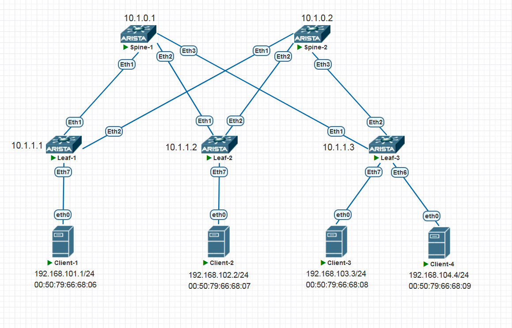

<!-- TOC --><a name="-5-vxlan-l2-vni"></a>
# Домашнее задание 6 (VxLAN. EVPN L3)

<!-- TOC start (generated with https://github.com/derlin/bitdowntoc) -->

<!-- TOC --><a name=""></a>
## Содержание
- [Домашнее задание 6 (VxLAN. EVPN L3)](#-5-vxlan-l2-vni)
   * [Содержание](#)
   * [Цель домашней работы](#-)
   * [Задача](#-1)
   * [Топология](#-2)
   * [Введение](#-3)
   * [IP-план](#ip-)
      + [Loopbacks и ASN на коммутаторах](#loopbacks-asn-)
      + [IRB-интерфейсы на Leaf'ах](#irb-leaf)
      + [Клиенты](#-4)
      + [VXLAN](#vxlan)
   * [План работы](#--1)
      + [Шаги для выполнения работы](#--2)
   * [Выполнение работы](#--3)
      + [Проверка Underlay](#-underlay)
         - [Leaf-1](#leaf-1)
         - [Leaf-2](#leaf-2)
         - [Leaf-3](#leaf-3)
      + [Настройка Spine-1](#-spine-1)
         - [Начальная конфигурация](#--4)
         - [Настройка address-family EVPN](#-address-family-evpn)
      + [Настройка Spine-2](#-spine-2)
      + [Настройка Leaf-1](#-leaf-1)
      + [Настройка Leaf-2](#-leaf-2)
      + [Настройка Leaf-3](#-leaf-3)
   * [Верификация](#-5)
      + [Верификация Spine-1](#-spine-1-1)
         - [BGP summary](#bgp-summary)
         - [BGP evpn routes](#bgp-evpn-routes)
      + [Верификация Spine-2](#-spine-2-1)
         - [BGP summary](#bgp-summary-1)
         - [BGP EVPN Routes](#bgp-evpn-routes-1)
      + [Верификация Leaf-1](#-leaf-1-1)
         - [BGP Summary](#bgp-summary-2)
         - [BGP EVPN Routes](#bgp-evpn-routes-2)
         - [VXLAN](#vxlan-1)
         - [Таблица маршрутизации VRF1](#-vrf1)
      + [Верификация Leaf-2](#-leaf-2-1)
         - [BGP Summary](#bgp-summary-3)
         - [BGP EVPN Routes](#bgp-evpn-routes-3)
         - [VXLAN](#vxlan-2)
         - [Таблица маршрутизации VRF1](#-vrf1-1)
      + [Верификация Leaf-3](#-leaf-3-1)
         - [BGP Summary](#bgp-summary-4)
         - [BGP EVPN Routes](#bgp-evpn-routes-4)
         - [VXLAN](#vxlan-3)
         - [Таблица маршрутизации VRF1](#-vrf1-2)
      + [Верификация связности между клиентами](#--5)
         - [Client-1](#client-1)
         - [Client-2](#client-2)
         - [Client-3](#client-3)
         - [Client-4](#client-4)
   * [Итого](#-6)

<!-- TOC end -->

<!-- TOC --><a name="-"></a>
## Цель домашней работы
Закрепление пройденного материала по теме VxLAN. EVPN L3.

<!-- TOC --><a name="-1"></a>
## Задача
Настроить маршрутизацию в рамках Overlay между клиентами. Каждый клиент должен находиться в отдельном VNI.

<!-- TOC --><a name="-2"></a>
## Топология



<!-- TOC --><a name="-3"></a>
## Введение
В этой домашней работе нам предстоит настроить Overlay-сеть на базе технологии EVPN/VXLAN и обеспечить связность на уровне 3 между четырьмя клиентами, находящимися в разных MAC-VRF, путем настройки функционала IRB (Integrated Routing and Bridging) для EVPN/VXLAN.

Работа будет выполнена на виртуальных нодах на основе Arista vEOS 4.29.2F.

Underlay-сеть мы возьмем из Домашней работы 4 [домашней работы](https://github.com/v435/OTUS_Data-center-network-design/blob/main/Homework/Homework-4/README.md). То есть будет использоваться схема eBGP Unnumbered (RFC 5549). Она подразумевает, что наши коммутаторы устанавливают друг с другом BGP-соседства без использования статически заданной стыковочной IP-адресации. Соседи находят друг друга по IPv6 Link-local адресам. В конфигурации BGP мы указываем лишь интерфейсы, на которых хотим пириться с соседями.

Подробно детали настройки Underlay-сети здесь описывать я не буду, чтобы не раздувать текст и не повторяться. Подробно настройки описаны в соответствующем домашнем задании.

Я решил сессии EVPN для overlay-сети установить с использованием все тех же underlay-сессий, но не в AF IPv4 Unicast, а в address-family EVPN (AFI 25, SAFI 70). То есть отдельно соседей для EVPN мы конфигурировать не будем, а просто активируем на наших underlay IPv4-сессиях адресную семью EVPN. Таким образом и underlay и overlay будут работать в рамках одной и той же сессии и с одними и теми же соседями.

Модель сервиса EVPN будет использована VLAN-Based, как наиболее логичная в наших условиях домашнего задания (по одному-двум VNI на Leaf).

BUM-трафик будем рассылать с помощью механизма Ingress Replication (копируем приходящие BUM-пакеты по числу VTEP'ов в данном VNI и рассылаем их юникастом на эти самые VTEP'ы).

Уровень 3 будет настроен следующим образом: мы будем использовать модель Symmetric IRB, чтобы не плодить лишних VNI на каждом Leaf'е, а также сэкономить дорогие аппаратные L2-ресурсы FDB. Лишние VNI - это VNI, в которых на конкретном Leaf'е не присутствуют никакие локально подключенные клиенты. В качестве шлюзов по умолчанию будут использоваться статические anycast-шлюзы (SAG) по схеме "распределенный шлюз" (Distributed Gateway).

Согласно [RFC 9135, пункт 4.1](https://datatracker.ietf.org/doc/html/rfc9135#section-4.1) существуют два подхода к настройке SAG. В первом случае мы настраиваем одинаковый IP и MAC на каждом IRB-интерфейсе конкретного VNI. Во втором варианте мы настраиваем одинаковый IP, но MAC на каждом IRB-интерфейсе конкретного VNI остается уникальным.

Чем хорош первый подход? Тем, что если конечный узел мигрирует с VTEP на VTEP, ему не придется обновлять ARP-запись своего шлюза по умолчанию, он может сразу после миграции начинать работать так, как будто никакой миграции и не было. В случае же с уникальным MAC, обновление в конечном счете потребуется. В принципе, для облегчения обновления ARP-записи шлюза конечным хостом RFC предлагает использовать механизм MAC Aliasing, при котором VTEP'ы анонсируют свои IRB-интерфейсы в EVPN с помощью RT-2 маршрутов, при этом добавляя к ним специальное комьюнити Default Gateway. Другие VTEP, принимая маршрут с таким комьюнити, должны понимать, что такой MAC-адрес принадлежит IRB-интерфейсу удаленного VTEP, и должны считать его (MAC-адрес из этого NLRI) - своим собственным, принимая на него (и терминируя на себе) Ethernet-кадры, как будто бы это был их локальный MAC! Таким образом перерыва в работе мигрировавшего клиента не должно быть, а в конечном итоге его ARP-запись обновится на актуальную.

Все же второй вариант мне не очень нравится тем, что требуется усложнение плоскости управления - собственно, необходимо генерировать дополнительные маршруты с комьюнити Default GW, нужно их обрабатывать, нужно строить списки MAC Aliasing, нужно сверять DST_MAC приходящих Ethernet-кадров со списком - а не нужно ли нам принять этот кадр? И ради чего? Не проще ли изначально настроить одинаковый anycast MAC на каждом Leaf статически? Мне кажется, что проще. Его и реализуем. MAC-адреса каждого IRB-интерфейса для всех четырех Leaf'ов будут совпадать.

<!-- TOC --><a name="ip-"></a>
## IP-план

<!-- TOC --><a name="loopbacks-asn-"></a>
### Loopbacks и ASN на коммутаторах
Наши Loopback'и и ASN, настроенные на Underlay.

| Устройство | Loopback | ASN   |
| ---------- | -------- | ----- |
| Spine-1    | 10.1.0.1 | 65100 |
| Spine-2    | 10.1.0.2 | 65100 |
| Leaf-1     | 10.1.1.1 | 65001 |
| Leaf-2     | 10.1.1.2 | 65002 |
| Leaf-3     | 10.1.1.3 | 65003 | 

<!-- TOC --><a name="irb-leaf"></a>
### IRB-интерфейсы на Leaf'ах
| Устройство | IRB                | VLAN  |
| ---------- | ------------------ | ----- |
| Leaf-1     | 192.168.101.254/24 | 101   |
| Leaf-2     | 192.168.102.254/24 | 102   |
| Leaf-3     | 192.168.103.254/24 | 103   |
| Leaf-3     | 192.168.104.254/24 | 104   | 

<!-- TOC --><a name="-4"></a>
### Клиенты
MAC, IP-адреса, VLAN, VNI клиентов, подключенных к Leaf-устройствам.

| Клиент   | MAC               | IP/Mask          | VLAN |
| -------- | ----------------- | ---------------- | ---- |
| Client-1 | 00:50:79:66:68:06 | 192.168.101.1/24 | 101  |
| Client-2 | 00:50:79:66:68:07 | 192.168.102.2/24 | 102  |
| Client-3 | 00:50:79:66:68:08 | 192.168.103.3/24 | 103  |
| Client-4 | 00:50:79:66:68:09 | 192.168.104.4/24 | 104  |

IP-VRF будет иметь имя VRF1.

<!-- TOC --><a name="vxlan"></a>
### VXLAN
| VLAN | VNI  | RD       | RT       |
| ---- | ---- | -------- | -------- |
| 101  | 1101 | LoIP:101 | 100:1101 |
| 102  | 1102 | LoIP:102 | 100:1102 |
| 103  | 1103 | LoIP:103 | 100:1103 |
| 104  | 1104 | LoIP:104 | 100:1104 | 

L3VNI для VRF1 будет назначен на VNI 1100, RT будет 100:1100, RD будет LoIP:1100.

<!-- TOC --><a name="--1"></a>
## План работы

<!-- TOC --><a name="--2"></a>
### Шаги для выполнения работы
1. Проверить достижимость loopback'ов с каждого Leaf до каждого Spine и других Leaf. Все должно работать с уже настроенным Underlay.
2. На Spine в рамках процесса BGP настроить address-family EVPN.
3. На Leaf настроить клиентские порты (прописать access vlan)
4. На Leaf настроить плоскость данных VXLAN (source IP, маппинг VLAN на VNI)
5. На Leaf настроить MAC-VRF (для нужного VNI прописать RD, RT, включить распространение локально изученных MAC в EVPN).
6. На Leaf настроить IP-VRF, который свяжет L2VNI на 3-ем уровне (выделить для него свой RD, RT, VNI).
7. На Leaf настроить IRB-интерфейсы с использованием модели Symmetric IRB и Distributed Gateway.
8. Активировать address-family EVPN в процессе BGP.

<!-- TOC --><a name="--3"></a>
## Выполнение работы
Как уже говорил в введении, я подробно опишу конфигурацию только для Spine-1 и Leaf-1. Все остальные коммутаторы будут настроены максимально похоже и для них будут приведены лишь распечатки нужных команд.

<!-- TOC --><a name="-underlay"></a>
### Проверка Underlay
Давайте кратко проверим пингами работу Underlay. С каждого Leaf выполним пинг каждого Spine и соседних Leaf'ов.

<!-- TOC --><a name="leaf-1"></a>
#### Leaf-1
```
Leaf-1#ping 10.1.0.1 repeat 1
PING 10.1.0.1 (10.1.0.1) 72(100) bytes of data.
80 bytes from 10.1.0.1: icmp_seq=1 ttl=65 time=9.52 ms

Leaf-1#ping 10.1.0.2 repeat 1
PING 10.1.0.2 (10.1.0.2) 72(100) bytes of data.
80 bytes from 10.1.0.2: icmp_seq=1 ttl=65 time=7.55 ms

Leaf-1#ping 10.1.1.2 repeat 1
PING 10.1.1.2 (10.1.1.2) 72(100) bytes of data.
80 bytes from 10.1.1.2: icmp_seq=1 ttl=64 time=13.7 ms

Leaf-1#ping 10.1.1.3 repeat 1
PING 10.1.1.3 (10.1.1.3) 72(100) bytes of data.
80 bytes from 10.1.1.3: icmp_seq=1 ttl=64 time=12.6 ms
```

<!-- TOC --><a name="leaf-2"></a>
#### Leaf-2
```
Leaf-2#ping 10.1.0.1 repeat 1
PING 10.1.0.1 (10.1.0.1) 72(100) bytes of data.
80 bytes from 10.1.0.1: icmp_seq=1 ttl=65 time=5.73 ms

Leaf-2#ping 10.1.0.2 repeat 1
PING 10.1.0.2 (10.1.0.2) 72(100) bytes of data.
80 bytes from 10.1.0.2: icmp_seq=1 ttl=65 time=5.20 ms

Leaf-2#ping 10.1.1.1 repeat 1
PING 10.1.1.1 (10.1.1.1) 72(100) bytes of data.
80 bytes from 10.1.1.1: icmp_seq=1 ttl=64 time=10.1 ms

Leaf-2#ping 10.1.1.3 repeat 1
PING 10.1.1.3 (10.1.1.3) 72(100) bytes of data.
80 bytes from 10.1.1.3: icmp_seq=1 ttl=64 time=10.3 ms
```

<!-- TOC --><a name="leaf-3"></a>
#### Leaf-3
```
Leaf-3#ping 10.1.0.1 repeat 1
PING 10.1.0.1 (10.1.0.1) 72(100) bytes of data.
80 bytes from 10.1.0.1: icmp_seq=1 ttl=65 time=5.04 ms

Leaf-3#ping 10.1.0.2 repeat 1
PING 10.1.0.2 (10.1.0.2) 72(100) bytes of data.
80 bytes from 10.1.0.2: icmp_seq=1 ttl=65 time=4.58 ms

Leaf-3#ping 10.1.1.1 repeat 1
PING 10.1.1.1 (10.1.1.1) 72(100) bytes of data.
80 bytes from 10.1.1.1: icmp_seq=1 ttl=64 time=8.91 ms

Leaf-3#ping 10.1.1.2 repeat 1
PING 10.1.1.2 (10.1.1.2) 72(100) bytes of data.
80 bytes from 10.1.1.2: icmp_seq=1 ttl=64 time=8.35 ms
```

Все выглядит хорошо. Переходим к настройкам EVPN.

<!-- TOC --><a name="-spine-1"></a>
### Настройка Spine-1
<!-- TOC --><a name="--4"></a>
#### Начальная конфигурация
Приведу начальную настройку (с настроенным Underlay). Все остальные настройки будут касаться исключительно задач для выполнения текущего ДЗ.
```
service routing protocols model multi-agent
!
hostname Spine-1
!
interface Ethernet1
   description Link_to_Leaf-1
   no switchport
   ipv6 enable
!
interface Ethernet2
   description Link_to_Leaf-2
   no switchport
   ipv6 enable
!
interface Ethernet3
   description Link_to_Leaf-3
   no switchport
   ipv6 enable
!
interface Ethernet4
   shutdown
!
interface Ethernet5
   shutdown
!
interface Ethernet6
   shutdown
!
interface Ethernet7
   shutdown
!
interface Loopback0
   ip address 10.1.0.1/32
!
ip routing ipv6 interfaces
!
ipv6 unicast-routing
!
route-map BGP_REDISTRIBUTE_CONNECTED permit 10
   match interface Loopback0
!
peer-filter LEAFS
   10 match as-range 65001-65006 result accept
!
router bgp 65100
   maximum-paths 64
   neighbor CLOS peer group
   neighbor CLOS out-delay 0
   neighbor CLOS bfd
   neighbor CLOS timers 3 9
   neighbor CLOS password OTUS
   redistribute connected route-map BGP_REDISTRIBUTE_CONNECTED
   neighbor interface Et1-6 peer-group CLOS peer-filter LEAFS
   !
   address-family ipv4
      neighbor CLOS activate
      neighbor CLOS next-hop address-family ipv6 originate
!
end
```

<!-- TOC --><a name="-address-family-evpn"></a>
#### Настройка address-family EVPN
В принципе, вся настройка на Spine сведется к активации address-family и включению отсылки расширенных комьюнити, которые нам необходимы для передачи route-target'ов, которые из себя и представляют эти самые extended community. Без RT ни один Leaf не установит информацию из маршрутов в свои MAC-VRF и IP-VRF, так как именно по RT определяется, какому VRF должна принадлежать данная маршрутная информация.

```
Spine-1(config)# router bgp 65100
Spine-1(config-router-bgp)# neighbor CLOS send-community extended
Spine-1(config-router-bgp)# address-family evpn
Spine-1(config-router-bgp-af)# neighbor CLOS activate
```

Всё :) Настраиваем Spine-2 по такой же схеме.

<!-- TOC --><a name="-spine-2"></a>
### Настройка Spine-2
Начальная конфигурация из ДЗ-4:
```
service routing protocols model multi-agent
!
hostname Spine-2
!
interface Ethernet1
   description Link_to_Leaf-1
   no switchport
   ipv6 enable
!
interface Ethernet2
   description Link_to_Leaf-2
   no switchport
   ipv6 enable
!
interface Ethernet3
   description Link_to_Leaf-3
   no switchport
   ipv6 enable
!
interface Ethernet4
   shutdown
!
interface Ethernet5
   shutdown
!
interface Ethernet6
   shutdown
!
interface Ethernet7
   shutdown
!
interface Loopback0
   ip address 10.1.0.2/32
!
ip routing ipv6 interfaces
!
ipv6 unicast-routing
!
route-map BGP_REDISTRIBUTE_CONNECTED permit 10
   match interface Loopback0
!
peer-filter LEAFS
   10 match as-range 65001-65006 result accept
!
router bgp 65100
   maximum-paths 64
   neighbor CLOS peer group
   neighbor CLOS out-delay 0
   neighbor CLOS bfd
   neighbor CLOS timers 3 9
   neighbor CLOS password OTUS
   redistribute connected route-map BGP_REDISTRIBUTE_CONNECTED
   neighbor interface Et1-6 peer-group CLOS peer-filter LEAFS
   !
   address-family ipv4
      neighbor CLOS activate
      neighbor CLOS next-hop address-family ipv6 originate
!
end
```

Касательно настроек EVPN, здесь всё так же, как и для Spine-1. 

```
Spine-2(config)# router bgp 65100
Spine-2(config-router-bgp)# neighbor CLOS send-community extended
Spine-2(config-router-bgp)# address-family evpn
Spine-2(config-router-bgp-af)# neighbor CLOS activate
```

<!-- TOC --><a name="-leaf-1"></a>
### Настройка Leaf-1
Начальная конфигурация из ДЗ-4:
```
service routing protocols model multi-agent
!
hostname Leaf-1
!
interface Ethernet1
   description Link_to_Spine-1
   no switchport
   ipv6 enable
!
interface Ethernet2
   description Link_to_Spine-2
   no switchport
   ipv6 enable
!
interface Ethernet3
   shutdown
!
interface Ethernet4
   shutdown
!
interface Ethernet5
   shutdown
!
interface Ethernet6
   shutdown
!
interface Ethernet7
   shutdown
!
interface Loopback0
   ip address 10.1.1.1/32
!
ip routing ipv6 interfaces
!
ipv6 unicast-routing
!
route-map BGP_REDISTRIBUTE_CONNECTED permit 10
   match interface Loopback0
!
router bgp 65001
   maximum-paths 64
   neighbor CLOS peer group
   neighbor CLOS out-delay 0
   neighbor CLOS bfd
   neighbor CLOS timers 3 9
   neighbor CLOS password OTUS
   redistribute connected route-map BGP_REDISTRIBUTE_CONNECTED
   neighbor interface Et1-2 peer-group CLOS remote-as 65100
   !
   address-family ipv4
      neighbor CLOS activate
      neighbor CLOS next-hop address-family ipv6 originate
!
end
```

А вот с EVPN тут уже всё сложнее. Давайте пойдем по шагам, чтобы ничего не упустить.

Во-первых создадим VLAN 101, в котором будут наши клиенты (один клиент, но не важно, клиентов могло быть и несколько):
```
Leaf-1(config)#vlan 101
Leaf-1(config-vlan-101)# name Clients_101
```

Теперь настроим физический порт, в который подключен наш клиент Client-1:
```
Leaf-1(config-vlan-101)# interface Ethernet7
Leaf-1(config-if-Et7)# description Link_to_Client-1
Leaf-1(config-if-Et7)# switchport access vlan 101
Leaf-1(config-if-Et7)# no shutdown
```
Здесь мы задаем описание порта и указываем, что порт принадлежит VLAN'у 101 и трафик должен отправляться и приниматься нетегированным. Также мы включаем интерфейс (до этого он был административно отключен).

Теперь создадим IRB-интерфейс для VLAN 101 и установим на него anycast IP-адрес, который будет служить шлюзом по умолчанию для наших клиентов в данном VLAN. Также поместим этот IRB-интерфейс в VRF VRF1.
```
Leaf-1(config)# interface Vlan101
Leaf-1(config-if-Vl101)# vrf VRF1
Leaf-1(config-if-Vl101)# ip address virtual 192.168.101.254/24
```

Теперь настроим интерфейс VXLAN:
```
Leaf-1(config)#interface Vxlan1
Leaf-1(config-if-Vx1)# vxlan source-interface Loopback0
Leaf-1(config-if-Vx1)# vxlan vlan 101 vni 1101
Leaf-1(config-if-Vx1)# vxlan vrf VRF1 vni 1100
```
Здесь мы указываем, что VTEP IP-адрес нужно брать с интерфейса Loopback0. Этот IP-адрес будет использоваться как внешний Source IP в VXLAN-пакетах.
Далее мы задаем соответствие VLAN 101 к VNI 1101, как бы соединяя их. Трафик из VLAN 101 при выходе из VXLAN-интерфейса должен инкапсулироваться в VNI 1101. Также мы здесь создаем L3VNI для VRF VRF1. Этот L3VNI будет использоваться для маршрутизируемого трафика внутри нашего VRF.

Теперь настроим anycast MAC-адрес для наших IRB-интерфейсов:
```
Leaf-1(config)# ip virtual-router mac-address 02:00:00:00:00:00
```

Включим маршрутизацию для нашего VRF VRF1:
```
Leaf-1(config)# ip routing vrf VRF1
```

Настроим MAC-VRF для VLAN 101:
```
Leaf-1(config)#router bgp 65001
Leaf-1(config-router-bgp)# vlan 101
Leaf-1(config-macvrf-101)# rd auto
Leaf-1(config-macvrf-101)# route-target both 100:1101
Leaf-1(config-macvrf-101)# redistribute learned
```
Здесь мы настраиваем MAC-VRF для VLAN 101. Route Distinguisher зададим как auto, потому что механизм генерации RD у аристы по умолчанию нас вполне устраивает (LoopbackIP:VID).
Далее мы задаем route-target как 100:1101 (как на импорт, так и на экспорт), таким образов уникально обозначив конкретный MAC-VRF в пределах нашей фабрики.
Ну и напоследок даем указание распространять в EVPN информацию о всех изученных локально клиентах в данном VLAN.

Теперь настроим L3VNI для VRF1, который мы будем использовать для передачи маршрутизируемого трафика (inter-VNI):
```
Leaf-1(config-router-bgp)#vrf VRF1
Leaf-1(config-router-bgp-vrf-VRF1)#rd 10.1.1.1:1100
Leaf-1(config-router-bgp-vrf-VRF1)#route-target export evpn 100:1100
Leaf-1(config-router-bgp-vrf-VRF1)#route-target export evpn 100:1100
```
Здесь мы указываем RD (здесь требуется задать его явно, опции auto не предлагается). Далее конфигурируем экспортную и импортную политику для L3VNI. Оба RT должны совпадать на всех VTEP для этого VRF.

Теперь включим AF EVPN в настройках процесса BGP:
```
Leaf-1(config)# router bgp 65001
Leaf-1(config-router-bgp)# neighbor CLOS send-community extended
Leaf-1(config-router-bgp)# address-family evpn
Leaf-1(config-router-bgp-af)# neighbor CLOS activate
```
Как и везде, активируем AF EVPN для наших соседей и включаем отсылку расширенных комьюнити.

Общий вид настройки EVPN:
```
vlan 101
   name Clients_101
!
vrf instance VRF1
!
interface Ethernet7
   description Link_to_Client-1
   switchport access vlan 101
   no shutdown
!
interface Vlan101
   vrf VRF1
   ip address virtual 192.168.101.254/24
!
interface Vxlan1
   vxlan source-interface Loopback0
   vxlan vlan 101 vni 1101
   vxlan vrf VRF1 vni 1100
!
ip virtual-router mac-address 02:00:00:00:00:00
!
ip routing vrf VRF1
!
router bgp 65001
   neighbor CLOS send-community extended
!
   vlan 101
      rd auto
      route-target both 100:1101
      redistribute learned
!
    vrf VRF1
    rd 10.1.1.1:1100
    route-target import evpn 100:1100
    route-target export evpn 100:1100
!   
   address-family evpn
      neighbor CLOS activate
```

Всё. Остальные коммутаторы Leaf настраиваем по той же схеме. Буду приводить только финальные настройки EVPN, чтобы не дублировать информацию.

<!-- TOC --><a name="-leaf-2"></a>
### Настройка Leaf-2
Начальная конфигурация:
```
service routing protocols model multi-agent
!
hostname Leaf-2
!
interface Ethernet1
   description Link_to_Spine-1
   no switchport
   ipv6 enable
!
interface Ethernet2
   description Link_to_Spine-2
   no switchport
   ipv6 enable
!
interface Ethernet3
   shutdown
!
interface Ethernet4
   shutdown
!
interface Ethernet5
   shutdown
!
interface Ethernet6
   shutdown
!
interface Ethernet7
   shutdown
!
interface Loopback0
   ip address 10.1.1.2/32
!
ip routing ipv6 interfaces
!
ipv6 unicast-routing
!
route-map BGP_REDISTRIBUTE_CONNECTED permit 10
   match interface Loopback0
!
router bgp 65002
   maximum-paths 64
   neighbor CLOS peer group
   neighbor CLOS out-delay 0
   neighbor CLOS bfd
   neighbor CLOS timers 3 9
   neighbor CLOS password OTUS
   redistribute connected route-map BGP_REDISTRIBUTE_CONNECTED
   neighbor interface Et1-2 peer-group CLOS remote-as 65100
   !
   address-family ipv4
      neighbor CLOS activate
      neighbor CLOS next-hop address-family ipv6 originate
!
end
```

Конфигурация EVPN:
```
vlan 102
   name Clients_102
!
vrf instance VRF1
!
interface Ethernet7
   description Link_to_Client-2
   switchport access vlan 102
   no shutdown
!
interface Vlan102
   vrf VRF1
   ip address virtual 192.168.102.254/24
!
interface Vxlan1
   vxlan source-interface Loopback0
   vxlan vlan 102 vni 1102
   vxlan vrf VRF1 vni 1100
!
ip virtual-router mac-address 02:00:00:00:00:00
!
ip routing vrf VRF1
!
router bgp 65002
   neighbor CLOS send-community extended
!
   vlan 102
      rd auto
      route-target both 100:1102
      redistribute learned
!
    vrf VRF1
    rd 10.1.1.2:1100
    route-target import evpn 100:1100
    route-target export evpn 100:1100
!   
   address-family evpn
      neighbor CLOS activate
```

<!-- TOC --><a name="-leaf-3"></a>
### Настройка Leaf-3
Начальная конфигурация:
```
service routing protocols model multi-agent
!
hostname Leaf-3
!
interface Ethernet1
   description Link_to_Spine-1
   no switchport
   ipv6 enable
!
interface Ethernet2
   description Link_to_Spine-2
   no switchport
   ipv6 enable
!
interface Ethernet3
   shutdown
!
interface Ethernet4
   shutdown
!
interface Ethernet5
   shutdown
!
interface Ethernet6
   shutdown
!
interface Ethernet7
   shutdown
!
interface Loopback0
   ip address 10.1.1.3/32
!
ip routing ipv6 interfaces
!
ipv6 unicast-routing
!
route-map BGP_REDISTRIBUTE_CONNECTED permit 10
   match interface Loopback0
!
router bgp 65003
   maximum-paths 64
   neighbor CLOS peer group
   neighbor CLOS out-delay 0
   neighbor CLOS bfd
   neighbor CLOS timers 3 9
   neighbor CLOS password OTUS
   redistribute connected route-map BGP_REDISTRIBUTE_CONNECTED
   neighbor interface Et1-2 peer-group CLOS remote-as 65100
   !
   address-family ipv4
      neighbor CLOS activate
      neighbor CLOS next-hop address-family ipv6 originate
!
end
```

Настройки EVPN:
```
vlan 103
   name Clients_103
!
vlan 104
   name Clients_104
!
vrf instance VRF1
!
interface Ethernet6
   description Link_to_Client-4
   switchport access vlan 104
   no shutdown
!
interface Ethernet7
   description Link_to_Client-3
   switchport access vlan 103
   no shutdown
!
interface Vlan103
   vrf VRF1
   ip address virtual 192.168.103.254/24
!
interface Vlan104
   vrf VRF1
   ip address virtual 192.168.104.254/24
!
interface Vxlan1
   vxlan source-interface Loopback0
   vxlan vlan 103 vni 1103
   vxlan vlan 104 vni 1104
   vxlan vrf VRF1 vni 1100
!
ip virtual-router mac-address 02:00:00:00:00:00
!
ip routing vrf VRF1
!
router bgp 65003
   neighbor CLOS send-community extended
!
   vlan 103
      rd auto
      route-target both 100:1103
      redistribute learned
!
   vlan 104
      rd auto
      route-target both 100:1104
      redistribute learned
!
    vrf VRF1
    rd 10.1.1.3:1100
    route-target import evpn 100:1100
    route-target export evpn 100:1100
!   
   address-family evpn
      neighbor CLOS activate
```

<!-- TOC --><a name="-5"></a>
## Верификация
На коммутаторах посмотрим, правильно ли применились наши настройки, все ли маршруты в наличии.

По условиям задания мы должны убедиться, что все клиенты видят друг друга на 3-ом уровне. Проверим это пингами.


<!-- TOC --><a name="-spine-1-1"></a>
### Верификация Spine-1
<!-- TOC --><a name="bgp-summary"></a>
#### BGP summary
```
Spine-1#show bgp summary 
BGP summary information for VRF default
Router identifier 10.1.0.1, local AS number 65100
Neighbor                               AS Session State AFI/SAFI                AFI/SAFI State   NLRI Rcd   NLRI Acc
----------------------------- ----------- ------------- ----------------------- -------------- ---------- ----------
fe80::525a:57ff:fe87:6f51%Et2       65002 Established   IPv4 Unicast            Negotiated              1          1
fe80::525a:57ff:fe87:6f51%Et2       65002 Established   L2VPN EVPN              Negotiated              3          3
fe80::52f1:cdff:fea5:4624%Et1       65001 Established   IPv4 Unicast            Negotiated              1          1
fe80::52f1:cdff:fea5:4624%Et1       65001 Established   L2VPN EVPN              Negotiated              3          3
fe80::52ff:b3ff:fe43:89a1%Et3       65003 Established   IPv4 Unicast            Negotiated              1          1
fe80::52ff:b3ff:fe43:89a1%Et3       65003 Established   L2VPN EVPN              Negotiated              6          6
```
Все в порядке. С каждым соседом у нас установлена сессия в L2VPN EVPN.

<!-- TOC --><a name="bgp-evpn-routes"></a>
#### BGP evpn routes
```
Spine-1#show bgp evpn detail
BGP routing table information for VRF default
Router identifier 10.1.0.1, local AS number 65100
BGP routing table entry for mac-ip 0050.7966.6806, Route Distinguisher: 10.1.1.1:101
 Paths: 1 available
  65001
    10.1.1.1 from fe80::52f1:cdff:fea5:4624%Et1 (10.1.1.1)
      Origin IGP, metric -, localpref 100, weight 0, tag 0, valid, external, best
      Extended Community: Route-Target-AS:100:1101 TunnelEncap:tunnelTypeVxlan
      VNI: 1101 ESI: 0000:0000:0000:0000:0000
BGP routing table entry for mac-ip 0050.7966.6806 192.168.101.1, Route Distinguisher: 10.1.1.1:101
 Paths: 1 available
  65001
    10.1.1.1 from fe80::52f1:cdff:fea5:4624%Et1 (10.1.1.1)
      Origin IGP, metric -, localpref 100, weight 0, tag 0, valid, external, best
      Extended Community: Route-Target-AS:100:1100 Route-Target-AS:100:1101 TunnelEncap:tunnelTypeVxlan EvpnRouterMac:50:f1:cd:a5:46:24
      VNI: 1101 L3 VNI: 1100 ESI: 0000:0000:0000:0000:0000
BGP routing table entry for mac-ip 0050.7966.6807, Route Distinguisher: 10.1.1.2:102
 Paths: 1 available
  65002
    10.1.1.2 from fe80::525a:57ff:fe87:6f51%Et2 (10.1.1.2)
      Origin IGP, metric -, localpref 100, weight 0, tag 0, valid, external, best
      Extended Community: Route-Target-AS:100:1102 TunnelEncap:tunnelTypeVxlan
      VNI: 1102 ESI: 0000:0000:0000:0000:0000
BGP routing table entry for mac-ip 0050.7966.6807 192.168.102.2, Route Distinguisher: 10.1.1.2:102
 Paths: 1 available
  65002
    10.1.1.2 from fe80::525a:57ff:fe87:6f51%Et2 (10.1.1.2)
      Origin IGP, metric -, localpref 100, weight 0, tag 0, valid, external, best
      Extended Community: Route-Target-AS:100:1100 Route-Target-AS:100:1102 TunnelEncap:tunnelTypeVxlan EvpnRouterMac:50:5a:57:87:6f:51
      VNI: 1102 L3 VNI: 1100 ESI: 0000:0000:0000:0000:0000
BGP routing table entry for mac-ip 0050.7966.6808, Route Distinguisher: 10.1.1.3:103
 Paths: 1 available
  65003
    10.1.1.3 from fe80::52ff:b3ff:fe43:89a1%Et3 (10.1.1.3)
      Origin IGP, metric -, localpref 100, weight 0, tag 0, valid, external, best
      Extended Community: Route-Target-AS:100:1103 TunnelEncap:tunnelTypeVxlan
      VNI: 1103 ESI: 0000:0000:0000:0000:0000
BGP routing table entry for mac-ip 0050.7966.6808 192.168.103.3, Route Distinguisher: 10.1.1.3:103
 Paths: 1 available
  65003
    10.1.1.3 from fe80::52ff:b3ff:fe43:89a1%Et3 (10.1.1.3)
      Origin IGP, metric -, localpref 100, weight 0, tag 0, valid, external, best
      Extended Community: Route-Target-AS:100:1100 Route-Target-AS:100:1103 TunnelEncap:tunnelTypeVxlan EvpnRouterMac:50:ff:b3:43:89:a1
      VNI: 1103 L3 VNI: 1100 ESI: 0000:0000:0000:0000:0000
BGP routing table entry for mac-ip 0050.7966.6809, Route Distinguisher: 10.1.1.3:104
 Paths: 1 available
  65003
    10.1.1.3 from fe80::52ff:b3ff:fe43:89a1%Et3 (10.1.1.3)
      Origin IGP, metric -, localpref 100, weight 0, tag 0, valid, external, best
      Extended Community: Route-Target-AS:100:1104 TunnelEncap:tunnelTypeVxlan
      VNI: 1104 ESI: 0000:0000:0000:0000:0000
BGP routing table entry for mac-ip 0050.7966.6809 192.168.104.4, Route Distinguisher: 10.1.1.3:104
 Paths: 1 available
  65003
    10.1.1.3 from fe80::52ff:b3ff:fe43:89a1%Et3 (10.1.1.3)
      Origin IGP, metric -, localpref 100, weight 0, tag 0, valid, external, best
      Extended Community: Route-Target-AS:100:1100 Route-Target-AS:100:1104 TunnelEncap:tunnelTypeVxlan EvpnRouterMac:50:ff:b3:43:89:a1
      VNI: 1104 L3 VNI: 1100 ESI: 0000:0000:0000:0000:0000
BGP routing table entry for imet 10.1.1.1, Route Distinguisher: 10.1.1.1:101
 Paths: 1 available
  65001
    10.1.1.1 from fe80::52f1:cdff:fea5:4624%Et1 (10.1.1.1)
      Origin IGP, metric -, localpref 100, weight 0, tag 0, valid, external, best
      Extended Community: Route-Target-AS:100:1101 TunnelEncap:tunnelTypeVxlan
      VNI: 1101
      PMSI Tunnel: Ingress Replication, MPLS Label: 1101, Leaf Information Required: false, Tunnel ID: 10.1.1.1
BGP routing table entry for imet 10.1.1.2, Route Distinguisher: 10.1.1.2:102
 Paths: 1 available
  65002
    10.1.1.2 from fe80::525a:57ff:fe87:6f51%Et2 (10.1.1.2)
      Origin IGP, metric -, localpref 100, weight 0, tag 0, valid, external, best
      Extended Community: Route-Target-AS:100:1102 TunnelEncap:tunnelTypeVxlan
      VNI: 1102
      PMSI Tunnel: Ingress Replication, MPLS Label: 1102, Leaf Information Required: false, Tunnel ID: 10.1.1.2
BGP routing table entry for imet 10.1.1.3, Route Distinguisher: 10.1.1.3:103
 Paths: 1 available
  65003
    10.1.1.3 from fe80::52ff:b3ff:fe43:89a1%Et3 (10.1.1.3)
      Origin IGP, metric -, localpref 100, weight 0, tag 0, valid, external, best
      Extended Community: Route-Target-AS:100:1103 TunnelEncap:tunnelTypeVxlan
      VNI: 1103
      PMSI Tunnel: Ingress Replication, MPLS Label: 1103, Leaf Information Required: false, Tunnel ID: 10.1.1.3
BGP routing table entry for imet 10.1.1.3, Route Distinguisher: 10.1.1.3:104
 Paths: 1 available
  65003
    10.1.1.3 from fe80::52ff:b3ff:fe43:89a1%Et3 (10.1.1.3)
      Origin IGP, metric -, localpref 100, weight 0, tag 0, valid, external, best
      Extended Community: Route-Target-AS:100:1104 TunnelEncap:tunnelTypeVxlan
      VNI: 1104
      PMSI Tunnel: Ingress Replication, MPLS Label: 1104, Leaf Information Required: false, Tunnel ID: 10.1.1.3
```
Все так. Каждый Leaf прислал по одному RT-3 маршруту (Leaf-3 прислал два - по одному для VNI 1103 и 1104), route target именно тот, который мы настроили.
Для каждого MAC/IP-маршрута указывается не только L2VNI, но и следом за ним L3VNI (и L3VNI RT), которые мы настроили. Такой маршрут будет установлен в соответствующую IP-VRF VRF1.

BUM-трафик рассылается с помощью Ingress Replication.

Ну, будем считать, что всё работает.

<!-- TOC --><a name="-spine-2-1"></a>
### Верификация Spine-2
<!-- TOC --><a name="bgp-summary-1"></a>
#### BGP summary
```
Spine-2#show bgp summary
BGP summary information for VRF default
Router identifier 10.1.0.2, local AS number 65100
Neighbor                               AS Session State AFI/SAFI                AFI/SAFI State   NLRI Rcd   NLRI Acc
----------------------------- ----------- ------------- ----------------------- -------------- ---------- ----------
fe80::525a:57ff:fe87:6f51%Et2       65002 Established   IPv4 Unicast            Negotiated              1          1
fe80::525a:57ff:fe87:6f51%Et2       65002 Established   L2VPN EVPN              Negotiated              3          3
fe80::52f1:cdff:fea5:4624%Et1       65001 Established   IPv4 Unicast            Negotiated              1          1
fe80::52f1:cdff:fea5:4624%Et1       65001 Established   L2VPN EVPN              Negotiated              3          3
fe80::52ff:b3ff:fe43:89a1%Et3       65003 Established   IPv4 Unicast            Negotiated              1          1
fe80::52ff:b3ff:fe43:89a1%Et3       65003 Established   L2VPN EVPN              Negotiated              6          6
```
Все в порядке. С каждым соседом у нас установлена сессия в L2VPN EVPN.

<!-- TOC --><a name="bgp-evpn-routes-1"></a>
#### BGP EVPN Routes
```
Spine-2#show bgp evpn detail 
BGP routing table information for VRF default
Router identifier 10.1.0.2, local AS number 65100
BGP routing table entry for mac-ip 0050.7966.6806, Route Distinguisher: 10.1.1.1:101
 Paths: 1 available
  65001
    10.1.1.1 from fe80::52f1:cdff:fea5:4624%Et1 (10.1.1.1)
      Origin IGP, metric -, localpref 100, weight 0, tag 0, valid, external, best
      Extended Community: Route-Target-AS:100:1101 TunnelEncap:tunnelTypeVxlan
      VNI: 1101 ESI: 0000:0000:0000:0000:0000
BGP routing table entry for mac-ip 0050.7966.6806 192.168.101.1, Route Distinguisher: 10.1.1.1:101
 Paths: 1 available
  65001
    10.1.1.1 from fe80::52f1:cdff:fea5:4624%Et1 (10.1.1.1)
      Origin IGP, metric -, localpref 100, weight 0, tag 0, valid, external, best
      Extended Community: Route-Target-AS:100:1100 Route-Target-AS:100:1101 TunnelEncap:tunnelTypeVxlan EvpnRouterMac:50:f1:cd:a5:46:24
      VNI: 1101 L3 VNI: 1100 ESI: 0000:0000:0000:0000:0000
BGP routing table entry for mac-ip 0050.7966.6807, Route Distinguisher: 10.1.1.2:102
 Paths: 1 available
  65002
    10.1.1.2 from fe80::525a:57ff:fe87:6f51%Et2 (10.1.1.2)
      Origin IGP, metric -, localpref 100, weight 0, tag 0, valid, external, best
      Extended Community: Route-Target-AS:100:1102 TunnelEncap:tunnelTypeVxlan
      VNI: 1102 ESI: 0000:0000:0000:0000:0000
BGP routing table entry for mac-ip 0050.7966.6807 192.168.102.2, Route Distinguisher: 10.1.1.2:102
 Paths: 1 available
  65002
    10.1.1.2 from fe80::525a:57ff:fe87:6f51%Et2 (10.1.1.2)
      Origin IGP, metric -, localpref 100, weight 0, tag 0, valid, external, best
      Extended Community: Route-Target-AS:100:1100 Route-Target-AS:100:1102 TunnelEncap:tunnelTypeVxlan EvpnRouterMac:50:5a:57:87:6f:51
      VNI: 1102 L3 VNI: 1100 ESI: 0000:0000:0000:0000:0000
BGP routing table entry for mac-ip 0050.7966.6808, Route Distinguisher: 10.1.1.3:103
 Paths: 1 available
  65003
    10.1.1.3 from fe80::52ff:b3ff:fe43:89a1%Et3 (10.1.1.3)
      Origin IGP, metric -, localpref 100, weight 0, tag 0, valid, external, best
      Extended Community: Route-Target-AS:100:1103 TunnelEncap:tunnelTypeVxlan
      VNI: 1103 ESI: 0000:0000:0000:0000:0000
BGP routing table entry for mac-ip 0050.7966.6808 192.168.103.3, Route Distinguisher: 10.1.1.3:103
 Paths: 1 available
  65003
    10.1.1.3 from fe80::52ff:b3ff:fe43:89a1%Et3 (10.1.1.3)
      Origin IGP, metric -, localpref 100, weight 0, tag 0, valid, external, best
      Extended Community: Route-Target-AS:100:1100 Route-Target-AS:100:1103 TunnelEncap:tunnelTypeVxlan EvpnRouterMac:50:ff:b3:43:89:a1
      VNI: 1103 L3 VNI: 1100 ESI: 0000:0000:0000:0000:0000
BGP routing table entry for mac-ip 0050.7966.6809, Route Distinguisher: 10.1.1.3:104
 Paths: 1 available
  65003
    10.1.1.3 from fe80::52ff:b3ff:fe43:89a1%Et3 (10.1.1.3)
      Origin IGP, metric -, localpref 100, weight 0, tag 0, valid, external, best
      Extended Community: Route-Target-AS:100:1104 TunnelEncap:tunnelTypeVxlan
      VNI: 1104 ESI: 0000:0000:0000:0000:0000
BGP routing table entry for mac-ip 0050.7966.6809 192.168.104.4, Route Distinguisher: 10.1.1.3:104
 Paths: 1 available
  65003
    10.1.1.3 from fe80::52ff:b3ff:fe43:89a1%Et3 (10.1.1.3)
      Origin IGP, metric -, localpref 100, weight 0, tag 0, valid, external, best
      Extended Community: Route-Target-AS:100:1100 Route-Target-AS:100:1104 TunnelEncap:tunnelTypeVxlan EvpnRouterMac:50:ff:b3:43:89:a1
      VNI: 1104 L3 VNI: 1100 ESI: 0000:0000:0000:0000:0000
BGP routing table entry for imet 10.1.1.1, Route Distinguisher: 10.1.1.1:101
 Paths: 1 available
  65001
    10.1.1.1 from fe80::52f1:cdff:fea5:4624%Et1 (10.1.1.1)
      Origin IGP, metric -, localpref 100, weight 0, tag 0, valid, external, best
      Extended Community: Route-Target-AS:100:1101 TunnelEncap:tunnelTypeVxlan
      VNI: 1101
      PMSI Tunnel: Ingress Replication, MPLS Label: 1101, Leaf Information Required: false, Tunnel ID: 10.1.1.1
BGP routing table entry for imet 10.1.1.2, Route Distinguisher: 10.1.1.2:102
 Paths: 1 available
  65002
    10.1.1.2 from fe80::525a:57ff:fe87:6f51%Et2 (10.1.1.2)
      Origin IGP, metric -, localpref 100, weight 0, tag 0, valid, external, best
      Extended Community: Route-Target-AS:100:1102 TunnelEncap:tunnelTypeVxlan
      VNI: 1102
      PMSI Tunnel: Ingress Replication, MPLS Label: 1102, Leaf Information Required: false, Tunnel ID: 10.1.1.2
BGP routing table entry for imet 10.1.1.3, Route Distinguisher: 10.1.1.3:103
 Paths: 1 available
  65003
    10.1.1.3 from fe80::52ff:b3ff:fe43:89a1%Et3 (10.1.1.3)
      Origin IGP, metric -, localpref 100, weight 0, tag 0, valid, external, best
      Extended Community: Route-Target-AS:100:1103 TunnelEncap:tunnelTypeVxlan
      VNI: 1103
      PMSI Tunnel: Ingress Replication, MPLS Label: 1103, Leaf Information Required: false, Tunnel ID: 10.1.1.3
BGP routing table entry for imet 10.1.1.3, Route Distinguisher: 10.1.1.3:104
 Paths: 1 available
  65003
    10.1.1.3 from fe80::52ff:b3ff:fe43:89a1%Et3 (10.1.1.3)
      Origin IGP, metric -, localpref 100, weight 0, tag 0, valid, external, best
      Extended Community: Route-Target-AS:100:1104 TunnelEncap:tunnelTypeVxlan
      VNI: 1104
      PMSI Tunnel: Ingress Replication, MPLS Label: 1104, Leaf Information Required: false, Tunnel ID: 10.1.1.3
```
Все так, как и для Spine-1.

<!-- TOC --><a name="-leaf-1-1"></a>
### Верификация Leaf-1
<!-- TOC --><a name="bgp-summary-2"></a>
#### BGP Summary
```
Leaf-1#show bgp summary 
BGP summary information for VRF default
Router identifier 10.1.1.1, local AS number 65001
Neighbor                               AS Session State AFI/SAFI                AFI/SAFI State   NLRI Rcd   NLRI Acc
----------------------------- ----------- ------------- ----------------------- -------------- ---------- ----------
fe80::5268:63ff:fe55:3e6b%Et2       65100 Established   IPv4 Unicast            Negotiated              3          3
fe80::5268:63ff:fe55:3e6b%Et2       65100 Established   L2VPN EVPN              Negotiated              9          9
fe80::52d0:ff:fe0b:bc2f%Et1         65100 Established   IPv4 Unicast            Negotiated              3          3
fe80::52d0:ff:fe0b:bc2f%Et1         65100 Established   L2VPN EVPN              Negotiated              9          9
```
Сессии у нас установлены только со Spine-ами, в обоих AF - IPv4 Unicast и в L2VPN EVPN.

<!-- TOC --><a name="bgp-evpn-routes-2"></a>
#### BGP EVPN Routes
Сначала посмотрим маршруты кратко, потом подробно.
```
Leaf-1#show bgp evpn 
BGP routing table information for VRF default
Router identifier 10.1.1.1, local AS number 65001
Route status codes: * - valid, > - active, S - Stale, E - ECMP head, e - ECMP
                    c - Contributing to ECMP, % - Pending BGP convergence
Origin codes: i - IGP, e - EGP, ? - incomplete
AS Path Attributes: Or-ID - Originator ID, C-LST - Cluster List, LL Nexthop - Link Local Nexthop

          Network                Next Hop              Metric  LocPref Weight  Path
 * >      RD: 10.1.1.1:101 mac-ip 0050.7966.6806
                                 -                     -       -       0       i
 * >      RD: 10.1.1.1:101 mac-ip 0050.7966.6806 192.168.101.1
                                 -                     -       -       0       i
 * >Ec    RD: 10.1.1.2:102 mac-ip 0050.7966.6807
                                 10.1.1.2              -       100     0       65100 65002 i
 *  ec    RD: 10.1.1.2:102 mac-ip 0050.7966.6807
                                 10.1.1.2              -       100     0       65100 65002 i
 * >Ec    RD: 10.1.1.2:102 mac-ip 0050.7966.6807 192.168.102.2
                                 10.1.1.2              -       100     0       65100 65002 i
 *  ec    RD: 10.1.1.2:102 mac-ip 0050.7966.6807 192.168.102.2
                                 10.1.1.2              -       100     0       65100 65002 i
 * >Ec    RD: 10.1.1.3:103 mac-ip 0050.7966.6808
                                 10.1.1.3              -       100     0       65100 65003 i
 *  ec    RD: 10.1.1.3:103 mac-ip 0050.7966.6808
                                 10.1.1.3              -       100     0       65100 65003 i
 * >Ec    RD: 10.1.1.3:103 mac-ip 0050.7966.6808 192.168.103.3
                                 10.1.1.3              -       100     0       65100 65003 i
 *  ec    RD: 10.1.1.3:103 mac-ip 0050.7966.6808 192.168.103.3
                                 10.1.1.3              -       100     0       65100 65003 i
 * >Ec    RD: 10.1.1.3:104 mac-ip 0050.7966.6809
                                 10.1.1.3              -       100     0       65100 65003 i
 *  ec    RD: 10.1.1.3:104 mac-ip 0050.7966.6809
                                 10.1.1.3              -       100     0       65100 65003 i
 * >Ec    RD: 10.1.1.3:104 mac-ip 0050.7966.6809 192.168.104.4
                                 10.1.1.3              -       100     0       65100 65003 i
 *  ec    RD: 10.1.1.3:104 mac-ip 0050.7966.6809 192.168.104.4
                                 10.1.1.3              -       100     0       65100 65003 i
 * >      RD: 10.1.1.1:101 imet 10.1.1.1
                                 -                     -       -       0       i
 * >Ec    RD: 10.1.1.2:102 imet 10.1.1.2
                                 10.1.1.2              -       100     0       65100 65002 i
 *  ec    RD: 10.1.1.2:102 imet 10.1.1.2
                                 10.1.1.2              -       100     0       65100 65002 i
 * >Ec    RD: 10.1.1.3:103 imet 10.1.1.3
                                 10.1.1.3              -       100     0       65100 65003 i
 *  ec    RD: 10.1.1.3:103 imet 10.1.1.3
                                 10.1.1.3              -       100     0       65100 65003 i
 * >Ec    RD: 10.1.1.3:104 imet 10.1.1.3
                                 10.1.1.3              -       100     0       65100 65003 i
 *  ec    RD: 10.1.1.3:104 imet 10.1.1.3
                                 10.1.1.3              -       100     0       65100 65003 i
```
ECMP отрабатывает...

```
Leaf-1#show bgp evpn detail 
BGP routing table information for VRF default
Router identifier 10.1.1.1, local AS number 65001
BGP routing table entry for mac-ip 0050.7966.6806, Route Distinguisher: 10.1.1.1:101
 Paths: 1 available
  Local
    - from - (0.0.0.0)
      Origin IGP, metric -, localpref -, weight 0, tag 0, valid, local, best
      Extended Community: Route-Target-AS:100:1101 TunnelEncap:tunnelTypeVxlan
      VNI: 1101 ESI: 0000:0000:0000:0000:0000
BGP routing table entry for mac-ip 0050.7966.6806 192.168.101.1, Route Distinguisher: 10.1.1.1:101
 Paths: 1 available
  Local
    - from - (0.0.0.0)
      Origin IGP, metric -, localpref -, weight 0, tag 0, valid, local, best
      Extended Community: Route-Target-AS:100:1100 Route-Target-AS:100:1101 TunnelEncap:tunnelTypeVxlan
      VNI: 1101 L3 VNI: 1100 ESI: 0000:0000:0000:0000:0000
BGP routing table entry for mac-ip 0050.7966.6807, Route Distinguisher: 10.1.1.2:102
 Paths: 2 available
  65100 65002
    10.1.1.2 from fe80::5268:63ff:fe55:3e6b%Et2 (10.1.0.2)
      Origin IGP, metric -, localpref 100, weight 0, tag 0, valid, external, ECMP head, ECMP, best, ECMP contributor
      Extended Community: Route-Target-AS:100:1102 TunnelEncap:tunnelTypeVxlan
      VNI: 1102 ESI: 0000:0000:0000:0000:0000
  65100 65002
    10.1.1.2 from fe80::52d0:ff:fe0b:bc2f%Et1 (10.1.0.1)
      Origin IGP, metric -, localpref 100, weight 0, tag 0, valid, external, ECMP, ECMP contributor
      Extended Community: Route-Target-AS:100:1102 TunnelEncap:tunnelTypeVxlan
      VNI: 1102 ESI: 0000:0000:0000:0000:0000
BGP routing table entry for mac-ip 0050.7966.6807 192.168.102.2, Route Distinguisher: 10.1.1.2:102
 Paths: 2 available
  65100 65002
    10.1.1.2 from fe80::52d0:ff:fe0b:bc2f%Et1 (10.1.0.1)
      Origin IGP, metric -, localpref 100, weight 0, tag 0, valid, external, ECMP head, ECMP, best, ECMP contributor
      Extended Community: Route-Target-AS:100:1100 Route-Target-AS:100:1102 TunnelEncap:tunnelTypeVxlan EvpnRouterMac:50:5a:57:87:6f:51
      VNI: 1102 L3 VNI: 1100 ESI: 0000:0000:0000:0000:0000
  65100 65002
    10.1.1.2 from fe80::5268:63ff:fe55:3e6b%Et2 (10.1.0.2)
      Origin IGP, metric -, localpref 100, weight 0, tag 0, valid, external, ECMP, ECMP contributor
      Extended Community: Route-Target-AS:100:1100 Route-Target-AS:100:1102 TunnelEncap:tunnelTypeVxlan EvpnRouterMac:50:5a:57:87:6f:51
      VNI: 1102 L3 VNI: 1100 ESI: 0000:0000:0000:0000:0000
BGP routing table entry for mac-ip 0050.7966.6808, Route Distinguisher: 10.1.1.3:103
 Paths: 2 available
  65100 65003
    10.1.1.3 from fe80::5268:63ff:fe55:3e6b%Et2 (10.1.0.2)
      Origin IGP, metric -, localpref 100, weight 0, tag 0, valid, external, ECMP head, ECMP, best, ECMP contributor
      Extended Community: Route-Target-AS:100:1103 TunnelEncap:tunnelTypeVxlan
      VNI: 1103 ESI: 0000:0000:0000:0000:0000
  65100 65003
    10.1.1.3 from fe80::52d0:ff:fe0b:bc2f%Et1 (10.1.0.1)
      Origin IGP, metric -, localpref 100, weight 0, tag 0, valid, external, ECMP, ECMP contributor
      Extended Community: Route-Target-AS:100:1103 TunnelEncap:tunnelTypeVxlan
      VNI: 1103 ESI: 0000:0000:0000:0000:0000
BGP routing table entry for mac-ip 0050.7966.6808 192.168.103.3, Route Distinguisher: 10.1.1.3:103
 Paths: 2 available
  65100 65003
    10.1.1.3 from fe80::5268:63ff:fe55:3e6b%Et2 (10.1.0.2)
      Origin IGP, metric -, localpref 100, weight 0, tag 0, valid, external, ECMP head, ECMP, best, ECMP contributor
      Extended Community: Route-Target-AS:100:1100 Route-Target-AS:100:1103 TunnelEncap:tunnelTypeVxlan EvpnRouterMac:50:ff:b3:43:89:a1
      VNI: 1103 L3 VNI: 1100 ESI: 0000:0000:0000:0000:0000
  65100 65003
    10.1.1.3 from fe80::52d0:ff:fe0b:bc2f%Et1 (10.1.0.1)
      Origin IGP, metric -, localpref 100, weight 0, tag 0, valid, external, ECMP, ECMP contributor
      Extended Community: Route-Target-AS:100:1100 Route-Target-AS:100:1103 TunnelEncap:tunnelTypeVxlan EvpnRouterMac:50:ff:b3:43:89:a1
      VNI: 1103 L3 VNI: 1100 ESI: 0000:0000:0000:0000:0000
BGP routing table entry for mac-ip 0050.7966.6809, Route Distinguisher: 10.1.1.3:104
 Paths: 2 available
  65100 65003
    10.1.1.3 from fe80::52d0:ff:fe0b:bc2f%Et1 (10.1.0.1)
      Origin IGP, metric -, localpref 100, weight 0, tag 0, valid, external, ECMP head, ECMP, best, ECMP contributor
      Extended Community: Route-Target-AS:100:1104 TunnelEncap:tunnelTypeVxlan
      VNI: 1104 ESI: 0000:0000:0000:0000:0000
  65100 65003
    10.1.1.3 from fe80::5268:63ff:fe55:3e6b%Et2 (10.1.0.2)
      Origin IGP, metric -, localpref 100, weight 0, tag 0, valid, external, ECMP, ECMP contributor
      Extended Community: Route-Target-AS:100:1104 TunnelEncap:tunnelTypeVxlan
      VNI: 1104 ESI: 0000:0000:0000:0000:0000
BGP routing table entry for mac-ip 0050.7966.6809 192.168.104.4, Route Distinguisher: 10.1.1.3:104
 Paths: 2 available
  65100 65003
    10.1.1.3 from fe80::52d0:ff:fe0b:bc2f%Et1 (10.1.0.1)
      Origin IGP, metric -, localpref 100, weight 0, tag 0, valid, external, ECMP head, ECMP, best, ECMP contributor
      Extended Community: Route-Target-AS:100:1100 Route-Target-AS:100:1104 TunnelEncap:tunnelTypeVxlan EvpnRouterMac:50:ff:b3:43:89:a1
      VNI: 1104 L3 VNI: 1100 ESI: 0000:0000:0000:0000:0000
  65100 65003
    10.1.1.3 from fe80::5268:63ff:fe55:3e6b%Et2 (10.1.0.2)
      Origin IGP, metric -, localpref 100, weight 0, tag 0, valid, external, ECMP, ECMP contributor
      Extended Community: Route-Target-AS:100:1100 Route-Target-AS:100:1104 TunnelEncap:tunnelTypeVxlan EvpnRouterMac:50:ff:b3:43:89:a1
      VNI: 1104 L3 VNI: 1100 ESI: 0000:0000:0000:0000:0000
BGP routing table entry for imet 10.1.1.1, Route Distinguisher: 10.1.1.1:101
 Paths: 1 available
  Local
    - from - (0.0.0.0)
      Origin IGP, metric -, localpref -, weight 0, tag 0, valid, local, best
      Extended Community: Route-Target-AS:100:1101 TunnelEncap:tunnelTypeVxlan
      VNI: 1101
      PMSI Tunnel: Ingress Replication, MPLS Label: 1101, Leaf Information Required: false, Tunnel ID: 10.1.1.1
BGP routing table entry for imet 10.1.1.2, Route Distinguisher: 10.1.1.2:102
 Paths: 2 available
  65100 65002
    10.1.1.2 from fe80::52d0:ff:fe0b:bc2f%Et1 (10.1.0.1)
      Origin IGP, metric -, localpref 100, weight 0, tag 0, valid, external, ECMP head, ECMP, best, ECMP contributor
      Extended Community: Route-Target-AS:100:1102 TunnelEncap:tunnelTypeVxlan
      VNI: 1102
      PMSI Tunnel: Ingress Replication, MPLS Label: 1102, Leaf Information Required: false, Tunnel ID: 10.1.1.2
  65100 65002
    10.1.1.2 from fe80::5268:63ff:fe55:3e6b%Et2 (10.1.0.2)
      Origin IGP, metric -, localpref 100, weight 0, tag 0, valid, external, ECMP, ECMP contributor
      Extended Community: Route-Target-AS:100:1102 TunnelEncap:tunnelTypeVxlan
      VNI: 1102
      PMSI Tunnel: Ingress Replication, MPLS Label: 1102, Leaf Information Required: false, Tunnel ID: 10.1.1.2
BGP routing table entry for imet 10.1.1.3, Route Distinguisher: 10.1.1.3:103
 Paths: 2 available
  65100 65003
    10.1.1.3 from fe80::5268:63ff:fe55:3e6b%Et2 (10.1.0.2)
      Origin IGP, metric -, localpref 100, weight 0, tag 0, valid, external, ECMP head, ECMP, best, ECMP contributor
      Extended Community: Route-Target-AS:100:1103 TunnelEncap:tunnelTypeVxlan
      VNI: 1103
      PMSI Tunnel: Ingress Replication, MPLS Label: 1103, Leaf Information Required: false, Tunnel ID: 10.1.1.3
  65100 65003
    10.1.1.3 from fe80::52d0:ff:fe0b:bc2f%Et1 (10.1.0.1)
      Origin IGP, metric -, localpref 100, weight 0, tag 0, valid, external, ECMP, ECMP contributor
      Extended Community: Route-Target-AS:100:1103 TunnelEncap:tunnelTypeVxlan
      VNI: 1103
      PMSI Tunnel: Ingress Replication, MPLS Label: 1103, Leaf Information Required: false, Tunnel ID: 10.1.1.3
BGP routing table entry for imet 10.1.1.3, Route Distinguisher: 10.1.1.3:104
 Paths: 2 available
  65100 65003
    10.1.1.3 from fe80::5268:63ff:fe55:3e6b%Et2 (10.1.0.2)
      Origin IGP, metric -, localpref 100, weight 0, tag 0, valid, external, ECMP head, ECMP, best, ECMP contributor
      Extended Community: Route-Target-AS:100:1104 TunnelEncap:tunnelTypeVxlan
      VNI: 1104
      PMSI Tunnel: Ingress Replication, MPLS Label: 1104, Leaf Information Required: false, Tunnel ID: 10.1.1.3
  65100 65003
    10.1.1.3 from fe80::52d0:ff:fe0b:bc2f%Et1 (10.1.0.1)
      Origin IGP, metric -, localpref 100, weight 0, tag 0, valid, external, ECMP, ECMP contributor
      Extended Community: Route-Target-AS:100:1104 TunnelEncap:tunnelTypeVxlan
      VNI: 1104
      PMSI Tunnel: Ingress Replication, MPLS Label: 1104, Leaf Information Required: false, Tunnel ID: 10.1.1.3
```
Все выглядит в порядке. Также обратим внимание, что здесь появляется комьюнити Router's MAC: EvpnRouterMac на MAC/IP-маршрутах, в которых едет MAC VTEP'а, который породил маршрут. Этот MAC нужен для того, чтобы входной (ingress) удаленный VTEP установил данный MAC как DST_MAC во внутреннем инкапсулированном кадре VXLAN. Таким образом, когда выходной (egress) VTEP получит этот кадр, он увидит, что DST_MAC является его локальным MAC, таким образом поднимет пакет на 3-ий уровень для маршрутизации. Без локального MAC в DST_MAC внутреннего кадра, наш VTEP просто отправил бы его в свои порты согласно обычной политике форвардинга на 2-ом уровне и никакой маршрутизации у нас не случилось бы. Для этого и нужен атрибут Router's MAC и он обязательно присутствует в маршруте, где есть присутствует L3VNI.

<!-- TOC --><a name="vxlan-1"></a>
#### VXLAN
Проверка EVI
```
Leaf-1#show bgp evpn instance
EVPN instance: VLAN 101
  Route distinguisher: 0:0
  Route target import: Route-Target-AS:100:1101
  Route target export: Route-Target-AS:100:1101
  Service interface: VLAN-based
  Local VXLAN IP address: 10.1.1.1
  VXLAN: enabled
  MPLS: disabled
```
EVI для VLAN 101 создан с корректным RT, остальные настройки выглядят верными. Правда, меня смущает RD: 0:0. Судя по тому, что другие VTEP'ы видят корректный RD, возможно в аристе так показывается, что RD настраивается автоматически...

```
Leaf-1#show vxlan vni
VNI to VLAN Mapping for Vxlan1
VNI        VLAN       Source       Interface       802.1Q Tag
---------- ---------- ------------ --------------- ----------
1101       101        static       Ethernet7       untagged  
                                   Vxlan1          101       

VNI to dynamic VLAN Mapping for Vxlan1
VNI        VLAN       VRF        Source       
---------- ---------- ---------- ------------ 
1100       4094       VRF1       evpn         
```
Здесь мы видим, что маппинг VLAN на VNI сделан корректно. Клиентский порт указан.
Также видим L3VNI и назначенный ему служебный VLAN и VRF. 

```
Leaf-1#show vxlan control-plane 
   VLAN       Control Plane       Direction    Source       
---------- ------------------- --------------- -------------
   101        EVPN                both         configuration
```
Видим, что для VXLAN 100 настроен EVPN в качестве плоскости управления.

```
Leaf-1#show vxlan vtep
Remote VTEPS for Vxlan1:

VTEP           Tunnel Type(s)
-------------- --------------
10.1.1.2       unicast       
10.1.1.3       unicast       

Total number of remote VTEPS:  2
```
Построены туннели до двух других Leaf'ов.

<!-- TOC --><a name="-vrf1"></a>
#### Таблица маршрутизации VRF1
Проверка таблицы маршрутизации VRF1:
```
Leaf-1#show ip route vrf VRF1

VRF: VRF1
Codes: C - connected, S - static, K - kernel, 
       O - OSPF, IA - OSPF inter area, E1 - OSPF external type 1,
       E2 - OSPF external type 2, N1 - OSPF NSSA external type 1,
       N2 - OSPF NSSA external type2, B - Other BGP Routes,
       B I - iBGP, B E - eBGP, R - RIP, I L1 - IS-IS level 1,
       I L2 - IS-IS level 2, O3 - OSPFv3, A B - BGP Aggregate,
       A O - OSPF Summary, NG - Nexthop Group Static Route,
       V - VXLAN Control Service, M - Martian,
       DH - DHCP client installed default route,
       DP - Dynamic Policy Route, L - VRF Leaked,
       G  - gRIBI, RC - Route Cache Route

Gateway of last resort is not set

 C        192.168.101.0/24 is directly connected, Vlan101
 B E      192.168.102.2/32 [200/0] via VTEP 10.1.1.2 VNI 1100 router-mac 50:5a:57:87:6f:51 local-interface Vxlan1
 B E      192.168.103.3/32 [200/0] via VTEP 10.1.1.3 VNI 1100 router-mac 50:ff:b3:43:89:a1 local-interface Vxlan1
 B E      192.168.104.4/32 [200/0] via VTEP 10.1.1.3 VNI 1100 router-mac 50:ff:b3:43:89:a1 local-interface Vxlan1
 ```
 Видим установленные RT-2 маршруты для остальных клиентов в других VNI. Все они доступны через L3VNI 1100. 

<!-- TOC --><a name="-leaf-2-1"></a>
### Верификация Leaf-2
<!-- TOC --><a name="bgp-summary-3"></a>
#### BGP Summary
```
Leaf-2#show bgp summary 
BGP summary information for VRF default
Router identifier 10.1.1.2, local AS number 65002
Neighbor                               AS Session State AFI/SAFI                AFI/SAFI State   NLRI Rcd   NLRI Acc
----------------------------- ----------- ------------- ----------------------- -------------- ---------- ----------
fe80::5268:63ff:fe55:3e6b%Et2       65100 Established   IPv4 Unicast            Negotiated              3          3
fe80::5268:63ff:fe55:3e6b%Et2       65100 Established   L2VPN EVPN              Negotiated              9          9
fe80::52d0:ff:fe0b:bc2f%Et1         65100 Established   IPv4 Unicast            Negotiated              3          3
fe80::52d0:ff:fe0b:bc2f%Et1         65100 Established   L2VPN EVPN              Negotiated              9          9
```
Сессии у нас установлены только со Spine-ами, в обоих AF - IPv4 Unicast и в L2VPN EVPN.

<!-- TOC --><a name="bgp-evpn-routes-3"></a>
#### BGP EVPN Routes
Сначала посмотрим маршруты кратко, потом подробно.
```
Leaf-2#show bgp evpn
BGP routing table information for VRF default
Router identifier 10.1.1.2, local AS number 65002
Route status codes: * - valid, > - active, S - Stale, E - ECMP head, e - ECMP
                    c - Contributing to ECMP, % - Pending BGP convergence
Origin codes: i - IGP, e - EGP, ? - incomplete
AS Path Attributes: Or-ID - Originator ID, C-LST - Cluster List, LL Nexthop - Link Local Nexthop

          Network                Next Hop              Metric  LocPref Weight  Path
 * >Ec    RD: 10.1.1.1:101 mac-ip 0050.7966.6806
                                 10.1.1.1              -       100     0       65100 65001 i
 *  ec    RD: 10.1.1.1:101 mac-ip 0050.7966.6806
                                 10.1.1.1              -       100     0       65100 65001 i
 * >Ec    RD: 10.1.1.1:101 mac-ip 0050.7966.6806 192.168.101.1
                                 10.1.1.1              -       100     0       65100 65001 i
 *  ec    RD: 10.1.1.1:101 mac-ip 0050.7966.6806 192.168.101.1
                                 10.1.1.1              -       100     0       65100 65001 i
 * >      RD: 10.1.1.2:102 mac-ip 0050.7966.6807
                                 -                     -       -       0       i
 * >      RD: 10.1.1.2:102 mac-ip 0050.7966.6807 192.168.102.2
                                 -                     -       -       0       i
 * >Ec    RD: 10.1.1.3:103 mac-ip 0050.7966.6808
                                 10.1.1.3              -       100     0       65100 65003 i
 *  ec    RD: 10.1.1.3:103 mac-ip 0050.7966.6808
                                 10.1.1.3              -       100     0       65100 65003 i
 * >Ec    RD: 10.1.1.3:103 mac-ip 0050.7966.6808 192.168.103.3
                                 10.1.1.3              -       100     0       65100 65003 i
 *  ec    RD: 10.1.1.3:103 mac-ip 0050.7966.6808 192.168.103.3
                                 10.1.1.3              -       100     0       65100 65003 i
 * >Ec    RD: 10.1.1.3:104 mac-ip 0050.7966.6809
                                 10.1.1.3              -       100     0       65100 65003 i
 *  ec    RD: 10.1.1.3:104 mac-ip 0050.7966.6809
                                 10.1.1.3              -       100     0       65100 65003 i
 * >Ec    RD: 10.1.1.3:104 mac-ip 0050.7966.6809 192.168.104.4
                                 10.1.1.3              -       100     0       65100 65003 i
 *  ec    RD: 10.1.1.3:104 mac-ip 0050.7966.6809 192.168.104.4
                                 10.1.1.3              -       100     0       65100 65003 i
 * >Ec    RD: 10.1.1.1:101 imet 10.1.1.1
                                 10.1.1.1              -       100     0       65100 65001 i
 *  ec    RD: 10.1.1.1:101 imet 10.1.1.1
                                 10.1.1.1              -       100     0       65100 65001 i
 * >      RD: 10.1.1.2:102 imet 10.1.1.2
                                 -                     -       -       0       i
 * >Ec    RD: 10.1.1.3:103 imet 10.1.1.3
                                 10.1.1.3              -       100     0       65100 65003 i
 *  ec    RD: 10.1.1.3:103 imet 10.1.1.3
                                 10.1.1.3              -       100     0       65100 65003 i
 * >Ec    RD: 10.1.1.3:104 imet 10.1.1.3
                                 10.1.1.3              -       100     0       65100 65003 i
 *  ec    RD: 10.1.1.3:104 imet 10.1.1.3
                                 10.1.1.3              -       100     0       65100 65003 i
```
ECMP отрабатывает...

```
Leaf-2#show bgp evpn detail 
BGP routing table information for VRF default
Router identifier 10.1.1.2, local AS number 65002
BGP routing table entry for mac-ip 0050.7966.6806, Route Distinguisher: 10.1.1.1:101
 Paths: 2 available
  65100 65001
    10.1.1.1 from fe80::5268:63ff:fe55:3e6b%Et2 (10.1.0.2)
      Origin IGP, metric -, localpref 100, weight 0, tag 0, valid, external, ECMP head, ECMP, best, ECMP contributor
      Extended Community: Route-Target-AS:100:1101 TunnelEncap:tunnelTypeVxlan
      VNI: 1101 ESI: 0000:0000:0000:0000:0000
  65100 65001
    10.1.1.1 from fe80::52d0:ff:fe0b:bc2f%Et1 (10.1.0.1)
      Origin IGP, metric -, localpref 100, weight 0, tag 0, valid, external, ECMP, ECMP contributor
      Extended Community: Route-Target-AS:100:1101 TunnelEncap:tunnelTypeVxlan
      VNI: 1101 ESI: 0000:0000:0000:0000:0000
BGP routing table entry for mac-ip 0050.7966.6806 192.168.101.1, Route Distinguisher: 10.1.1.1:101
 Paths: 2 available
  65100 65001
    10.1.1.1 from fe80::5268:63ff:fe55:3e6b%Et2 (10.1.0.2)
      Origin IGP, metric -, localpref 100, weight 0, tag 0, valid, external, ECMP head, ECMP, best, ECMP contributor
      Extended Community: Route-Target-AS:100:1100 Route-Target-AS:100:1101 TunnelEncap:tunnelTypeVxlan EvpnRouterMac:50:f1:cd:a5:46:24
      VNI: 1101 L3 VNI: 1100 ESI: 0000:0000:0000:0000:0000
  65100 65001
    10.1.1.1 from fe80::52d0:ff:fe0b:bc2f%Et1 (10.1.0.1)
      Origin IGP, metric -, localpref 100, weight 0, tag 0, valid, external, ECMP, ECMP contributor
      Extended Community: Route-Target-AS:100:1100 Route-Target-AS:100:1101 TunnelEncap:tunnelTypeVxlan EvpnRouterMac:50:f1:cd:a5:46:24
      VNI: 1101 L3 VNI: 1100 ESI: 0000:0000:0000:0000:0000
BGP routing table entry for mac-ip 0050.7966.6807, Route Distinguisher: 10.1.1.2:102
 Paths: 1 available
  Local
    - from - (0.0.0.0)
      Origin IGP, metric -, localpref -, weight 0, tag 0, valid, local, best
      Extended Community: Route-Target-AS:100:1102 TunnelEncap:tunnelTypeVxlan
      VNI: 1102 ESI: 0000:0000:0000:0000:0000
BGP routing table entry for mac-ip 0050.7966.6807 192.168.102.2, Route Distinguisher: 10.1.1.2:102
 Paths: 1 available
  Local
    - from - (0.0.0.0)
      Origin IGP, metric -, localpref -, weight 0, tag 0, valid, local, best
      Extended Community: Route-Target-AS:100:1100 Route-Target-AS:100:1102 TunnelEncap:tunnelTypeVxlan
      VNI: 1102 L3 VNI: 1100 ESI: 0000:0000:0000:0000:0000
BGP routing table entry for mac-ip 0050.7966.6808, Route Distinguisher: 10.1.1.3:103
 Paths: 2 available
  65100 65003
    10.1.1.3 from fe80::5268:63ff:fe55:3e6b%Et2 (10.1.0.2)
      Origin IGP, metric -, localpref 100, weight 0, tag 0, valid, external, ECMP head, ECMP, best, ECMP contributor
      Extended Community: Route-Target-AS:100:1103 TunnelEncap:tunnelTypeVxlan
      VNI: 1103 ESI: 0000:0000:0000:0000:0000
  65100 65003
    10.1.1.3 from fe80::52d0:ff:fe0b:bc2f%Et1 (10.1.0.1)
      Origin IGP, metric -, localpref 100, weight 0, tag 0, valid, external, ECMP, ECMP contributor
      Extended Community: Route-Target-AS:100:1103 TunnelEncap:tunnelTypeVxlan
      VNI: 1103 ESI: 0000:0000:0000:0000:0000
BGP routing table entry for mac-ip 0050.7966.6808 192.168.103.3, Route Distinguisher: 10.1.1.3:103
 Paths: 2 available
  65100 65003
    10.1.1.3 from fe80::52d0:ff:fe0b:bc2f%Et1 (10.1.0.1)
      Origin IGP, metric -, localpref 100, weight 0, tag 0, valid, external, ECMP head, ECMP, best, ECMP contributor
      Extended Community: Route-Target-AS:100:1100 Route-Target-AS:100:1103 TunnelEncap:tunnelTypeVxlan EvpnRouterMac:50:ff:b3:43:89:a1
      VNI: 1103 L3 VNI: 1100 ESI: 0000:0000:0000:0000:0000
  65100 65003
    10.1.1.3 from fe80::5268:63ff:fe55:3e6b%Et2 (10.1.0.2)
      Origin IGP, metric -, localpref 100, weight 0, tag 0, valid, external, ECMP, ECMP contributor
      Extended Community: Route-Target-AS:100:1100 Route-Target-AS:100:1103 TunnelEncap:tunnelTypeVxlan EvpnRouterMac:50:ff:b3:43:89:a1
      VNI: 1103 L3 VNI: 1100 ESI: 0000:0000:0000:0000:0000
BGP routing table entry for mac-ip 0050.7966.6809, Route Distinguisher: 10.1.1.3:104
 Paths: 2 available
  65100 65003
    10.1.1.3 from fe80::52d0:ff:fe0b:bc2f%Et1 (10.1.0.1)
      Origin IGP, metric -, localpref 100, weight 0, tag 0, valid, external, ECMP head, ECMP, best, ECMP contributor
      Extended Community: Route-Target-AS:100:1104 TunnelEncap:tunnelTypeVxlan
      VNI: 1104 ESI: 0000:0000:0000:0000:0000
  65100 65003
    10.1.1.3 from fe80::5268:63ff:fe55:3e6b%Et2 (10.1.0.2)
      Origin IGP, metric -, localpref 100, weight 0, tag 0, valid, external, ECMP, ECMP contributor
      Extended Community: Route-Target-AS:100:1104 TunnelEncap:tunnelTypeVxlan
      VNI: 1104 ESI: 0000:0000:0000:0000:0000
BGP routing table entry for mac-ip 0050.7966.6809 192.168.104.4, Route Distinguisher: 10.1.1.3:104
 Paths: 2 available
  65100 65003
    10.1.1.3 from fe80::52d0:ff:fe0b:bc2f%Et1 (10.1.0.1)
      Origin IGP, metric -, localpref 100, weight 0, tag 0, valid, external, ECMP head, ECMP, best, ECMP contributor
      Extended Community: Route-Target-AS:100:1100 Route-Target-AS:100:1104 TunnelEncap:tunnelTypeVxlan EvpnRouterMac:50:ff:b3:43:89:a1
      VNI: 1104 L3 VNI: 1100 ESI: 0000:0000:0000:0000:0000
  65100 65003
    10.1.1.3 from fe80::5268:63ff:fe55:3e6b%Et2 (10.1.0.2)
      Origin IGP, metric -, localpref 100, weight 0, tag 0, valid, external, ECMP, ECMP contributor
      Extended Community: Route-Target-AS:100:1100 Route-Target-AS:100:1104 TunnelEncap:tunnelTypeVxlan EvpnRouterMac:50:ff:b3:43:89:a1
      VNI: 1104 L3 VNI: 1100 ESI: 0000:0000:0000:0000:0000
BGP routing table entry for imet 10.1.1.1, Route Distinguisher: 10.1.1.1:101
 Paths: 2 available
  65100 65001
    10.1.1.1 from fe80::52d0:ff:fe0b:bc2f%Et1 (10.1.0.1)
      Origin IGP, metric -, localpref 100, weight 0, tag 0, valid, external, ECMP head, ECMP, best, ECMP contributor
      Extended Community: Route-Target-AS:100:1101 TunnelEncap:tunnelTypeVxlan
      VNI: 1101
      PMSI Tunnel: Ingress Replication, MPLS Label: 1101, Leaf Information Required: false, Tunnel ID: 10.1.1.1
  65100 65001
    10.1.1.1 from fe80::5268:63ff:fe55:3e6b%Et2 (10.1.0.2)
      Origin IGP, metric -, localpref 100, weight 0, tag 0, valid, external, ECMP, ECMP contributor
      Extended Community: Route-Target-AS:100:1101 TunnelEncap:tunnelTypeVxlan
      VNI: 1101
      PMSI Tunnel: Ingress Replication, MPLS Label: 1101, Leaf Information Required: false, Tunnel ID: 10.1.1.1
BGP routing table entry for imet 10.1.1.2, Route Distinguisher: 10.1.1.2:102
 Paths: 1 available
  Local
    - from - (0.0.0.0)
      Origin IGP, metric -, localpref -, weight 0, tag 0, valid, local, best
      Extended Community: Route-Target-AS:100:1102 TunnelEncap:tunnelTypeVxlan
      VNI: 1102
      PMSI Tunnel: Ingress Replication, MPLS Label: 1102, Leaf Information Required: false, Tunnel ID: 10.1.1.2
BGP routing table entry for imet 10.1.1.3, Route Distinguisher: 10.1.1.3:103
 Paths: 2 available
  65100 65003
    10.1.1.3 from fe80::5268:63ff:fe55:3e6b%Et2 (10.1.0.2)
      Origin IGP, metric -, localpref 100, weight 0, tag 0, valid, external, ECMP head, ECMP, best, ECMP contributor
      Extended Community: Route-Target-AS:100:1103 TunnelEncap:tunnelTypeVxlan
      VNI: 1103
      PMSI Tunnel: Ingress Replication, MPLS Label: 1103, Leaf Information Required: false, Tunnel ID: 10.1.1.3
  65100 65003
    10.1.1.3 from fe80::52d0:ff:fe0b:bc2f%Et1 (10.1.0.1)
      Origin IGP, metric -, localpref 100, weight 0, tag 0, valid, external, ECMP, ECMP contributor
      Extended Community: Route-Target-AS:100:1103 TunnelEncap:tunnelTypeVxlan
      VNI: 1103
      PMSI Tunnel: Ingress Replication, MPLS Label: 1103, Leaf Information Required: false, Tunnel ID: 10.1.1.3
BGP routing table entry for imet 10.1.1.3, Route Distinguisher: 10.1.1.3:104
 Paths: 2 available
  65100 65003
    10.1.1.3 from fe80::5268:63ff:fe55:3e6b%Et2 (10.1.0.2)
      Origin IGP, metric -, localpref 100, weight 0, tag 0, valid, external, ECMP head, ECMP, best, ECMP contributor
      Extended Community: Route-Target-AS:100:1104 TunnelEncap:tunnelTypeVxlan
      VNI: 1104
      PMSI Tunnel: Ingress Replication, MPLS Label: 1104, Leaf Information Required: false, Tunnel ID: 10.1.1.3
  65100 65003
    10.1.1.3 from fe80::52d0:ff:fe0b:bc2f%Et1 (10.1.0.1)
      Origin IGP, metric -, localpref 100, weight 0, tag 0, valid, external, ECMP, ECMP contributor
      Extended Community: Route-Target-AS:100:1104 TunnelEncap:tunnelTypeVxlan
      VNI: 1104
      PMSI Tunnel: Ingress Replication, MPLS Label: 1104, Leaf Information Required: false, Tunnel ID: 10.1.1.3
```
Все выглядит в порядке, как и на других Leaf-ах.

<!-- TOC --><a name="vxlan-2"></a>
#### VXLAN
Проверка EVI
```
Leaf-2#show bgp evpn instance
EVPN instance: VLAN 102
  Route distinguisher: 0:0
  Route target import: Route-Target-AS:100:1102
  Route target export: Route-Target-AS:100:1102
  Service interface: VLAN-based
  Local VXLAN IP address: 10.1.1.2
  VXLAN: enabled
  MPLS: disabled
```
Все так же выглядит в порядке.

```
Leaf-2#show vxlan vni
VNI to VLAN Mapping for Vxlan1
VNI        VLAN       Source       Interface       802.1Q Tag
---------- ---------- ------------ --------------- ----------
1102       102        static       Ethernet7       untagged  
                                   Vxlan1          102       

VNI to dynamic VLAN Mapping for Vxlan1
VNI        VLAN       VRF        Source       
---------- ---------- ---------- ------------ 
1100       4094       VRF1       evpn         
```
Все так же, как и на Leaf-1.

```
Leaf-2#show vxlan control-plane 
   VLAN       Control Plane       Direction    Source       
---------- ------------------- --------------- -------------
   102        EVPN                both         configuration
```
Видим, что для VXLAN 102 настроен EVPN в качестве плоскости управления.

```
Leaf-2#show vxlan vtep
Remote VTEPS for Vxlan1:

VTEP           Tunnel Type(s)
-------------- --------------
10.1.1.1       unicast       
10.1.1.3       unicast       

Total number of remote VTEPS:  2
```
Построены туннели до двух других Leaf'ов.

<!-- TOC --><a name="-vrf1-1"></a>
#### Таблица маршрутизации VRF1
Проверка таблицы маршрутизации VRF1:
```
Leaf-2#show ip route vrf VRF1

VRF: VRF1
Codes: C - connected, S - static, K - kernel, 
       O - OSPF, IA - OSPF inter area, E1 - OSPF external type 1,
       E2 - OSPF external type 2, N1 - OSPF NSSA external type 1,
       N2 - OSPF NSSA external type2, B - Other BGP Routes,
       B I - iBGP, B E - eBGP, R - RIP, I L1 - IS-IS level 1,
       I L2 - IS-IS level 2, O3 - OSPFv3, A B - BGP Aggregate,
       A O - OSPF Summary, NG - Nexthop Group Static Route,
       V - VXLAN Control Service, M - Martian,
       DH - DHCP client installed default route,
       DP - Dynamic Policy Route, L - VRF Leaked,
       G  - gRIBI, RC - Route Cache Route

Gateway of last resort is not set

 B E      192.168.101.1/32 [200/0] via VTEP 10.1.1.1 VNI 1100 router-mac 50:f1:cd:a5:46:24 local-interface Vxlan1
 C        192.168.102.0/24 is directly connected, Vlan102
 B E      192.168.103.3/32 [200/0] via VTEP 10.1.1.3 VNI 1100 router-mac 50:ff:b3:43:89:a1 local-interface Vxlan1
 B E      192.168.104.4/32 [200/0] via VTEP 10.1.1.3 VNI 1100 router-mac 50:ff:b3:43:89:a1 local-interface Vxlan1
 ```
 Видим установленные RT-2 маршруты для остальных клиентов в других VNI. Все они доступны через L3VNI 1100. 


<!-- TOC --><a name="-leaf-3-1"></a>
### Верификация Leaf-3
<!-- TOC --><a name="bgp-summary-4"></a>
#### BGP Summary
```
Leaf-3#show bgp summary 
BGP summary information for VRF default
Router identifier 10.1.1.3, local AS number 65003
Neighbor                               AS Session State AFI/SAFI                AFI/SAFI State   NLRI Rcd   NLRI Acc
----------------------------- ----------- ------------- ----------------------- -------------- ---------- ----------
fe80::5268:63ff:fe55:3e6b%Et2       65100 Established   IPv4 Unicast            Negotiated              3          3
fe80::5268:63ff:fe55:3e6b%Et2       65100 Established   L2VPN EVPN              Negotiated              6          6
fe80::52d0:ff:fe0b:bc2f%Et1         65100 Established   IPv4 Unicast            Negotiated              3          3
fe80::52d0:ff:fe0b:bc2f%Et1         65100 Established   L2VPN EVPN              Negotiated              6          6
```
Сессии у нас установлены только со Spine-ами, в обоих AF - IPv4 Unicast и в L2VPN EVPN.

<!-- TOC --><a name="bgp-evpn-routes-4"></a>
#### BGP EVPN Routes
Сначала посмотрим маршруты кратко, потом подробно.
```
Leaf-3#show bgp evpn
BGP routing table information for VRF default
Router identifier 10.1.1.3, local AS number 65003
Route status codes: * - valid, > - active, S - Stale, E - ECMP head, e - ECMP
                    c - Contributing to ECMP, % - Pending BGP convergence
Origin codes: i - IGP, e - EGP, ? - incomplete
AS Path Attributes: Or-ID - Originator ID, C-LST - Cluster List, LL Nexthop - Link Local Nexthop

          Network                Next Hop              Metric  LocPref Weight  Path
 * >Ec    RD: 10.1.1.1:101 mac-ip 0050.7966.6806
                                 10.1.1.1              -       100     0       65100 65001 i
 *  ec    RD: 10.1.1.1:101 mac-ip 0050.7966.6806
                                 10.1.1.1              -       100     0       65100 65001 i
 * >Ec    RD: 10.1.1.1:101 mac-ip 0050.7966.6806 192.168.101.1
                                 10.1.1.1              -       100     0       65100 65001 i
 *  ec    RD: 10.1.1.1:101 mac-ip 0050.7966.6806 192.168.101.1
                                 10.1.1.1              -       100     0       65100 65001 i
 * >Ec    RD: 10.1.1.2:102 mac-ip 0050.7966.6807
                                 10.1.1.2              -       100     0       65100 65002 i
 *  ec    RD: 10.1.1.2:102 mac-ip 0050.7966.6807
                                 10.1.1.2              -       100     0       65100 65002 i
 * >Ec    RD: 10.1.1.2:102 mac-ip 0050.7966.6807 192.168.102.2
                                 10.1.1.2              -       100     0       65100 65002 i
 *  ec    RD: 10.1.1.2:102 mac-ip 0050.7966.6807 192.168.102.2
                                 10.1.1.2              -       100     0       65100 65002 i
 * >      RD: 10.1.1.3:103 mac-ip 0050.7966.6808
                                 -                     -       -       0       i
 * >      RD: 10.1.1.3:103 mac-ip 0050.7966.6808 192.168.103.3
                                 -                     -       -       0       i
 * >      RD: 10.1.1.3:104 mac-ip 0050.7966.6809
                                 -                     -       -       0       i
 * >      RD: 10.1.1.3:104 mac-ip 0050.7966.6809 192.168.104.4
                                 -                     -       -       0       i
 * >Ec    RD: 10.1.1.1:101 imet 10.1.1.1
                                 10.1.1.1              -       100     0       65100 65001 i
 *  ec    RD: 10.1.1.1:101 imet 10.1.1.1
                                 10.1.1.1              -       100     0       65100 65001 i
 * >Ec    RD: 10.1.1.2:102 imet 10.1.1.2
                                 10.1.1.2              -       100     0       65100 65002 i
 *  ec    RD: 10.1.1.2:102 imet 10.1.1.2
                                 10.1.1.2              -       100     0       65100 65002 i
 * >      RD: 10.1.1.3:103 imet 10.1.1.3
                                 -                     -       -       0       i
 * >      RD: 10.1.1.3:104 imet 10.1.1.3
                                 -                     -       -       0       i
```
ECMP отрабатывает...

```
Leaf-3#show bgp evpn detail
BGP routing table information for VRF default
Router identifier 10.1.1.3, local AS number 65003
BGP routing table entry for mac-ip 0050.7966.6806, Route Distinguisher: 10.1.1.1:101
 Paths: 2 available
  65100 65001
    10.1.1.1 from fe80::5268:63ff:fe55:3e6b%Et2 (10.1.0.2)
      Origin IGP, metric -, localpref 100, weight 0, tag 0, valid, external, ECMP head, ECMP, best, ECMP contributor
      Extended Community: Route-Target-AS:100:1101 TunnelEncap:tunnelTypeVxlan
      VNI: 1101 ESI: 0000:0000:0000:0000:0000
  65100 65001
    10.1.1.1 from fe80::52d0:ff:fe0b:bc2f%Et1 (10.1.0.1)
      Origin IGP, metric -, localpref 100, weight 0, tag 0, valid, external, ECMP, ECMP contributor
      Extended Community: Route-Target-AS:100:1101 TunnelEncap:tunnelTypeVxlan
      VNI: 1101 ESI: 0000:0000:0000:0000:0000
BGP routing table entry for mac-ip 0050.7966.6806 192.168.101.1, Route Distinguisher: 10.1.1.1:101
 Paths: 2 available
  65100 65001
    10.1.1.1 from fe80::5268:63ff:fe55:3e6b%Et2 (10.1.0.2)
      Origin IGP, metric -, localpref 100, weight 0, tag 0, valid, external, ECMP head, ECMP, best, ECMP contributor
      Extended Community: Route-Target-AS:100:1100 Route-Target-AS:100:1101 TunnelEncap:tunnelTypeVxlan EvpnRouterMac:50:f1:cd:a5:46:24
      VNI: 1101 L3 VNI: 1100 ESI: 0000:0000:0000:0000:0000
  65100 65001
    10.1.1.1 from fe80::52d0:ff:fe0b:bc2f%Et1 (10.1.0.1)
      Origin IGP, metric -, localpref 100, weight 0, tag 0, valid, external, ECMP, ECMP contributor
      Extended Community: Route-Target-AS:100:1100 Route-Target-AS:100:1101 TunnelEncap:tunnelTypeVxlan EvpnRouterMac:50:f1:cd:a5:46:24
      VNI: 1101 L3 VNI: 1100 ESI: 0000:0000:0000:0000:0000
BGP routing table entry for mac-ip 0050.7966.6807, Route Distinguisher: 10.1.1.2:102
 Paths: 2 available
  65100 65002
    10.1.1.2 from fe80::5268:63ff:fe55:3e6b%Et2 (10.1.0.2)
      Origin IGP, metric -, localpref 100, weight 0, tag 0, valid, external, ECMP head, ECMP, best, ECMP contributor
      Extended Community: Route-Target-AS:100:1102 TunnelEncap:tunnelTypeVxlan
      VNI: 1102 ESI: 0000:0000:0000:0000:0000
  65100 65002
    10.1.1.2 from fe80::52d0:ff:fe0b:bc2f%Et1 (10.1.0.1)
      Origin IGP, metric -, localpref 100, weight 0, tag 0, valid, external, ECMP, ECMP contributor
      Extended Community: Route-Target-AS:100:1102 TunnelEncap:tunnelTypeVxlan
      VNI: 1102 ESI: 0000:0000:0000:0000:0000
BGP routing table entry for mac-ip 0050.7966.6807 192.168.102.2, Route Distinguisher: 10.1.1.2:102
 Paths: 2 available
  65100 65002
    10.1.1.2 from fe80::5268:63ff:fe55:3e6b%Et2 (10.1.0.2)
      Origin IGP, metric -, localpref 100, weight 0, tag 0, valid, external, ECMP head, ECMP, best, ECMP contributor
      Extended Community: Route-Target-AS:100:1100 Route-Target-AS:100:1102 TunnelEncap:tunnelTypeVxlan EvpnRouterMac:50:5a:57:87:6f:51
      VNI: 1102 L3 VNI: 1100 ESI: 0000:0000:0000:0000:0000
  65100 65002
    10.1.1.2 from fe80::52d0:ff:fe0b:bc2f%Et1 (10.1.0.1)
      Origin IGP, metric -, localpref 100, weight 0, tag 0, valid, external, ECMP, ECMP contributor
      Extended Community: Route-Target-AS:100:1100 Route-Target-AS:100:1102 TunnelEncap:tunnelTypeVxlan EvpnRouterMac:50:5a:57:87:6f:51
      VNI: 1102 L3 VNI: 1100 ESI: 0000:0000:0000:0000:0000
BGP routing table entry for mac-ip 0050.7966.6808, Route Distinguisher: 10.1.1.3:103
 Paths: 1 available
  Local
    - from - (0.0.0.0)
      Origin IGP, metric -, localpref -, weight 0, tag 0, valid, local, best
      Extended Community: Route-Target-AS:100:1103 TunnelEncap:tunnelTypeVxlan
      VNI: 1103 ESI: 0000:0000:0000:0000:0000
BGP routing table entry for mac-ip 0050.7966.6808 192.168.103.3, Route Distinguisher: 10.1.1.3:103
 Paths: 1 available
  Local
    - from - (0.0.0.0)
      Origin IGP, metric -, localpref -, weight 0, tag 0, valid, local, best
      Extended Community: Route-Target-AS:100:1100 Route-Target-AS:100:1103 TunnelEncap:tunnelTypeVxlan
      VNI: 1103 L3 VNI: 1100 ESI: 0000:0000:0000:0000:0000
BGP routing table entry for mac-ip 0050.7966.6809, Route Distinguisher: 10.1.1.3:104
 Paths: 1 available
  Local
    - from - (0.0.0.0)
      Origin IGP, metric -, localpref -, weight 0, tag 0, valid, local, best
      Extended Community: Route-Target-AS:100:1104 TunnelEncap:tunnelTypeVxlan
      VNI: 1104 ESI: 0000:0000:0000:0000:0000
BGP routing table entry for mac-ip 0050.7966.6809 192.168.104.4, Route Distinguisher: 10.1.1.3:104
 Paths: 1 available
  Local
    - from - (0.0.0.0)
      Origin IGP, metric -, localpref -, weight 0, tag 0, valid, local, best
      Extended Community: Route-Target-AS:100:1100 Route-Target-AS:100:1104 TunnelEncap:tunnelTypeVxlan
      VNI: 1104 L3 VNI: 1100 ESI: 0000:0000:0000:0000:0000
BGP routing table entry for imet 10.1.1.1, Route Distinguisher: 10.1.1.1:101
 Paths: 2 available
  65100 65001
    10.1.1.1 from fe80::5268:63ff:fe55:3e6b%Et2 (10.1.0.2)
      Origin IGP, metric -, localpref 100, weight 0, tag 0, valid, external, ECMP head, ECMP, best, ECMP contributor
      Extended Community: Route-Target-AS:100:1101 TunnelEncap:tunnelTypeVxlan
      VNI: 1101
      PMSI Tunnel: Ingress Replication, MPLS Label: 1101, Leaf Information Required: false, Tunnel ID: 10.1.1.1
  65100 65001
    10.1.1.1 from fe80::52d0:ff:fe0b:bc2f%Et1 (10.1.0.1)
      Origin IGP, metric -, localpref 100, weight 0, tag 0, valid, external, ECMP, ECMP contributor
      Extended Community: Route-Target-AS:100:1101 TunnelEncap:tunnelTypeVxlan
      VNI: 1101
      PMSI Tunnel: Ingress Replication, MPLS Label: 1101, Leaf Information Required: false, Tunnel ID: 10.1.1.1
BGP routing table entry for imet 10.1.1.2, Route Distinguisher: 10.1.1.2:102
 Paths: 2 available
  65100 65002
    10.1.1.2 from fe80::5268:63ff:fe55:3e6b%Et2 (10.1.0.2)
      Origin IGP, metric -, localpref 100, weight 0, tag 0, valid, external, ECMP head, ECMP, best, ECMP contributor
      Extended Community: Route-Target-AS:100:1102 TunnelEncap:tunnelTypeVxlan
      VNI: 1102
      PMSI Tunnel: Ingress Replication, MPLS Label: 1102, Leaf Information Required: false, Tunnel ID: 10.1.1.2
  65100 65002
    10.1.1.2 from fe80::52d0:ff:fe0b:bc2f%Et1 (10.1.0.1)
      Origin IGP, metric -, localpref 100, weight 0, tag 0, valid, external, ECMP, ECMP contributor
      Extended Community: Route-Target-AS:100:1102 TunnelEncap:tunnelTypeVxlan
      VNI: 1102
      PMSI Tunnel: Ingress Replication, MPLS Label: 1102, Leaf Information Required: false, Tunnel ID: 10.1.1.2
BGP routing table entry for imet 10.1.1.3, Route Distinguisher: 10.1.1.3:103
 Paths: 1 available
  Local
    - from - (0.0.0.0)
      Origin IGP, metric -, localpref -, weight 0, tag 0, valid, local, best
      Extended Community: Route-Target-AS:100:1103 TunnelEncap:tunnelTypeVxlan
      VNI: 1103
      PMSI Tunnel: Ingress Replication, MPLS Label: 1103, Leaf Information Required: false, Tunnel ID: 10.1.1.3
BGP routing table entry for imet 10.1.1.3, Route Distinguisher: 10.1.1.3:104
 Paths: 1 available
  Local
    - from - (0.0.0.0)
      Origin IGP, metric -, localpref -, weight 0, tag 0, valid, local, best
      Extended Community: Route-Target-AS:100:1104 TunnelEncap:tunnelTypeVxlan
      VNI: 1104
      PMSI Tunnel: Ingress Replication, MPLS Label: 1104, Leaf Information Required: false, Tunnel ID: 10.1.1.3
```
Все выглядит в порядке, как и на других Leaf-ах.

<!-- TOC --><a name="vxlan-3"></a>
#### VXLAN
Проверка EVI
```
Leaf-3#show bgp evpn instance
EVPN instance: VLAN 103
  Route distinguisher: 0:0
  Route target import: Route-Target-AS:100:1103
  Route target export: Route-Target-AS:100:1103
  Service interface: VLAN-based
  Local VXLAN IP address: 10.1.1.3
  VXLAN: enabled
  MPLS: disabled
EVPN instance: VLAN 104
  Route distinguisher: 0:0
  Route target import: Route-Target-AS:100:1104
  Route target export: Route-Target-AS:100:1104
  Service interface: VLAN-based
  Local VXLAN IP address: 10.1.1.3
  VXLAN: enabled
  MPLS: disabled
```
Все так же выглядит в порядке.

```
Leaf-3#show vxlan vni
VNI to VLAN Mapping for Vxlan1
VNI        VLAN       Source       Interface       802.1Q Tag
---------- ---------- ------------ --------------- ----------
1103       103        static       Ethernet7       untagged  
                                   Vxlan1          103       
1104       104        static       Ethernet6       untagged  
                                   Vxlan1          104       

VNI to dynamic VLAN Mapping for Vxlan1
VNI        VLAN       VRF        Source       
---------- ---------- ---------- ------------ 
1100       4094       VRF1       evpn         
```
Все так же, как и на Leaf-1, за исключением того, что здесь у нас два VNI и два VLAN'а.

```
Leaf-3#show vxlan control-plane 
   VLAN       Control Plane       Direction    Source       
---------- ------------------- --------------- -------------
   103        EVPN                both         configuration
   104        EVPN                both         configuration
```

```
Leaf-3#show vxlan vtep
Remote VTEPS for Vxlan1:

VTEP           Tunnel Type(s)
-------------- --------------
10.1.1.1       unicast       
10.1.1.2       unicast       

Total number of remote VTEPS:  2
```
Построены туннели до двух других Leaf'ов.

<!-- TOC --><a name="-vrf1-2"></a>
#### Таблица маршрутизации VRF1
Проверка таблицы маршрутизации VRF1:
```
Leaf-3#show ip route vrf VRF1

VRF: VRF1
Codes: C - connected, S - static, K - kernel, 
       O - OSPF, IA - OSPF inter area, E1 - OSPF external type 1,
       E2 - OSPF external type 2, N1 - OSPF NSSA external type 1,
       N2 - OSPF NSSA external type2, B - Other BGP Routes,
       B I - iBGP, B E - eBGP, R - RIP, I L1 - IS-IS level 1,
       I L2 - IS-IS level 2, O3 - OSPFv3, A B - BGP Aggregate,
       A O - OSPF Summary, NG - Nexthop Group Static Route,
       V - VXLAN Control Service, M - Martian,
       DH - DHCP client installed default route,
       DP - Dynamic Policy Route, L - VRF Leaked,
       G  - gRIBI, RC - Route Cache Route

Gateway of last resort is not set

 B E      192.168.101.1/32 [200/0] via VTEP 10.1.1.1 VNI 1100 router-mac 50:f1:cd:a5:46:24 local-interface Vxlan1
 B E      192.168.102.2/32 [200/0] via VTEP 10.1.1.2 VNI 1100 router-mac 50:5a:57:87:6f:51 local-interface Vxlan1
 C        192.168.103.0/24 is directly connected, Vlan103
 C        192.168.104.0/24 is directly connected, Vlan104
 ```
 Видим установленные RT-2 маршруты для остальных клиентов в других VNI. Все они доступны через L3VNI 1100. 


<!-- TOC --><a name="--5"></a>
### Верификация связности между клиентами
Проверять будем таким образом. Сначала мы на клиенте делаем пинг другого клиента (физически находящегося за другим Leaf'ом). Затем смотрим в tcpdump и проверяем, все ли там в порядке.

Далее пингуем всех остальных клиентов.
Так повторяем со всеми клиентами (кроме tcpdump, его сделаем только для первого пинга).

На всякий случай приведем настройки каждого клиента:

```
Cl-1> show ip

NAME        : Cl-1[1]
IP/MASK     : 192.168.101.1/24
GATEWAY     : 192.168.101.254
DNS         : 
MAC         : 00:50:79:66:68:06
LPORT       : 20000
RHOST:PORT  : 127.0.0.1:30000
MTU         : 1500
```
```
Cl-2> show ip                

NAME        : Cl-2[1]
IP/MASK     : 192.168.102.2/24
GATEWAY     : 192.168.102.254
DNS         : 
MAC         : 00:50:79:66:68:07
LPORT       : 20000
RHOST:PORT  : 127.0.0.1:30000
MTU         : 1500
```
```
Cl-3> show ip

NAME        : Cl-3[1]
IP/MASK     : 192.168.103.3/24
GATEWAY     : 192.168.103.254
DNS         : 
MAC         : 00:50:79:66:68:08
LPORT       : 20000
RHOST:PORT  : 127.0.0.1:30000
MTU         : 1500
```
```
Cl-4> show ip                

NAME        : Cl-4[1]
IP/MASK     : 192.168.104.4/24
GATEWAY     : 192.168.104.254
DNS         : 
MAC         : 00:50:79:66:68:09
LPORT       : 20000
RHOST:PORT  : 127.0.0.1:30000
MTU         : 1500
```

<!-- TOC --><a name="client-1"></a>
#### Client-1
ping Client-2
```
Cl-1> ping 192.168.102.2   

84 bytes from 192.168.102.2 icmp_seq=1 ttl=62 time=14.545 ms
84 bytes from 192.168.102.2 icmp_seq=2 ttl=62 time=13.560 ms
84 bytes from 192.168.102.2 icmp_seq=3 ttl=62 time=15.750 ms
84 bytes from 192.168.102.2 icmp_seq=4 ttl=62 time=14.119 ms
84 bytes from 192.168.102.2 icmp_seq=5 ttl=62 time=14.093 ms
```
ping Client-3
```
Cl-1> ping 192.168.103.3

84 bytes from 192.168.103.3 icmp_seq=1 ttl=62 time=18.171 ms
84 bytes from 192.168.103.3 icmp_seq=2 ttl=62 time=16.317 ms
84 bytes from 192.168.103.3 icmp_seq=3 ttl=62 time=14.522 ms
84 bytes from 192.168.103.3 icmp_seq=4 ttl=62 time=14.138 ms
84 bytes from 192.168.103.3 icmp_seq=5 ttl=62 time=14.916 ms
```
ping Client-4
```
Cl-1> ping 192.168.104.4

84 bytes from 192.168.104.4 icmp_seq=1 ttl=62 time=21.506 ms
84 bytes from 192.168.104.4 icmp_seq=2 ttl=62 time=15.234 ms
84 bytes from 192.168.104.4 icmp_seq=3 ttl=62 time=14.492 ms
84 bytes from 192.168.104.4 icmp_seq=4 ttl=62 time=14.820 ms
84 bytes from 192.168.104.4 icmp_seq=5 ttl=62 time=14.464 ms
```

ARP-таблица Client-1
```
Cl-1> arp

02:00:00:00:00:00  192.168.101.254 expires in 62 seconds 
```
Видим наш шлюз по умолчанию. MAC именно тот, который мы задали для IRB-интерфейса - anycast MAC 02:00:00:00:00:00.

tcpdump:
Посмотрим в дамп трафика одного из пингов. 

request и reply:
```
Frame 1: 148 bytes on wire (1184 bits), 148 bytes captured (1184 bits)
Ethernet II, Src: 50:f1:cd:a5:46:24 (50:f1:cd:a5:46:24), Dst: 50:d0:00:0b:bc:2f (50:d0:00:0b:bc:2f)
Internet Protocol Version 4, Src: 10.1.1.1, Dst: 10.1.1.2
User Datagram Protocol, Src Port: 61215, Dst Port: 4789
Virtual eXtensible Local Area Network
    Flags: 0x0800, VXLAN Network ID (VNI)
    Group Policy ID: 0
    VXLAN Network Identifier (VNI): 1100
    Reserved: 0
Ethernet II, Src: 50:f1:cd:a5:46:24 (50:f1:cd:a5:46:24), Dst: 50:5a:57:87:6f:51 (50:5a:57:87:6f:51)
Internet Protocol Version 4, Src: 192.168.101.1, Dst: 192.168.102.2
Internet Control Message Protocol

Frame 2: 148 bytes on wire (1184 bits), 148 bytes captured (1184 bits)
Ethernet II, Src: 50:d0:00:0b:bc:2f (50:d0:00:0b:bc:2f), Dst: 50:f1:cd:a5:46:24 (50:f1:cd:a5:46:24)
Internet Protocol Version 4, Src: 10.1.1.2, Dst: 10.1.1.1
User Datagram Protocol, Src Port: 61215, Dst Port: 4789
Virtual eXtensible Local Area Network
    Flags: 0x0800, VXLAN Network ID (VNI)
    Group Policy ID: 0
    VXLAN Network Identifier (VNI): 1100
    Reserved: 0
Ethernet II, Src: 50:5a:57:87:6f:51 (50:5a:57:87:6f:51), Dst: 50:f1:cd:a5:46:24 (50:f1:cd:a5:46:24)
Internet Protocol Version 4, Src: 192.168.102.2, Dst: 192.168.101.1
Internet Control Message Protocol
```

Обратите внимание на DST_MAC инкапсулированного кадра в первом. Это тот самый Router's MAC из RT-2 маршрута в BGP, вот оно:
```
BGP routing table entry for mac-ip 0050.7966.6807 192.168.102.2, Route Distinguisher: 10.1.1.2:102
 Paths: 1 available
  65002
    10.1.1.2 from fe80::525a:57ff:fe87:6f51%Et2 (10.1.1.2)
      Origin IGP, metric -, localpref 100, weight 0, tag 0, valid, external, best
      Extended Community: Route-Target-AS:100:1100 Route-Target-AS:100:1102 TunnelEncap:tunnelTypeVxlan EvpnRouterMac:50:5a:57:87:6f:51
      VNI: 1102 L3 VNI: 1100 ESI: 0000:0000:0000:0000:0000
```
И во втором пакете DST_MAC из этого маршрута:
```
BGP routing table entry for mac-ip 0050.7966.6806 192.168.101.1, Route Distinguisher: 10.1.1.1:101
 Paths: 1 available
  65001
    10.1.1.1 from fe80::52f1:cdff:fea5:4624%Et1 (10.1.1.1)
      Origin IGP, metric -, localpref 100, weight 0, tag 0, valid, external, best
      Extended Community: Route-Target-AS:100:1100 Route-Target-AS:100:1101 TunnelEncap:tunnelTypeVxlan EvpnRouterMac:50:f1:cd:a5:46:24
      VNI: 1101 L3 VNI: 1100 ESI: 0000:0000:0000:0000:0000
```

<!-- TOC --><a name="client-2"></a>
#### Client-2
ping Client-1
```
Cl-2> ping 192.168.101.1     

84 bytes from 192.168.101.1 icmp_seq=1 ttl=62 time=16.229 ms
84 bytes from 192.168.101.1 icmp_seq=2 ttl=62 time=15.526 ms
84 bytes from 192.168.101.1 icmp_seq=3 ttl=62 time=13.857 ms
84 bytes from 192.168.101.1 icmp_seq=4 ttl=62 time=13.627 ms
84 bytes from 192.168.101.1 icmp_seq=5 ttl=62 time=14.275 ms
```
ping Client-3
```
Cl-2> ping 192.168.103.3

84 bytes from 192.168.103.3 icmp_seq=1 ttl=62 time=23.146 ms
84 bytes from 192.168.103.3 icmp_seq=2 ttl=62 time=15.329 ms
84 bytes from 192.168.103.3 icmp_seq=3 ttl=62 time=14.236 ms
84 bytes from 192.168.103.3 icmp_seq=4 ttl=62 time=13.934 ms
84 bytes from 192.168.103.3 icmp_seq=5 ttl=62 time=15.169 ms
```
ping Client-4
```
Cl-2> ping 192.168.104.4

84 bytes from 192.168.104.4 icmp_seq=1 ttl=62 time=17.960 ms
84 bytes from 192.168.104.4 icmp_seq=2 ttl=62 time=14.826 ms
84 bytes from 192.168.104.4 icmp_seq=3 ttl=62 time=13.890 ms
84 bytes from 192.168.104.4 icmp_seq=4 ttl=62 time=13.957 ms
84 bytes from 192.168.104.4 icmp_seq=5 ttl=62 time=16.668 ms
```

ARP-таблица Client-2
```
Cl-2> arp

02:00:00:00:00:00  192.168.102.254 expires in 37 seconds 
```

<!-- TOC --><a name="client-3"></a>
#### Client-3
ping Client-1
```
Cl-3> ping 192.168.101.1

84 bytes from 192.168.101.1 icmp_seq=1 ttl=62 time=19.996 ms
84 bytes from 192.168.101.1 icmp_seq=2 ttl=62 time=14.591 ms
84 bytes from 192.168.101.1 icmp_seq=3 ttl=62 time=21.681 ms
84 bytes from 192.168.101.1 icmp_seq=4 ttl=62 time=15.426 ms
84 bytes from 192.168.101.1 icmp_seq=5 ttl=62 time=14.213 ms
```
ping Client-2
```
Cl-3> ping 192.168.102.2

84 bytes from 192.168.102.2 icmp_seq=1 ttl=62 time=19.161 ms
84 bytes from 192.168.102.2 icmp_seq=2 ttl=62 time=13.873 ms
84 bytes from 192.168.102.2 icmp_seq=3 ttl=62 time=14.390 ms
84 bytes from 192.168.102.2 icmp_seq=4 ttl=62 time=14.237 ms
84 bytes from 192.168.102.2 icmp_seq=5 ttl=62 time=15.373 ms
```
ping Client-4
```
Cl-3> ping 192.168.104.4

84 bytes from 192.168.104.4 icmp_seq=1 ttl=63 time=5.403 ms
84 bytes from 192.168.104.4 icmp_seq=2 ttl=63 time=4.652 ms
84 bytes from 192.168.104.4 icmp_seq=3 ttl=63 time=4.504 ms
84 bytes from 192.168.104.4 icmp_seq=4 ttl=63 time=4.547 ms
84 bytes from 192.168.104.4 icmp_seq=5 ttl=63 time=4.382 ms
```

ARP-таблица Client-3
```
Cl-3> arp

02:00:00:00:00:00  192.168.103.254 expires in 12 seconds 
```

<!-- TOC --><a name="client-4"></a>
#### Client-4
ping Client-1
```
Cl-4> ping 192.168.101.1

84 bytes from 192.168.101.1 icmp_seq=1 ttl=62 time=20.282 ms
84 bytes from 192.168.101.1 icmp_seq=2 ttl=62 time=15.450 ms
84 bytes from 192.168.101.1 icmp_seq=3 ttl=62 time=15.623 ms
84 bytes from 192.168.101.1 icmp_seq=4 ttl=62 time=14.498 ms
84 bytes from 192.168.101.1 icmp_seq=5 ttl=62 time=14.998 ms
```
ping Client-2
```
Cl-4> ping 192.168.102.2

84 bytes from 192.168.102.2 icmp_seq=1 ttl=62 time=15.822 ms
84 bytes from 192.168.102.2 icmp_seq=2 ttl=62 time=16.572 ms
84 bytes from 192.168.102.2 icmp_seq=3 ttl=62 time=18.283 ms
84 bytes from 192.168.102.2 icmp_seq=4 ttl=62 time=15.190 ms
84 bytes from 192.168.102.2 icmp_seq=5 ttl=62 time=15.676 ms
```
ping Client-3
```
Cl-4> ping 192.168.103.3

84 bytes from 192.168.103.3 icmp_seq=1 ttl=63 time=4.776 ms
84 bytes from 192.168.103.3 icmp_seq=2 ttl=63 time=5.241 ms
84 bytes from 192.168.103.3 icmp_seq=3 ttl=63 time=4.472 ms
84 bytes from 192.168.103.3 icmp_seq=4 ttl=63 time=4.613 ms
84 bytes from 192.168.103.3 icmp_seq=5 ttl=63 time=4.156 ms
```

ARP-таблица Client-4
```
Cl-4> arp

02:00:00:00:00:00  192.168.104.254 expires in 92 seconds 
```

<!-- TOC --><a name="-6"></a>
## Итого
Связность между клиентами на 3-ом уровне достигнута. Задание выполнено.