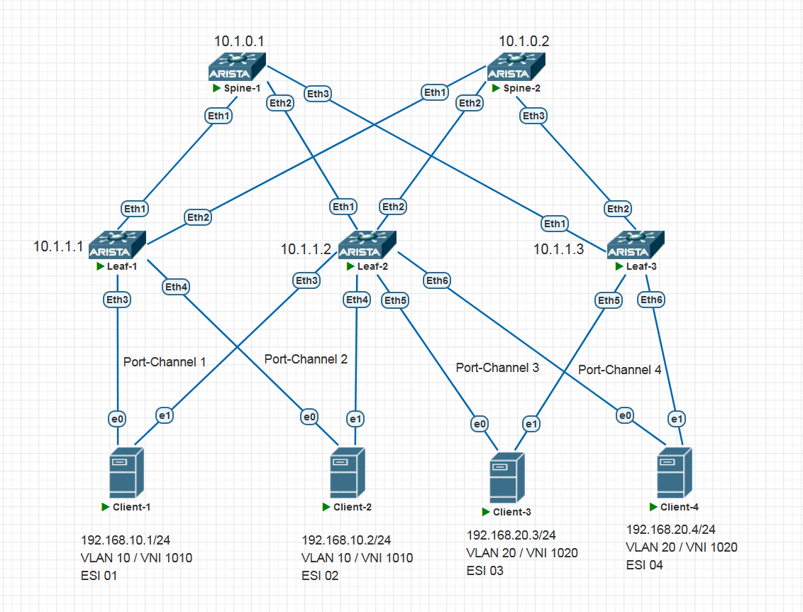
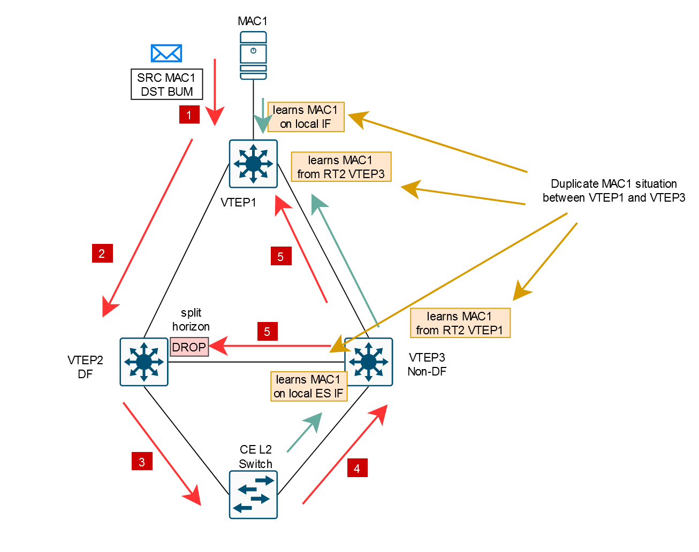
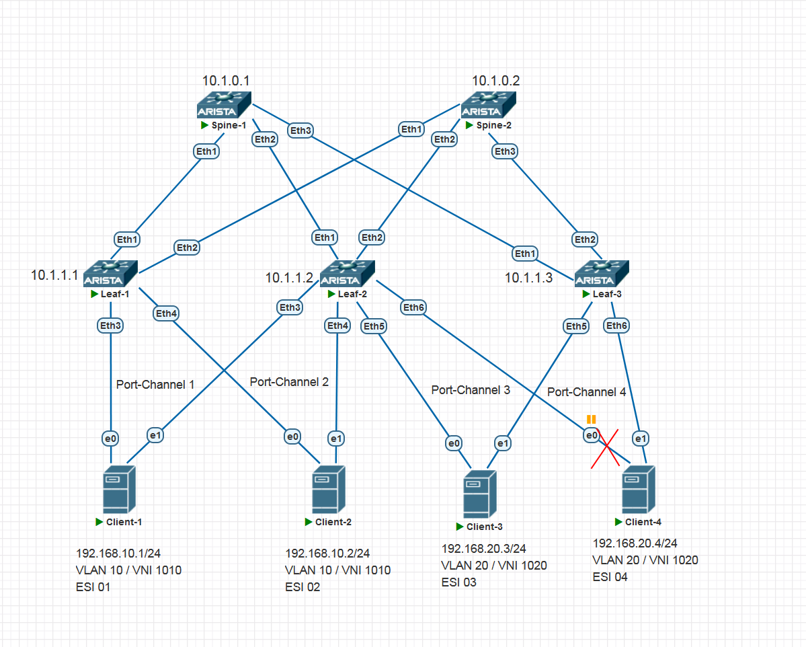
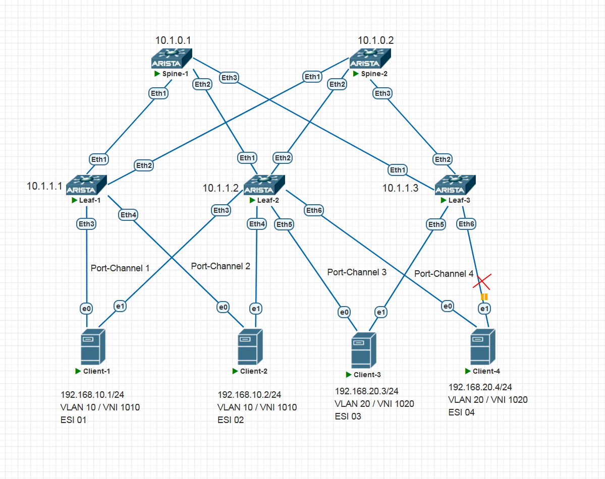

<!-- TOC --><a name="-6-vxlan-evpn-l3"></a>
# Домашнее задание 7 (VxLAN. Аналоги VPC)

<!-- TOC --><a name=""></a>
## Содержание

<!-- TOC start (generated with https://github.com/derlin/bitdowntoc) -->

- [Домашнее задание 6 (VxLAN. Аналоги VPC)](#-6-vxlan-evpn-l3)
   * [Содержание](#)
   * [Цель домашней работы](#-)
   * [Задача](#-1)
   * [Топология](#-2)
   * [Введение](#-3)
   * [IP-план](#ip-)
      + [Loopbacks и ASN на коммутаторах](#loopbacks-asn-)
      + [IRB-интерфейсы на Leaf'ах](#irb-leaf)
      + [Клиенты](#-4)
      + [VXLAN](#vxlan)
   * [План работы](#--1)
      + [Шаги для выполнения работы](#--2)
   * [Выполнение работы](#--3)
      + [Проверка Underlay](#-underlay)
         - [Leaf-1](#leaf-1)
         - [Leaf-2](#leaf-2)
         - [Leaf-3](#leaf-3)
      + [Настройка Spine-1](#-spine-1)
         - [Начальная конфигурация](#--4)
         - [Настройка address-family EVPN](#-address-family-evpn)
      + [Настройка Spine-2](#-spine-2)
      + [Настройка Leaf-1](#-leaf-1)
      + [Настройка Leaf-2](#-leaf-2)
      + [Настройка Leaf-3](#-leaf-3)
      + [Настройка Client-1](#-client-1)
      + [Настройка Client-2](#-client-2)
      + [Настройка Client-3](#-client-3)
      + [Настройка Client-4](#-client-4)
   * [Верификация](#-5)
      + [Верификация Spine-1](#-spine-1-1)
         - [BGP summary](#bgp-summary)
      + [Верификация Spine-2](#-spine-2-1)
         - [BGP summary](#bgp-summary-1)
      + [Верификация Leaf-1](#-leaf-1-1)
         - [BGP Summary](#bgp-summary-2)
         - [BGP EVPN Routes](#bgp-evpn-routes)
            * [Route Type 3 (Inclusive Multicast Ethernet Tag Route)](#route-type-3-inclusive-multicast-ethernet-tag-route)
            * [Route Type 1 (Ethernet A-D Route)](#route-type-1-ethernet-a-d-route)
            * [Route Type 4 (Ethernet Segment Route)](#route-type-4-ethernet-segment-route)
            * [Route Type 2 (MAC Advertisment Route)](#route-type-2-mac-advertisment-route)
         - [VXLAN](#vxlan-1)
         - [Таблица маршрутизации VRF1](#-vrf1)
      + [Верификация Leaf-2](#-leaf-2-1)
         - [BGP Summary](#bgp-summary-3)
         - [BGP EVPN Routes](#bgp-evpn-routes-1)
            * [Route Type 3 (Inclusive Multicast Ethernet Tag Route)](#route-type-3-inclusive-multicast-ethernet-tag-route-1)
            * [Route Type 1 (Ethernet A-D Route)](#route-type-1-ethernet-a-d-route-1)
            * [Route Type 4 (Ethernet Segment Route)](#route-type-4-ethernet-segment-route-1)
            * [Route Type 2 (MAC Advertisment Route)](#route-type-2-mac-advertisment-route-1)
         - [VXLAN](#vxlan-2)
         - [Таблица маршрутизации VRF1](#-vrf1-1)
      + [Верификация Leaf-3](#-leaf-3-1)
         - [BGP Summary](#bgp-summary-4)
         - [BGP EVPN Routes](#bgp-evpn-routes-2)
            * [Route Type 3 (Inclusive Multicast Ethernet Tag Route)](#route-type-3-inclusive-multicast-ethernet-tag-route-2)
            * [Route Type 1 (Ethernet A-D Route)](#route-type-1-ethernet-a-d-route-2)
            * [Route Type 4 (Ethernet Segment Route)](#route-type-4-ethernet-segment-route-2)
            * [Route Type 2 (MAC Advertisment Route)](#route-type-2-mac-advertisment-route-2)
         - [VXLAN](#vxlan-3)
         - [Таблица маршрутизации VRF1](#-vrf1-2)
      + [Верификация связности между клиентами](#--5)
         - [Client-1](#client-1)
         - [Client-2](#client-2)
         - [Client-3](#client-3)
         - [Client-4](#client-4)
      + [Верификация работы Multihoming](#-multihoming)
   * [Итого](#-6)

<!-- TOC end -->

<!-- TOC --><a name="-"></a>
## Цель домашней работы
Закрепление пройденного материала по теме VxLAN. Аналоги VPC.

<!-- TOC --><a name="-1"></a>
## Задача
Настроить отказоустойчивое подключение клиентов с использованием EVPN Multihoming.

<!-- TOC --><a name="-2"></a>
## Топология



<!-- TOC --><a name="-3"></a>
## Введение
В этой домашней работе нам предстоит настроить Overlay-сеть на базе технологии EVPN/VXLAN и обеспечить связность на уровнях 2 и 3 между четырьмя клиентами, находящимися в двух различных MAC-VRF, а также обеспечить резервируемость подключений клиентов с помощью технологии EVPN Multihoming.

Работа будет выполнена на виртуальных нодах на основе Arista vEOS 4.29.2F.

Underlay-сеть и принципы общей настройки Overlay-сети мы возьмем из ДЗ 4, ДЗ 5 и ДЗ 6. То есть будет использоваться схема eBGP Unnumbered (RFC 5549). Она подразумевает, что наши коммутаторы устанавливают друг с другом BGP-соседства без использования статически заданной стыковочной IP-адресации. Соседи находят друг друга по IPv6 Link-local адресам. В конфигурации BGP мы указываем лишь интерфейсы, на которых хотим пириться с соседями.

Модель сервиса EVPN будет использована VLAN-Based, как уже повелось традиционно. Вообще, сейчас, после выполнения нескольких домашних заданий по EVPN, мне эта модель начинает нравиться больше, чем модель VLAN-Aware. Как-то красивее выглядит, когда у нас широковещательный домен уникально представлен конкретным MAC-VRF и EVI в нашей фабрике. И не нужно этой лишней логики в виде полей Ethernet Tag ID, и VTEP'ы маршруты импортируют только для тех VNI, в которых они заинтересованы. В-общем, решил я и дальше действовать по модели VLAN-Based. :)

BUM-трафик будем рассылать с помощью механизма Ingress Replication (копируем BUM-пакеты и рассылаем их юникастом на нужные удаленные VTEP)

Уровень 3 будет настроен следующим образом. Мы будем использовать схему Symmetric IRB. В качестве шлюзов по умолчанию будут использоваться статические anycast-шлюзы по схеме "распределенный шлюз" (distributed gateway). MAC-адреса IRB-интерфейсов также будут Anycast ([RFC 9135, option 1](https://datatracker.ietf.org/doc/html/rfc9135#section-4.1)).

Клиенты будут подключаться двумя отдельными линками к двум разным VTEP'ам. Физические линки будут объединены в LACP-канал. Функциональность Multihoming будет обеспечиваться стандартными средствами EVPN (ESI LAG). Подключение каждого клиента будет идентифицировано собственным ESI.

Резервируемость через MCLAG (vPC, MLAG) мне как-то не зашла после прослушивания лекций. Как-то уж очень костыльно выглядит эта схема, как будто две разных технологии примотали друг к другу скотчем, а потом еще и гвоздями прибили, чтобы скотч не разматывался. Как и модель "Anycast VTEP" совершенно не выглядит элегантной. Родные средства EVPN для мультихоминга смотрятся куда органичнее.

EVPN-мультихоминг мне еще нравится тем, что не требуется отдельный peer-link и нет жесткого ограничения на 2 устройства-члена LAG (хотя, зависит от вендора).

Multihomed-системой со стороны клиента может выступать как L3-узел (сервер, маршрутизатор), так и L2-узел (коммутатор). В том случае, когда клиентской системой является коммутатор, линки, ведущие к VTEP'ам, обязательно должны быть аггрегированы в LAG. Либо же, если LAG использовать не представляется возможным, в конкретном VLAN должен быть одновременно активен только один линк.


Немного оффтопика:

Когда я собирал лабу, меня вдруг заинтересовал вопрос, а что будет, если клиентской системой будет L2-коммутатор, а линки к VTEP'ам не будут объединены в LAG? Я попробовал нарисовать на бумаге, и получилось вот что. При моделировании пути прохождения BUM-пакетов от удаленной системы в сегмент, у меня образовался MAC Flapping между удаленным VTEP'ом и одним из локальных VTEP'ов сегмента.

Иллюстрация: 


Вкратце, получается это так (если я ничего не напутал):

1) Сервер MAC1, находящийся за VTEP-1, а также находящийся в одном VNI с клиентским коммутатором "CE L2 Switch" за VTEP-2 и VTEP-3, создает некий BUM-пакет и отправляет его в свой L2-домен.
2) VTEP-1 реплицирует BUM-пакет на VTEP-2 и VTEP-3.
3) Так как VTEP-3 не является DF для данного ESI/EVI, он отфильтровывает пакет.
4) VTEP-2 передает BUM-пакет в сегмент. Пакет попадает на CE L2 Switch.
5) CE L2 Switch пересылает его в порт, смотрящий в сторону VTEP-3.
6) VTEP-3, очевидно, не может знать, что данный BUM-пакет был порожден не локально в сегменте, а изначально пришел откуда-то с другого конца EVPN-сети, поэтому он радостно выучивает MAC1 как "locally learned MAC" и создает RT-2 маршрут с увеличенным на +1 счетчиком MAC Mobility и анонсирует его в EVPN.
7) VTEP-1, получая RT-2 для MAC1 со стороны VTEP-3, считает, что произошла миграция MAC1 от него за VTEP-3. Где-то в RFC я читал, что VTEP-1, перед тем, как установить новый RT-2 маршрут, полученный от VTEP-3, должен отправить ARP-Request в свой локальный L2-домен, чтобы убедиться, что MAC1 действительно "уехал".
8) MAC1 отвечает на ARP-Request и VTEP-1 снова анонсирует RT-2 маршрут для MAC1.
9) Сервер MAC1 отправляет еще один BUM-пакет и вся ситуация повторяется по кругу...

Интересно было разобрать такое. Теперь понятно, почему схема L2-Switch у клиента с Non-LAG линками к VTEP не выглядит работоспособной - наш клиентский коммутатор будет пересылать BUM-трафик, полученный от одного VTEP, в сторону второго VTEP. А в случае с LAG-каналом этого происходить не будет из-за базового правила L2-пересылки: не пересылаем полученный кадр в порт, с которого мы его получили. А ведь LAG считается одним "портом", хоть и логическим.

Возвращаемся дальше к выполнению задания.

<!-- TOC --><a name="ip-"></a>
## IP-план

<!-- TOC --><a name="loopbacks-asn-"></a>
### Loopbacks и ASN на коммутаторах
Наши Loopback'и и ASN, настроенные на Underlay.

| Устройство | Loopback | ASN   |
| ---------- | -------- | ----- |
| Spine-1    | 10.1.0.1 | 65100 |
| Spine-2    | 10.1.0.2 | 65100 |
| Leaf-1     | 10.1.1.1 | 65001 |
| Leaf-2     | 10.1.1.2 | 65002 |
| Leaf-3     | 10.1.1.3 | 65003 | 

<!-- TOC --><a name="irb-leaf"></a>
### IRB-интерфейсы на Leaf'ах
| Устройство | IRB               | VLAN |
| ---------- | ----------------- | ---- |
| Leaf-1     | 192.168.10.254/24 | 10   |
| Leaf-2     | 192.168.10.254/24 | 10   |
| Leaf-2     | 192.168.20.254/24 | 20   |
| Leaf-3     | 192.168.20.254/24 | 20   |

<!-- TOC --><a name="-4"></a>
### Клиенты
MAC, IP-адреса, VLAN, VNI клиентов, подключенных к Leaf-устройствам.

| Клиент   | MAC (LAG Interface) | IP/Mask         | VLAN |
| -------- | ------------------- | --------------- | ---- |
| Client-1 | 02:00:00:00:01:bb   | 192.168.10.1/24 | 10   |
| Client-2 | 02:00:00:00:02:bb   | 192.168.10.2/24 | 10   |
| Client-3 | 02:00:00:00:03:bb   | 192.168.20.3/24 | 20   |
| Client-4 | 02:00:00:00:04:bb   | 192.168.20.4/24 | 20   |

IP-VRF будет иметь имя VRF1.

<!-- TOC --><a name="vxlan"></a>
### VXLAN
| VLAN | VNI  | RD      | RT     |
| ---- | ---- | ------- | ------ |
| 10   | 1010 | LoIP:10 | 1:1010 |
| 20   | 1020 | LoIP:20 | 1:1020 |

L3VNI для VRF1 будет назначен на VNI 1000, RT будет 1:1000, RD будет LoIP:1000.

### ESI
Идентификаторы ESI и LAG.

| Client   | ESI                      | ES-Import-RT      | LACP System-ID |
| -------- | ------------------------ | ----------------- | -------------- |
| Client-1 | 0000:0000:0000:0000:0001 | 00:00:00:00:00:01 | 02aa.aaaa.0001 |
| Client-2 | 0000:0000:0000:0000:0002 | 00:00:00:00:00:02 | 02aa.aaaa.0002 |
| Client-3 | 0000:0000:0000:0000:0003 | 00:00:00:00:00:03 | 02aa.aaaa.0003 |
| Client-4 | 0000:0000:0000:0000:0004 | 00:00:00:00:00:04 | 02aa.aaaa.0004 | 

<!-- TOC --><a name="--1"></a>
## План работы

<!-- TOC --><a name="--2"></a>
### Шаги для выполнения работы
1. Проверить достижимость loopback'ов с каждого Leaf до каждого Spine и других Leaf. Все должно работать с уже настроенным Underlay.
2. Настроить EVPN-Overlay сеть на Leaf'ах и Spine'ах (MAC-VRF и ESI).
3. Настроить IRB-функциональность на Leaf'ах.
4. Проверить связность между клиентами и резервируемость.

<!-- TOC --><a name="--3"></a>
## Выполнение работы
Я подробно опишу конфигурацию только для Spine-1 и Leaf-1. Все остальные коммутаторы будут настроены максимально похоже и для них будут приведены лишь распечатки нужных команд.

<!-- TOC --><a name="-underlay"></a>
### Проверка Underlay
Давайте кратко проверим пингами работу Underlay. С каждого Leaf выполним пинг каждого Spine и соседних Leaf'ов.

<!-- TOC --><a name="leaf-1"></a>
#### Leaf-1
```
Leaf-1#ping 10.1.0.1 repeat 1
PING 10.1.0.1 (10.1.0.1) 72(100) bytes of data.
80 bytes from 10.1.0.1: icmp_seq=1 ttl=65 time=8.18 ms

Leaf-1#ping 10.1.0.2 repeat 1
PING 10.1.0.2 (10.1.0.2) 72(100) bytes of data.
80 bytes from 10.1.0.2: icmp_seq=1 ttl=65 time=8.80 ms

Leaf-1#ping 10.1.1.1 repeat 1
PING 10.1.1.1 (10.1.1.1) 72(100) bytes of data.
80 bytes from 10.1.1.1: icmp_seq=1 ttl=64 time=0.182 ms

Leaf-1#ping 10.1.1.3 repeat 1
PING 10.1.1.3 (10.1.1.3) 72(100) bytes of data.
80 bytes from 10.1.1.3: icmp_seq=1 ttl=64 time=11.9 ms
```

<!-- TOC --><a name="leaf-2"></a>
#### Leaf-2
```
Leaf-2#ping 10.1.0.1 repeat 1
PING 10.1.0.1 (10.1.0.1) 72(100) bytes of data.
80 bytes from 10.1.0.1: icmp_seq=1 ttl=65 time=4.57 ms

Leaf-2#ping 10.1.0.2 repeat 1
PING 10.1.0.2 (10.1.0.2) 72(100) bytes of data.
80 bytes from 10.1.0.2: icmp_seq=1 ttl=65 time=7.29 ms

Leaf-2#ping 10.1.1.1 repeat 1
PING 10.1.1.1 (10.1.1.1) 72(100) bytes of data.
80 bytes from 10.1.1.1: icmp_seq=1 ttl=64 time=17.1 ms

Leaf-2#ping 10.1.1.3 repeat 1
PING 10.1.1.3 (10.1.1.3) 72(100) bytes of data.
80 bytes from 10.1.1.3: icmp_seq=1 ttl=64 time=12.5 ms
```

<!-- TOC --><a name="leaf-3"></a>
#### Leaf-3
```
Leaf-3#ping 10.1.0.1 repeat 1
PING 10.1.0.1 (10.1.0.1) 72(100) bytes of data.
80 bytes from 10.1.0.1: icmp_seq=1 ttl=65 time=8.42 ms

Leaf-3#ping 10.1.0.2 repeat 1
PING 10.1.0.2 (10.1.0.2) 72(100) bytes of data.
80 bytes from 10.1.0.2: icmp_seq=1 ttl=65 time=7.07 ms

Leaf-3#ping 10.1.1.1 repeat 1
PING 10.1.1.1 (10.1.1.1) 72(100) bytes of data.
80 bytes from 10.1.1.1: icmp_seq=1 ttl=64 time=10.7 ms

Leaf-3#ping 10.1.1.2 repeat 1
PING 10.1.1.2 (10.1.1.2) 72(100) bytes of data.
80 bytes from 10.1.1.2: icmp_seq=1 ttl=64 time=13.1 ms
```

Все выглядит хорошо. Переходим к настройкам EVPN.

<!-- TOC --><a name="-spine-1"></a>
### Настройка Spine-1

<!-- TOC --><a name="--4"></a>
#### Начальная конфигурация
Приведу начальную настройку (с настроенным Underlay). Все остальные настройки будут касаться исключительно целей текущего ДЗ.
```
service routing protocols model multi-agent
!
hostname Spine-1
!
interface Ethernet1
   description Link_to_Leaf-1
   no switchport
   ipv6 enable
!
interface Ethernet2
   description Link_to_Leaf-2
   no switchport
   ipv6 enable
!
interface Ethernet3
   description Link_to_Leaf-3
   no switchport
   ipv6 enable
!
interface Ethernet4
   shutdown
!
interface Ethernet5
   shutdown
!
interface Ethernet6
   shutdown
!
interface Ethernet7
   shutdown
!
interface Loopback0
   ip address 10.1.0.1/32
!
ip routing ipv6 interfaces
!
ipv6 unicast-routing
!
route-map BGP_REDISTRIBUTE_CONNECTED permit 10
   match interface Loopback0
!
peer-filter LEAFS
   10 match as-range 65001-65006 result accept
!
router bgp 65100
   maximum-paths 64
   neighbor CLOS peer group
   neighbor CLOS out-delay 0
   neighbor CLOS bfd
   neighbor CLOS timers 3 9
   neighbor CLOS password OTUS
   redistribute connected route-map BGP_REDISTRIBUTE_CONNECTED
   neighbor interface Et1-6 peer-group CLOS peer-filter LEAFS
   !
   address-family ipv4
      neighbor CLOS activate
      neighbor CLOS next-hop address-family ipv6 originate
!
end
```

<!-- TOC --><a name="-address-family-evpn"></a>
#### Настройка address-family EVPN
В принципе, вся настройка на Spine сведется к активации address-family и включению отсылки расширенных комьюнити, которые нам необходимы для передачи route-target'ов, которые из себя и представляют эти самые extended community. Без RT ни один Leaf не установит информацию из маршрутов в свои MAC-VRF и IP-VRF, так как именно по RT определяется, какому VRF должна принадлежать данная маршрутная информация.

```
Spine-1(config)# router bgp 65100
Spine-1(config-router-bgp)# neighbor CLOS send-community extended
Spine-1(config-router-bgp)# address-family evpn
Spine-1(config-router-bgp-af)# neighbor CLOS activate
```

Всё :) Настраиваем Spine-2 по такой же схеме.

<!-- TOC --><a name="-spine-2"></a>
### Настройка Spine-2
Начальная конфигурация из ДЗ-4:
```
service routing protocols model multi-agent
!
hostname Spine-2
!
interface Ethernet1
   description Link_to_Leaf-1
   no switchport
   ipv6 enable
!
interface Ethernet2
   description Link_to_Leaf-2
   no switchport
   ipv6 enable
!
interface Ethernet3
   description Link_to_Leaf-3
   no switchport
   ipv6 enable
!
interface Ethernet4
   shutdown
!
interface Ethernet5
   shutdown
!
interface Ethernet6
   shutdown
!
interface Ethernet7
   shutdown
!
interface Loopback0
   ip address 10.1.0.2/32
!
ip routing ipv6 interfaces
!
ipv6 unicast-routing
!
route-map BGP_REDISTRIBUTE_CONNECTED permit 10
   match interface Loopback0
!
peer-filter LEAFS
   10 match as-range 65001-65006 result accept
!
router bgp 65100
   maximum-paths 64
   neighbor CLOS peer group
   neighbor CLOS out-delay 0
   neighbor CLOS bfd
   neighbor CLOS timers 3 9
   neighbor CLOS password OTUS
   redistribute connected route-map BGP_REDISTRIBUTE_CONNECTED
   neighbor interface Et1-6 peer-group CLOS peer-filter LEAFS
   !
   address-family ipv4
      neighbor CLOS activate
      neighbor CLOS next-hop address-family ipv6 originate
!
end
```

Касательно настроек EVPN, здесь всё так же, как и для Spine-1. 

```
Spine-2(config)# router bgp 65100
Spine-2(config-router-bgp)# neighbor CLOS send-community extended
Spine-2(config-router-bgp)# address-family evpn
Spine-2(config-router-bgp-af)# neighbor CLOS activate
```

<!-- TOC --><a name="-leaf-1"></a>
### Настройка Leaf-1
Начальная конфигурация из ДЗ-4:
```
service routing protocols model multi-agent
!
hostname Leaf-1
!
interface Ethernet1
   description Link_to_Spine-1
   no switchport
   ipv6 enable
!
interface Ethernet2
   description Link_to_Spine-2
   no switchport
   ipv6 enable
!
interface Ethernet3
   shutdown
!
interface Ethernet4
   shutdown
!
interface Ethernet5
   shutdown
!
interface Ethernet6
   shutdown
!
interface Ethernet7
   shutdown
!
interface Loopback0
   ip address 10.1.1.1/32
!
ip routing ipv6 interfaces
!
ipv6 unicast-routing
!
route-map BGP_REDISTRIBUTE_CONNECTED permit 10
   match interface Loopback0
!
router bgp 65001
   maximum-paths 64
   neighbor CLOS peer group
   neighbor CLOS out-delay 0
   neighbor CLOS bfd
   neighbor CLOS timers 3 9
   neighbor CLOS password OTUS
   redistribute connected route-map BGP_REDISTRIBUTE_CONNECTED
   neighbor interface Et1-2 peer-group CLOS remote-as 65100
   !
   address-family ipv4
      neighbor CLOS activate
      neighbor CLOS next-hop address-family ipv6 originate
!
end
```

А вот настройка EVPN на Leaf'ах уже будет интересной. Давайте пойдем по шагам, чтобы ничего не упустить.

Создадим VLAN 10 для клиентов:
```
vlan 10
   name Clients_10
```

Создадим VRF для клиентов:
```
vrf instance VRF1
```

Создадим LAG-интерфейсы, которые будут смотреть в сторону клиентов. В сторону каждого из клиентов на этом лифе будет смотреть одна нога (вторая будет на соседнем Leaf'е - ведь у нас ESI LAG).
```
interface Port-Channel1
   description Link_to_Client-1
   switchport access vlan 10
   !
   evpn ethernet-segment
      identifier 0000:0000:0000:0000:0001
      route-target import 00:00:00:00:00:01
   lacp system-id 02aa.aaaa.0001
!
interface Port-Channel2
   description Link_to_Client-2
   switchport access vlan 10
   !
   evpn ethernet-segment
      identifier 0000:0000:0000:0000:0002
      route-target import 00:00:00:00:00:02
   lacp system-id 02aa.aaaa.0002
```
Помимо перевода интерфейса в режим VLAN 10 Untagged, мы здесь задаем MAC-адрес LACP-канала. Он должен быть одинаковым на обоих Leaf'ах-членах Port-Channel'а. Это нужно для того, чтобы клиент считал, что оба его LAG-линка ведут к одному устройству (он ведь ничего не знает ни про какие ESI LAG, для него канал выглядит как совершенно обычный агрегированный канал).

Также в этой секции мы задаем две важные настройки ESI: идентификатор сегмента и Route-target сегмента. Идентификатор сегмента будет уникально идентифицировать данный линк как часть набора линков, ведущих к одной и той же клиентской multihomed-системе. Благодаря ненулевому идентификатору сегмента наши VTEP'ы будут четко понимать, кто еще из EVPN-пиров смотрит в этот же сегмент, или, другими словами, подключен к этой же клиентской системе.

На основе этого идентификатора сегмента будет сгенерирован маршрут RT-1 (Ethernet Auto-discovery), который будет использоваться VTEP'ами для обнаружения соседей, смотрящих в этот же сегмент, для предотвращения закольцовывания BUM-трафика и для ECMP. ECMP означает следующее: неважно, с какого VTEP'а был получен RT-2 маршрут: другие VTEP'ы в фабрике будут знать, что трафик до конкретной системы в конкретном Ethernet-сегменте можно отправить на _любой_ VTEP, имеющий подключение к этому же самому Ethernet-сегменту. Такое поведение называется Aliasing.

Также в этой секции мы задаем ES-Import Route Target. Задание этого комьюнити требуется для генерации и приема маршрутов RT-4 (Ethernet Segment Route). Благодаря этому комьюнити VTEP'ы, подключенные к одному ESI, будут импортировать маршруты RT-4 для этого сегмента. Вообще по идее значение должно генерироваться автоматически на основе ESI, но у меня на Аристе почему-то потребовалось явное указание ES-Import RT.

Вообще маршрут RT-4 нужен для того, чтобы VTEP'ы, подключенные к одному сегменту, смогли выбрать Designated Forwarder'а, то есть VTEP, которому будет разрешено пересылать BUM-трафик **в ES-сегмент** (нужно для предотвращения дублирования BUM-трафика в сторону клиентской системы, ведь все VTEP'ы, подключенные к сегменту, получат по копии BUM-трафика, и в обычной ситуации отправили бы свои копии BUM-пакета в сторону клиента).

Здесь особенно важно помнить, что VTEP'ы, не являющиеся DF, не имеют права отправлять трафик **в сегмент**, но на BUM-трафик, полученный **из сегмента**, подобных ограничений не налагается, и он может быть передан без какой-бы то ни было оглядки на статус DF/Non-DF. Более того, существует еще правило, называемое "локальным предпочтением" (local bias). Оно гласит (если я правильно его понял), что VTEP имеет право пересылать BUM-трафик, полученный с собственных физических access-портов, в локально подключенный ESI-сегмент **вне зависимости от своего статуса DF/Non-DF**. Что, в-общем-то, логично. Зачем гонять трафик по фабрике, когда мы физически подключены к сегменту назначения, а трафик, который нужно переслать в сегмент, был порожден нашими же локальными клиентами?

На этом настройки, связанные непосредственно с Multihoming, закончены :). Идем дальше. У нас еще впереди поднятие третьего уровня и пара мелочей.

Назначим физические линки к клиентам в Port-Channel'ы (сделаем их членами LAG):
```
interface Ethernet3
   description Link_to_Client-1
   channel-group 1 mode active
!
interface Ethernet4
   description Link_to_Client-2
   channel-group 2 mode active
```
mode active означает, что мы будем активно пытаться установить LACP-соседство вместо того, чтобы пассивно ожидать, пока нас позовут его оформить с другой стороны :).

IRB-интерфейс, нужно для обеспечения маршрутизации из нашего VNI. Задаем IP-адрес шлюза по умолчанию (он же Static Anycast Gateway). Этот интерфейс назначаем в наш VRF1:
```
interface Vlan10
   vrf VRF1
   ip address virtual 192.168.10.254/24
```

Настраиваем VXLAN. Указываем, откуда брать Source IP для VXLAN-пакетов (с Loopback'а), задаем соответствие vlan 10 и vni 1010. Создаем L3VNI путем назначения VRF1 на "виэнайку" 1000.
```
interface Vxlan1
   vxlan source-interface Loopback0
   vxlan vlan 10 vni 1010
   vxlan vrf VRF1 vni 1000
```

Зададим anycast-MAC для наших IRB-интерфейсов. В нашей схеме Anycast IP/Anycast MAC он должен быть одинаковым на всех IRB-интерфейсах конкретного VNI:
```
ip virtual-router mac-address 02:aa:aa:aa:aa:aa
```

Включим маршрутизацию для VRF1:
```
ip routing vrf VRF1
```

Включим отсылку расширенных комьюнити для EVPN (Route Target'ы, всякие Router's MAC'и и т.д.)
```
router bgp 65001
neighbor CLOS send-community extended
```

Пропишем для нашего MAC-VRF для VLAN 10 соответствующий RD и RT (RD, точнее, не пропишем, а прикажем Аристе генерировать его автоматически). Включим распространение информации о локально подключенных хостах в EVPN с помощью команды redistribute learned.
```
router bgp 65001
   !
   vlan 10
      rd auto
      route-target both 1:1010
      redistribute learned
```

Активируем AFI/SAFI EVPN для нашего процесса MP-BGP:
```
router bgp 65001
   address-family evpn
      neighbor CLOS activate
```

Ну и последнее - зададим RD и RT для нашей L3VNI.
```
router bgp 65001
   vrf VRF1
      rd 10.1.1.1:1000
      route-target import evpn 1:1000
      route-target export evpn 1:1000
```

Общий вид настроек, которые мы только что произвели:
```
vlan 10
   name Clients_10
!
vrf instance VRF1
!
interface Port-Channel1
   description Link_to_Client-1
   switchport access vlan 10
   !
   evpn ethernet-segment
      identifier 0000:0000:0000:0000:0001
      route-target import 00:00:00:00:00:01
   lacp system-id 02aa.aaaa.0001
!
interface Port-Channel2
   description Link_to_Client-2
   switchport access vlan 10
   !
   evpn ethernet-segment
      identifier 0000:0000:0000:0000:0002
      route-target import 00:00:00:00:00:02
   lacp system-id 02aa.aaaa.0002
!
interface Ethernet1
   description Link_to_Spine-1
   no switchport
   ipv6 enable
!
interface Ethernet2
   description Link_to_Spine-2
   no switchport
   ipv6 enable
!
interface Ethernet3
   description Link_to_Client-1
   channel-group 1 mode active
   no shutdown
!
interface Ethernet4
   description Link_to_Client-2
   channel-group 2 mode active
   no shutdown
!
interface Vlan10
   vrf VRF1
   ip address virtual 192.168.10.254/24
!
interface Vxlan1
   vxlan source-interface Loopback0
   vxlan udp-port 4789
   vxlan vlan 10 vni 1010
   vxlan vrf VRF1 vni 1000
!
ip virtual-router mac-address 02:aa:aa:aa:aa:aa
!
ip routing vrf VRF1
!

router bgp 65001
   neighbor CLOS send-community extended
   !
   vlan 10
      rd auto
      route-target both 1:1010
      redistribute learned
   !
   address-family evpn
      neighbor CLOS activate
   !
   vrf VRF1
      rd 10.1.1.1:1000
      route-target import evpn 1:1000
      route-target export evpn 1:1000
```

Всё. Остальные коммутаторы Leaf настраиваем по той же схеме. Буду приводить только финальные настройки EVPN, чтобы не дублировать информацию.

<!-- TOC --><a name="-leaf-2"></a>
### Настройка Leaf-2
Начальная конфигурация:
```
service routing protocols model multi-agent
!
hostname Leaf-2
!
interface Ethernet1
   description Link_to_Spine-1
   no switchport
   ipv6 enable
!
interface Ethernet2
   description Link_to_Spine-2
   no switchport
   ipv6 enable
!
interface Ethernet3
   shutdown
!
interface Ethernet4
   shutdown
!
interface Ethernet5
   shutdown
!
interface Ethernet6
   shutdown
!
interface Ethernet7
   shutdown
!
interface Loopback0
   ip address 10.1.1.2/32
!
ip routing ipv6 interfaces
!
ipv6 unicast-routing
!
route-map BGP_REDISTRIBUTE_CONNECTED permit 10
   match interface Loopback0
!
router bgp 65002
   maximum-paths 64
   neighbor CLOS peer group
   neighbor CLOS out-delay 0
   neighbor CLOS bfd
   neighbor CLOS timers 3 9
   neighbor CLOS password OTUS
   redistribute connected route-map BGP_REDISTRIBUTE_CONNECTED
   neighbor interface Et1-2 peer-group CLOS remote-as 65100
   !
   address-family ipv4
      neighbor CLOS activate
      neighbor CLOS next-hop address-family ipv6 originate
!
end
```

Конфигурация EVPN:
```
vlan 10
   name Clients_10
!
vlan 20
   name Clients_20
!
vrf instance VRF1
!
interface Port-Channel1
   description Link_to_Client-1
   switchport access vlan 10
   !
   evpn ethernet-segment
      identifier 0000:0000:0000:0000:0001
      route-target import 00:00:00:00:00:01
   lacp system-id 02aa.aaaa.0001
!
interface Port-Channel2
   description Link_to_Client-2
   switchport access vlan 10
   !
   evpn ethernet-segment
      identifier 0000:0000:0000:0000:0002
      route-target import 00:00:00:00:00:02
   lacp system-id 02aa.aaaa.0002
!
interface Port-Channel3
   description Link_to_Client-3
   switchport access vlan 20
   !
   evpn ethernet-segment
      identifier 0000:0000:0000:0000:0003
   lacp system-id 02aa.aaaa.0003
!
interface Port-Channel4
   description Link_to_Client-4
   switchport access vlan 20
   !
   evpn ethernet-segment
      identifier 0000:0000:0000:0000:0004
   lacp system-id 02aa.aaaa.0004
!
interface Ethernet1
   description Link_to_Spine-1
   no switchport
   ipv6 enable
!
interface Ethernet2
   description Link_to_Spine-2
   no switchport
   ipv6 enable
!
interface Ethernet3
   description Link_to_Client-1
   channel-group 1 mode active
   no shutdown
!
interface Ethernet4
   description Link_to_Client-2
   channel-group 2 mode active
   no shutdown
!
interface Ethernet5
   description Link_to_Client-3
   channel-group 3 mode active
   no shutdown
!
interface Ethernet6
   description Link_to_Client-4
   channel-group 4 mode active
   no shutdown
!
interface Vlan10
   vrf VRF1
   ip address virtual 192.168.10.254/24
!
interface Vlan20
   vrf VRF1
   ip address virtual 192.168.20.254/24
!
interface Vxlan1
   vxlan source-interface Loopback0
   vxlan vlan 10 vni 1010
   vxlan vlan 20 vni 1020
   vxlan vrf VRF1 vni 1000
!
ip virtual-router mac-address 02:aa:aa:aa:aa:aa
!
ip routing vrf VRF1
!
router bgp 65002
   neighbor CLOS send-community extended
   !
   vlan 10
      rd auto
      route-target both 1:1010
      redistribute learned
   !
   vlan 20
      rd auto
      route-target both 1:1020
      redistribute learned
   !
   address-family evpn
      neighbor CLOS activate
   !
   vrf VRF1
      rd 10.1.1.1:1000
      route-target import evpn 1:1000
      route-target export evpn 1:1000
```

<!-- TOC --><a name="-leaf-3"></a>
### Настройка Leaf-3
Начальная конфигурация:
```
service routing protocols model multi-agent
!
hostname Leaf-3
!
interface Ethernet1
   description Link_to_Spine-1
   no switchport
   ipv6 enable
!
interface Ethernet2
   description Link_to_Spine-2
   no switchport
   ipv6 enable
!
interface Ethernet3
   shutdown
!
interface Ethernet4
   shutdown
!
interface Ethernet5
   shutdown
!
interface Ethernet6
   shutdown
!
interface Ethernet7
   shutdown
!
interface Loopback0
   ip address 10.1.1.3/32
!
ip routing ipv6 interfaces
!
ipv6 unicast-routing
!
route-map BGP_REDISTRIBUTE_CONNECTED permit 10
   match interface Loopback0
!
router bgp 65003
   maximum-paths 64
   neighbor CLOS peer group
   neighbor CLOS out-delay 0
   neighbor CLOS bfd
   neighbor CLOS timers 3 9
   neighbor CLOS password OTUS
   redistribute connected route-map BGP_REDISTRIBUTE_CONNECTED
   neighbor interface Et1-2 peer-group CLOS remote-as 65100
   !
   address-family ipv4
      neighbor CLOS activate
      neighbor CLOS next-hop address-family ipv6 originate
!
end
```

Настройки EVPN:
```
vlan 20
   name Clients_20
!
vrf instance VRF1
!
interface Port-Channel3
   description Link_to_Client-3
   switchport access vlan 20
   !
   evpn ethernet-segment
      identifier 0000:0000:0000:0000:0003
      route-target import 00:00:00:00:00:03
   lacp system-id 02aa.aaaa.0003
!
interface Port-Channel4
   description Link_to_Client-4
   switchport access vlan 20
   !
   evpn ethernet-segment
      identifier 0000:0000:0000:0000:0004
      route-target import 00:00:00:00:00:04
   lacp system-id 02aa.aaaa.0004
!
interface Ethernet1
   description Link_to_Spine-1
   no switchport
   ipv6 enable
!
interface Ethernet2
   description Link_to_Spine-2
   no switchport
   ipv6 enable
!
interface Ethernet5
   description Link_to_Client-3
   channel-group 3 mode active
   no shutdown
!
interface Ethernet6
   description Link_to_Client-4
   channel-group 4 mode active
   no shutdown
!
interface Vlan20
   vrf VRF1
   ip address virtual 192.168.20.254/24
!
interface Vxlan1
   vxlan source-interface Loopback0
   vxlan vlan 20 vni 1020
   vxlan vrf VRF1 vni 1000
!
ip virtual-router mac-address 02:aa:aa:aa:aa:aa
!
ip routing vrf VRF1
!
router bgp 65003
   neighbor CLOS send-community extended
   !
   vlan 20
      rd auto
      route-target both 1:1020
      redistribute learned
   !
   address-family evpn
      neighbor CLOS activate
   !
   vrf VRF1
      rd 10.1.1.1:1000
      route-target import evpn 1:1000
      route-target export evpn 1:1000
```

Приведу еще настройки клиентов. Тут ничего необычного - виртуалки на основе Ubuntu Server, настройки выполнены через стандартный механизм Netplan, создан LACP LAG на двух интерфейсах, смотрящих в разные VTEP'ы.
<!-- TOC --><a name="-client-1"></a>
### Настройка Client-1
```
network:
  ethernets:
    eports:
      match:
        name: ens*
      optional: true

  bonds:
    bond0:
      interfaces: [eports]
      addresses: [192.168.10.1/24]
      macaddress: 02:00:00:00:01:bb
      parameters:
        mode: 802.3ad
      routes:
       - to: default
         via: 192.168.10.254
        
  version: 2
  ```

<!-- TOC --><a name="-client-2"></a>
### Настройка Client-2
```
network:
  ethernets:
    eports:
      match:
        name: ens*
      optional: true

  bonds:
    bond0:
      interfaces: [eports]
      addresses: [192.168.10.2/24]
      macaddress: 02:00:00:00:02:bb
      parameters:
        mode: 802.3ad
      routes:
       - to: default
         via: 192.168.10.254
        
  version: 2
  ```

<!-- TOC --><a name="-client-3"></a>
### Настройка Client-3
```
network:
  ethernets:
    eports:
      match:
        name: ens*
      optional: true

  bonds:
    bond0:
      interfaces: [eports]
      addresses: [192.168.20.3/24]
      macaddress: 02:00:00:00:03:bb
      parameters:
        mode: 802.3ad
      routes:
       - to: default
         via: 192.168.20.254
        
  version: 2
  ```

<!-- TOC --><a name="-client-4"></a>
### Настройка Client-4
```
network:
  ethernets:
    eports:
      match:
        name: ens*
      optional: true

  bonds:
    bond0:
      interfaces: [eports]
      addresses: [192.168.20.4/24]
      macaddress: 02:00:00:00:04:bb
      parameters:
        mode: 802.3ad
      routes:
       - to: default
         via: 192.168.20.254
        
  version: 2
  ```

<!-- TOC --><a name="-5"></a>
## Верификация
Предлагаю не проверять сейчас каждую мелочь (L2/L3 были проверены в предыдущих ДЗ). Сейчас верифицируем только основной статус BGP (соседство), проверим маршруты, разберем, все ли в порядке с нашими ESI, а потом проверим пингами доступность всех клиентов друг для друга. И напоследок - погасим по очереди один и другой линк на одном из клиентов и проверим, будет ли отрабатывать переход трафика с упавшего линка на уцелевший.

С учетом того, что Spine с точки зрения мультихоминга нас особо не интересуют, ограничимся только самыми общими проверками.
<!-- TOC --><a name="-spine-1-1"></a>
### Верификация Spine-1
<!-- TOC --><a name="bgp-summary"></a>
#### BGP summary
```
Spine-1#show bgp summary 
BGP summary information for VRF default
Router identifier 10.1.0.1, local AS number 65100
Neighbor                               AS Session State AFI/SAFI                AFI/SAFI State   NLRI Rcd   NLRI Acc
----------------------------- ----------- ------------- ----------------------- -------------- ---------- ----------
fe80::5255:aaff:fe38:6360%Et2       65002 Established   IPv4 Unicast            Negotiated              1          1
fe80::5255:aaff:fe38:6360%Et2       65002 Established   L2VPN EVPN              Negotiated             20         20
fe80::525d:31ff:fe1f:e784%Et1       65001 Established   IPv4 Unicast            Negotiated              1          1
fe80::525d:31ff:fe1f:e784%Et1       65001 Established   L2VPN EVPN              Negotiated             11         11
fe80::52fc:b9ff:fe4f:4120%Et3       65003 Established   IPv4 Unicast            Negotiated              1          1
fe80::52fc:b9ff:fe4f:4120%Et3       65003 Established   L2VPN EVPN              Negotiated             11         11
```
Все в порядке. С каждым соседом у нас установлена сессия в L2VPN EVPN.

<!-- TOC --><a name="-spine-2-1"></a>
### Верификация Spine-2
<!-- TOC --><a name="bgp-summary-1"></a>
#### BGP summary
```
Spine-2#show bgp summary
BGP summary information for VRF default
Router identifier 10.1.0.2, local AS number 65100
Neighbor                               AS Session State AFI/SAFI                AFI/SAFI State   NLRI Rcd   NLRI Acc
----------------------------- ----------- ------------- ----------------------- -------------- ---------- ----------
fe80::5255:aaff:fe38:6360%Et2       65002 Established   IPv4 Unicast            Negotiated              1          1
fe80::5255:aaff:fe38:6360%Et2       65002 Established   L2VPN EVPN              Negotiated             20         20
fe80::525d:31ff:fe1f:e784%Et1       65001 Established   IPv4 Unicast            Negotiated              1          1
fe80::525d:31ff:fe1f:e784%Et1       65001 Established   L2VPN EVPN              Negotiated             11         11
fe80::52fc:b9ff:fe4f:4120%Et3       65003 Established   IPv4 Unicast            Negotiated              1          1
fe80::52fc:b9ff:fe4f:4120%Et3       65003 Established   L2VPN EVPN              Negotiated             11         11
```
Все в порядке. С каждым соседом у нас установлена сессия в L2VPN EVPN.

<!-- TOC --><a name="-leaf-1-1"></a>
### Верификация Leaf-1

Давайте в первую очередь проверим состояние LAG'ов для наших клиентов:
```
Leaf-1#show lacp 1 peer
State: A = Active, P = Passive; S=ShortTimeout, L=LongTimeout;
       G = Aggregable, I = Individual; s+=InSync, s-=OutOfSync;
       C = Collecting, X = state machine expired,
       D = Distributing, d = default neighbor state
                 |                        Partner                              
 Port    Status  | Sys-id                    Port#   State     OperKey  PortPri
------ ----------|------------------------- ------- --------- --------- -------
Port Channel Port-Channel1:                                            
 Et3     Bundled | FFFF,02-00-00-00-01-bb        2   ALGs+CD    0x0009      255

Leaf-1#show lacp 2 peer
State: A = Active, P = Passive; S=ShortTimeout, L=LongTimeout;
       G = Aggregable, I = Individual; s+=InSync, s-=OutOfSync;
       C = Collecting, X = state machine expired,
       D = Distributing, d = default neighbor state
                 |                        Partner                              
 Port    Status  | Sys-id                    Port#   State     OperKey  PortPri
------ ----------|------------------------- ------- --------- --------- -------
Port Channel Port-Channel2:                                            
 Et4     Bundled | FFFF,02-00-00-00-02-bb        2   ALGs+CD    0x0009      255
```
Тут вроде бы все в порядке. Мы видим наших клиентов, состояние портов Up.

<!-- TOC --><a name="bgp-summary-2"></a>
#### BGP Summary
```
Leaf-1#show bgp summary 
BGP summary information for VRF default
Router identifier 10.1.1.1, local AS number 65001
Neighbor                               AS Session State AFI/SAFI                AFI/SAFI State   NLRI Rcd   NLRI Acc
----------------------------- ----------- ------------- ----------------------- -------------- ---------- ----------
fe80::522e:8aff:fe07:b3f5%Et1       65100 Established   IPv4 Unicast            Negotiated              3          3
fe80::522e:8aff:fe07:b3f5%Et1       65100 Established   L2VPN EVPN              Negotiated             31         31
fe80::5290:ceff:fec1:219%Et2        65100 Established   IPv4 Unicast            Negotiated              3          3
fe80::5290:ceff:fec1:219%Et2        65100 Established   L2VPN EVPN              Negotiated             31         31
```
Сессии у нас установлены только со Spine-ами, в обоих AF - IPv4 Unicast и в L2VPN EVPN.

<!-- TOC --><a name="bgp-evpn-routes"></a>
#### BGP EVPN Routes
Так как маршрутов очень много, давайте посмотрим их по отдельности.

<!-- TOC --><a name="route-type-3-inclusive-multicast-ethernet-tag-route"></a>
##### Route Type 3 (Inclusive Multicast Ethernet Tag Route)
```
Leaf-1#show bgp evpn route-type imet
BGP routing table information for VRF default
Router identifier 10.1.1.1, local AS number 65001
Route status codes: * - valid, > - active, S - Stale, E - ECMP head, e - ECMP
                    c - Contributing to ECMP, % - Pending BGP convergence
Origin codes: i - IGP, e - EGP, ? - incomplete
AS Path Attributes: Or-ID - Originator ID, C-LST - Cluster List, LL Nexthop - Link Local Nexthop

          Network                Next Hop              Metric  LocPref Weight  Path
 * >      RD: 10.1.1.1:10 imet 10.1.1.1
                                 -                     -       -       0       i
 * >Ec    RD: 10.1.1.2:10 imet 10.1.1.2
                                 10.1.1.2              -       100     0       65100 65002 i
 *  ec    RD: 10.1.1.2:10 imet 10.1.1.2
                                 10.1.1.2              -       100     0       65100 65002 i
 * >Ec    RD: 10.1.1.2:20 imet 10.1.1.2
                                 10.1.1.2              -       100     0       65100 65002 i
 *  ec    RD: 10.1.1.2:20 imet 10.1.1.2
                                 10.1.1.2              -       100     0       65100 65002 i
 * >Ec    RD: 10.1.1.3:20 imet 10.1.1.3
                                 10.1.1.3              -       100     0       65100 65003 i
 *  ec    RD: 10.1.1.3:20 imet 10.1.1.3
                                 10.1.1.3              -       100     0       65100 65003 i
```
IMET-маршруты мы должны увидеть от каждого VTEP'а для каждого VNI. Тут в принципе все предсказуемо - один IMET мы генерируем сами (VNI 1010), две штуки получаем от Leaf-2 (10.1.1.2) - ведь у него настроены VNI 1010 и VNI 1020. Подробней тут смотреть не вижу смысла. А, ну и ECMP тоже присутствует, как и должно быть - у нас ведь два Spine, через которые мы ходим до других Leaf'ов.

<!-- TOC --><a name="route-type-1-ethernet-a-d-route"></a>
##### Route Type 1 (Ethernet A-D Route)
Вот тут посмотрим поподробнее. VTEP'ы должны сгенерировать по одному маршруту RT-1 для каждого EVI и еще один RT-1 общий для Ethernet-сегмента (без привязки к EVI).

```
Leaf-1#show bgp evpn route-type auto-discovery detail 
BGP routing table information for VRF default
Router identifier 10.1.1.1, local AS number 65001
BGP routing table entry for auto-discovery 0 0000:0000:0000:0000:0001, Route Distinguisher: 10.1.1.1:10
 Paths: 1 available
  Local
    - from - (0.0.0.0)
      Origin IGP, metric -, localpref -, weight 0, tag 0, valid, local, best
      Extended Community: Route-Target-AS:1:1010 TunnelEncap:tunnelTypeVxlan
      VNI: 1010
BGP routing table entry for auto-discovery 0 0000:0000:0000:0000:0001, Route Distinguisher: 10.1.1.2:10
 Paths: 2 available
  65100 65002
    10.1.1.2 from fe80::5290:ceff:fec1:219%Et2 (10.1.0.2)
      Origin IGP, metric -, localpref 100, weight 0, tag 0, valid, external, ECMP head, ECMP, best, ECMP contributor
      Extended Community: Route-Target-AS:1:1010 TunnelEncap:tunnelTypeVxlan
      VNI: 1010
  65100 65002
    10.1.1.2 from fe80::522e:8aff:fe07:b3f5%Et1 (10.1.0.1)
      Origin IGP, metric -, localpref 100, weight 0, tag 0, valid, external, ECMP, ECMP contributor
      Extended Community: Route-Target-AS:1:1010 TunnelEncap:tunnelTypeVxlan
      VNI: 1010
BGP routing table entry for auto-discovery 0000:0000:0000:0000:0001, Route Distinguisher: 10.1.1.1:1
 Paths: 1 available
  Local
    - from - (0.0.0.0)
      Origin IGP, metric -, localpref -, weight 0, tag 0, valid, local, best
      Extended Community: Route-Target-AS:1:1010 TunnelEncap:tunnelTypeVxlan EvpnEsiLabel:0
BGP routing table entry for auto-discovery 0000:0000:0000:0000:0001, Route Distinguisher: 10.1.1.2:1
 Paths: 2 available
  65100 65002
    10.1.1.2 from fe80::5290:ceff:fec1:219%Et2 (10.1.0.2)
      Origin IGP, metric -, localpref 100, weight 0, tag 0, valid, external, ECMP head, ECMP, best, ECMP contributor
      Extended Community: Route-Target-AS:1:1010 TunnelEncap:tunnelTypeVxlan EvpnEsiLabel:0
      VNI: 0
  65100 65002
    10.1.1.2 from fe80::522e:8aff:fe07:b3f5%Et1 (10.1.0.1)
      Origin IGP, metric -, localpref 100, weight 0, tag 0, valid, external, ECMP, ECMP contributor
      Extended Community: Route-Target-AS:1:1010 TunnelEncap:tunnelTypeVxlan EvpnEsiLabel:0
      VNI: 0
BGP routing table entry for auto-discovery 0 0000:0000:0000:0000:0002, Route Distinguisher: 10.1.1.1:10
 Paths: 1 available
  Local
    - from - (0.0.0.0)
      Origin IGP, metric -, localpref -, weight 0, tag 0, valid, local, best
      Extended Community: Route-Target-AS:1:1010 TunnelEncap:tunnelTypeVxlan
      VNI: 1010
BGP routing table entry for auto-discovery 0 0000:0000:0000:0000:0002, Route Distinguisher: 10.1.1.2:10
 Paths: 2 available
  65100 65002
    10.1.1.2 from fe80::522e:8aff:fe07:b3f5%Et1 (10.1.0.1)
      Origin IGP, metric -, localpref 100, weight 0, tag 0, valid, external, ECMP head, ECMP, best, ECMP contributor
      Extended Community: Route-Target-AS:1:1010 TunnelEncap:tunnelTypeVxlan
      VNI: 1010
  65100 65002
    10.1.1.2 from fe80::5290:ceff:fec1:219%Et2 (10.1.0.2)
      Origin IGP, metric -, localpref 100, weight 0, tag 0, valid, external, ECMP, ECMP contributor
      Extended Community: Route-Target-AS:1:1010 TunnelEncap:tunnelTypeVxlan
      VNI: 1010
BGP routing table entry for auto-discovery 0000:0000:0000:0000:0002, Route Distinguisher: 10.1.1.1:1
 Paths: 1 available
  Local
    - from - (0.0.0.0)
      Origin IGP, metric -, localpref -, weight 0, tag 0, valid, local, best
      Extended Community: Route-Target-AS:1:1010 TunnelEncap:tunnelTypeVxlan EvpnEsiLabel:0
BGP routing table entry for auto-discovery 0000:0000:0000:0000:0002, Route Distinguisher: 10.1.1.2:1
 Paths: 2 available
  65100 65002
    10.1.1.2 from fe80::5290:ceff:fec1:219%Et2 (10.1.0.2)
      Origin IGP, metric -, localpref 100, weight 0, tag 0, valid, external, ECMP head, ECMP, best, ECMP contributor
      Extended Community: Route-Target-AS:1:1010 TunnelEncap:tunnelTypeVxlan EvpnEsiLabel:0
      VNI: 0
  65100 65002
    10.1.1.2 from fe80::522e:8aff:fe07:b3f5%Et1 (10.1.0.1)
      Origin IGP, metric -, localpref 100, weight 0, tag 0, valid, external, ECMP, ECMP contributor
      Extended Community: Route-Target-AS:1:1010 TunnelEncap:tunnelTypeVxlan EvpnEsiLabel:0
      VNI: 0
BGP routing table entry for auto-discovery 0 0000:0000:0000:0000:0003, Route Distinguisher: 10.1.1.2:20
 Paths: 2 available
  65100 65002
    10.1.1.2 from fe80::522e:8aff:fe07:b3f5%Et1 (10.1.0.1)
      Origin IGP, metric -, localpref 100, weight 0, tag 0, valid, external, ECMP head, ECMP, best, ECMP contributor
      Extended Community: Route-Target-AS:1:1020 TunnelEncap:tunnelTypeVxlan
      VNI: 1020
  65100 65002
    10.1.1.2 from fe80::5290:ceff:fec1:219%Et2 (10.1.0.2)
      Origin IGP, metric -, localpref 100, weight 0, tag 0, valid, external, ECMP, ECMP contributor
      Extended Community: Route-Target-AS:1:1020 TunnelEncap:tunnelTypeVxlan
      VNI: 1020
BGP routing table entry for auto-discovery 0 0000:0000:0000:0000:0003, Route Distinguisher: 10.1.1.3:20
 Paths: 2 available
  65100 65003
    10.1.1.3 from fe80::5290:ceff:fec1:219%Et2 (10.1.0.2)
      Origin IGP, metric -, localpref 100, weight 0, tag 0, valid, external, ECMP head, ECMP, best, ECMP contributor
      Extended Community: Route-Target-AS:1:1020 TunnelEncap:tunnelTypeVxlan
      VNI: 1020
  65100 65003
    10.1.1.3 from fe80::522e:8aff:fe07:b3f5%Et1 (10.1.0.1)
      Origin IGP, metric -, localpref 100, weight 0, tag 0, valid, external, ECMP, ECMP contributor
      Extended Community: Route-Target-AS:1:1020 TunnelEncap:tunnelTypeVxlan
      VNI: 1020
BGP routing table entry for auto-discovery 0000:0000:0000:0000:0003, Route Distinguisher: 10.1.1.2:1
 Paths: 2 available
  65100 65002
    10.1.1.2 from fe80::5290:ceff:fec1:219%Et2 (10.1.0.2)
      Origin IGP, metric -, localpref 100, weight 0, tag 0, valid, external, ECMP head, ECMP, best, ECMP contributor
      Extended Community: Route-Target-AS:1:1020 TunnelEncap:tunnelTypeVxlan EvpnEsiLabel:0
      VNI: 0
  65100 65002
    10.1.1.2 from fe80::522e:8aff:fe07:b3f5%Et1 (10.1.0.1)
      Origin IGP, metric -, localpref 100, weight 0, tag 0, valid, external, ECMP, ECMP contributor
      Extended Community: Route-Target-AS:1:1020 TunnelEncap:tunnelTypeVxlan EvpnEsiLabel:0
      VNI: 0
BGP routing table entry for auto-discovery 0000:0000:0000:0000:0003, Route Distinguisher: 10.1.1.3:1
 Paths: 2 available
  65100 65003
    10.1.1.3 from fe80::5290:ceff:fec1:219%Et2 (10.1.0.2)
      Origin IGP, metric -, localpref 100, weight 0, tag 0, valid, external, ECMP head, ECMP, best, ECMP contributor
      Extended Community: Route-Target-AS:1:1020 TunnelEncap:tunnelTypeVxlan EvpnEsiLabel:0
      VNI: 0
  65100 65003
    10.1.1.3 from fe80::522e:8aff:fe07:b3f5%Et1 (10.1.0.1)
      Origin IGP, metric -, localpref 100, weight 0, tag 0, valid, external, ECMP, ECMP contributor
      Extended Community: Route-Target-AS:1:1020 TunnelEncap:tunnelTypeVxlan EvpnEsiLabel:0
      VNI: 0
BGP routing table entry for auto-discovery 0 0000:0000:0000:0000:0004, Route Distinguisher: 10.1.1.2:20
 Paths: 2 available
  65100 65002
    10.1.1.2 from fe80::5290:ceff:fec1:219%Et2 (10.1.0.2)
      Origin IGP, metric -, localpref 100, weight 0, tag 0, valid, external, ECMP head, ECMP, best, ECMP contributor
      Extended Community: Route-Target-AS:1:1020 TunnelEncap:tunnelTypeVxlan
      VNI: 1020
  65100 65002
    10.1.1.2 from fe80::522e:8aff:fe07:b3f5%Et1 (10.1.0.1)
      Origin IGP, metric -, localpref 100, weight 0, tag 0, valid, external, ECMP, ECMP contributor
      Extended Community: Route-Target-AS:1:1020 TunnelEncap:tunnelTypeVxlan
      VNI: 1020
BGP routing table entry for auto-discovery 0 0000:0000:0000:0000:0004, Route Distinguisher: 10.1.1.3:20
 Paths: 2 available
  65100 65003
    10.1.1.3 from fe80::5290:ceff:fec1:219%Et2 (10.1.0.2)
      Origin IGP, metric -, localpref 100, weight 0, tag 0, valid, external, ECMP head, ECMP, best, ECMP contributor
      Extended Community: Route-Target-AS:1:1020 TunnelEncap:tunnelTypeVxlan
      VNI: 1020
  65100 65003
    10.1.1.3 from fe80::522e:8aff:fe07:b3f5%Et1 (10.1.0.1)
      Origin IGP, metric -, localpref 100, weight 0, tag 0, valid, external, ECMP, ECMP contributor
      Extended Community: Route-Target-AS:1:1020 TunnelEncap:tunnelTypeVxlan
      VNI: 1020
BGP routing table entry for auto-discovery 0000:0000:0000:0000:0004, Route Distinguisher: 10.1.1.2:1
 Paths: 2 available
  65100 65002
    10.1.1.2 from fe80::522e:8aff:fe07:b3f5%Et1 (10.1.0.1)
      Origin IGP, metric -, localpref 100, weight 0, tag 0, valid, external, ECMP head, ECMP, best, ECMP contributor
      Extended Community: Route-Target-AS:1:1020 TunnelEncap:tunnelTypeVxlan EvpnEsiLabel:0
      VNI: 0
  65100 65002
    10.1.1.2 from fe80::5290:ceff:fec1:219%Et2 (10.1.0.2)
      Origin IGP, metric -, localpref 100, weight 0, tag 0, valid, external, ECMP, ECMP contributor
      Extended Community: Route-Target-AS:1:1020 TunnelEncap:tunnelTypeVxlan EvpnEsiLabel:0
      VNI: 0
BGP routing table entry for auto-discovery 0000:0000:0000:0000:0004, Route Distinguisher: 10.1.1.3:1
 Paths: 2 available
  65100 65003
    10.1.1.3 from fe80::522e:8aff:fe07:b3f5%Et1 (10.1.0.1)
      Origin IGP, metric -, localpref 100, weight 0, tag 0, valid, external, ECMP head, ECMP, best, ECMP contributor
      Extended Community: Route-Target-AS:1:1020 TunnelEncap:tunnelTypeVxlan EvpnEsiLabel:0
      VNI: 0
  65100 65003
    10.1.1.3 from fe80::5290:ceff:fec1:219%Et2 (10.1.0.2)
      Origin IGP, metric -, localpref 100, weight 0, tag 0, valid, external, ECMP, ECMP contributor
      Extended Community: Route-Target-AS:1:1020 TunnelEncap:tunnelTypeVxlan EvpnEsiLabel:0
      VNI: 0
```
Как я подозреваю, маршруты с VNI: 0 - это маршруты, сгенерированные Per-ESI, то есть общие для сегмента. Я, если честно, забыл, для чего генерировать маршрут RT-1 per-ESI, но, по-моему, это нужно для fast convergence & mass withdrawal: если у нас падает линк в сегмент, мы отзываем данный маршрут, и все другие VTEP'ы понимают, что любые EVI, доступные в данном сегменте через этот VTEP, становятся недоступными, и трафик слать через этот VTEP в них нельзя. нужно скорректировать next-hop'ы для всех маршрутов, касающихся данного ESI, а если подходящих VTEP'ов не осталось, инвалидировать эти маршруты. Могу ошибаться, но по логике должно быть так.

А вообще все выглядит как будто бы в порядке. ESI-шки присутствуют.

<!-- TOC --><a name="route-type-4-ethernet-segment-route"></a>
##### Route Type 4 (Ethernet Segment Route)
```
Leaf-1#show bgp evpn route-type ethernet-segment detail 
BGP routing table information for VRF default
Router identifier 10.1.1.1, local AS number 65001
BGP routing table entry for ethernet-segment 0000:0000:0000:0000:0001 10.1.1.1, Route Distinguisher: 10.1.1.1:1
 Paths: 1 available
  Local
    - from - (0.0.0.0)
      Origin IGP, metric -, localpref -, weight 0, tag 0, valid, local, best
      Extended Community: TunnelEncap:tunnelTypeVxlan EvpnEsImportRt:00:00:00:00:00:01
BGP routing table entry for ethernet-segment 0000:0000:0000:0000:0001 10.1.1.2, Route Distinguisher: 10.1.1.2:1
 Paths: 2 available
  65100 65002
    10.1.1.2 from fe80::5290:ceff:fec1:219%Et2 (10.1.0.2)
      Origin IGP, metric -, localpref 100, weight 0, tag 0, valid, external, ECMP head, ECMP, best, ECMP contributor
      Extended Community: TunnelEncap:tunnelTypeVxlan EvpnEsImportRt:00:00:00:00:00:01
  65100 65002
    10.1.1.2 from fe80::522e:8aff:fe07:b3f5%Et1 (10.1.0.1)
      Origin IGP, metric -, localpref 100, weight 0, tag 0, valid, external, ECMP, ECMP contributor
      Extended Community: TunnelEncap:tunnelTypeVxlan EvpnEsImportRt:00:00:00:00:00:01
BGP routing table entry for ethernet-segment 0000:0000:0000:0000:0002 10.1.1.1, Route Distinguisher: 10.1.1.1:1
 Paths: 1 available
  Local
    - from - (0.0.0.0)
      Origin IGP, metric -, localpref -, weight 0, tag 0, valid, local, best
      Extended Community: TunnelEncap:tunnelTypeVxlan EvpnEsImportRt:00:00:00:00:00:02
BGP routing table entry for ethernet-segment 0000:0000:0000:0000:0002 10.1.1.2, Route Distinguisher: 10.1.1.2:1
 Paths: 2 available
  65100 65002
    10.1.1.2 from fe80::5290:ceff:fec1:219%Et2 (10.1.0.2)
      Origin IGP, metric -, localpref 100, weight 0, tag 0, valid, external, ECMP head, ECMP, best, ECMP contributor
      Extended Community: TunnelEncap:tunnelTypeVxlan EvpnEsImportRt:00:00:00:00:00:02
  65100 65002
    10.1.1.2 from fe80::522e:8aff:fe07:b3f5%Et1 (10.1.0.1)
      Origin IGP, metric -, localpref 100, weight 0, tag 0, valid, external, ECMP, ECMP contributor
      Extended Community: TunnelEncap:tunnelTypeVxlan EvpnEsImportRt:00:00:00:00:00:02
BGP routing table entry for ethernet-segment 0000:0000:0000:0000:0003 10.1.1.3, Route Distinguisher: 10.1.1.3:1
 Paths: 2 available
  65100 65003
    10.1.1.3 from fe80::5290:ceff:fec1:219%Et2 (10.1.0.2)
      Origin IGP, metric -, localpref 100, weight 0, tag 0, valid, external, ECMP head, ECMP, best, ECMP contributor
      Extended Community: TunnelEncap:tunnelTypeVxlan EvpnEsImportRt:00:00:00:00:00:03
  65100 65003
    10.1.1.3 from fe80::522e:8aff:fe07:b3f5%Et1 (10.1.0.1)
      Origin IGP, metric -, localpref 100, weight 0, tag 0, valid, external, ECMP, ECMP contributor
      Extended Community: TunnelEncap:tunnelTypeVxlan EvpnEsImportRt:00:00:00:00:00:03
BGP routing table entry for ethernet-segment 0000:0000:0000:0000:0004 10.1.1.3, Route Distinguisher: 10.1.1.3:1
 Paths: 2 available
  65100 65003
    10.1.1.3 from fe80::522e:8aff:fe07:b3f5%Et1 (10.1.0.1)
      Origin IGP, metric -, localpref 100, weight 0, tag 0, valid, external, ECMP head, ECMP, best, ECMP contributor
      Extended Community: TunnelEncap:tunnelTypeVxlan EvpnEsImportRt:00:00:00:00:00:04
  65100 65003
    10.1.1.3 from fe80::5290:ceff:fec1:219%Et2 (10.1.0.2)
      Origin IGP, metric -, localpref 100, weight 0, tag 0, valid, external, ECMP, ECMP contributor
      Extended Community: TunnelEncap:tunnelTypeVxlan EvpnEsImportRt:00:00:00:00:00:04
```
Так, ну тут мы видим ES-Import-RT, которое мы задавали в конфигурации, для нужных ESI. А вот что я тут не вижу, это указание на то, кто сейчас является DF'ом. Возможно, эта информация и не передается, надо будет в RFC перепроверить формат маршрута. Ладно, статусы DF/Non-DF посмотрим потом в show-командах. Маршруты для всех ESI у нас присутствуют, так что здесь тоже все в порядке.

<!-- TOC --><a name="route-type-2-mac-advertisment-route"></a>
##### Route Type 2 (MAC Advertisment Route)
```
Leaf-1#show bgp evpn route-type mac-ip detail 
BGP routing table information for VRF default
Router identifier 10.1.1.1, local AS number 65001
BGP routing table entry for mac-ip 0200.0000.01bb, Route Distinguisher: 10.1.1.1:10
 Paths: 1 available
  Local
    - from - (0.0.0.0)
      Origin IGP, metric -, localpref -, weight 0, tag 0, valid, local, best
      Extended Community: Route-Target-AS:1:1010 TunnelEncap:tunnelTypeVxlan
      VNI: 1010 ESI: 0000:0000:0000:0000:0001
BGP routing table entry for mac-ip 0200.0000.01bb, Route Distinguisher: 10.1.1.2:10
 Paths: 2 available
  65100 65002
    10.1.1.2 from fe80::5290:ceff:fec1:219%Et2 (10.1.0.2)
      Origin IGP, metric -, localpref 100, weight 0, tag 0, valid, external, ECMP head, ECMP, best, ECMP contributor
      Extended Community: Route-Target-AS:1:1010 TunnelEncap:tunnelTypeVxlan
      VNI: 1010 ESI: 0000:0000:0000:0000:0001
  65100 65002
    10.1.1.2 from fe80::522e:8aff:fe07:b3f5%Et1 (10.1.0.1)
      Origin IGP, metric -, localpref 100, weight 0, tag 0, valid, external, ECMP, ECMP contributor
      Extended Community: Route-Target-AS:1:1010 TunnelEncap:tunnelTypeVxlan
      VNI: 1010 ESI: 0000:0000:0000:0000:0001
BGP routing table entry for mac-ip 0200.0000.01bb 192.168.10.1, Route Distinguisher: 10.1.1.1:10
 Paths: 1 available
  Local
    - from - (0.0.0.0)
      Origin IGP, metric -, localpref -, weight 0, tag 0, valid, local, best
      Extended Community: Route-Target-AS:1:1000 Route-Target-AS:1:1010 TunnelEncap:tunnelTypeVxlan
      VNI: 1010 L3 VNI: 1000 ESI: 0000:0000:0000:0000:0001
BGP routing table entry for mac-ip 0200.0000.01bb 192.168.10.1, Route Distinguisher: 10.1.1.2:10
 Paths: 2 available
  65100 65002
    10.1.1.2 from fe80::5290:ceff:fec1:219%Et2 (10.1.0.2)
      Origin IGP, metric -, localpref 100, weight 0, tag 0, valid, external, ECMP head, ECMP, best, ECMP contributor
      Extended Community: Route-Target-AS:1:1000 Route-Target-AS:1:1010 TunnelEncap:tunnelTypeVxlan EvpnRouterMac:50:55:aa:38:63:60
      VNI: 1010 L3 VNI: 1000 ESI: 0000:0000:0000:0000:0001
  65100 65002
    10.1.1.2 from fe80::522e:8aff:fe07:b3f5%Et1 (10.1.0.1)
      Origin IGP, metric -, localpref 100, weight 0, tag 0, valid, external, ECMP, ECMP contributor
      Extended Community: Route-Target-AS:1:1000 Route-Target-AS:1:1010 TunnelEncap:tunnelTypeVxlan EvpnRouterMac:50:55:aa:38:63:60
      VNI: 1010 L3 VNI: 1000 ESI: 0000:0000:0000:0000:0001
BGP routing table entry for mac-ip 0200.0000.02bb, Route Distinguisher: 10.1.1.1:10
 Paths: 1 available
  Local
    - from - (0.0.0.0)
      Origin IGP, metric -, localpref -, weight 0, tag 0, valid, local, best
      Extended Community: Route-Target-AS:1:1010 TunnelEncap:tunnelTypeVxlan
      VNI: 1010 ESI: 0000:0000:0000:0000:0002
BGP routing table entry for mac-ip 0200.0000.02bb, Route Distinguisher: 10.1.1.2:10
 Paths: 2 available
  65100 65002
    10.1.1.2 from fe80::522e:8aff:fe07:b3f5%Et1 (10.1.0.1)
      Origin IGP, metric -, localpref 100, weight 0, tag 0, valid, external, ECMP head, ECMP, best, ECMP contributor
      Extended Community: Route-Target-AS:1:1010 TunnelEncap:tunnelTypeVxlan
      VNI: 1010 ESI: 0000:0000:0000:0000:0002
  65100 65002
    10.1.1.2 from fe80::5290:ceff:fec1:219%Et2 (10.1.0.2)
      Origin IGP, metric -, localpref 100, weight 0, tag 0, valid, external, ECMP, ECMP contributor
      Extended Community: Route-Target-AS:1:1010 TunnelEncap:tunnelTypeVxlan
      VNI: 1010 ESI: 0000:0000:0000:0000:0002
BGP routing table entry for mac-ip 0200.0000.02bb 192.168.10.2, Route Distinguisher: 10.1.1.1:10
 Paths: 1 available
  Local
    - from - (0.0.0.0)
      Origin IGP, metric -, localpref -, weight 0, tag 0, valid, local, best
      Extended Community: Route-Target-AS:1:1000 Route-Target-AS:1:1010 TunnelEncap:tunnelTypeVxlan
      VNI: 1010 L3 VNI: 1000 ESI: 0000:0000:0000:0000:0002
BGP routing table entry for mac-ip 0200.0000.02bb 192.168.10.2, Route Distinguisher: 10.1.1.2:10
 Paths: 2 available
  65100 65002
    10.1.1.2 from fe80::522e:8aff:fe07:b3f5%Et1 (10.1.0.1)
      Origin IGP, metric -, localpref 100, weight 0, tag 0, valid, external, ECMP head, ECMP, best, ECMP contributor
      Extended Community: Route-Target-AS:1:1000 Route-Target-AS:1:1010 TunnelEncap:tunnelTypeVxlan EvpnRouterMac:50:55:aa:38:63:60
      VNI: 1010 L3 VNI: 1000 ESI: 0000:0000:0000:0000:0002
  65100 65002
    10.1.1.2 from fe80::5290:ceff:fec1:219%Et2 (10.1.0.2)
      Origin IGP, metric -, localpref 100, weight 0, tag 0, valid, external, ECMP, ECMP contributor
      Extended Community: Route-Target-AS:1:1000 Route-Target-AS:1:1010 TunnelEncap:tunnelTypeVxlan EvpnRouterMac:50:55:aa:38:63:60
      VNI: 1010 L3 VNI: 1000 ESI: 0000:0000:0000:0000:0002
BGP routing table entry for mac-ip 0200.0000.03bb, Route Distinguisher: 10.1.1.2:20
 Paths: 2 available
  65100 65002
    10.1.1.2 from fe80::522e:8aff:fe07:b3f5%Et1 (10.1.0.1)
      Origin IGP, metric -, localpref 100, weight 0, tag 0, valid, external, ECMP head, ECMP, best, ECMP contributor
      Extended Community: Route-Target-AS:1:1020 TunnelEncap:tunnelTypeVxlan
      VNI: 1020 ESI: 0000:0000:0000:0000:0003
  65100 65002
    10.1.1.2 from fe80::5290:ceff:fec1:219%Et2 (10.1.0.2)
      Origin IGP, metric -, localpref 100, weight 0, tag 0, valid, external, ECMP, ECMP contributor
      Extended Community: Route-Target-AS:1:1020 TunnelEncap:tunnelTypeVxlan
      VNI: 1020 ESI: 0000:0000:0000:0000:0003
BGP routing table entry for mac-ip 0200.0000.03bb, Route Distinguisher: 10.1.1.3:20
 Paths: 2 available
  65100 65003
    10.1.1.3 from fe80::522e:8aff:fe07:b3f5%Et1 (10.1.0.1)
      Origin IGP, metric -, localpref 100, weight 0, tag 0, valid, external, ECMP head, ECMP, best, ECMP contributor
      Extended Community: Route-Target-AS:1:1020 TunnelEncap:tunnelTypeVxlan
      VNI: 1020 ESI: 0000:0000:0000:0000:0003
  65100 65003
    10.1.1.3 from fe80::5290:ceff:fec1:219%Et2 (10.1.0.2)
      Origin IGP, metric -, localpref 100, weight 0, tag 0, valid, external, ECMP, ECMP contributor
      Extended Community: Route-Target-AS:1:1020 TunnelEncap:tunnelTypeVxlan
      VNI: 1020 ESI: 0000:0000:0000:0000:0003
BGP routing table entry for mac-ip 0200.0000.03bb 192.168.20.3, Route Distinguisher: 10.1.1.2:20
 Paths: 2 available
  65100 65002
    10.1.1.2 from fe80::522e:8aff:fe07:b3f5%Et1 (10.1.0.1)
      Origin IGP, metric -, localpref 100, weight 0, tag 0, valid, external, ECMP head, ECMP, best, ECMP contributor
      Extended Community: Route-Target-AS:1:1000 Route-Target-AS:1:1020 TunnelEncap:tunnelTypeVxlan EvpnRouterMac:50:55:aa:38:63:60
      VNI: 1020 L3 VNI: 1000 ESI: 0000:0000:0000:0000:0003
  65100 65002
    10.1.1.2 from fe80::5290:ceff:fec1:219%Et2 (10.1.0.2)
      Origin IGP, metric -, localpref 100, weight 0, tag 0, valid, external, ECMP, ECMP contributor
      Extended Community: Route-Target-AS:1:1000 Route-Target-AS:1:1020 TunnelEncap:tunnelTypeVxlan EvpnRouterMac:50:55:aa:38:63:60
      VNI: 1020 L3 VNI: 1000 ESI: 0000:0000:0000:0000:0003
BGP routing table entry for mac-ip 0200.0000.03bb 192.168.20.3, Route Distinguisher: 10.1.1.3:20
 Paths: 2 available
  65100 65003
    10.1.1.3 from fe80::522e:8aff:fe07:b3f5%Et1 (10.1.0.1)
      Origin IGP, metric -, localpref 100, weight 0, tag 0, valid, external, ECMP head, ECMP, best, ECMP contributor
      Extended Community: Route-Target-AS:1:1000 Route-Target-AS:1:1020 TunnelEncap:tunnelTypeVxlan EvpnRouterMac:50:fc:b9:4f:41:20
      VNI: 1020 L3 VNI: 1000 ESI: 0000:0000:0000:0000:0003
  65100 65003
    10.1.1.3 from fe80::5290:ceff:fec1:219%Et2 (10.1.0.2)
      Origin IGP, metric -, localpref 100, weight 0, tag 0, valid, external, ECMP, ECMP contributor
      Extended Community: Route-Target-AS:1:1000 Route-Target-AS:1:1020 TunnelEncap:tunnelTypeVxlan EvpnRouterMac:50:fc:b9:4f:41:20
      VNI: 1020 L3 VNI: 1000 ESI: 0000:0000:0000:0000:0003
BGP routing table entry for mac-ip 0200.0000.04bb, Route Distinguisher: 10.1.1.2:20
 Paths: 2 available
  65100 65002
    10.1.1.2 from fe80::522e:8aff:fe07:b3f5%Et1 (10.1.0.1)
      Origin IGP, metric -, localpref 100, weight 0, tag 0, valid, external, ECMP head, ECMP, best, ECMP contributor
      Extended Community: Route-Target-AS:1:1020 TunnelEncap:tunnelTypeVxlan
      VNI: 1020 ESI: 0000:0000:0000:0000:0004
  65100 65002
    10.1.1.2 from fe80::5290:ceff:fec1:219%Et2 (10.1.0.2)
      Origin IGP, metric -, localpref 100, weight 0, tag 0, valid, external, ECMP, ECMP contributor
      Extended Community: Route-Target-AS:1:1020 TunnelEncap:tunnelTypeVxlan
      VNI: 1020 ESI: 0000:0000:0000:0000:0004
BGP routing table entry for mac-ip 0200.0000.04bb, Route Distinguisher: 10.1.1.3:20
 Paths: 2 available
  65100 65003
    10.1.1.3 from fe80::522e:8aff:fe07:b3f5%Et1 (10.1.0.1)
      Origin IGP, metric -, localpref 100, weight 0, tag 0, valid, external, ECMP head, ECMP, best, ECMP contributor
      Extended Community: Route-Target-AS:1:1020 TunnelEncap:tunnelTypeVxlan
      VNI: 1020 ESI: 0000:0000:0000:0000:0004
  65100 65003
    10.1.1.3 from fe80::5290:ceff:fec1:219%Et2 (10.1.0.2)
      Origin IGP, metric -, localpref 100, weight 0, tag 0, valid, external, ECMP, ECMP contributor
      Extended Community: Route-Target-AS:1:1020 TunnelEncap:tunnelTypeVxlan
      VNI: 1020 ESI: 0000:0000:0000:0000:0004
BGP routing table entry for mac-ip 0200.0000.04bb 192.168.20.4, Route Distinguisher: 10.1.1.2:20
 Paths: 2 available
  65100 65002
    10.1.1.2 from fe80::522e:8aff:fe07:b3f5%Et1 (10.1.0.1)
      Origin IGP, metric -, localpref 100, weight 0, tag 0, valid, external, ECMP head, ECMP, best, ECMP contributor
      Extended Community: Route-Target-AS:1:1000 Route-Target-AS:1:1020 TunnelEncap:tunnelTypeVxlan EvpnRouterMac:50:55:aa:38:63:60
      VNI: 1020 L3 VNI: 1000 ESI: 0000:0000:0000:0000:0004
  65100 65002
    10.1.1.2 from fe80::5290:ceff:fec1:219%Et2 (10.1.0.2)
      Origin IGP, metric -, localpref 100, weight 0, tag 0, valid, external, ECMP, ECMP contributor
      Extended Community: Route-Target-AS:1:1000 Route-Target-AS:1:1020 TunnelEncap:tunnelTypeVxlan EvpnRouterMac:50:55:aa:38:63:60
      VNI: 1020 L3 VNI: 1000 ESI: 0000:0000:0000:0000:0004
BGP routing table entry for mac-ip 0200.0000.04bb 192.168.20.4, Route Distinguisher: 10.1.1.3:20
 Paths: 2 available
  65100 65003
    10.1.1.3 from fe80::522e:8aff:fe07:b3f5%Et1 (10.1.0.1)
      Origin IGP, metric -, localpref 100, weight 0, tag 0, valid, external, ECMP head, ECMP, best, ECMP contributor
      Extended Community: Route-Target-AS:1:1000 Route-Target-AS:1:1020 TunnelEncap:tunnelTypeVxlan EvpnRouterMac:50:fc:b9:4f:41:20
      VNI: 1020 L3 VNI: 1000 ESI: 0000:0000:0000:0000:0004
  65100 65003
    10.1.1.3 from fe80::5290:ceff:fec1:219%Et2 (10.1.0.2)
      Origin IGP, metric -, localpref 100, weight 0, tag 0, valid, external, ECMP, ECMP contributor
      Extended Community: Route-Target-AS:1:1000 Route-Target-AS:1:1020 TunnelEncap:tunnelTypeVxlan EvpnRouterMac:50:fc:b9:4f:41:20
      VNI: 1020 L3 VNI: 1000 ESI: 0000:0000:0000:0000:0004
```
Подробный вывод для того, чтобы убедиться, что хосты у нас видны в своих ESI. И это так и есть - ESI у них не нулевой, а именно тот, которому принадлежат линки, которыми хосты подключены к нашим VTEP'ам. Что нам и нужно было увидеть.

<!-- TOC --><a name="vxlan-1"></a>
#### VXLAN
Проверка EVI
```
Leaf-1#show bgp evpn instance 
EVPN instance: VLAN 10
  Route distinguisher: 0:0
  Route target import: Route-Target-AS:1:1010
  Route target export: Route-Target-AS:1:1010
  Service interface: VLAN-based
  Local VXLAN IP address: 10.1.1.1
  VXLAN: enabled
  MPLS: disabled
  Local ethernet segment:
    ESI: 0000:0000:0000:0000:0002
      Interface: Port-Channel2
      Mode: all-active
      State: up
      ES-Import RT: 00:00:00:00:00:02
      DF election algorithm: modulus
      Designated forwarder: 10.1.1.1
      Non-Designated forwarder: 10.1.1.2
    ESI: 0000:0000:0000:0000:0001
      Interface: Port-Channel1
      Mode: all-active
      State: up
      ES-Import RT: 00:00:00:00:00:01
      DF election algorithm: modulus
      Designated forwarder: 10.1.1.1
      Non-Designated forwarder: 10.1.1.2
```
Что нам тут важно увидеть: список локальных Ethernet-сегменты и кто является для каждого из них Designated Forwader'ом, а кто не является. Также здесь мы можем убедиться, что у нас включен режим All-Active Multihoming, то есть оба линка к клиенту могут использоваться одновременно.

```
Leaf-1#show vxlan vni
VNI to VLAN Mapping for Vxlan1
VNI        VLAN       Source       Interface           802.1Q Tag
---------- ---------- ------------ ------------------- ----------
1010       10         static       Port-Channel1       untagged  
                                   Port-Channel2       untagged  
                                   Vxlan1              10        

VNI to dynamic VLAN Mapping for Vxlan1
VNI        VLAN       VRF        Source       
---------- ---------- ---------- ------------ 
1000       4094       VRF1       evpn         
```
Здесь мы видим, что маппинг VLAN на VNI сделан корректно. Клиентский порт указан.
Также видим L3VNI и назначенный ему служебный VLAN и VRF. 

```
Leaf-1#show vxlan control-plane 
   VLAN       Control Plane       Direction    Source       
---------- ------------------- --------------- -------------
   10         EVPN                both         configuration
```
Видим, что для VXLAN 10 настроен EVPN в качестве плоскости управления.

```
Leaf-1#show vxlan vtep
Remote VTEPS for Vxlan1:

VTEP           Tunnel Type(s)
-------------- --------------
10.1.1.2       unicast, flood
10.1.1.3       unicast       

Total number of remote VTEPS:  2
```
Построены туннели до двух других Leaf'ов.

<!-- TOC --><a name="-vrf1"></a>
#### Таблица маршрутизации VRF1
Проверка таблицы маршрутизации VRF1:
```
Leaf-1#show ip route vrf VRF1

VRF: VRF1
Codes: C - connected, S - static, K - kernel, 
       O - OSPF, IA - OSPF inter area, E1 - OSPF external type 1,
       E2 - OSPF external type 2, N1 - OSPF NSSA external type 1,
       N2 - OSPF NSSA external type2, B - Other BGP Routes,
       B I - iBGP, B E - eBGP, R - RIP, I L1 - IS-IS level 1,
       I L2 - IS-IS level 2, O3 - OSPFv3, A B - BGP Aggregate,
       A O - OSPF Summary, NG - Nexthop Group Static Route,
       V - VXLAN Control Service, M - Martian,
       DH - DHCP client installed default route,
       DP - Dynamic Policy Route, L - VRF Leaked,
       G  - gRIBI, RC - Route Cache Route

Gateway of last resort is not set

 C        192.168.10.0/24 is directly connected, Vlan10
 B E      192.168.20.3/32 [200/0] via VTEP 10.1.1.2 VNI 1000 router-mac 50:55:aa:38:63:60 local-interface Vxlan1
                                  via VTEP 10.1.1.3 VNI 1000 router-mac 50:fc:b9:4f:41:20 local-interface Vxlan1
 B E      192.168.20.4/32 [200/0] via VTEP 10.1.1.2 VNI 1000 router-mac 50:55:aa:38:63:60 local-interface Vxlan1
                                  via VTEP 10.1.1.3 VNI 1000 router-mac 50:fc:b9:4f:41:20 local-interface Vxlan1

 ```
 Видим установленные RT-2 маршруты для остальных клиентов в других VNI. Все они доступны через L3VNI 1000. 

<!-- TOC --><a name="-leaf-2-1"></a>
### Верификация Leaf-2
Давайте в первую очередь проверим состояние LAG'ов для наших клиентов:

```
Leaf-2#show lacp 1 peer
State: A = Active, P = Passive; S=ShortTimeout, L=LongTimeout;
       G = Aggregable, I = Individual; s+=InSync, s-=OutOfSync;
       C = Collecting, X = state machine expired,
       D = Distributing, d = default neighbor state
                 |                        Partner                              
 Port    Status  | Sys-id                    Port#   State     OperKey  PortPri
------ ----------|------------------------- ------- --------- --------- -------
Port Channel Port-Channel1:                                            
 Et3     Bundled | FFFF,02-00-00-00-01-bb        1   ALGs+CD    0x0009      255

Leaf-2#show lacp 2 peer
State: A = Active, P = Passive; S=ShortTimeout, L=LongTimeout;
       G = Aggregable, I = Individual; s+=InSync, s-=OutOfSync;
       C = Collecting, X = state machine expired,
       D = Distributing, d = default neighbor state
                 |                        Partner                              
 Port    Status  | Sys-id                    Port#   State     OperKey  PortPri
------ ----------|------------------------- ------- --------- --------- -------
Port Channel Port-Channel2:                                            
 Et4     Bundled | FFFF,02-00-00-00-02-bb        1   ALGs+CD    0x0009      255

Leaf-2#show lacp 3 peer
State: A = Active, P = Passive; S=ShortTimeout, L=LongTimeout;
       G = Aggregable, I = Individual; s+=InSync, s-=OutOfSync;
       C = Collecting, X = state machine expired,
       D = Distributing, d = default neighbor state
                 |                        Partner                              
 Port    Status  | Sys-id                    Port#   State     OperKey  PortPri
------ ----------|------------------------- ------- --------- --------- -------
Port Channel Port-Channel3:                                            
 Et5     Bundled | FFFF,02-00-00-00-03-bb        2   ALGs+CD    0x0009      255

Leaf-2#show lacp 4 peer
State: A = Active, P = Passive; S=ShortTimeout, L=LongTimeout;
       G = Aggregable, I = Individual; s+=InSync, s-=OutOfSync;
       C = Collecting, X = state machine expired,
       D = Distributing, d = default neighbor state
                 |                        Partner                              
 Port    Status  | Sys-id                    Port#   State     OperKey  PortPri
------ ----------|------------------------- ------- --------- --------- -------
Port Channel Port-Channel4:                                            
 Et6     Bundled | FFFF,02-00-00-00-04-bb        2   ALGs+CD    0x0009      255
```
Тут вроде бы все в порядке. Мы видим наших клиентов, состояние портов Up.

<!-- TOC --><a name="bgp-summary-3"></a>
#### BGP Summary
```
Leaf-2#show bgp summary 
BGP summary information for VRF default
Router identifier 10.1.1.2, local AS number 65002
Neighbor                               AS Session State AFI/SAFI                AFI/SAFI State   NLRI Rcd   NLRI Acc
----------------------------- ----------- ------------- ----------------------- -------------- ---------- ----------
fe80::522e:8aff:fe07:b3f5%Et1       65100 Established   IPv4 Unicast            Negotiated              3          3
fe80::522e:8aff:fe07:b3f5%Et1       65100 Established   L2VPN EVPN              Negotiated             22         22
fe80::5290:ceff:fec1:219%Et2        65100 Established   IPv4 Unicast            Negotiated              3          3
fe80::5290:ceff:fec1:219%Et2        65100 Established   L2VPN EVPN              Negotiated             22         22
```
Сессии у нас установлены только со Spine-ами, в обоих AF - IPv4 Unicast и в L2VPN EVPN.

<!-- TOC --><a name="bgp-evpn-routes-1"></a>
#### BGP EVPN Routes
Так как маршрутов очень много, давайте посмотрим их по отдельности.

<!-- TOC --><a name="route-type-3-inclusive-multicast-ethernet-tag-route-1"></a>
##### Route Type 3 (Inclusive Multicast Ethernet Tag Route)
```
Leaf-2#show bgp evpn route-type imet
BGP routing table information for VRF default
Router identifier 10.1.1.2, local AS number 65002
Route status codes: * - valid, > - active, S - Stale, E - ECMP head, e - ECMP
                    c - Contributing to ECMP, % - Pending BGP convergence
Origin codes: i - IGP, e - EGP, ? - incomplete
AS Path Attributes: Or-ID - Originator ID, C-LST - Cluster List, LL Nexthop - Link Local Nexthop

          Network                Next Hop              Metric  LocPref Weight  Path
 * >Ec    RD: 10.1.1.1:10 imet 10.1.1.1
                                 10.1.1.1              -       100     0       65100 65001 i
 *  ec    RD: 10.1.1.1:10 imet 10.1.1.1
                                 10.1.1.1              -       100     0       65100 65001 i
 * >      RD: 10.1.1.2:10 imet 10.1.1.2
                                 -                     -       -       0       i
 * >      RD: 10.1.1.2:20 imet 10.1.1.2
                                 -                     -       -       0       i
 * >Ec    RD: 10.1.1.3:20 imet 10.1.1.3
                                 10.1.1.3              -       100     0       65100 65003 i
 *  ec    RD: 10.1.1.3:20 imet 10.1.1.3
                                 10.1.1.3              -       100     0       65100 65003 i
```
IMET-маршруты мы должны увидеть от каждого VTEP'а для каждого VNI.

<!-- TOC --><a name="route-type-1-ethernet-a-d-route-1"></a>
##### Route Type 1 (Ethernet A-D Route)
VTEP'ы должны сгенерировать по одному маршруту RT-1 для каждого EVI И еще один RT-1 для Ethernet-сегмента (без привязки к EVI).

```
Leaf-2#show bgp evpn route-type auto-discovery 
BGP routing table information for VRF default
Router identifier 10.1.1.2, local AS number 65002
Route status codes: * - valid, > - active, S - Stale, E - ECMP head, e - ECMP
                    c - Contributing to ECMP, % - Pending BGP convergence
Origin codes: i - IGP, e - EGP, ? - incomplete
AS Path Attributes: Or-ID - Originator ID, C-LST - Cluster List, LL Nexthop - Link Local Nexthop

          Network                Next Hop              Metric  LocPref Weight  Path
 * >Ec    RD: 10.1.1.1:10 auto-discovery 0 0000:0000:0000:0000:0001
                                 10.1.1.1              -       100     0       65100 65001 i
 *  ec    RD: 10.1.1.1:10 auto-discovery 0 0000:0000:0000:0000:0001
                                 10.1.1.1              -       100     0       65100 65001 i
 * >      RD: 10.1.1.2:10 auto-discovery 0 0000:0000:0000:0000:0001
                                 -                     -       -       0       i
 * >Ec    RD: 10.1.1.1:1 auto-discovery 0000:0000:0000:0000:0001
                                 10.1.1.1              -       100     0       65100 65001 i
 *  ec    RD: 10.1.1.1:1 auto-discovery 0000:0000:0000:0000:0001
                                 10.1.1.1              -       100     0       65100 65001 i
 * >      RD: 10.1.1.2:1 auto-discovery 0000:0000:0000:0000:0001
                                 -                     -       -       0       i
 * >Ec    RD: 10.1.1.1:10 auto-discovery 0 0000:0000:0000:0000:0002
                                 10.1.1.1              -       100     0       65100 65001 i
 *  ec    RD: 10.1.1.1:10 auto-discovery 0 0000:0000:0000:0000:0002
                                 10.1.1.1              -       100     0       65100 65001 i
 * >      RD: 10.1.1.2:10 auto-discovery 0 0000:0000:0000:0000:0002
                                 -                     -       -       0       i
 * >Ec    RD: 10.1.1.1:1 auto-discovery 0000:0000:0000:0000:0002
                                 10.1.1.1              -       100     0       65100 65001 i
 *  ec    RD: 10.1.1.1:1 auto-discovery 0000:0000:0000:0000:0002
                                 10.1.1.1              -       100     0       65100 65001 i
 * >      RD: 10.1.1.2:1 auto-discovery 0000:0000:0000:0000:0002
                                 -                     -       -       0       i
 * >      RD: 10.1.1.2:20 auto-discovery 0 0000:0000:0000:0000:0003
                                 -                     -       -       0       i
 * >Ec    RD: 10.1.1.3:20 auto-discovery 0 0000:0000:0000:0000:0003
                                 10.1.1.3              -       100     0       65100 65003 i
 *  ec    RD: 10.1.1.3:20 auto-discovery 0 0000:0000:0000:0000:0003
                                 10.1.1.3              -       100     0       65100 65003 i
 * >      RD: 10.1.1.2:1 auto-discovery 0000:0000:0000:0000:0003
                                 -                     -       -       0       i
 * >Ec    RD: 10.1.1.3:1 auto-discovery 0000:0000:0000:0000:0003
                                 10.1.1.3              -       100     0       65100 65003 i
 *  ec    RD: 10.1.1.3:1 auto-discovery 0000:0000:0000:0000:0003
                                 10.1.1.3              -       100     0       65100 65003 i
 * >      RD: 10.1.1.2:20 auto-discovery 0 0000:0000:0000:0000:0004
                                 -                     -       -       0       i
 * >Ec    RD: 10.1.1.3:20 auto-discovery 0 0000:0000:0000:0000:0004
                                 10.1.1.3              -       100     0       65100 65003 i
 *  ec    RD: 10.1.1.3:20 auto-discovery 0 0000:0000:0000:0000:0004
                                 10.1.1.3              -       100     0       65100 65003 i
 * >      RD: 10.1.1.2:1 auto-discovery 0000:0000:0000:0000:0004
                                 -                     -       -       0       i
 * >Ec    RD: 10.1.1.3:1 auto-discovery 0000:0000:0000:0000:0004
                                 10.1.1.3              -       100     0       65100 65003 i
 *  ec    RD: 10.1.1.3:1 auto-discovery 0000:0000:0000:0000:0004
                                 10.1.1.3              -       100     0       65100 65003 i
```
Подробно рассматривать не будем, так как подробно разбирали для Leaf-1.

<!-- TOC --><a name="route-type-4-ethernet-segment-route-1"></a>
##### Route Type 4 (Ethernet Segment Route)
```
Leaf-2#show bgp evpn route-type ethernet-segment
BGP routing table information for VRF default
Router identifier 10.1.1.2, local AS number 65002
Route status codes: * - valid, > - active, S - Stale, E - ECMP head, e - ECMP
                    c - Contributing to ECMP, % - Pending BGP convergence
Origin codes: i - IGP, e - EGP, ? - incomplete
AS Path Attributes: Or-ID - Originator ID, C-LST - Cluster List, LL Nexthop - Link Local Nexthop

          Network                Next Hop              Metric  LocPref Weight  Path
 * >Ec    RD: 10.1.1.1:1 ethernet-segment 0000:0000:0000:0000:0001 10.1.1.1
                                 10.1.1.1              -       100     0       65100 65001 i
 *  ec    RD: 10.1.1.1:1 ethernet-segment 0000:0000:0000:0000:0001 10.1.1.1
                                 10.1.1.1              -       100     0       65100 65001 i
 * >      RD: 10.1.1.2:1 ethernet-segment 0000:0000:0000:0000:0001 10.1.1.2
                                 -                     -       -       0       i
 * >Ec    RD: 10.1.1.1:1 ethernet-segment 0000:0000:0000:0000:0002 10.1.1.1
                                 10.1.1.1              -       100     0       65100 65001 i
 *  ec    RD: 10.1.1.1:1 ethernet-segment 0000:0000:0000:0000:0002 10.1.1.1
                                 10.1.1.1              -       100     0       65100 65001 i
 * >      RD: 10.1.1.2:1 ethernet-segment 0000:0000:0000:0000:0002 10.1.1.2
                                 -                     -       -       0       i
 * >Ec    RD: 10.1.1.3:1 ethernet-segment 0000:0000:0000:0000:0003 10.1.1.3
                                 10.1.1.3              -       100     0       65100 65003 i
 *  ec    RD: 10.1.1.3:1 ethernet-segment 0000:0000:0000:0000:0003 10.1.1.3
                                 10.1.1.3              -       100     0       65100 65003 i
 * >Ec    RD: 10.1.1.3:1 ethernet-segment 0000:0000:0000:0000:0004 10.1.1.3
                                 10.1.1.3              -       100     0       65100 65003 i
 *  ec    RD: 10.1.1.3:1 ethernet-segment 0000:0000:0000:0000:0004 10.1.1.3
                                 10.1.1.3              -       100     0       65100 65003 i
```
Все выглядит, кажется, в порядке.

<!-- TOC --><a name="route-type-2-mac-advertisment-route-1"></a>
##### Route Type 2 (MAC Advertisment Route)
```
Leaf-2#show bgp evpn route-type mac-ip
BGP routing table information for VRF default
Router identifier 10.1.1.2, local AS number 65002
Route status codes: * - valid, > - active, S - Stale, E - ECMP head, e - ECMP
                    c - Contributing to ECMP, % - Pending BGP convergence
Origin codes: i - IGP, e - EGP, ? - incomplete
AS Path Attributes: Or-ID - Originator ID, C-LST - Cluster List, LL Nexthop - Link Local Nexthop

          Network                Next Hop              Metric  LocPref Weight  Path
 * >Ec    RD: 10.1.1.1:10 mac-ip 0200.0000.01bb
                                 10.1.1.1              -       100     0       65100 65001 i
 *  ec    RD: 10.1.1.1:10 mac-ip 0200.0000.01bb
                                 10.1.1.1              -       100     0       65100 65001 i
 * >      RD: 10.1.1.2:10 mac-ip 0200.0000.01bb
                                 -                     -       -       0       i
 * >Ec    RD: 10.1.1.1:10 mac-ip 0200.0000.01bb 192.168.10.1
                                 10.1.1.1              -       100     0       65100 65001 i
 *  ec    RD: 10.1.1.1:10 mac-ip 0200.0000.01bb 192.168.10.1
                                 10.1.1.1              -       100     0       65100 65001 i
 * >      RD: 10.1.1.2:10 mac-ip 0200.0000.01bb 192.168.10.1
                                 -                     -       -       0       i
 * >Ec    RD: 10.1.1.1:10 mac-ip 0200.0000.02bb
                                 10.1.1.1              -       100     0       65100 65001 i
 *  ec    RD: 10.1.1.1:10 mac-ip 0200.0000.02bb
                                 10.1.1.1              -       100     0       65100 65001 i
 * >      RD: 10.1.1.2:10 mac-ip 0200.0000.02bb
                                 -                     -       -       0       i
 * >Ec    RD: 10.1.1.1:10 mac-ip 0200.0000.02bb 192.168.10.2
                                 10.1.1.1              -       100     0       65100 65001 i
 *  ec    RD: 10.1.1.1:10 mac-ip 0200.0000.02bb 192.168.10.2
                                 10.1.1.1              -       100     0       65100 65001 i
 * >      RD: 10.1.1.2:10 mac-ip 0200.0000.02bb 192.168.10.2
                                 -                     -       -       0       i
 * >      RD: 10.1.1.2:20 mac-ip 0200.0000.03bb
                                 -                     -       -       0       i
 * >Ec    RD: 10.1.1.3:20 mac-ip 0200.0000.03bb
                                 10.1.1.3              -       100     0       65100 65003 i
 *  ec    RD: 10.1.1.3:20 mac-ip 0200.0000.03bb
                                 10.1.1.3              -       100     0       65100 65003 i
 * >      RD: 10.1.1.2:20 mac-ip 0200.0000.03bb 192.168.20.3
                                 -                     -       -       0       i
 * >Ec    RD: 10.1.1.3:20 mac-ip 0200.0000.03bb 192.168.20.3
                                 10.1.1.3              -       100     0       65100 65003 i
 *  ec    RD: 10.1.1.3:20 mac-ip 0200.0000.03bb 192.168.20.3
                                 10.1.1.3              -       100     0       65100 65003 i
 * >      RD: 10.1.1.2:20 mac-ip 0200.0000.04bb
                                 -                     -       -       0       i
 * >Ec    RD: 10.1.1.3:20 mac-ip 0200.0000.04bb
                                 10.1.1.3              -       100     0       65100 65003 i
 *  ec    RD: 10.1.1.3:20 mac-ip 0200.0000.04bb
                                 10.1.1.3              -       100     0       65100 65003 i
 * >      RD: 10.1.1.2:20 mac-ip 0200.0000.04bb 192.168.20.4
                                 -                     -       -       0       i
 * >Ec    RD: 10.1.1.3:20 mac-ip 0200.0000.04bb 192.168.20.4
                                 10.1.1.3              -       100     0       65100 65003 i
 *  ec    RD: 10.1.1.3:20 mac-ip 0200.0000.04bb 192.168.20.4
                                 10.1.1.3              -       100     0       65100 65003 i
```
Всех хостов видим.


<!-- TOC --><a name="vxlan-2"></a>
#### VXLAN
Проверка EVI
```
Leaf-2#show bgp evpn instance 
EVPN instance: VLAN 10
  Route distinguisher: 0:0
  Route target import: Route-Target-AS:1:1010
  Route target export: Route-Target-AS:1:1010
  Service interface: VLAN-based
  Local VXLAN IP address: 10.1.1.2
  VXLAN: enabled
  MPLS: disabled
  Local ethernet segment:
    ESI: 0000:0000:0000:0000:0001
      Interface: Port-Channel1
      Mode: all-active
      State: up
      ES-Import RT: 00:00:00:00:00:01
      DF election algorithm: modulus
      Designated forwarder: 10.1.1.1
      Non-Designated forwarder: 10.1.1.2
    ESI: 0000:0000:0000:0000:0002
      Interface: Port-Channel2
      Mode: all-active
      State: up
      ES-Import RT: 00:00:00:00:00:02
      DF election algorithm: modulus
      Designated forwarder: 10.1.1.1
      Non-Designated forwarder: 10.1.1.2
EVPN instance: VLAN 20
  Route distinguisher: 0:0
  Route target import: Route-Target-AS:1:1020
  Route target export: Route-Target-AS:1:1020
  Service interface: VLAN-based
  Local VXLAN IP address: 10.1.1.2
  VXLAN: enabled
  MPLS: disabled
  Local ethernet segment:
    ESI: 0000:0000:0000:0000:0004
      Interface: Port-Channel4
      Mode: all-active
      State: up
      ES-Import RT: 
      DF election algorithm: modulus
      Designated forwarder: 10.1.1.2
    ESI: 0000:0000:0000:0000:0003
      Interface: Port-Channel3
      Mode: all-active
      State: up
      ES-Import RT: 
      DF election algorithm: modulus
      Designated forwarder: 10.1.1.2
```
Все выглядит хорошо.

```
Leaf-2#show vxlan vni
VNI to VLAN Mapping for Vxlan1
VNI        VLAN       Source       Interface           802.1Q Tag
---------- ---------- ------------ ------------------- ----------
1010       10         static       Port-Channel1       untagged  
                                   Port-Channel2       untagged  
                                   Vxlan1              10        
1020       20         static       Port-Channel3       untagged  
                                   Port-Channel4       untagged  
                                   Vxlan1              20        

VNI to dynamic VLAN Mapping for Vxlan1
VNI        VLAN       VRF        Source       
---------- ---------- ---------- ------------ 
1000       4094       VRF1       evpn         
```
Здесь мы видим, что маппинг VLAN на VNI сделан корректно. Клиентский порт указан.
Также видим L3VNI и назначенный ему служебный VLAN и VRF. 

```
Leaf-2#show vxlan control-plane
   VLAN       Control Plane       Direction    Source       
---------- ------------------- --------------- -------------
   10         EVPN                both         configuration
   20         EVPN                both         configuration
```
Видим, что для VLAN 10 и 20 настроен EVPN в качестве плоскости управления.

```
Leaf-2#show vxlan vtep
Remote VTEPS for Vxlan1:

VTEP           Tunnel Type(s)
-------------- --------------
10.1.1.1       flood, unicast
10.1.1.3       flood, unicast

Total number of remote VTEPS:  2
```
Построены туннели до двух других Leaf'ов.

<!-- TOC --><a name="-vrf1-1"></a>
#### Таблица маршрутизации VRF1
Проверка таблицы маршрутизации VRF1:
```
Leaf-2#show ip route vrf VRF1

VRF: VRF1
Codes: C - connected, S - static, K - kernel, 
       O - OSPF, IA - OSPF inter area, E1 - OSPF external type 1,
       E2 - OSPF external type 2, N1 - OSPF NSSA external type 1,
       N2 - OSPF NSSA external type2, B - Other BGP Routes,
       B I - iBGP, B E - eBGP, R - RIP, I L1 - IS-IS level 1,
       I L2 - IS-IS level 2, O3 - OSPFv3, A B - BGP Aggregate,
       A O - OSPF Summary, NG - Nexthop Group Static Route,
       V - VXLAN Control Service, M - Martian,
       DH - DHCP client installed default route,
       DP - Dynamic Policy Route, L - VRF Leaked,
       G  - gRIBI, RC - Route Cache Route

Gateway of last resort is not set

 C        192.168.10.0/24 is directly connected, Vlan10
 C        192.168.20.0/24 is directly connected, Vlan20
 ```
Оба VLAN у нас подключены напрямую, причем совсем напрямую - все клиенты в данном VLAN подключеным к нам физически, поэтому мы видим только две локально подключенных сети.

<!-- TOC --><a name="-leaf-3-1"></a>
### Верификация Leaf-3
Давайте в первую очередь проверим состояние LAG'ов для наших клиентов:

```
Leaf-3#show lacp 3 peer
State: A = Active, P = Passive; S=ShortTimeout, L=LongTimeout;
       G = Aggregable, I = Individual; s+=InSync, s-=OutOfSync;
       C = Collecting, X = state machine expired,
       D = Distributing, d = default neighbor state
                 |                        Partner                              
 Port    Status  | Sys-id                    Port#   State     OperKey  PortPri
------ ----------|------------------------- ------- --------- --------- -------
Port Channel Port-Channel3:                                            
 Et5     Bundled | FFFF,02-00-00-00-03-bb        1   ALGs+CD    0x0009      255

Leaf-3#show lacp 4 peer
State: A = Active, P = Passive; S=ShortTimeout, L=LongTimeout;
       G = Aggregable, I = Individual; s+=InSync, s-=OutOfSync;
       C = Collecting, X = state machine expired,
       D = Distributing, d = default neighbor state
                 |                        Partner                              
 Port    Status  | Sys-id                    Port#   State     OperKey  PortPri
------ ----------|------------------------- ------- --------- --------- -------
Port Channel Port-Channel4:                                            
 Et6     Bundled | FFFF,02-00-00-00-04-bb        1   ALGs+CD    0x0009      255
```
Тут вроде бы все в порядке. Мы видим наших клиентов, состояние портов Up.

<!-- TOC --><a name="bgp-summary-4"></a>
#### BGP Summary
```
Leaf-3#show bgp summary 
BGP summary information for VRF default
Router identifier 10.1.1.3, local AS number 65003
Neighbor                               AS Session State AFI/SAFI                AFI/SAFI State   NLRI Rcd   NLRI Acc
----------------------------- ----------- ------------- ----------------------- -------------- ---------- ----------
fe80::522e:8aff:fe07:b3f5%Et1       65100 Established   IPv4 Unicast            Negotiated              3          3
fe80::522e:8aff:fe07:b3f5%Et1       65100 Established   L2VPN EVPN              Negotiated             32         32
fe80::5290:ceff:fec1:219%Et2        65100 Established   IPv4 Unicast            Negotiated              3          3
fe80::5290:ceff:fec1:219%Et2        65100 Established   L2VPN EVPN              Negotiated             32         32
```
Сессии у нас установлены только со Spine-ами, в обоих AF - IPv4 Unicast и в L2VPN EVPN.

<!-- TOC --><a name="bgp-evpn-routes-2"></a>
#### BGP EVPN Routes
Так как маршрутов очень много, давайте посмотрим их по отдельности.

<!-- TOC --><a name="route-type-3-inclusive-multicast-ethernet-tag-route-2"></a>
##### Route Type 3 (Inclusive Multicast Ethernet Tag Route)
```
Leaf-3#show bgp evpn route-type imet
BGP routing table information for VRF default
Router identifier 10.1.1.3, local AS number 65003
Route status codes: * - valid, > - active, S - Stale, E - ECMP head, e - ECMP
                    c - Contributing to ECMP, % - Pending BGP convergence
Origin codes: i - IGP, e - EGP, ? - incomplete
AS Path Attributes: Or-ID - Originator ID, C-LST - Cluster List, LL Nexthop - Link Local Nexthop

          Network                Next Hop              Metric  LocPref Weight  Path
 * >Ec    RD: 10.1.1.1:10 imet 10.1.1.1
                                 10.1.1.1              -       100     0       65100 65001 i
 *  ec    RD: 10.1.1.1:10 imet 10.1.1.1
                                 10.1.1.1              -       100     0       65100 65001 i
 * >Ec    RD: 10.1.1.2:10 imet 10.1.1.2
                                 10.1.1.2              -       100     0       65100 65002 i
 *  ec    RD: 10.1.1.2:10 imet 10.1.1.2
                                 10.1.1.2              -       100     0       65100 65002 i
 * >Ec    RD: 10.1.1.2:20 imet 10.1.1.2
                                 10.1.1.2              -       100     0       65100 65002 i
 *  ec    RD: 10.1.1.2:20 imet 10.1.1.2
                                 10.1.1.2              -       100     0       65100 65002 i
 * >      RD: 10.1.1.3:20 imet 10.1.1.3
                                 -                     -       -       0       i
```
IMET-маршруты мы должны увидеть от каждого VTEP'а для каждого VNI.

<!-- TOC --><a name="route-type-1-ethernet-a-d-route-2"></a>
##### Route Type 1 (Ethernet A-D Route)
VTEP'ы должны сгенерировать по одному маршруту RT-1 для каждого EVI И еще один RT-1 для Ethernet-сегмента (без привязки к EVI).

```
Leaf-3#show bgp evpn route-type auto-discovery 
BGP routing table information for VRF default
Router identifier 10.1.1.3, local AS number 65003
Route status codes: * - valid, > - active, S - Stale, E - ECMP head, e - ECMP
                    c - Contributing to ECMP, % - Pending BGP convergence
Origin codes: i - IGP, e - EGP, ? - incomplete
AS Path Attributes: Or-ID - Originator ID, C-LST - Cluster List, LL Nexthop - Link Local Nexthop

          Network                Next Hop              Metric  LocPref Weight  Path
 * >Ec    RD: 10.1.1.1:10 auto-discovery 0 0000:0000:0000:0000:0001
                                 10.1.1.1              -       100     0       65100 65001 i
 *  ec    RD: 10.1.1.1:10 auto-discovery 0 0000:0000:0000:0000:0001
                                 10.1.1.1              -       100     0       65100 65001 i
 * >Ec    RD: 10.1.1.2:10 auto-discovery 0 0000:0000:0000:0000:0001
                                 10.1.1.2              -       100     0       65100 65002 i
 *  ec    RD: 10.1.1.2:10 auto-discovery 0 0000:0000:0000:0000:0001
                                 10.1.1.2              -       100     0       65100 65002 i
 * >Ec    RD: 10.1.1.1:1 auto-discovery 0000:0000:0000:0000:0001
                                 10.1.1.1              -       100     0       65100 65001 i
 *  ec    RD: 10.1.1.1:1 auto-discovery 0000:0000:0000:0000:0001
                                 10.1.1.1              -       100     0       65100 65001 i
 * >Ec    RD: 10.1.1.2:1 auto-discovery 0000:0000:0000:0000:0001
                                 10.1.1.2              -       100     0       65100 65002 i
 *  ec    RD: 10.1.1.2:1 auto-discovery 0000:0000:0000:0000:0001
                                 10.1.1.2              -       100     0       65100 65002 i
 * >Ec    RD: 10.1.1.1:10 auto-discovery 0 0000:0000:0000:0000:0002
                                 10.1.1.1              -       100     0       65100 65001 i
 *  ec    RD: 10.1.1.1:10 auto-discovery 0 0000:0000:0000:0000:0002
                                 10.1.1.1              -       100     0       65100 65001 i
 * >Ec    RD: 10.1.1.2:10 auto-discovery 0 0000:0000:0000:0000:0002
                                 10.1.1.2              -       100     0       65100 65002 i
 *  ec    RD: 10.1.1.2:10 auto-discovery 0 0000:0000:0000:0000:0002
                                 10.1.1.2              -       100     0       65100 65002 i
 * >Ec    RD: 10.1.1.1:1 auto-discovery 0000:0000:0000:0000:0002
                                 10.1.1.1              -       100     0       65100 65001 i
 *  ec    RD: 10.1.1.1:1 auto-discovery 0000:0000:0000:0000:0002
                                 10.1.1.1              -       100     0       65100 65001 i
 * >Ec    RD: 10.1.1.2:1 auto-discovery 0000:0000:0000:0000:0002
                                 10.1.1.2              -       100     0       65100 65002 i
 *  ec    RD: 10.1.1.2:1 auto-discovery 0000:0000:0000:0000:0002
                                 10.1.1.2              -       100     0       65100 65002 i
 * >Ec    RD: 10.1.1.2:20 auto-discovery 0 0000:0000:0000:0000:0003
                                 10.1.1.2              -       100     0       65100 65002 i
 *  ec    RD: 10.1.1.2:20 auto-discovery 0 0000:0000:0000:0000:0003
                                 10.1.1.2              -       100     0       65100 65002 i
 * >      RD: 10.1.1.3:20 auto-discovery 0 0000:0000:0000:0000:0003
                                 -                     -       -       0       i
 * >Ec    RD: 10.1.1.2:1 auto-discovery 0000:0000:0000:0000:0003
                                 10.1.1.2              -       100     0       65100 65002 i
 *  ec    RD: 10.1.1.2:1 auto-discovery 0000:0000:0000:0000:0003
                                 10.1.1.2              -       100     0       65100 65002 i
 * >      RD: 10.1.1.3:1 auto-discovery 0000:0000:0000:0000:0003
                                 -                     -       -       0       i
 * >Ec    RD: 10.1.1.2:20 auto-discovery 0 0000:0000:0000:0000:0004
                                 10.1.1.2              -       100     0       65100 65002 i
 *  ec    RD: 10.1.1.2:20 auto-discovery 0 0000:0000:0000:0000:0004
                                 10.1.1.2              -       100     0       65100 65002 i
 * >      RD: 10.1.1.3:20 auto-discovery 0 0000:0000:0000:0000:0004
                                 -                     -       -       0       i
 * >Ec    RD: 10.1.1.2:1 auto-discovery 0000:0000:0000:0000:0004
                                 10.1.1.2              -       100     0       65100 65002 i
 *  ec    RD: 10.1.1.2:1 auto-discovery 0000:0000:0000:0000:0004
                                 10.1.1.2              -       100     0       65100 65002 i
 * >      RD: 10.1.1.3:1 auto-discovery 0000:0000:0000:0000:0004
                                 -                     -       -       0       i
```
Подробно рассматривать не будем, так как подробно разбирали для Leaf-1.

<!-- TOC --><a name="route-type-4-ethernet-segment-route-2"></a>
##### Route Type 4 (Ethernet Segment Route)
```
Leaf-3#show bgp evpn route-type ethernet-segment
BGP routing table information for VRF default
Router identifier 10.1.1.3, local AS number 65003
Route status codes: * - valid, > - active, S - Stale, E - ECMP head, e - ECMP
                    c - Contributing to ECMP, % - Pending BGP convergence
Origin codes: i - IGP, e - EGP, ? - incomplete
AS Path Attributes: Or-ID - Originator ID, C-LST - Cluster List, LL Nexthop - Link Local Nexthop

          Network                Next Hop              Metric  LocPref Weight  Path
 * >Ec    RD: 10.1.1.1:1 ethernet-segment 0000:0000:0000:0000:0001 10.1.1.1
                                 10.1.1.1              -       100     0       65100 65001 i
 *  ec    RD: 10.1.1.1:1 ethernet-segment 0000:0000:0000:0000:0001 10.1.1.1
                                 10.1.1.1              -       100     0       65100 65001 i
 * >Ec    RD: 10.1.1.2:1 ethernet-segment 0000:0000:0000:0000:0001 10.1.1.2
                                 10.1.1.2              -       100     0       65100 65002 i
 *  ec    RD: 10.1.1.2:1 ethernet-segment 0000:0000:0000:0000:0001 10.1.1.2
                                 10.1.1.2              -       100     0       65100 65002 i
 * >Ec    RD: 10.1.1.1:1 ethernet-segment 0000:0000:0000:0000:0002 10.1.1.1
                                 10.1.1.1              -       100     0       65100 65001 i
 *  ec    RD: 10.1.1.1:1 ethernet-segment 0000:0000:0000:0000:0002 10.1.1.1
                                 10.1.1.1              -       100     0       65100 65001 i
 * >Ec    RD: 10.1.1.2:1 ethernet-segment 0000:0000:0000:0000:0002 10.1.1.2
                                 10.1.1.2              -       100     0       65100 65002 i
 *  ec    RD: 10.1.1.2:1 ethernet-segment 0000:0000:0000:0000:0002 10.1.1.2
                                 10.1.1.2              -       100     0       65100 65002 i
 * >      RD: 10.1.1.3:1 ethernet-segment 0000:0000:0000:0000:0003 10.1.1.3
                                 -                     -       -       0       i
 * >      RD: 10.1.1.3:1 ethernet-segment 0000:0000:0000:0000:0004 10.1.1.3
                                 -                     -       -       0       i
```
Все выглядит, кажется, в порядке.

<!-- TOC --><a name="route-type-2-mac-advertisment-route-2"></a>
##### Route Type 2 (MAC Advertisment Route)
```
Leaf-3#show bgp evpn route-type mac-ip
BGP routing table information for VRF default
Router identifier 10.1.1.3, local AS number 65003
Route status codes: * - valid, > - active, S - Stale, E - ECMP head, e - ECMP
                    c - Contributing to ECMP, % - Pending BGP convergence
Origin codes: i - IGP, e - EGP, ? - incomplete
AS Path Attributes: Or-ID - Originator ID, C-LST - Cluster List, LL Nexthop - Link Local Nexthop

          Network                Next Hop              Metric  LocPref Weight  Path
 * >Ec    RD: 10.1.1.1:10 mac-ip 0200.0000.01bb
                                 10.1.1.1              -       100     0       65100 65001 i
 *  ec    RD: 10.1.1.1:10 mac-ip 0200.0000.01bb
                                 10.1.1.1              -       100     0       65100 65001 i
 * >Ec    RD: 10.1.1.2:10 mac-ip 0200.0000.01bb
                                 10.1.1.2              -       100     0       65100 65002 i
 *  ec    RD: 10.1.1.2:10 mac-ip 0200.0000.01bb
                                 10.1.1.2              -       100     0       65100 65002 i
 * >Ec    RD: 10.1.1.1:10 mac-ip 0200.0000.01bb 192.168.10.1
                                 10.1.1.1              -       100     0       65100 65001 i
 *  ec    RD: 10.1.1.1:10 mac-ip 0200.0000.01bb 192.168.10.1
                                 10.1.1.1              -       100     0       65100 65001 i
 * >Ec    RD: 10.1.1.2:10 mac-ip 0200.0000.01bb 192.168.10.1
                                 10.1.1.2              -       100     0       65100 65002 i
 *  ec    RD: 10.1.1.2:10 mac-ip 0200.0000.01bb 192.168.10.1
                                 10.1.1.2              -       100     0       65100 65002 i
 * >Ec    RD: 10.1.1.1:10 mac-ip 0200.0000.02bb
                                 10.1.1.1              -       100     0       65100 65001 i
 *  ec    RD: 10.1.1.1:10 mac-ip 0200.0000.02bb
                                 10.1.1.1              -       100     0       65100 65001 i
 * >Ec    RD: 10.1.1.2:10 mac-ip 0200.0000.02bb
                                 10.1.1.2              -       100     0       65100 65002 i
 *  ec    RD: 10.1.1.2:10 mac-ip 0200.0000.02bb
                                 10.1.1.2              -       100     0       65100 65002 i
 * >Ec    RD: 10.1.1.1:10 mac-ip 0200.0000.02bb 192.168.10.2
                                 10.1.1.1              -       100     0       65100 65001 i
 *  ec    RD: 10.1.1.1:10 mac-ip 0200.0000.02bb 192.168.10.2
                                 10.1.1.1              -       100     0       65100 65001 i
 * >Ec    RD: 10.1.1.2:10 mac-ip 0200.0000.02bb 192.168.10.2
                                 10.1.1.2              -       100     0       65100 65002 i
 *  ec    RD: 10.1.1.2:10 mac-ip 0200.0000.02bb 192.168.10.2
                                 10.1.1.2              -       100     0       65100 65002 i
 * >Ec    RD: 10.1.1.2:20 mac-ip 0200.0000.03bb
                                 10.1.1.2              -       100     0       65100 65002 i
 *  ec    RD: 10.1.1.2:20 mac-ip 0200.0000.03bb
                                 10.1.1.2              -       100     0       65100 65002 i
 * >      RD: 10.1.1.3:20 mac-ip 0200.0000.03bb
                                 -                     -       -       0       i
 * >Ec    RD: 10.1.1.2:20 mac-ip 0200.0000.03bb 192.168.20.3
                                 10.1.1.2              -       100     0       65100 65002 i
 *  ec    RD: 10.1.1.2:20 mac-ip 0200.0000.03bb 192.168.20.3
                                 10.1.1.2              -       100     0       65100 65002 i
 * >      RD: 10.1.1.3:20 mac-ip 0200.0000.03bb 192.168.20.3
                                 -                     -       -       0       i
 * >Ec    RD: 10.1.1.2:20 mac-ip 0200.0000.04bb
                                 10.1.1.2              -       100     0       65100 65002 i
 *  ec    RD: 10.1.1.2:20 mac-ip 0200.0000.04bb
                                 10.1.1.2              -       100     0       65100 65002 i
 * >      RD: 10.1.1.3:20 mac-ip 0200.0000.04bb
                                 -                     -       -       0       i
 * >Ec    RD: 10.1.1.2:20 mac-ip 0200.0000.04bb 192.168.20.4
                                 10.1.1.2              -       100     0       65100 65002 i
 *  ec    RD: 10.1.1.2:20 mac-ip 0200.0000.04bb 192.168.20.4
                                 10.1.1.2              -       100     0       65100 65002 i
 * >      RD: 10.1.1.3:20 mac-ip 0200.0000.04bb 192.168.20.4
                                 -                     -       -       0       i
 * >Ec    RD: 10.1.1.2:20 mac-ip de61.70ba.1c3a
                                 10.1.1.2              -       100     0       65100 65002 i
 *  ec    RD: 10.1.1.2:20 mac-ip de61.70ba.1c3a
                                 10.1.1.2              -       100     0       65100 65002 i
```
Всех хостов видим.


<!-- TOC --><a name="vxlan-3"></a>
#### VXLAN
Проверка EVI
```
Leaf-3#show bgp evpn instance 
EVPN instance: VLAN 20
  Route distinguisher: 0:0
  Route target import: Route-Target-AS:1:1020
  Route target export: Route-Target-AS:1:1020
  Service interface: VLAN-based
  Local VXLAN IP address: 10.1.1.3
  VXLAN: enabled
  MPLS: disabled
  Local ethernet segment:
    ESI: 0000:0000:0000:0000:0004
      Interface: Port-Channel4
      Mode: all-active
      State: up
      ES-Import RT: 00:00:00:00:00:04
      DF election algorithm: modulus
      Designated forwarder: 10.1.1.3
    ESI: 0000:0000:0000:0000:0003
      Interface: Port-Channel3
      Mode: all-active
      State: up
      ES-Import RT: 00:00:00:00:00:03
      DF election algorithm: modulus
      Designated forwarder: 10.1.1.3
```
Все выглядит хорошо.

```
Leaf-3#show vxlan vni
VNI to VLAN Mapping for Vxlan1
VNI        VLAN       Source       Interface           802.1Q Tag
---------- ---------- ------------ ------------------- ----------
1020       20         static       Port-Channel3       untagged  
                                   Port-Channel4       untagged  
                                   Vxlan1              20        

VNI to dynamic VLAN Mapping for Vxlan1
VNI        VLAN       VRF        Source       
---------- ---------- ---------- ------------ 
1000       4094       VRF1       evpn         
```
Здесь мы видим, что маппинг VLAN на VNI сделан корректно. Клиентский порт указан.
Также видим L3VNI и назначенный ему служебный VLAN и VRF. 

```
Leaf-3#show vxlan control-plane
   VLAN       Control Plane       Direction    Source       
---------- ------------------- --------------- -------------
   20         EVPN                both         configuration
```
Видим, что для VLAN 20 настроен EVPN в качестве плоскости управления.

```
Leaf-3#show vxlan vtep
Remote VTEPS for Vxlan1:

VTEP           Tunnel Type(s)
-------------- --------------
10.1.1.1       unicast       
10.1.1.2       unicast, flood

Total number of remote VTEPS:  2
```
Построены туннели до двух других Leaf'ов.

<!-- TOC --><a name="-vrf1-2"></a>
#### Таблица маршрутизации VRF1
Проверка таблицы маршрутизации VRF1:
```
Leaf-3#show ip route vrf VRF1

VRF: VRF1
Codes: C - connected, S - static, K - kernel, 
       O - OSPF, IA - OSPF inter area, E1 - OSPF external type 1,
       E2 - OSPF external type 2, N1 - OSPF NSSA external type 1,
       N2 - OSPF NSSA external type2, B - Other BGP Routes,
       B I - iBGP, B E - eBGP, R - RIP, I L1 - IS-IS level 1,
       I L2 - IS-IS level 2, O3 - OSPFv3, A B - BGP Aggregate,
       A O - OSPF Summary, NG - Nexthop Group Static Route,
       V - VXLAN Control Service, M - Martian,
       DH - DHCP client installed default route,
       DP - Dynamic Policy Route, L - VRF Leaked,
       G  - gRIBI, RC - Route Cache Route

Gateway of last resort is not set

 B E      192.168.10.1/32 [200/0] via VTEP 10.1.1.2 VNI 1000 router-mac 50:55:aa:38:63:60 local-interface Vxlan1
                                  via VTEP 10.1.1.1 VNI 1000 router-mac 50:5d:31:1f:e7:84 local-interface Vxlan1
 B E      192.168.10.2/32 [200/0] via VTEP 10.1.1.2 VNI 1000 router-mac 50:55:aa:38:63:60 local-interface Vxlan1
                                  via VTEP 10.1.1.1 VNI 1000 router-mac 50:5d:31:1f:e7:84 local-interface Vxlan1
 C        192.168.20.0/24 is directly connected, Vlan20
 ```
Видим host/32 маршруты до клиентов в VLAN 10, который для нас не является локальным.

<!-- TOC --><a name="--5"></a>
### Верификация связности между клиентами
Проверять будем таким образом. Сначала мы на клиенте делаем пинг всех других клиентов (проверим таким образом передачу трафика intra-VNI и inter-VNI).
После этого мы запустим пинг с Client-1 до Client-4, а на Client-4 попеременно будем отключать оба линка и проверять, что трафик перетекает на уцелевший линк. У меня здесь лабораторная работа построена на виртуалках и ресурсов на хост-системе мало, поэтому будет заметный лаг при переключении с линка на линк. :-/

<!-- TOC --><a name="client-1"></a>
#### Client-1
ping Client-2 (intra-VNI)
```
root@Client-1:~# ping 192.168.10.2 -c 3
PING 192.168.10.2 (192.168.10.2) 56(84) bytes of data.
64 bytes from 192.168.10.2: icmp_seq=1 ttl=64 time=4.06 ms
64 bytes from 192.168.10.2: icmp_seq=2 ttl=64 time=3.56 ms
64 bytes from 192.168.10.2: icmp_seq=3 ttl=64 time=3.59 ms

--- 192.168.10.2 ping statistics ---
3 packets transmitted, 3 received, 0% packet loss, time 2003ms
rtt min/avg/max/mdev = 3.557/3.736/4.062/0.230 ms
```
ping Client-3 (inter-VNI)
```
root@Client-1:~# ping 192.168.20.3 -c 3
PING 192.168.20.3 (192.168.20.3) 56(84) bytes of data.
64 bytes from 192.168.20.3: icmp_seq=1 ttl=63 time=12.9 ms
64 bytes from 192.168.20.3: icmp_seq=2 ttl=63 time=9.77 ms
64 bytes from 192.168.20.3: icmp_seq=3 ttl=63 time=10.2 ms

--- 192.168.20.3 ping statistics ---
3 packets transmitted, 3 received, 0% packet loss, time 2003ms
rtt min/avg/max/mdev = 9.770/10.967/12.935/1.402 ms
```
ping Client-4 (inter-VNI)
```
root@Client-1:~# ping 192.168.20.4 -c 3
PING 192.168.20.4 (192.168.20.4) 56(84) bytes of data.
64 bytes from 192.168.20.4: icmp_seq=1 ttl=63 time=14.4 ms
64 bytes from 192.168.20.4: icmp_seq=2 ttl=63 time=10.2 ms
64 bytes from 192.168.20.4: icmp_seq=3 ttl=63 time=10.3 ms

--- 192.168.20.4 ping statistics ---
3 packets transmitted, 3 received, 0% packet loss, time 2003ms
rtt min/avg/max/mdev = 10.210/11.649/14.406/1.950 ms
```

ARP-таблица Client-1
```
root@Client-1:~# ip nei
192.168.10.2 dev bond0 lladdr 02:00:00:00:02:bb STALE
192.168.10.254 dev bond0 lladdr 02:aa:aa:aa:aa:aa REACHABLE
```
Видим MAC Client-2, который с нами в одном VNI, а также наш шлюз.

<!-- TOC --><a name="client-2"></a>
#### Client-2
ping Client-1 (intra-VNI)
```
root@Client-2:~# ping 192.168.10.1 -c 3
PING 192.168.10.1 (192.168.10.1) 56(84) bytes of data.
64 bytes from 192.168.10.1: icmp_seq=1 ttl=64 time=3.88 ms
64 bytes from 192.168.10.1: icmp_seq=2 ttl=64 time=3.51 ms
64 bytes from 192.168.10.1: icmp_seq=3 ttl=64 time=4.04 ms

--- 192.168.10.1 ping statistics ---
3 packets transmitted, 3 received, 0% packet loss, time 2004ms
rtt min/avg/max/mdev = 3.505/3.808/4.040/0.224 ms
```
ping Client-3 (inter-VNI)
```
root@Client-2:~# ping 192.168.20.3 -c 3
PING 192.168.20.3 (192.168.20.3) 56(84) bytes of data.
64 bytes from 192.168.20.3: icmp_seq=1 ttl=63 time=13.4 ms
64 bytes from 192.168.20.3: icmp_seq=2 ttl=63 time=9.85 ms
64 bytes from 192.168.20.3: icmp_seq=3 ttl=63 time=10.1 ms

--- 192.168.20.3 ping statistics ---
3 packets transmitted, 3 received, 0% packet loss, time 2004ms
rtt min/avg/max/mdev = 9.850/11.104/13.366/1.602 ms
```
ping Client-4 (inter-VNI)
```
root@Client-2:~# ping 192.168.20.4 -c 3
PING 192.168.20.4 (192.168.20.4) 56(84) bytes of data.
64 bytes from 192.168.20.4: icmp_seq=1 ttl=63 time=15.3 ms
64 bytes from 192.168.20.4: icmp_seq=2 ttl=63 time=10.5 ms
64 bytes from 192.168.20.4: icmp_seq=3 ttl=63 time=9.94 ms

--- 192.168.20.4 ping statistics ---
3 packets transmitted, 3 received, 0% packet loss, time 2004ms
rtt min/avg/max/mdev = 9.944/11.914/15.312/2.412 ms
```

ARP-таблица Client-2
```
root@Client-2:~# ip nei
192.168.10.254 dev bond0 lladdr 02:aa:aa:aa:aa:aa REACHABLE
192.168.10.1 dev bond0 lladdr 02:00:00:00:01:bb STALE
```

<!-- TOC --><a name="client-3"></a>
#### Client-3
ping Client-1 (inter-VNI)
```
root@Client-3:~# ping 192.168.10.1 -c 3
PING 192.168.10.1 (192.168.10.1) 56(84) bytes of data.
64 bytes from 192.168.10.1: icmp_seq=1 ttl=62 time=13.2 ms
64 bytes from 192.168.10.1: icmp_seq=2 ttl=62 time=11.2 ms
64 bytes from 192.168.10.1: icmp_seq=3 ttl=62 time=10.0 ms

--- 192.168.10.1 ping statistics ---
3 packets transmitted, 3 received, 0% packet loss, time 2003ms
rtt min/avg/max/mdev = 10.041/11.491/13.233/1.319 ms
```
ping Client-2 (inter-VNI)
```
root@Client-3:~# ping 192.168.10.2 -c 3
PING 192.168.10.2 (192.168.10.2) 56(84) bytes of data.
64 bytes from 192.168.10.2: icmp_seq=1 ttl=62 time=9.72 ms
64 bytes from 192.168.10.2: icmp_seq=2 ttl=62 time=10.0 ms
64 bytes from 192.168.10.2: icmp_seq=3 ttl=62 time=10.2 ms

--- 192.168.10.2 ping statistics ---
3 packets transmitted, 3 received, 0% packet loss, time 2004ms
rtt min/avg/max/mdev = 9.717/10.001/10.245/0.217 ms
```
ping Client-4 (intra-VNI)
```
root@Client-3:~# ping 192.168.20.4 -c 3
PING 192.168.20.4 (192.168.20.4) 56(84) bytes of data.
64 bytes from 192.168.20.4: icmp_seq=1 ttl=64 time=8.05 ms
64 bytes from 192.168.20.4: icmp_seq=2 ttl=64 time=3.64 ms
64 bytes from 192.168.20.4: icmp_seq=3 ttl=64 time=4.01 ms

--- 192.168.20.4 ping statistics ---
3 packets transmitted, 3 received, 0% packet loss, time 2004ms
rtt min/avg/max/mdev = 3.643/5.231/8.045/1.995 ms
```

ARP-таблица Client-3
```
root@Client-3:~# ip nei
192.168.20.254 dev bond0 lladdr 02:aa:aa:aa:aa:aa STALE
192.168.20.4 dev bond0 lladdr 02:00:00:00:04:bb REACHABLE
```

<!-- TOC --><a name="client-4"></a>
#### Client-4
ping Client-1 (inter-VNI)
```
root@Client-4:~# ping 192.168.10.1 -c 3
PING 192.168.10.1 (192.168.10.1) 56(84) bytes of data.
64 bytes from 192.168.10.1: icmp_seq=1 ttl=62 time=13.0 ms
64 bytes from 192.168.10.1: icmp_seq=2 ttl=62 time=12.7 ms
64 bytes from 192.168.10.1: icmp_seq=3 ttl=62 time=10.6 ms

--- 192.168.10.1 ping statistics ---
3 packets transmitted, 3 received, 0% packet loss, time 2004ms
rtt min/avg/max/mdev = 10.619/12.101/13.019/1.057 ms
```
ping Client-2 (inter-VNI)
```
root@Client-4:~# ping 192.168.10.2 -c 3
PING 192.168.10.2 (192.168.10.2) 56(84) bytes of data.
64 bytes from 192.168.10.2: icmp_seq=1 ttl=62 time=11.0 ms
64 bytes from 192.168.10.2: icmp_seq=2 ttl=62 time=11.2 ms
64 bytes from 192.168.10.2: icmp_seq=3 ttl=62 time=11.2 ms

--- 192.168.10.2 ping statistics ---
3 packets transmitted, 3 received, 0% packet loss, time 2004ms
rtt min/avg/max/mdev = 11.001/11.141/11.249/0.103 ms
```
ping Client-3
```
root@Client-4:~# ping 192.168.20.3 -c 3
PING 192.168.20.3 (192.168.20.3) 56(84) bytes of data.
64 bytes from 192.168.20.3: icmp_seq=1 ttl=64 time=3.95 ms
64 bytes from 192.168.20.3: icmp_seq=2 ttl=64 time=4.86 ms
64 bytes from 192.168.20.3: icmp_seq=3 ttl=64 time=3.48 ms

--- 192.168.20.3 ping statistics ---
3 packets transmitted, 3 received, 0% packet loss, time 2003ms
rtt min/avg/max/mdev = 3.475/4.096/4.861/0.574 ms
```

ARP-таблица Client-4
```
root@Client-4:~# ip nei
192.168.20.254 dev bond0 lladdr 02:aa:aa:aa:aa:aa REACHABLE
192.168.20.3 dev bond0 lladdr 02:00:00:00:03:bb REACHABLE
```

<!-- TOC --><a name="-multihoming"></a>
### Верификация работы Multihoming
Давайте запустим на Client-1 пинг Client-4, а затем на Client-4 сначала отключим одну ногу, затем включим ее обратно и отключим вторую. Пинги должны восстановиться после некоторого периода.

Запускаем пинг:
```
root@Client-1:~# ping -O 192.168.20.4
PING 192.168.20.4 (192.168.20.4) 56(84) bytes of data.
64 bytes from 192.168.20.4: icmp_seq=1 ttl=63 time=16.8 ms
64 bytes from 192.168.20.4: icmp_seq=2 ttl=63 time=11.4 ms
64 bytes from 192.168.20.4: icmp_seq=3 ttl=63 time=11.8 ms
64 bytes from 192.168.20.4: icmp_seq=4 ttl=63 time=11.3 ms
...
```
Кладем линк между e0 у Client-4 и Leaf-2:


Пинги утеряны, но после некоторого перерыва восстанавливаются:
```
64 bytes from 192.168.20.4: icmp_seq=21 ttl=63 time=14.4 ms
64 bytes from 192.168.20.4: icmp_seq=22 ttl=63 time=11.7 ms
64 bytes from 192.168.20.4: icmp_seq=23 ttl=63 time=11.2 ms
64 bytes from 192.168.20.4: icmp_seq=24 ttl=63 time=11.1 ms
no answer yet for icmp_seq=25
no answer yet for icmp_seq=26
no answer yet for icmp_seq=27
no answer yet for icmp_seq=28
no answer yet for icmp_seq=29
no answer yet for icmp_seq=30
no answer yet for icmp_seq=31
...
no answer yet for icmp_seq=97
no answer yet for icmp_seq=98
no answer yet for icmp_seq=99
no answer yet for icmp_seq=100
no answer yet for icmp_seq=101
no answer yet for icmp_seq=102
no answer yet for icmp_seq=103
no answer yet for icmp_seq=104
no answer yet for icmp_seq=105
no answer yet for icmp_seq=106
no answer yet for icmp_seq=107
no answer yet for icmp_seq=108
no answer yet for icmp_seq=109
no answer yet for icmp_seq=110
no answer yet for icmp_seq=111
64 bytes from 192.168.20.4: icmp_seq=112 ttl=62 time=24.3 ms
64 bytes from 192.168.20.4: icmp_seq=113 ttl=62 time=19.2 ms
64 bytes from 192.168.20.4: icmp_seq=114 ttl=62 time=22.6 ms
64 bytes from 192.168.20.4: icmp_seq=115 ttl=62 time=23.5 ms
64 bytes from 192.168.20.4: icmp_seq=116 ttl=62 time=19.3 ms
64 bytes from 192.168.20.4: icmp_seq=117 ttl=62 time=21.6 ms
64 bytes from 192.168.20.4: icmp_seq=118 ttl=62 time=21.9 ms
```

Восстанавливаем линк к e0 и кладем линк между e1 и Leaf-3:

```
64 bytes from 192.168.20.4: icmp_seq=151 ttl=62 time=15.3 ms
64 bytes from 192.168.20.4: icmp_seq=152 ttl=62 time=16.6 ms
64 bytes from 192.168.20.4: icmp_seq=153 ttl=62 time=16.2 ms
no answer yet for icmp_seq=154
no answer yet for icmp_seq=155
no answer yet for icmp_seq=156
no answer yet for icmp_seq=157
no answer yet for icmp_seq=158
no answer yet for icmp_seq=159
no answer yet for icmp_seq=160
no answer yet for icmp_seq=161
no answer yet for icmp_seq=162
no answer yet for icmp_seq=163
no answer yet for icmp_seq=164
no answer yet for icmp_seq=165
no answer yet for icmp_seq=166
no answer yet for icmp_seq=167
no answer yet for icmp_seq=168
no answer yet for icmp_seq=169
no answer yet for icmp_seq=170
no answer yet for icmp_seq=171
no answer yet for icmp_seq=172
no answer yet for icmp_seq=173
no answer yet for icmp_seq=174
64 bytes from 192.168.20.4: icmp_seq=175 ttl=63 time=12.3 ms
64 bytes from 192.168.20.4: icmp_seq=176 ttl=63 time=10.1 ms
64 bytes from 192.168.20.4: icmp_seq=177 ttl=63 time=9.87 ms
```
После некоторого перерыва трафик пошел снова, теперь уже через e1.

<!-- TOC --><a name="-6"></a>
## Итого
Резервируемость клиентов по двум физическим каналам к разным VTEP достигнута. Задание выполнено.