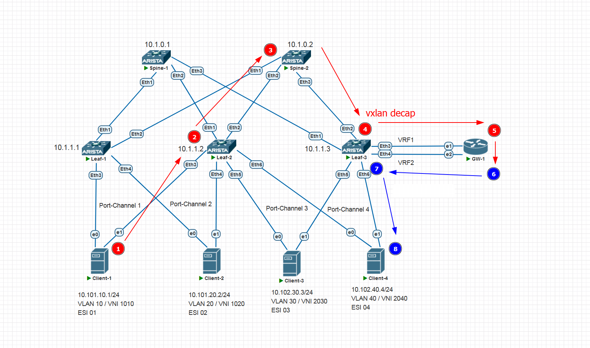

# Домашнее задание 8 (VxLAN. Оптимизация таблиц маршрутизации)

## Содержание
<!-- TOC start (generated with https://github.com/derlin/bitdowntoc) -->

- [Цель домашней работы](#-)
- [Задача](#-1)
- [Топология](#-2)
- [Введение](#-3)
- [IP-план](#ip-)
   * [Loopbacks и ASN на коммутаторах и GW](#loopbacks-asn-gw)
   * [IRB-интерфейсы на Leaf'ах](#irb-leaf)
      + [Leaf-1](#leaf-1)
      + [Leaf-2](#leaf-2)
      + [Leaf-3](#leaf-3)
      + [GW-1](#gw-1)
   * [Клиенты](#-4)
   * [VXLAN](#vxlan)
   * [ESI](#esi)
- [План работы](#--1)
   * [Шаги для выполнения работы](#--2)
- [Выполнение работы](#--3)
   * [Проверка Underlay](#-underlay)
      + [Leaf-1](#leaf-1-1)
      + [Leaf-2](#leaf-2-1)
      + [Leaf-3](#leaf-3-1)
   * [Настройка Spine-1](#-spine-1)
      + [Начальная конфигурация](#--4)
      + [Настройка address-family EVPN](#-address-family-evpn)
   * [Настройка Spine-2](#-spine-2)
   * [Настройка Leaf-1](#-leaf-1)
   * [Настройка Leaf-2](#-leaf-2)
   * [Настройка Leaf-3](#-leaf-3)
      + [Связь с GW-1 и обмен с ним subnet-маршрутами.](#-gw-1-subnet-)
   * [Настройка GW-1](#-gw-1)
      + [Настройка ОС и интерфейсов](#--5)
   * [Настройка Client-1](#-client-1)
   * [Настройка Client-2](#-client-2)
   * [Настройка Client-3](#-client-3)
   * [Настройка Client-4](#-client-4)
- [Проверка](#-5)
   * [Верификация Spine-1](#-spine-1-1)
      + [BGP summary](#bgp-summary)
   * [Верификация Spine-2](#-spine-2-1)
      + [BGP summary](#bgp-summary-1)
   * [Верификация Leaf-1](#-leaf-1-1)
      + [BGP Summary](#bgp-summary-2)
      + [BGP EVPN Routes](#bgp-evpn-routes)
      + [Таблица маршрутизации VRF1](#-vrf1)
   * [Верификация Leaf-2](#-leaf-2-1)
      + [BGP Summary](#bgp-summary-3)
      + [BGP EVPN Routes](#bgp-evpn-routes-1)
      + [Таблица маршрутизации VRF1](#-vrf1-1)
   * [Верификация Leaf-3](#-leaf-3-1)
      + [BGP Summary](#bgp-summary-4)
      + [BGP EVPN Routes](#bgp-evpn-routes-2)
      + [Таблица маршрутизации VRF1](#-vrf1-2)
   * [Верификация GW-1](#-gw-1-1)
      + [BGP Summary](#bgp-summary-5)
      + [BGP Neighbor](#bgp-neighbor)
      + [BGP Routes](#bgp-routes)
      + [Таблица маршрутизации](#--6)
   * [Верификация связности между клиентами](#--7)
      + [Client-1](#client-1)
      + [Client-2](#client-2)
      + [Client-3](#client-3)
      + [Client-4](#client-4)
   * [Проверка, что трафик идет через GW](#-gw)
- [Итого](#-6)

<!-- TOC end -->

<!-- TOC --><a name="-"></a>
## Цель домашней работы
Закрепление пройденного материала по теме VxLAN. Оптимизация таблиц маршрутизации.

<!-- TOC --><a name="-1"></a>
## Задача
Реализовать передачу суммарных префиксов через EVPN route-type 5.


<!-- TOC --><a name="-2"></a>
## Топология


<!-- TOC --><a name="-3"></a>
## Введение
В последней домашней работе на курсе OTUS "Дизайн сетей ЦОД" нам необходимо реализовать так называемую "внешнюю связность" для нашего PoD'а. Означает это следующее: мы должны импортировать в нашу overlay-сеть некие внешние маршруты через некоторое внешнее устройство (например, это выделенный маршрутизатор, подключенный к одному из наших Leaf'ов). Маршруты будут импортированы в EVPN в качестве маршрутов 5-го типа (IP Prefix Route).

Работа будет выполнена на виртуальных нодах на основе Arista vEOS 4.29.2F. В качестве внешнего маршрутизатора будет взята виртуальная машина с установленной на ней Ubuntu Server 22. В качестве ПО маршрутизации будет использован FRR 10.

Underlay-сеть и Overlay-сеть мы возьмем из домашней работы №7 (Multihoming). В качестве underlay-сети будет использоваться все та же схема eBGP Unnumbered (RFC 5549). Overlay-сеть будет настроена так же, как в ДЗ 7, однако с некоторыми важными изменениями, требуемыми целями нашего задания.

Во-первых, мы поделим наших клиентов на две независимых VRF: VRF1 и VRF2. Client-1 и Client-2 будут принадлежать VRF1, а Client-3 и Client-4 будут жить в VRF2.

Во-вторых, к Leaf-3 будет подключен маршрутизатор GW-1, который будет устанавливать IPv4 BGP-соседство с Leaf-3. Какова будет его (GW-1) роль? Роль его будет чем-то вроде внешнего файрволла. То есть Leaf-3 будет отдавать на него два физических линка, каждый из которых будет принадлежать своей VRF (модель VRF-Lite).

Leaf-3 по этим линкам будет отдавать на GW-1 суммарные маршруты подсетей, находящихся за IRB-интерфейсами всех VLAN'ов нашей фабрики.

Задача GW-1 будет состоять в том, чтобы принять маршруты одного VRF, а затем экспортировать их в другой VRF, по возможности проведя суммаризацию. Попутно на этом этапе можно понастраивать какие-нибудь гибкие политики фильтрации трафика или чего-то подобного, но по условиям задания нам это не требуется, и лишними сущностями перегружать ДЗ не будем. Главное, что есть такая возможность. :)

Так, ну модель сервиса у нас останется VLAN-Based (которую я окончательно выбрал в свои фавориты после всех ДЗ на данном курсе). Репликация BUM-трафика у нас будет настроена с помощью Head End Replication... Так, что там еще. IRB-интерфейсы будут настроены как Static Anycast Gateway + Anycast MAC ([RFC 9135, option 1](https://datatracker.ietf.org/doc/html/rfc9135#section-4.1)). 
Будет настроен ESI LAG в режиме All-Active на каждом из клиентов (ну раз уж настроили в ДЗ-7, то и не будем ломать работающую топологию. Работает - не трожь :)). 

Собственно, как мы подойдем к выполнению ДЗ (обеспечить связность между VRF через выделенный внешний маршрутизатор)?.

Сейчас, когда я только начинаю делать это ДЗ, мне видится такая схема:
1) Leaf-3 и GW-1 устанавливают BGPv4-соседство (а точнее два соседства - по одному внутри каждого VRF).
2) Все Leaf'ы экспортируют свои IRB-подсети как маршруты 5-го типа (далее RT-5) в своих VRF.
3) Leaf-3 передает эти маршруты как обычные маршруты IPv4 в сторону GW-1.
4) GW-1 на своей стороне делает взаимное перетекание маршрутов из VRF1 в VRF2 и наоборот, попутно максимально их суммаризируя.
5) Leaf-3 принимает маршруты от GW-1 обратно (уже в других VRF) и анонсирует их как RT-5 в сторону EVPN.

По итогу у нас клиенты в одном VRF должны иметь связность с клиентами в другом VRF через маршрутизатор GW-1.

Пока что я вижу проблему, с которой я гарантированно столкнусь на перегоне Leaf-3 <-> GW-1: Leaf-3 не захочет принимать маршруты от GW-1, потому что AS Leaf-3 будет присутствовать в AS-PATH маршрутов, анонсируемых от GW-1. (то есть AS-PATH будет выглядеть примерно так: 65001 (Leaf-1) 65100 (Spine) 65003 (Leaf-3) 65099 (GW-1)). Точнее, в обратном порядке.

Можно подойти к решению этого вопроса через команду as-override, которая заставит GW-1 переписать AS Leaf-3 на собственную. Тогда Leaf-3 примет маршрут, однако по-любому потом возникнет точно такая же проблема на Spine'ах, которые так же увидят в AS-PATH свою AS 65100 и отвергнут маршруты, которые им предложит Leaf-3. Короче, это не решение проблемы. Надо найти способ полностью очистить AS-PATH от PoD'овских автономок при экспорте маршрутов с GW-1. Вроде, что-то я помню, у FRR была подобная команда (или был способ очистить AS-PATH через route-map), но точно не помню. Буду разбираться по ходу дела.

<!-- TOC --><a name="ip-"></a>
## IP-план

<!-- TOC --><a name="loopbacks-asn-gw"></a>
### Loopbacks и ASN на коммутаторах и GW
Наши Loopback'и и ASN, настроенные на Underlay. Здесь еще добавляется GW-1, которому мы выделим свою автономку и свой Loopback. Строго говоря, Loopback ему не нужен, наверное (ну или я пока не вижу, зачем он ему будет нужен), но пусть будет. Вдруг понадобится, чтобы потом не возвращаться сюда.

| Устройство | Loopback | ASN   |
| ---------- | -------- | ----- |
| Spine-1    | 10.1.0.1 | 65100 |
| Spine-2    | 10.1.0.2 | 65100 |
| Leaf-1     | 10.1.1.1 | 65001 |
| Leaf-2     | 10.1.1.2 | 65002 |
| Leaf-3     | 10.1.1.3 | 65003 |
| GW-1       | 10.1.2.1 | 65099 | 

<!-- TOC --><a name="irb-leaf"></a>
### IRB-интерфейсы на Leaf'ах
Так, сразу оговорим конфигурацию. Каждый клиент будет в своем широковещательном домене и своей подсети. Подсети в пределах VRF я выделил таким образом, чтобы потом можно было их суммаризировать в один маршрут.

<!-- TOC --><a name="leaf-1"></a>
#### Leaf-1
VLAN 10: 10.101.10.254/24  
VLAN 20: 10.101.20.254/24  

<!-- TOC --><a name="leaf-2"></a>
#### Leaf-2
VLAN 10: 10.101.10.254/24  
VLAN 20: 10.101.20.254/24  
VLAN 30: 10.102.30.254/24  
VLAN 40: 10.102.40.254/24  

<!-- TOC --><a name="leaf-3"></a>
#### Leaf-3
VLAN 30: 10.102.30.254/24  
VLAN 40: 10.102.40.254/24  

<!-- TOC --><a name="gw-1"></a>
#### GW-1
Для GW-1 выделим две стыковочные сети (Leaf3 <-> GW-1):  
VRF1: 10.99.1.0/30  
VRF2: 10.99.2.0/30  

Технически, можно было бы взять одинаковую сеть (они же в разных VRF), но лучше не надо. Мало ли какие подводные камни вылезут при настройке BGP и обмене маршрутами (там всякие некст-хопы и т.д.), а экономить сети пространства [RFC 1918](https://datatracker.ietf.org/doc/html/rfc1918) нам точно без надобности.

Выделим ему собственную AS: 65099.

<!-- TOC --><a name="-4"></a>
### Клиенты
MAC, IP-адреса, VLAN, VNI, VRF клиентов, подключенных к Leaf-устройствам.

| Клиент   | MAC (LAG Interface) | IP/Mask        | VLAN | VRF  |
| -------- | ------------------- | -------------- | ---- | ---- |
| Client-1 | 02:00:00:00:01:bb   | 10.101.10.1/24 | 10   | VRF1 |
| Client-2 | 02:00:00:00:02:bb   | 10.101.20.2/24 | 20   | VRF1 |
| Client-3 | 02:00:00:00:03:bb   | 10.102.30.3/24 | 30   | VRF2 |
| Client-4 | 02:00:00:00:04:bb   | 10.102.40.4/24 | 40   | VRF2 |

<!-- TOC --><a name="vxlan"></a>
### VXLAN
MAC-VRF:
| VLAN | VNI  | RD   | RT     |
| ---- | ---- | ---- | ------ |
| 10   | 1010 | auto | 1:1010 |
| 20   | 1020 | auto | 1:1020 |
| 30   | 2030 | auto | 1:2030 |
| 40   | 2040 | auto | 1:2040 |

IP-VRF:
| VRF  | VNI  | RD   | RT     |
| ---- | ---- | ---- | ------ |
| VRF1 | 1000 | auto | 1:1000 |
| VRF2 | 2000 | auto | 1:2000 |

<!-- TOC --><a name="esi"></a>
### ESI
Идентификаторы ESI и LAG.

| Client   | ESI                      | ES-Import-RT      | LACP System-ID |
| -------- | ------------------------ | ----------------- | -------------- |
| Client-1 | 0000:0000:0000:0000:0001 | 00:00:00:00:00:01 | 02aa.aaaa.0001 |
| Client-2 | 0000:0000:0000:0000:0002 | 00:00:00:00:00:02 | 02aa.aaaa.0002 |
| Client-3 | 0000:0000:0000:0000:0003 | 00:00:00:00:00:03 | 02aa.aaaa.0003 |
| Client-4 | 0000:0000:0000:0000:0004 | 00:00:00:00:00:04 | 02aa.aaaa.0004 | 

Так, ну с IP-планом и идентификаторами не должно возникнуть проблем. Тут всё по сути так же, как было в предыдущих ДЗ, только подсети немножко другие.

<!-- TOC --><a name="--1"></a>
## План работы

<!-- TOC --><a name="--2"></a>
### Шаги для выполнения работы
1. Проверить достижимость loopback'ов с каждого Leaf до каждого Spine и других Leaf. Все должно работать с уже настроенным Underlay.
2. Настроить Overlay, L2VXLAN, L3VXLAN, Multihoming для каждого клиента. То есть, в принципе, повторить всё то, что мы уже делали в предыдущих ДЗ.
3. Анонсировать IRB-подсети с Leaf'ов в EVPN как RT-5.
4. На Leaf-3 добавить VRF1
5. Подключить к Leaf-3 маршрутизатор GW-1. Настроить BGPv4-пиринг между Leaf-3 и GW-1 по выделенным линкам для каждого VRF отдельно.
6. Настроить GW-1, настроить перетекание и суммаризацию маршрутов, принятых от Leaf-3.
7. Проверить связность inter-VRF, убедиться, что трафик между VRF ходит через GW-1.

<!-- TOC --><a name="--3"></a>
## Выполнение работы
Буду подробно описывать конфигурацию, относящуюся к ДЗ. Настройки L2VXLAN, L3VXLAN, MH будут расписаны кратко.

<!-- TOC --><a name="-underlay"></a>
### Проверка Underlay
Давайте кратко проверим пингами работу Underlay. С каждого Leaf выполним пинг каждого Spine и соседних Leaf'ов.


<!-- TOC --><a name="leaf-1-1"></a>
#### Leaf-1
```
Leaf-1#ping 10.1.0.1 repeat 1
PING 10.1.0.1 (10.1.0.1) 72(100) bytes of data.
80 bytes from 10.1.0.1: icmp_seq=1 ttl=65 time=3.99 ms

--- 10.1.0.1 ping statistics ---
1 packets transmitted, 1 received, 0% packet loss, time 0ms
rtt min/avg/max/mdev = 3.995/3.995/3.995/0.000 ms
Leaf-1#ping 10.1.0.2 repeat 1
PING 10.1.0.2 (10.1.0.2) 72(100) bytes of data.
80 bytes from 10.1.0.2: icmp_seq=1 ttl=65 time=10.5 ms

--- 10.1.0.2 ping statistics ---
1 packets transmitted, 1 received, 0% packet loss, time 0ms
rtt min/avg/max/mdev = 10.516/10.516/10.516/0.000 ms
Leaf-1#ping 10.1.1.2 repeat 1
PING 10.1.1.2 (10.1.1.2) 72(100) bytes of data.
80 bytes from 10.1.1.2: icmp_seq=1 ttl=64 time=8.87 ms

--- 10.1.1.2 ping statistics ---
1 packets transmitted, 1 received, 0% packet loss, time 0ms
rtt min/avg/max/mdev = 8.876/8.876/8.876/0.000 ms
Leaf-1#ping 10.1.1.3 repeat 1
PING 10.1.1.3 (10.1.1.3) 72(100) bytes of data.
80 bytes from 10.1.1.3: icmp_seq=1 ttl=64 time=9.12 ms

--- 10.1.1.3 ping statistics ---
1 packets transmitted, 1 received, 0% packet loss, time 0ms
rtt min/avg/max/mdev = 9.123/9.123/9.123/0.000 ms
```


<!-- TOC --><a name="leaf-2-1"></a>
#### Leaf-2
```
Leaf-2#ping 10.1.0.1 repeat 1
PING 10.1.0.1 (10.1.0.1) 72(100) bytes of data.
80 bytes from 10.1.0.1: icmp_seq=1 ttl=65 time=4.74 ms

--- 10.1.0.1 ping statistics ---
1 packets transmitted, 1 received, 0% packet loss, time 0ms
rtt min/avg/max/mdev = 4.743/4.743/4.743/0.000 ms
Leaf-2#ping 10.1.0.2 repeat 1
PING 10.1.0.2 (10.1.0.2) 72(100) bytes of data.
80 bytes from 10.1.0.2: icmp_seq=1 ttl=65 time=4.62 ms

--- 10.1.0.2 ping statistics ---
1 packets transmitted, 1 received, 0% packet loss, time 0ms
rtt min/avg/max/mdev = 4.626/4.626/4.626/0.000 ms
Leaf-2#ping 10.1.1.1 repeat 1
PING 10.1.1.1 (10.1.1.1) 72(100) bytes of data.
80 bytes from 10.1.1.1: icmp_seq=1 ttl=64 time=8.41 ms

--- 10.1.1.1 ping statistics ---
1 packets transmitted, 1 received, 0% packet loss, time 0ms
rtt min/avg/max/mdev = 8.417/8.417/8.417/0.000 ms
Leaf-2#ping 10.1.1.3 repeat 1
PING 10.1.1.3 (10.1.1.3) 72(100) bytes of data.
80 bytes from 10.1.1.3: icmp_seq=1 ttl=64 time=8.87 ms

--- 10.1.1.3 ping statistics ---
1 packets transmitted, 1 received, 0% packet loss, time 0ms
rtt min/avg/max/mdev = 8.877/8.877/8.877/0.000 ms
```


<!-- TOC --><a name="leaf-3-1"></a>
#### Leaf-3
```
Leaf-3#ping 10.1.0.1 repeat 1
PING 10.1.0.1 (10.1.0.1) 72(100) bytes of data.
80 bytes from 10.1.0.1: icmp_seq=1 ttl=65 time=4.23 ms

--- 10.1.0.1 ping statistics ---
1 packets transmitted, 1 received, 0% packet loss, time 0ms
rtt min/avg/max/mdev = 4.231/4.231/4.231/0.000 ms
Leaf-3#ping 10.1.0.2 repeat 1
PING 10.1.0.2 (10.1.0.2) 72(100) bytes of data.
80 bytes from 10.1.0.2: icmp_seq=1 ttl=65 time=4.82 ms

--- 10.1.0.2 ping statistics ---
1 packets transmitted, 1 received, 0% packet loss, time 0ms
rtt min/avg/max/mdev = 4.829/4.829/4.829/0.000 ms
Leaf-3#ping 10.1.1.1 repeat 1
PING 10.1.1.1 (10.1.1.1) 72(100) bytes of data.
80 bytes from 10.1.1.1: icmp_seq=1 ttl=64 time=9.86 ms

--- 10.1.1.1 ping statistics ---
1 packets transmitted, 1 received, 0% packet loss, time 0ms
rtt min/avg/max/mdev = 9.865/9.865/9.865/0.000 ms
Leaf-3#ping 10.1.1.2 repeat 1
PING 10.1.1.2 (10.1.1.2) 72(100) bytes of data.
80 bytes from 10.1.1.2: icmp_seq=1 ttl=64 time=8.72 ms

--- 10.1.1.2 ping statistics ---
1 packets transmitted, 1 received, 0% packet loss, time 0ms
rtt min/avg/max/mdev = 8.725/8.725/8.725/0.000 ms
```

Все выглядит хорошо. Переходим к настройкам Overlay.


<!-- TOC --><a name="-spine-1"></a>
### Настройка Spine-1

<!-- TOC --><a name="--4"></a>
#### Начальная конфигурация
Приведу начальную настройку (с настроенным Underlay и Overlay). Все остальные настройки будут касаться исключительно целей текущего ДЗ.
```
service routing protocols model multi-agent
!
hostname Spine-1
!
interface Ethernet1
   description Link_to_Leaf-1
   no switchport
   ipv6 enable
!
interface Ethernet2
   description Link_to_Leaf-2
   no switchport
   ipv6 enable
!
interface Ethernet3
   description Link_to_Leaf-3
   no switchport
   ipv6 enable
!
interface Ethernet4
   shutdown
!
interface Ethernet5
   shutdown
!
interface Ethernet6
   shutdown
!
interface Ethernet7
   shutdown
!
interface Loopback0
   ip address 10.1.0.1/32
!
ip routing ipv6 interfaces
!
ipv6 unicast-routing
!
route-map BGP_REDISTRIBUTE_CONNECTED permit 10
   match interface Loopback0
!
peer-filter LEAFS
   10 match as-range 65001-65006 result accept
!
router bgp 65100
   maximum-paths 64
   neighbor CLOS peer group
   neighbor CLOS out-delay 0
   neighbor CLOS bfd
   neighbor CLOS timers 3 9
   neighbor CLOS password OTUS
   redistribute connected route-map BGP_REDISTRIBUTE_CONNECTED
   neighbor interface Et1-6 peer-group CLOS peer-filter LEAFS
   !
   address-family ipv4
      neighbor CLOS activate
      neighbor CLOS next-hop address-family ipv6 originate
!
end
```

<!-- TOC --><a name="-address-family-evpn"></a>
#### Настройка address-family EVPN
В принципе, вся настройка на Spine сведется к активации address-family и включению отсылки расширенных комьюнити, которые нам необходимы для передачи route-target'ов, которые из себя и представляют эти самые extended community. Без RT ни один Leaf не установит информацию из маршрутов в свои MAC-VRF и IP-VRF, так как именно по RT определяется, какому VRF должна принадлежать данная маршрутная информация.

```
Spine-1(config)# router bgp 65100
Spine-1(config-router-bgp)# neighbor CLOS send-community extended
Spine-1(config-router-bgp)# address-family evpn
Spine-1(config-router-bgp-af)# neighbor CLOS activate
```

Всё :) Настраиваем Spine-2 по такой же схеме.

<!-- TOC --><a name="-spine-2"></a>
### Настройка Spine-2
Начальная конфигурация из ДЗ-4:
```
service routing protocols model multi-agent
!
hostname Spine-2
!
interface Ethernet1
   description Link_to_Leaf-1
   no switchport
   ipv6 enable
!
interface Ethernet2
   description Link_to_Leaf-2
   no switchport
   ipv6 enable
!
interface Ethernet3
   description Link_to_Leaf-3
   no switchport
   ipv6 enable
!
interface Ethernet4
   shutdown
!
interface Ethernet5
   shutdown
!
interface Ethernet6
   shutdown
!
interface Ethernet7
   shutdown
!
interface Loopback0
   ip address 10.1.0.2/32
!
ip routing ipv6 interfaces
!
ipv6 unicast-routing
!
route-map BGP_REDISTRIBUTE_CONNECTED permit 10
   match interface Loopback0
!
peer-filter LEAFS
   10 match as-range 65001-65006 result accept
!
router bgp 65100
   maximum-paths 64
   neighbor CLOS peer group
   neighbor CLOS out-delay 0
   neighbor CLOS bfd
   neighbor CLOS timers 3 9
   neighbor CLOS password OTUS
   redistribute connected route-map BGP_REDISTRIBUTE_CONNECTED
   neighbor interface Et1-6 peer-group CLOS peer-filter LEAFS
   !
   address-family ipv4
      neighbor CLOS activate
      neighbor CLOS next-hop address-family ipv6 originate
!
end
```

Касательно настроек EVPN, здесь всё так же, как и для Spine-1. 

```
Spine-2(config)# router bgp 65100
Spine-2(config-router-bgp)# neighbor CLOS send-community extended
Spine-2(config-router-bgp)# address-family evpn
Spine-2(config-router-bgp-af)# neighbor CLOS activate
```

<!-- TOC --><a name="-leaf-1"></a>
### Настройка Leaf-1
Начальная конфигурация из ДЗ-4:
```
service routing protocols model multi-agent
!
hostname Leaf-1
!
interface Ethernet1
   description Link_to_Spine-1
   no switchport
   ipv6 enable
!
interface Ethernet2
   description Link_to_Spine-2
   no switchport
   ipv6 enable
!
interface Ethernet3
   shutdown
!
interface Ethernet4
   shutdown
!
interface Ethernet5
   shutdown
!
interface Ethernet6
   shutdown
!
interface Ethernet7
   shutdown
!
interface Loopback0
   ip address 10.1.1.1/32
!
ip routing ipv6 interfaces
!
ipv6 unicast-routing
!
route-map BGP_REDISTRIBUTE_CONNECTED permit 10
   match interface Loopback0
!
router bgp 65001
   maximum-paths 64
   neighbor CLOS peer group
   neighbor CLOS out-delay 0
   neighbor CLOS bfd
   neighbor CLOS timers 3 9
   neighbor CLOS password OTUS
   redistribute connected route-map BGP_REDISTRIBUTE_CONNECTED
   neighbor interface Et1-2 peer-group CLOS remote-as 65100
   !
   address-family ipv4
      neighbor CLOS activate
      neighbor CLOS next-hop address-family ipv6 originate
!
end
```

Создадим VLAN 10 и VLAN 20 для Client-1 и Client-2:
```
Leaf-1(config)# vlan 10
Leaf-1(config-vlan-10)# name Clients_10
Leaf-1(config-vlan-10)# vlan 20
Leaf-1(config-vlan-20)# name Clients_20
```

Создадим VRF1:
```
Leaf-1(config)# vrf instance VRF1
```

Создадим Port-Channel'ы для клиентов:
```
Leaf-1(config)# interface Port-Channel1
Leaf-1(config-if-Po1)# description Link_to_Client-1
Leaf-1(config-if-Po1)# switchport access vlan 10
Leaf-1(config-if-Po1)# evpn ethernet-segment
Leaf-1(config-evpn-es)# identifier 0000:0000:0000:0000:0001
Leaf-1(config-evpn-es)# route-target import 00:00:00:00:00:01
Leaf-1(config-evpn-es)# lacp system-id 02aa.aaaa.0001

Leaf-1(config-if-Po1)#interface Port-Channel2
Leaf-1(config-if-Po2)# description Link_to_Client-2
Leaf-1(config-if-Po2)# switchport access vlan 20
Leaf-1(config-if-Po2)# evpn ethernet-segment
Leaf-1(config-evpn-es)# identifier 0000:0000:0000:0000:0002
Leaf-1(config-evpn-es)# route-target import 00:00:00:00:00:02
Leaf-1(config-evpn-es)# lacp system-id 02aa.aaaa.0002
```
Подробно расписывать, для чего я это прописываю, пожалуй, не буду, так как всё было подробно расписано в предыдущих ДЗ. Не надо раздувать и так огромный текст ДЗ.

Физические порты для клиентов:
```
Leaf-1(config)# interface Ethernet3
Leaf-1(config-if-Et3)# description Link_to_Client-1
Leaf-1(config-if-Et3)# channel-group 1 mode active

Leaf-1(config-if-Et3)# interface Ethernet4
Leaf-1(config-if-Et4)# description Link_to_Client-2
Leaf-1(config-if-Et4)# channel-group 2 mode active
```

IRB-интерфейсы:
```
Leaf-1(config)# interface Vlan10
Leaf-1(config-if-Vl10)# vrf VRF1
Leaf-1(config-if-Vl10)# ip address virtual 10.101.10.254/24

Leaf-1(config-if-Vl10)# interface Vlan20
Leaf-1(config-if-Vl20)# vrf VRF1
Leaf-1(config-if-Vl20)# ip address virtual 10.101.20.254/24
```

VXLAN-интерфейс, назначение VNI на VLAN и VRF:
```
Leaf-1(config)# interface Vxlan1
Leaf-1(config-if-Vx1)# vxlan source-interface Loopback0
Leaf-1(config-if-Vx1)# vxlan vlan 10 vni 1010
Leaf-1(config-if-Vx1)# vxlan vlan 20 vni 1020
Leaf-1(config-if-Vx1)# vxlan vrf VRF1 vni 1000
```

Anycast MAC для IRB-интерфейсов:
```
Leaf-1(config)# ip virtual-router mac-address 02:aa:aa:aa:aa:aa
```

Включение маршрутизации для VRF1:
```
Leaf-1(config)# ip routing vrf VRF1
```

Настраиваем RD, RT для MAC-VRF, включаем генерацию RT-2.
```
Leaf-1(config)# router bgp 65001
Leaf-1(config-router-bgp)# vlan 10
Leaf-1(config-macvrf-10)# rd auto
Leaf-1(config-macvrf-10)# route-target both 1:1010
Leaf-1(config-macvrf-10)# redistribute learned

Leaf-1(config-macvrf-10)# vlan 20
Leaf-1(config-macvrf-20)# rd auto
Leaf-1(config-macvrf-20)# route-target both 1:1020
Leaf-1(config-macvrf-20)# redistribute learned
```

Включаем AF для overlay и включаем отсылку расширенных комьюнити:
```
Leaf-1(config-router-bgp)# neighbor CLOS send-community extended
Leaf-1(config-router-bgp)# address-family evpn
Leaf-1(config-router-bgp-af)# neighbor CLOS activate
```

Настраиваем RD и RT для L3VNI. И вот тут еще есть важная команда - redistribute connected в AF IPv4 внутри VRF1. Эта команда включает анонсирование connected-подсетей в EVPN как маршруты RT-5!
```
Leaf-1(config-router-bgp)# vrf VRF1
Leaf-1(config-router-bgp-vrf-VRF1)# rd 10.1.1.1:1000
Leaf-1(config-router-bgp-vrf-VRF1)# route-target import evpn 1:1000
Leaf-1(config-router-bgp-vrf-VRF1)# route-target export evpn 1:1000

Leaf-1(config-router-bgp-vrf-VRF1)# address-family ipv4
Leaf-1(config-router-bgp-vrf-VRF1-af)# redistribute connected
```
Всё. Остальные коммутаторы Leaf настраиваем по той же схеме. Буду приводить только финальные настройки EVPN, чтобы не дублировать информацию.

<!-- TOC --><a name="-leaf-2"></a>
### Настройка Leaf-2
Начальная конфигурация:
```
service routing protocols model multi-agent
!
hostname Leaf-2
!
interface Ethernet1
   description Link_to_Spine-1
   no switchport
   ipv6 enable
!
interface Ethernet2
   description Link_to_Spine-2
   no switchport
   ipv6 enable
!
interface Ethernet3
   shutdown
!
interface Ethernet4
   shutdown
!
interface Ethernet5
   shutdown
!
interface Ethernet6
   shutdown
!
interface Ethernet7
   shutdown
!
interface Loopback0
   ip address 10.1.1.2/32
!
ip routing ipv6 interfaces
!
ipv6 unicast-routing
!
route-map BGP_REDISTRIBUTE_CONNECTED permit 10
   match interface Loopback0
!
router bgp 65002
   maximum-paths 64
   neighbor CLOS peer group
   neighbor CLOS out-delay 0
   neighbor CLOS bfd
   neighbor CLOS timers 3 9
   neighbor CLOS password OTUS
   redistribute connected route-map BGP_REDISTRIBUTE_CONNECTED
   neighbor interface Et1-2 peer-group CLOS remote-as 65100
   !
   address-family ipv4
      neighbor CLOS activate
      neighbor CLOS next-hop address-family ipv6 originate
!
end
```

По EVPN Leaf-2 будет настроен так же, как и Leaf-1. Единственное, что здесь будет добавлена VRF2, а также клиенты в ней. По сути - все похоже. Поэтому просто приведем конфигурацию Overlay и двинемся дальше.

Конфигурация overlay:
```
vlan 10
   name Clients_10
!
vlan 20
   name Clients_20
!
vlan 30
   name Clients_30
!
vlan 40
   name Clients_40
!
vrf instance VRF1
vrf instance VRF2
!
interface Port-Channel1
   description Link_to_Client-1
   switchport access vlan 10
   !
   evpn ethernet-segment
      identifier 0000:0000:0000:0000:0001
      route-target import 00:00:00:00:00:01
   lacp system-id 02aa.aaaa.0001
!
interface Port-Channel2
   description Link_to_Client-2
   switchport access vlan 20
   !
   evpn ethernet-segment
      identifier 0000:0000:0000:0000:0002
      route-target import 00:00:00:00:00:02
   lacp system-id 02aa.aaaa.0002
!
interface Port-Channel3
   description Link_to_Client-3
   switchport access vlan 30
   !
   evpn ethernet-segment
      identifier 0000:0000:0000:0000:0003
      route-target import 00:00:00:00:00:03
   lacp system-id 02aa.aaaa.0003
!
interface Port-Channel4
   description Link_to_Client-4
   switchport access vlan 40
   !
   evpn ethernet-segment
      identifier 0000:0000:0000:0000:0004
      route-target import 00:00:00:00:00:04
   lacp system-id 02aa.aaaa.0004
!
interface Ethernet3
   description Link_to_Client-1
   channel-group 1 mode active
!
interface Ethernet4
   description Link_to_Client-2
   channel-group 2 mode active
!
interface Ethernet5
   description Link_to_Client-3
   channel-group 3 mode active
!
interface Ethernet6
   description Link_to_Client-4
   channel-group 4 mode active
!
interface Vlan10
   vrf VRF1
   ip address virtual 10.101.10.254/24
!
interface Vlan20
   vrf VRF1
   ip address virtual 10.101.20.254/24
!
interface Vlan30
   vrf VRF2
   ip address virtual 10.102.30.254/24
!
interface Vlan40
   vrf VRF2
   ip address virtual 10.102.40.254/24
!
interface Vxlan1
   vxlan source-interface Loopback0
   vxlan vlan 10 vni 1010
   vxlan vlan 20 vni 1020
   vxlan vlan 30 vni 2030
   vxlan vlan 40 vni 2040
   vxlan vrf VRF1 vni 1000
   vxlan vrf VRF2 vni 2000
!
ip virtual-router mac-address 02:aa:aa:aa:aa:aa
!
ip routing vrf VRF1
ip routing vrf VRF2
!
router bgp 65002
   neighbor CLOS send-community extended
   !
   vlan 10
      rd auto
      route-target both 1:1010
      redistribute learned
   !
   vlan 20
      rd auto
      route-target both 1:1020
      redistribute learned
   !
   vlan 30
      rd auto
      route-target both 1:2030
      redistribute learned
   !
   vlan 40
      rd auto
      route-target both 1:2040
      redistribute learned
   !
   address-family evpn
      neighbor CLOS activate
   !
   vrf VRF1
      rd 10.1.1.2:1000
      route-target import evpn 1:1000
      route-target export evpn 1:1000
      !
      address-family ipv4
         redistribute connected
   !
   vrf VRF2
      rd 10.1.1.2:2000
      route-target import evpn 1:2000
      route-target export evpn 1:2000
      !
      address-family ipv4
         redistribute connected
```

<!-- TOC --><a name="-leaf-3"></a>
### Настройка Leaf-3
Начальная конфигурация:
```
service routing protocols model multi-agent
!
hostname Leaf-3
!
interface Ethernet1
   description Link_to_Spine-1
   no switchport
   ipv6 enable
!
interface Ethernet2
   description Link_to_Spine-2
   no switchport
   ipv6 enable
!
interface Ethernet3
   shutdown
!
interface Ethernet4
   shutdown
!
interface Ethernet5
   shutdown
!
interface Ethernet6
   shutdown
!
interface Ethernet7
   shutdown
!
interface Loopback0
   ip address 10.1.1.3/32
!
ip routing ipv6 interfaces
!
ipv6 unicast-routing
!
route-map BGP_REDISTRIBUTE_CONNECTED permit 10
   match interface Loopback0
!
router bgp 65003
   maximum-paths 64
   neighbor CLOS peer group
   neighbor CLOS out-delay 0
   neighbor CLOS bfd
   neighbor CLOS timers 3 9
   neighbor CLOS password OTUS
   redistribute connected route-map BGP_REDISTRIBUTE_CONNECTED
   neighbor interface Et1-2 peer-group CLOS remote-as 65100
   !
   address-family ipv4
      neighbor CLOS activate
      neighbor CLOS next-hop address-family ipv6 originate
!
end
```

Настройки EVPN:
```
vlan 30
   name Clients_30
!
vlan 40
   name Clients_40
!
vrf instance VRF2
!
interface Port-Channel3
   description Link_to_Client-3
   switchport access vlan 30
   !
   evpn ethernet-segment
      identifier 0000:0000:0000:0000:0003
      route-target import 00:00:00:00:00:03
   lacp system-id 02aa.aaaa.0003
!
interface Port-Channel4
   description Link_to_Client-4
   switchport access vlan 40
   !
   evpn ethernet-segment
      identifier 0000:0000:0000:0000:0004
      route-target import 00:00:00:00:00:04
   lacp system-id 02aa.aaaa.0004
!
interface Ethernet5
   description Link_to_Client-3
   channel-group 3 mode active
!
interface Ethernet6
   description Link_to_Client-4
   channel-group 4 mode active
!
interface Vlan30
   vrf VRF2
   ip address virtual 10.102.30.254/24
!
interface Vlan40
   vrf VRF2
   ip address virtual 10.102.40.254/24
!
interface Vxlan1
   vxlan source-interface Loopback0
   vxlan vlan 30 vni 2030
   vxlan vlan 40 vni 2040
   vxlan vrf VRF1 vni 1000
   vxlan vrf VRF2 vni 2000
!
ip virtual-router mac-address 02:aa:aa:aa:aa:aa
!
ip routing vrf VRF2
!
router bgp 65003
   neighbor CLOS send-community extended
   !
   vlan 30
      rd auto
      route-target both 1:2030
      redistribute learned
   !
   vlan 40
      rd auto
      route-target both 1:2040
      redistribute learned
   !
   address-family evpn
      neighbor CLOS activate
   !
   !
   vrf VRF2
      rd 10.1.1.3:2000
      route-target import evpn 1:2000
      route-target export evpn 1:2000
      redistribute connected
```

<!-- TOC --><a name="-gw-1-subnet-"></a>
#### Связь с GW-1 и обмен с ним subnet-маршрутами.
Давайте теперь настроим Leaf-3 для пересылки RT-5 в сторону GW-1.
Буду приводить куски конфигурации, и объяснять, для чего я это делал. Возможно, что-то будет лишним или выполненным не по best practices. Буду надеяться на обратную связь от проверяющего, если здесь будут какие-то явные промахи с точки зрения фен-шуй или работоспособности в каких-то edge-случаях.


Во-первых, нам нужно создать VRF1 на Leaf-3 (ведь нам же нужно обмениваться маршрутами VRF1, хотя у нас и нет подключенных локально клиентов)
```
Leaf-3(config)# vrf instance VRF1
```

Во-вторых, давайте настроим линки в сторону GW-1. Это будут стандартные L3-интерфейсы:
```
Leaf-3(config)# interface Ethernet3
Leaf-3(config-if-Et3)# description Link_to_GW1_for_VRF1
Leaf-3(config-if-Et3)# no switchport
Leaf-3(config-if-Et3)# vrf VRF1
Leaf-3(config-if-Et3)# ip address 10.99.1.2/30
Leaf-3(config-if-Et3)# no shutdown

Leaf-3(config-if-Et3)# interface Ethernet4
Leaf-3(config-if-Et4)# description Link_to_GW1_for_VRF2
Leaf-3(config-if-Et4)# no switchport
Leaf-3(config-if-Et4)# vrf VRF2
Leaf-3(config-if-Et4)# ip address 10.99.2.2/30
Leaf-3(config-if-Et4)# no shutdown
```

Создадим привязку VNI к VRF (выделим L3VNI) - нам ведь нужно маршрутизировать трафик через L3VNI, а RT-5 это тоже касается :)
```
Leaf-3(config)# interface Vxlan1
Leaf-3(config-if-Vx1)# vxlan vrf VRF1 vni 1000
```

Включим маршрутизацию для VRF1:
```
Leaf-3(config)# ip routing vrf VRF1
```

Создадим префикс-лист, отфильтровывающий host-маршруты (/32-маршруты). Для чего это понадобится, увидим дальше :)
```
Leaf-3(config)#ip prefix-list NO_HOST_ROUTES 
Leaf-3(config-ip-pfx)#permit 0.0.0.0/0 le 31
```

Создадим маршрутизационную карту, которую повесим на редистрибьюцию connected-маршрутов в сторону GW-1. Собственно, в ней я хочу исключить анонсирование стыковочных линков с GW-1 в сторону GW-1. Ничего плохого, конечно, это не принесет. В принципе, можно было и не вешать. Ну да ладно, давайте отфильтруем эти маршруты для красоты таблицы маршрутизации на GW-1 :)

Обратите внимание - в правиле 30 мы разрешаем только те маршруты, которые не являются /32-маршрутами. Незачем нам в сторону GW-1 отправлять тонны хлама в виде наших host-маршрутов :). Ему нужны только суммаризированные сети. Для того мы и создавали префикс-список чуть ранее.

```
Leaf-3(config)# route-map REDISTRIBUTE_TO_GW deny 10
Leaf-3(config-route-map-REDISTRIBUTE_TO_GW)# match interface Ethernet3

Leaf-3(config-route-map-REDISTRIBUTE_TO_GW)# route-map REDISTRIBUTE_TO_GW deny 20 
Leaf-3(config-route-map-REDISTRIBUTE_TO_GW)# match interface Ethernet4

Leaf-3(config-route-map-REDISTRIBUTE_TO_GW)# route-map REDISTRIBUTE_TO_GW permit 30
Leaf-3(config-route-map-REDISTRIBUTE_TO_GW)# match ip address prefix-list NO_HOST_ROUTES
```

Кстати, пока суд да дело, не отходя от кассы, давайте сделаем еще одну карту, которой отфильтруем стыковочный линк с GW-1 от анонсирования в EVPN. Ну потому что, зачем он там будет красоту таблицы портить :) Хотя, наверное, ничем бы не помешал в плане работоспособности нашей сети.
```
Leaf-3(config)# route-map VRF2_REDISTRIBUTE_CONNECTED deny 10
Leaf-3(config-route-map-VRF2_REDISTRIBUTE_CONNECTED)# match interface Ethernet4

Leaf-3(config-route-map-VRF2_REDISTRIBUTE_CONNECTED)# route-map VRF2_REDISTRIBUTE_CONNECTED permit 20
```

Теперь настроим BGP-пиринг с GW-1. Значит, настройки BGP в принципе возьмем те же, что и в нашем Underlay/Overlay. Единственное, что пропишем вручную router-id, потому что внутри VRF он автоматом Router ID с адреса Loopback не берет. Ну и повесим нашу route-карту в нужное место - на VRF2 к команде redistribute connected.
```
Leaf-3(config)# router bgp 65003
Leaf-3(config-router-bgp)# vrf VRF1
Leaf-3(config-router-bgp-vrf-VRF1)# rd 10.1.1.3:1000
Leaf-3(config-router-bgp-vrf-VRF1)# route-target import evpn 1:1000
Leaf-3(config-router-bgp-vrf-VRF1)# route-target export evpn 1:1000
Leaf-3(config-router-bgp-vrf-VRF1)# router-id 10.1.1.3
Leaf-3(config-router-bgp-vrf-VRF1)# neighbor 10.99.1.1 remote-as 65099
Leaf-3(config-router-bgp-vrf-VRF1)# neighbor 10.99.1.1 out-delay 0
Leaf-3(config-router-bgp-vrf-VRF1)# neighbor 10.99.1.1 bfd
Leaf-3(config-router-bgp-vrf-VRF1)# neighbor 10.99.1.1 description GW-1
Leaf-3(config-router-bgp-vrf-VRF1)# neighbor 10.99.1.1 timers 3 9
Leaf-3(config-router-bgp-vrf-VRF1)# neighbor 10.99.1.1 password OTUS

Leaf-3(config-router-bgp-vrf-VRF1)# address-family ipv4
Leaf-3(config-router-bgp-vrf-VRF1-af)# neighbor 10.99.1.1 activate
Leaf-3(config-router-bgp-vrf-VRF1-af)# neighbor 10.99.1.1 route-map REDISTRIBUTE_TO_GW out

Leaf-3(config-router-bgp-vrf-VRF1-af)# vrf VRF2
Leaf-3(config-router-bgp-vrf-VRF2)# router-id 10.1.1.3
Leaf-3(config-router-bgp-vrf-VRF2)# neighbor 10.99.2.1 remote-as 65099
Leaf-3(config-router-bgp-vrf-VRF2)# neighbor 10.99.2.1 out-delay 0
Leaf-3(config-router-bgp-vrf-VRF2)# neighbor 10.99.2.1 bfd
Leaf-3(config-router-bgp-vrf-VRF2)# neighbor 10.99.2.1 description GW-1
Leaf-3(config-router-bgp-vrf-VRF2)# neighbor 10.99.2.1 timers 3 9
Leaf-3(config-router-bgp-vrf-VRF2)# neighbor 10.99.2.1 password OTUS
Leaf-3(config-router-bgp-vrf-VRF2)# redistribute connected route-map VRF2_REDISTRIBUTE_CONNECTED

Leaf-3(config-router-bgp-vrf-VRF2)# address-family ipv4
Leaf-3(config-router-bgp-vrf-VRF2-af)# neighbor 10.99.2.1 activate
Leaf-3(config-router-bgp-vrf-VRF2-af)# neighbor 10.99.2.1 route-map REDISTRIBUTE_TO_GW out
```

Общий вид добавленной конфигурации, служащей выполнению целей текущего ДЗ:
```
vrf instance VRF1
!
interface Ethernet3
   description Link_to_GW1_for_VRF1
   no switchport
   vrf VRF1
   ip address 10.99.1.2/30
!
interface Ethernet4
   description Link_to_GW1_for_VRF2
   no switchport
   vrf VRF2
   ip address 10.99.2.2/30
!
interface Vxlan1
   vxlan vrf VRF1 vni 1000
!
ip routing vrf VRF1
!
ip prefix-list NO_HOST_ROUTES
   seq 10 permit 0.0.0.0/0 le 31
!
route-map BGP_REDISTRIBUTE_CONNECTED permit 10
   match interface Loopback0
!
route-map REDISTRIBUTE_TO_GW deny 10
   match interface Ethernet3
!
route-map REDISTRIBUTE_TO_GW deny 20
   match interface Ethernet4
!
route-map REDISTRIBUTE_TO_GW permit 30
   match ip address prefix-list NO_HOST_ROUTES
!
route-map VRF2_REDISTRIBUTE_CONNECTED deny 10
   match interface Ethernet4
!
route-map VRF2_REDISTRIBUTE_CONNECTED permit 20
!
router bgp 65003
   !
   vrf VRF1
      rd 10.1.1.3:1000
      route-target import evpn 1:1000
      route-target export evpn 1:1000
      router-id 10.1.1.3
      neighbor 10.99.1.1 remote-as 65099
      neighbor 10.99.1.1 out-delay 0
      neighbor 10.99.1.1 bfd
      neighbor 10.99.1.1 description GW-1
      neighbor 10.99.1.1 timers 3 9
      neighbor 10.99.1.1 password OTUS
      !
      address-family ipv4
         neighbor 10.99.1.1 activate
         neighbor 10.99.1.1 route-map REDISTRIBUTE_TO_GW out
   !
   vrf VRF2
      router-id 10.1.1.3
      neighbor 10.99.2.1 remote-as 65099
      neighbor 10.99.2.1 out-delay 0
      neighbor 10.99.2.1 bfd
      neighbor 10.99.2.1 description GW-1
      neighbor 10.99.2.1 timers 3 9
      neighbor 10.99.2.1 password OTUS
      redistribute connected route-map VRF2_REDISTRIBUTE_CONNECTED
      !
      address-family ipv4
         neighbor 10.99.2.1 activate
         neighbor 10.99.2.1 route-map REDISTRIBUTE_TO_GW out
```

На этой счастливой ноте можно считать настройку Leaf-3 законченной (в теории!). Настроим GW-1 и посмотрим, взлетим мы со всей этой дополнительной конфигурацией или не взлетим :).

<!-- TOC --><a name="-gw-1"></a>
### Настройка GW-1
Для GW-1 я отдельно приведу настройку ОС (интерфейсы и т.д.) и настройку маршрутизационного демона.

Подготовим почву:
<!-- TOC --><a name="--5"></a>
#### Настройка ОС и интерфейсов
Пропишем hostname:
```
root@Ubuntu:~# hostnamectl set-hostname GW-1
```

Далее, чтобы не забыть! Сразу же включим маршрутизацию на нашей Linux-коробке, иначе никакой трафик ходить через GW-1 не будет:
```
root@GW-1:~# sysctl -w net.ipv4.conf.all.forwarding=1
```

Интерфейсы.
Здесь мы задаем интерфейсы e1 и e2, которые будут смотреть в сторону Leaf-3. Прописываем на них IP-сети, потом, следовательно, создаем два VRF и назначаем каждый интерфейс в свой VRF.
```
root@GW-1:~# cat /etc/netplan/00-installer-config.yaml 
network:
  ethernets:
    e1:
      match:
        name: ens4
      set-name: e1
      addresses: [ 10.99.1.1/30 ]
    e2:
      match:
        name: ens5
      set-name: e2
      addresses: [ 10.99.2.1/30 ]
  bridges:
    lo0:
      addresses: [ 10.1.2.1/32 ]
  vrfs:
    VRF1:
      table: 1000
      interfaces: [ e1 ]
    VRF2:
      table: 2000
      interfaces: [ e2 ]

  version: 2
  ```

Настройки системы закончена, перейдем к настройке FRR:

Определим суммарные IP-префиксы клиентских сетей в обоих VRF. В данный префикс-лист будут входить все префиксы в пределах диапазона /16, но имеющие длину маски 24 или меньше (считаем, что сетей >24 у нас не должно быть).
```
GW-1(config)# ip prefix-list VRF1_CLIENT_NETS seq 5 permit 10.101.0.0/16 le 24
GW-1(config)# ip prefix-list VRF2_CLIENT_NETS seq 5 permit 10.102.0.0/16 le 24
```

Создадим оба VRF в конфигурации FRR. Вообще, по идее, он должен автоматически распознавать VRF, которые были созданы в системе, но у меня этот механизм почему-то не всегда работал стабильно. Лучше их явно указать.
```
GW-1(config)# vrf VRF1
GW-1(config)# vrf VRF2
```

Перейдем к настройкам BGP. Создадим процесс в AS 65099.
```
GW-1(config)# router bgp 65099
```

Перейдем в контекст конфигурации vrf VRF1 и зададим там Router ID:
```
GW-1(config)# router bgp 65099 vrf VRF1
GW-1(config-router)# bgp router-id 10.1.2.1
```

Отключим требование обязательно иметь политику фильтрации для eBGP-сессий (соответствие [RFC 8212](https://datatracker.ietf.org/doc/html/rfc8212)):
```
GW-1(config-router)# no bgp ebgp-requires-policy
```

Пропишем нашего neighbor'а в VRF1 (Leaf-3):
```
GW-1(config-router)# neighbor 10.99.1.2 remote-as 65003
GW-1(config-router)# neighbor 10.99.1.2 bfd
GW-1(config-router)# neighbor 10.99.1.2 password OTUS
GW-1(config-router)# neighbor 10.99.1.2 timers 3 9
```

Настройка AF IPv4. Здесь мы прописываем суммаризированный адрес для подсетей VRF2 (для того, чтобы в сторону Leaf-3 отдался один маршрут, а не несколько. Параметр summary-only запрещает анонсирование более специфических маршрутов, подпадающих под summary-маршрут).

Далее мы вешаем на исходящее направление в сторону Leaf-3 маршрутизационную карту VRF1_EXPORT (определим мы ее чуть позднее).
Затем мы импортируем маршруты из VRF2, но не абы какие, а соответствующие карте VRF1_IMPORT. А то мало ли что оттуда прилетит, мы четко должны понимать, что мы реэкспортнем в VRF1.

```
GW-1(config-router)# address-family ipv4 unicast
GW-1(config-router-af)# aggregate-address 10.102.0.0/16 summary-only
GW-1(config-router-af)# neighbor 10.99.1.2 route-map VRF1_EXPORT out
GW-1(config-router-af)# import vrf route-map VRF1_IMPORT
GW-1(config-router-af)# import vrf VRF2
```

Далее повторяем настройки для VRF2. В принципе, по смыслу они совпадают с настройками для VRF1, поэтому я просто их приведу здесь:
```
GW-1(config-router)# router bgp 65099 vrf VRF2
GW-1(config-router)#  no bgp ebgp-requires-policy
GW-1(config-router)#  neighbor 10.99.2.2 remote-as 65003
GW-1(config-router)#  neighbor 10.99.2.2 bfd
GW-1(config-router)#  neighbor 10.99.2.2 password OTUS
GW-1(config-router)#  neighbor 10.99.2.2 timers 3 9

GW-1(config-router)#  address-family ipv4 unicast
GW-1(config-router-af)#   aggregate-address 10.101.0.0/16 summary-only
GW-1(config-router-af)#   neighbor 10.99.2.2 as-override
GW-1(config-router-af)#   neighbor 10.99.2.2 route-map VRF2_EXPORT out
GW-1(config-router-af)#   import vrf route-map VRF2_IMPORT
GW-1(config-router-af)#   import vrf VRF1
```

Создаем маршрутизационную карту VRF1_IMPORT.
В ней мы разрешаем только подсети VRF2 и только если эти подсети были импортированы из VRF2.
```
GW-1(config)# route-map VRF1_IMPORT permit 10
GW-1(config-route-map)#  match ip address prefix-list VRF2_CLIENT_NETS
GW-1(config-route-map)#  match source-vrf VRF2
```

То же самое для VRF2:
```
GW-1(config)# route-map VRF2_IMPORT permit 10
GW-1(config-route-map)#  match ip address prefix-list VRF1_CLIENT_NETS
GW-1(config-route-map)#  match source-vrf VRF1
```

А вот следующая route-карта является очень важной! Она вешается на экспорт в сторону Leaf-3 и удаляет из AS-PATH все AS, кроме нашей собственной. Это нужно для того, чтобы Leaf-3 и другие коммутаторы PoD'а не агрились на маршруты, в которых присутствует их собственная AS (и, таким образом, их не отбрасывали)!. Это как раз решение той проблемы, о которой я писал во введении.
```
GW-1(config)# route-map VRF1_EXPORT permit 10
GW-1(config-route-map)#  match ip address prefix-list VRF2_CLIENT_NETS
GW-1(config-route-map)#  set as-path exclude all
```

То же для VRF2:
```
GW-1(config)# route-map VRF2_EXPORT permit 10
GW-1(config-route-map)#  match ip address prefix-list VRF1_CLIENT_NETS
GW-1(config-route-map)#  set as-path exclude all
```

Общий вид произведенной конфигурации:
```
ip prefix-list VRF1_CLIENT_NETS seq 5 permit 10.101.0.0/16 le 24
ip prefix-list VRF2_CLIENT_NETS seq 5 permit 10.102.0.0/16 le 24
!
vrf VRF1
vrf VRF2
!
router bgp 65099 vrf VRF1
 bgp router-id 10.1.2.1
 no bgp ebgp-requires-policy
 neighbor 10.99.1.2 remote-as 65003
 neighbor 10.99.1.2 bfd
 neighbor 10.99.1.2 password OTUS
 neighbor 10.99.1.2 timers 3 9
 !
 address-family ipv4 unicast
  aggregate-address 10.102.0.0/16 summary-only
  neighbor 10.99.1.2 route-map VRF1_EXPORT out
  import vrf route-map VRF1_IMPORT
  import vrf VRF2
!
router bgp 65099 vrf VRF2
 bgp router-id 10.1.2.1
 no bgp ebgp-requires-policy
 neighbor 10.99.2.2 remote-as 65003
 neighbor 10.99.2.2 bfd
 neighbor 10.99.2.2 password OTUS
 neighbor 10.99.2.2 timers 3 9
 !
 address-family ipv4 unicast
  aggregate-address 10.101.0.0/16 summary-only
  neighbor 10.99.2.2 as-override
  neighbor 10.99.2.2 route-map VRF2_EXPORT out
  import vrf route-map VRF2_IMPORT
  import vrf VRF1
!
route-map VRF1_IMPORT permit 10
 match ip address prefix-list VRF2_CLIENT_NETS
 match source-vrf VRF2
!
route-map VRF2_IMPORT permit 10
 match ip address prefix-list VRF1_CLIENT_NETS
 match source-vrf VRF1
!
route-map VRF1_EXPORT permit 10
 match ip address prefix-list VRF2_CLIENT_NETS
 set as-path exclude all
!
route-map VRF2_EXPORT permit 10
 match ip address prefix-list VRF1_CLIENT_NETS
 set as-path exclude all
```

Приведу еще настройки клиентов. Тут ничего необычного - виртуалки на основе Alpine Linux, настройки выполнены через стандартный файл /etc/network/interfaces, создан LACP LAG на двух интерфейсах, смотрящих в разные VTEP'ы.

<!-- TOC --><a name="-client-1"></a>
### Настройка Client-1
```
auto eth0
iface eth0 inet manual

auto eth1
iface eth1 inet manual

auto bond0
iface bond0 inet static
        address 10.101.10.1
        netmask 255.255.255.0
        gateway 10.101.10.254
        bond-slaves eth0 eth1
        bond-mode 802.3ad
        bond-xmit-hash-policy layer2+3
```

<!-- TOC --><a name="-client-2"></a>
### Настройка Client-2
```
auto eth0
iface eth0 inet manual

auto eth1
iface eth1 inet manual

auto bond0
iface bond0 inet static
        address 10.101.20.2
        netmask 255.255.255.0
        gateway 10.101.20.254
        bond-slaves eth0 eth1
        bond-mode 802.3ad
        bond-xmit-hash-policy layer2+3
```

<!-- TOC --><a name="-client-3"></a>
### Настройка Client-3
```
auto eth0
iface eth0 inet manual

auto eth1
iface eth1 inet manual

auto bond0
iface bond0 inet static
        address 10.102.30.3
        netmask 255.255.255.0
        gateway 10.102.30.254
        bond-slaves eth0 eth1
        bond-mode 802.3ad
        bond-xmit-hash-policy layer2+3
  ```

<!-- TOC --><a name="-client-4"></a>
### Настройка Client-4
```
auto eth0
iface eth0 inet manual

auto eth1
iface eth1 inet manual

auto bond0
iface bond0 inet static
        address 10.102.40.4
        netmask 255.255.255.0
        gateway 10.102.40.254
        bond-slaves eth0 eth1
        bond-mode 802.3ad
        bond-xmit-hash-policy layer2+3
  ```

<!-- TOC --><a name="-5"></a>
## Проверка
Будем считать, что underlay и overlay у нас работают (для верности сделаем пинги со всех клиентов всех остальных клиентов).

Проверим только то, что непосредственно относится к целям данного ДЗ: наличие маршрутов RT-5 в BGP RIB, таблицы маршрутизации на Leaf'ах, на GW-1, и проверим, как ходит трафик между Client-1 и Client-4. Посмотрим с помощью tcpdump - попробуем выловить этот трафик на интерфейсах GW-1. Мы должны увидеть трафик ICMP как на интерфейсе e1 (приходящий и уходящий в сторону VRF1 на Leaf-3), так и на интерфейсе e2 (приходящий и уходящий в сторону VRF2 на Leaf-3).


С учетом того, что Spine в рамках проверки корректности выполнения ДЗ нас особо не интересуют, ограничимся только самыми общими проверками.
<!-- TOC --><a name="-spine-1-1"></a>
### Верификация Spine-1
<!-- TOC --><a name="bgp-summary"></a>
#### BGP summary
```
Spine-1#show bgp summary
BGP summary information for VRF default
Router identifier 10.1.0.1, local AS number 65100
Neighbor                               AS Session State AFI/SAFI                AFI/SAFI State   NLRI Rcd   NLRI Acc
----------------------------- ----------- ------------- ----------------------- -------------- ---------- ----------
fe80::5206:10ff:fef6:2241%Et3       65003 Established   IPv4 Unicast            Negotiated              1          1
fe80::5206:10ff:fef6:2241%Et3       65003 Established   L2VPN EVPN              Negotiated             16         16
fe80::52bb:b3ff:fe90:9c78%Et2       65002 Established   IPv4 Unicast            Negotiated              1          1
fe80::52bb:b3ff:fe90:9c78%Et2       65002 Established   L2VPN EVPN              Negotiated             28         28
fe80::52c4:23ff:fe5a:df99%Et1       65001 Established   IPv4 Unicast            Negotiated              1          1
fe80::52c4:23ff:fe5a:df99%Et1       65001 Established   L2VPN EVPN              Negotiated             14         14
```
Все в порядке. С каждым соседом у нас установлена сессия в L2VPN EVPN.

<!-- TOC --><a name="-spine-2-1"></a>
### Верификация Spine-2
<!-- TOC --><a name="bgp-summary-1"></a>
#### BGP summary
```
Spine-2#show bgp summary
BGP summary information for VRF default
Router identifier 10.1.0.2, local AS number 65100
Neighbor                               AS Session State AFI/SAFI                AFI/SAFI State   NLRI Rcd   NLRI Acc
----------------------------- ----------- ------------- ----------------------- -------------- ---------- ----------
fe80::5206:10ff:fef6:2241%Et3       65003 Established   IPv4 Unicast            Negotiated              1          1
fe80::5206:10ff:fef6:2241%Et3       65003 Established   L2VPN EVPN              Negotiated             16         16
fe80::52bb:b3ff:fe90:9c78%Et2       65002 Established   IPv4 Unicast            Negotiated              1          1
fe80::52bb:b3ff:fe90:9c78%Et2       65002 Established   L2VPN EVPN              Negotiated             28         28
fe80::52c4:23ff:fe5a:df99%Et1       65001 Established   IPv4 Unicast            Negotiated              1          1
fe80::52c4:23ff:fe5a:df99%Et1       65001 Established   L2VPN EVPN              Negotiated             14         14
```
Все в порядке. С каждым соседом у нас установлена сессия в L2VPN EVPN.

<!-- TOC --><a name="-leaf-1-1"></a>
### Верификация Leaf-1

<!-- TOC --><a name="bgp-summary-2"></a>
#### BGP Summary
```
Leaf-1#show bgp summary 
BGP summary information for VRF default
Router identifier 10.1.1.1, local AS number 65001
Neighbor                               AS Session State AFI/SAFI                AFI/SAFI State   NLRI Rcd   NLRI Acc
----------------------------- ----------- ------------- ----------------------- -------------- ---------- ----------
fe80::5286:b2ff:fedf:449d%Et1       65100 Established   IPv4 Unicast            Negotiated              3          3
fe80::5286:b2ff:fedf:449d%Et1       65100 Established   L2VPN EVPN              Negotiated             44         44
fe80::52c1:7dff:fe0a:f4b1%Et2       65100 Established   IPv4 Unicast            Negotiated              3          3
fe80::52c1:7dff:fe0a:f4b1%Et2       65100 Established   L2VPN EVPN              Negotiated             44         44
```
Сессии у нас установлены только со Spine-ами, в обоих AF - IPv4 Unicast и в L2VPN EVPN.

<!-- TOC --><a name="bgp-evpn-routes"></a>
#### BGP EVPN Routes
Проверим наличие маршрутов RT-5:

```
Leaf-1#show bgp evpn route-type ip-prefix ipv4
BGP routing table information for VRF default
Router identifier 10.1.1.1, local AS number 65001
Route status codes: * - valid, > - active, S - Stale, E - ECMP head, e - ECMP
                    c - Contributing to ECMP, % - Pending BGP convergence
Origin codes: i - IGP, e - EGP, ? - incomplete
AS Path Attributes: Or-ID - Originator ID, C-LST - Cluster List, LL Nexthop - Link Local Nexthop

          Network                Next Hop              Metric  LocPref Weight  Path
 * >Ec    RD: 10.1.1.3:2000 ip-prefix 10.101.0.0/16
                                 10.1.1.3              -       100     0       65100 65003 65099 i
 *  ec    RD: 10.1.1.3:2000 ip-prefix 10.101.0.0/16
                                 10.1.1.3              -       100     0       65100 65003 65099 i
 * >      RD: 10.1.1.1:1000 ip-prefix 10.101.10.0/24
                                 -                     -       -       0       i
 * >Ec    RD: 10.1.1.2:1000 ip-prefix 10.101.10.0/24
                                 10.1.1.2              -       100     0       65100 65002 i
 *  ec    RD: 10.1.1.2:1000 ip-prefix 10.101.10.0/24
                                 10.1.1.2              -       100     0       65100 65002 i
 * >      RD: 10.1.1.1:1000 ip-prefix 10.101.20.0/24
                                 -                     -       -       0       i
 * >Ec    RD: 10.1.1.2:1000 ip-prefix 10.101.20.0/24
                                 10.1.1.2              -       100     0       65100 65002 i
 *  ec    RD: 10.1.1.2:1000 ip-prefix 10.101.20.0/24
                                 10.1.1.2              -       100     0       65100 65002 i
 * >Ec    RD: 10.1.1.3:1000 ip-prefix 10.102.0.0/16
                                 10.1.1.3              -       100     0       65100 65003 65099 i
 *  ec    RD: 10.1.1.3:1000 ip-prefix 10.102.0.0/16
                                 10.1.1.3              -       100     0       65100 65003 65099 i
 * >Ec    RD: 10.1.1.2:2000 ip-prefix 10.102.30.0/24
                                 10.1.1.2              -       100     0       65100 65002 i
 *  ec    RD: 10.1.1.2:2000 ip-prefix 10.102.30.0/24
                                 10.1.1.2              -       100     0       65100 65002 i
 * >Ec    RD: 10.1.1.3:2000 ip-prefix 10.102.30.0/24
                                 10.1.1.3              -       100     0       65100 65003 i
 *  ec    RD: 10.1.1.3:2000 ip-prefix 10.102.30.0/24
                                 10.1.1.3              -       100     0       65100 65003 i
 * >Ec    RD: 10.1.1.2:2000 ip-prefix 10.102.40.0/24
                                 10.1.1.2              -       100     0       65100 65002 i
 *  ec    RD: 10.1.1.2:2000 ip-prefix 10.102.40.0/24
                                 10.1.1.2              -       100     0       65100 65002 i
 * >Ec    RD: 10.1.1.3:2000 ip-prefix 10.102.40.0/24
                                 10.1.1.3              -       100     0       65100 65003 i
 *  ec    RD: 10.1.1.3:2000 ip-prefix 10.102.40.0/24
                                 10.1.1.3              -       100     0       65100 65003 i
```
Смотрите, как интересно. Мы уже видим маршруты RT-5, суммированные, AS-PATH которых ведет через AS 65099 (наш GW-1):

Давайте посмотрим на них отдельно и подробно:
```
Leaf-1#show bgp evpn route-type ip-prefix 10.101.0.0/16
BGP routing table information for VRF default
Router identifier 10.1.1.1, local AS number 65001
BGP routing table entry for ip-prefix 10.101.0.0/16, Route Distinguisher: 10.1.1.3:2000
 Paths: 2 available
  65100 65003 65099 (aggregated by 65099 10.99.2.1)
    10.1.1.3 from fe80::52c1:7dff:fe0a:f4b1%Et2 (10.1.0.2)
      Origin IGP, metric -, localpref 100, weight 0, tag 0, valid, external, ECMP head, ECMP, best, ECMP contributor, atomic-aggregate
      Extended Community: Route-Target-AS:1:2000 TunnelEncap:tunnelTypeVxlan EvpnRouterMac:50:06:10:f6:22:41
      VNI: 2000
  65100 65003 65099 (aggregated by 65099 10.99.2.1)
    10.1.1.3 from fe80::5286:b2ff:fedf:449d%Et1 (10.1.0.1)
      Origin IGP, metric -, localpref 100, weight 0, tag 0, valid, external, ECMP, ECMP contributor, atomic-aggregate
      Extended Community: Route-Target-AS:1:2000 TunnelEncap:tunnelTypeVxlan EvpnRouterMac:50:06:10:f6:22:41
      VNI: 2000

Leaf-1#show bgp evpn route-type ip-prefix 10.102.0.0/16
BGP routing table information for VRF default
Router identifier 10.1.1.1, local AS number 65001
BGP routing table entry for ip-prefix 10.102.0.0/16, Route Distinguisher: 10.1.1.3:1000
 Paths: 2 available
  65100 65003 65099 (aggregated by 65099 10.1.2.1)
    10.1.1.3 from fe80::5286:b2ff:fedf:449d%Et1 (10.1.0.1)
      Origin IGP, metric -, localpref 100, weight 0, tag 0, valid, external, ECMP head, ECMP, best, ECMP contributor, atomic-aggregate
      Extended Community: Route-Target-AS:1:1000 TunnelEncap:tunnelTypeVxlan EvpnRouterMac:50:06:10:f6:22:41
      VNI: 1000
  65100 65003 65099 (aggregated by 65099 10.1.2.1)
    10.1.1.3 from fe80::52c1:7dff:fe0a:f4b1%Et2 (10.1.0.2)
      Origin IGP, metric -, localpref 100, weight 0, tag 0, valid, external, ECMP, ECMP contributor, atomic-aggregate
      Extended Community: Route-Target-AS:1:1000 TunnelEncap:tunnelTypeVxlan EvpnRouterMac:50:06:10:f6:22:41
      VNI: 1000
```
Что мы тут видим? Маршруты пришли от GW-1. Каждый в своем L3VNI (маршруты для VRF2 в L3VNI VRF1 и наоборот). Кстати, виден глюк - почему-то вместо router-id для маршрута 10.101.0.0/16 отображается адрес интерфейса (в строке, где aggregated by). Похоже, это какой-то глюк Arista. Ну да ладно, на функциональность это влиять не должно.  
AS-PATH верный: сначала 65100 (Spine), затем 65003 (Leaf-3), затем 65099 (GW-1). Далее AS-PATH кончается, потому что, как помним, мы его подрезали на GW-1 с помощью команды as-exclude all в маршрутизационной карте, повешенной на экспорт в сторону Leaf-3.

Ну и остальные RT-5 - это аноснированные Leaf'ами подсети за IRB-интерфейсами. Ничего интересного.
Кстати - их вообще полезно анонсировать всегда, чтобы помочь добраться до silent host'ов за пределами своего VNI (чтобы в таблице маршрутизации Ingress VTEP'а был хоть какой-то маршрут в нужную удаленную подсеть, а дальше Egress VTEP уже разберется с этим тихим узлом (путем посылки ARP)).

<!-- TOC --><a name="-vrf1"></a>
#### Таблица маршрутизации VRF1
Проверка таблицы маршрутизации VRF1:
```
Leaf-1#show ip route vrf VRF1

VRF: VRF1
Codes: C - connected, S - static, K - kernel, 
       O - OSPF, IA - OSPF inter area, E1 - OSPF external type 1,
       E2 - OSPF external type 2, N1 - OSPF NSSA external type 1,
       N2 - OSPF NSSA external type2, B - Other BGP Routes,
       B I - iBGP, B E - eBGP, R - RIP, I L1 - IS-IS level 1,
       I L2 - IS-IS level 2, O3 - OSPFv3, A B - BGP Aggregate,
       A O - OSPF Summary, NG - Nexthop Group Static Route,
       V - VXLAN Control Service, M - Martian,
       DH - DHCP client installed default route,
       DP - Dynamic Policy Route, L - VRF Leaked,
       G  - gRIBI, RC - Route Cache Route

Gateway of last resort is not set

 C        10.101.10.0/24 is directly connected, Vlan10
 C        10.101.20.0/24 is directly connected, Vlan20
 B E      10.102.0.0/16 [200/0] via VTEP 10.1.1.3 VNI 1000 router-mac 50:06:10:f6:22:41 local-interface Vxlan1
```
Ага, тут мы видим суммаризированный маршрут 10.102.0.0/16 (это сети из VRF2). Router's MAC - это MAC-адрес Leaf-3, все верно. VNI тоже правильная - это L3VNI для VRF1.

<!-- TOC --><a name="-leaf-2-1"></a>
### Верификация Leaf-2
<!-- TOC --><a name="bgp-summary-3"></a>
#### BGP Summary
```
Leaf-2#show bgp summary 
BGP summary information for VRF default
Router identifier 10.1.1.2, local AS number 65002
Neighbor                               AS Session State AFI/SAFI                AFI/SAFI State   NLRI Rcd   NLRI Acc
----------------------------- ----------- ------------- ----------------------- -------------- ---------- ----------
fe80::5286:b2ff:fedf:449d%Et1       65100 Established   IPv4 Unicast            Negotiated              3          3
fe80::5286:b2ff:fedf:449d%Et1       65100 Established   L2VPN EVPN              Negotiated             30         30
fe80::52c1:7dff:fe0a:f4b1%Et2       65100 Established   IPv4 Unicast            Negotiated              3          3
fe80::52c1:7dff:fe0a:f4b1%Et2       65100 Established   L2VPN EVPN              Negotiated             30         30
```
Сессии у нас установлены только со Spine-ами, в обоих AF - IPv4 Unicast и в L2VPN EVPN.

<!-- TOC --><a name="bgp-evpn-routes-1"></a>
#### BGP EVPN Routes
Проверим наличие маршрутов RT-5:

```
Leaf-2#show bgp evpn route-type ip-prefix ipv4
BGP routing table information for VRF default
Router identifier 10.1.1.2, local AS number 65002
Route status codes: * - valid, > - active, S - Stale, E - ECMP head, e - ECMP
                    c - Contributing to ECMP, % - Pending BGP convergence
Origin codes: i - IGP, e - EGP, ? - incomplete
AS Path Attributes: Or-ID - Originator ID, C-LST - Cluster List, LL Nexthop - Link Local Nexthop

          Network                Next Hop              Metric  LocPref Weight  Path
 * >Ec    RD: 10.1.1.3:2000 ip-prefix 10.101.0.0/16
                                 10.1.1.3              -       100     0       65100 65003 65099 i
 *  ec    RD: 10.1.1.3:2000 ip-prefix 10.101.0.0/16
                                 10.1.1.3              -       100     0       65100 65003 65099 i
 * >Ec    RD: 10.1.1.1:1000 ip-prefix 10.101.10.0/24
                                 10.1.1.1              -       100     0       65100 65001 i
 *  ec    RD: 10.1.1.1:1000 ip-prefix 10.101.10.0/24
                                 10.1.1.1              -       100     0       65100 65001 i
 * >      RD: 10.1.1.2:1000 ip-prefix 10.101.10.0/24
                                 -                     -       -       0       i
 * >Ec    RD: 10.1.1.1:1000 ip-prefix 10.101.20.0/24
                                 10.1.1.1              -       100     0       65100 65001 i
 *  ec    RD: 10.1.1.1:1000 ip-prefix 10.101.20.0/24
                                 10.1.1.1              -       100     0       65100 65001 i
 * >      RD: 10.1.1.2:1000 ip-prefix 10.101.20.0/24
                                 -                     -       -       0       i
 * >Ec    RD: 10.1.1.3:1000 ip-prefix 10.102.0.0/16
                                 10.1.1.3              -       100     0       65100 65003 65099 i
 *  ec    RD: 10.1.1.3:1000 ip-prefix 10.102.0.0/16
                                 10.1.1.3              -       100     0       65100 65003 65099 i
 * >      RD: 10.1.1.2:2000 ip-prefix 10.102.30.0/24
                                 -                     -       -       0       i
 * >Ec    RD: 10.1.1.3:2000 ip-prefix 10.102.30.0/24
                                 10.1.1.3              -       100     0       65100 65003 i
 *  ec    RD: 10.1.1.3:2000 ip-prefix 10.102.30.0/24
                                 10.1.1.3              -       100     0       65100 65003 i
 * >      RD: 10.1.1.2:2000 ip-prefix 10.102.40.0/24
                                 -                     -       -       0       i
 * >Ec    RD: 10.1.1.3:2000 ip-prefix 10.102.40.0/24
                                 10.1.1.3              -       100     0       65100 65003 i
 *  ec    RD: 10.1.1.3:2000 ip-prefix 10.102.40.0/24
                                 10.1.1.3              -       100     0       65100 65003 i
```
Тут мы так же видим сети IRB-интерфейсов и суммаризированные сети, пришедшие от GW-1:

Давайте посмотрим на них отдельно и подробно:
```
Leaf-2#show bgp evpn route-type ip-prefix 10.101.0.0/16
BGP routing table information for VRF default
Router identifier 10.1.1.2, local AS number 65002
BGP routing table entry for ip-prefix 10.101.0.0/16, Route Distinguisher: 10.1.1.3:2000
 Paths: 2 available
  65100 65003 65099 (aggregated by 65099 10.99.2.1)
    10.1.1.3 from fe80::52c1:7dff:fe0a:f4b1%Et2 (10.1.0.2)
      Origin IGP, metric -, localpref 100, weight 0, tag 0, valid, external, ECMP head, ECMP, best, ECMP contributor, atomic-aggregate
      Extended Community: Route-Target-AS:1:2000 TunnelEncap:tunnelTypeVxlan EvpnRouterMac:50:06:10:f6:22:41
      VNI: 2000
  65100 65003 65099 (aggregated by 65099 10.99.2.1)
    10.1.1.3 from fe80::5286:b2ff:fedf:449d%Et1 (10.1.0.1)
      Origin IGP, metric -, localpref 100, weight 0, tag 0, valid, external, ECMP, ECMP contributor, atomic-aggregate
      Extended Community: Route-Target-AS:1:2000 TunnelEncap:tunnelTypeVxlan EvpnRouterMac:50:06:10:f6:22:41
      VNI: 2000

Leaf-2#show bgp evpn route-type ip-prefix 10.102.0.0/16
BGP routing table information for VRF default
Router identifier 10.1.1.2, local AS number 65002
BGP routing table entry for ip-prefix 10.102.0.0/16, Route Distinguisher: 10.1.1.3:1000
 Paths: 2 available
  65100 65003 65099 (aggregated by 65099 10.1.2.1)
    10.1.1.3 from fe80::5286:b2ff:fedf:449d%Et1 (10.1.0.1)
      Origin IGP, metric -, localpref 100, weight 0, tag 0, valid, external, ECMP head, ECMP, best, ECMP contributor, atomic-aggregate
      Extended Community: Route-Target-AS:1:1000 TunnelEncap:tunnelTypeVxlan EvpnRouterMac:50:06:10:f6:22:41
      VNI: 1000
  65100 65003 65099 (aggregated by 65099 10.1.2.1)
    10.1.1.3 from fe80::52c1:7dff:fe0a:f4b1%Et2 (10.1.0.2)
      Origin IGP, metric -, localpref 100, weight 0, tag 0, valid, external, ECMP, ECMP contributor, atomic-aggregate
      Extended Community: Route-Target-AS:1:1000 TunnelEncap:tunnelTypeVxlan EvpnRouterMac:50:06:10:f6:22:41
      VNI: 1000
```

<!-- TOC --><a name="-vrf1-1"></a>
#### Таблица маршрутизации VRF1
Проверка таблицы маршрутизации VRF1:
```
Leaf-2#show ip route vrf VRF1

VRF: VRF1
Codes: C - connected, S - static, K - kernel, 
       O - OSPF, IA - OSPF inter area, E1 - OSPF external type 1,
       E2 - OSPF external type 2, N1 - OSPF NSSA external type 1,
       N2 - OSPF NSSA external type2, B - Other BGP Routes,
       B I - iBGP, B E - eBGP, R - RIP, I L1 - IS-IS level 1,
       I L2 - IS-IS level 2, O3 - OSPFv3, A B - BGP Aggregate,
       A O - OSPF Summary, NG - Nexthop Group Static Route,
       V - VXLAN Control Service, M - Martian,
       DH - DHCP client installed default route,
       DP - Dynamic Policy Route, L - VRF Leaked,
       G  - gRIBI, RC - Route Cache Route

Gateway of last resort is not set

 C        10.101.10.0/24 is directly connected, Vlan10
 C        10.101.20.0/24 is directly connected, Vlan20
 B E      10.102.0.0/16 [200/0] via VTEP 10.1.1.3 VNI 1000 router-mac 50:06:10:f6:22:41 local-interface Vxlan1
```
Суммаризированный маршрут от GW-1 есть. Проверим VRF2:
```
Leaf-2#show ip route vrf VRF2

VRF: VRF2
Codes: C - connected, S - static, K - kernel, 
       O - OSPF, IA - OSPF inter area, E1 - OSPF external type 1,
       E2 - OSPF external type 2, N1 - OSPF NSSA external type 1,
       N2 - OSPF NSSA external type2, B - Other BGP Routes,
       B I - iBGP, B E - eBGP, R - RIP, I L1 - IS-IS level 1,
       I L2 - IS-IS level 2, O3 - OSPFv3, A B - BGP Aggregate,
       A O - OSPF Summary, NG - Nexthop Group Static Route,
       V - VXLAN Control Service, M - Martian,
       DH - DHCP client installed default route,
       DP - Dynamic Policy Route, L - VRF Leaked,
       G  - gRIBI, RC - Route Cache Route

Gateway of last resort is not set

 B E      10.101.0.0/16 [200/0] via VTEP 10.1.1.3 VNI 2000 router-mac 50:06:10:f6:22:41 local-interface Vxlan1
 C        10.102.30.0/24 is directly connected, Vlan30
 C        10.102.40.0/24 is directly connected, Vlan40
```
А тут мы видим суммаризированный маршрут для сетей VRF1, пришедший от GW-1!

<!-- TOC --><a name="-leaf-3-1"></a>
### Верификация Leaf-3
<!-- TOC --><a name="bgp-summary-4"></a>
#### BGP Summary
```
Leaf-3#show bgp summary
BGP summary information for VRF default
Router identifier 10.1.1.3, local AS number 65003
Neighbor                               AS Session State AFI/SAFI                AFI/SAFI State   NLRI Rcd   NLRI Acc
----------------------------- ----------- ------------- ----------------------- -------------- ---------- ----------
fe80::5286:b2ff:fedf:449d%Et1       65100 Established   IPv4 Unicast            Negotiated              3          3
fe80::5286:b2ff:fedf:449d%Et1       65100 Established   L2VPN EVPN              Negotiated             42         42
fe80::52c1:7dff:fe0a:f4b1%Et2       65100 Established   IPv4 Unicast            Negotiated              3          3
fe80::52c1:7dff:fe0a:f4b1%Et2       65100 Established   L2VPN EVPN              Negotiated             42         42
```
Сессии у нас установлены только со Spine-ами, в обоих AF - IPv4 Unicast и в L2VPN EVPN.

И еще проверим BGP Summary внутри VRF1 и VRF2:
```
Leaf-3#show bgp summary vrf VRF1
BGP summary information for VRF VRF1
Router identifier 10.1.1.3, local AS number 65003
Neighbor           AS Session State AFI/SAFI                AFI/SAFI State   NLRI Rcd   NLRI Acc
--------- ----------- ------------- ----------------------- -------------- ---------- ----------
10.99.1.1       65099 Established   IPv4 Unicast            Negotiated              1          1

Leaf-3#show bgp summary vrf VRF2
BGP summary information for VRF VRF2
Router identifier 10.1.1.3, local AS number 65003
Neighbor           AS Session State AFI/SAFI                AFI/SAFI State   NLRI Rcd   NLRI Acc
--------- ----------- ------------- ----------------------- -------------- ---------- ----------
10.99.2.1       65099 Established   IPv4 Unicast            Negotiated              1          1
```

Проверим его состояние подробнее для обоих VRF:
```
Leaf-3#show bgp neighbors vrf VRF1 
BGP neighbor is 10.99.1.1, remote AS 65099, external link
 Description: GW-1
  BGP version 4, remote router ID 10.1.2.1, VRF VRF1
  Last read 00:00:02, last write 00:00:03
  Hold time is 9, keepalive interval is 3 seconds
  Configured hold time is 9, keepalive interval is 3 seconds
  Effective minimum hold time is 3 seconds
  Hold timer is active, time left: 00:00:07
  Keepalive timer is inactive
  Connect timer is inactive
  Idle-restart timer is inactive
  BGP state is Established, up for 00:29:57
  Number of transitions to established: 7
  Last state was OpenConfirm
  Last event was RecvKeepAlive
  Last sent notification:Cease/BFD down, Last time 00:48:42, First time 00:50:10, Repeats 2
  Last rcvd notification:Cease/other configuration change, Last time 00:29:58
  Last rcvd socket-error:Connection reset by peer, Last time 00:48:08
  Types of communities advertised: none
  Enhanced route refresh stale path removal disabled
  Outbound enhanced route refresh enabled
  Neighbor Capabilities:
    Multiprotocol IPv4 Unicast: advertised and received and negotiated
    Four Octet ASN: advertised and received and negotiated
    Route Refresh: advertised and received and negotiated
    Enhanced route refresh: advertised and received and negotiated
    Send End-of-RIB messages: advertised and received and negotiated
    Additional-paths recv capability:
      IPv4 Unicast: advertised
    Additional-paths send capability:
      IPv4 Unicast: received
    Long Lived Graceful Restart received:
      IPv4 Unicast is enabled, Forwarding State is preserved, Stale time is 0 seconds
  Restart timer is inactive
  End of rib timer is inactive
    IPv4 Unicast End-of-RIB received: Yes
      Received 00:29:55
      Number of stale paths removed after graceful restart: 0
  AIGP attribute send and receive for IPv4 Unicast are disabled
  AIGP attribute send and receive for IPv6 Unicast are disabled
  BGP session driven failover for IPv4 Unicast is disabled
  BGP session driven failover for IPv6 Unicast is disabled
  Message Statistics:
                                  Sent      Rcvd
    Opens:                           8         7
    Notifications:                   3         4
    Updates:                        61        15
    Keepalives:                   3698      3149
    Enhanced Route Refresh:          0         0
    Begin of Route Refresh:          0         0
    End of Route Refresh:            0         0
    Total messages:               3770      3175
  Prefix Statistics:
                                   Sent      Rcvd     Best Paths     Best ECMP Paths
    IPv4 Unicast:                     2         1              1                   0
    IPv6 Unicast:                     0         0              0                   0
  Configured maximum total number of routes is 256000, warning limit is 204800
  Inbound updates dropped by reason:
    AS path loop detection: 0
    Cluster ID loop detection: 0
    Enforced First AS: 0
    Malformed MPBGP routes: 0
    Originator ID matches local router ID: 0
    Nexthop matches local IP address: 0
    Unexpected IPv6 nexthop for IPv4 routes: 0
  Inbound updates with attribute errors:
    Resulting in removal of all paths in update (treat as withdraw): 0
    Resulting in AFI/SAFI disable: 0
    Resulting in attribute ignore: 0
    Disabled AFI/SAFIs: None
  Inbound paths dropped by reason:
    IPv4 unicast NLRIs dropped due to martian prefix: 0
    IPv6 unicast NLRIs dropped due to martian prefix: 0
    IPv4 labeled-unicast NLRIs dropped due to excessive labels: 0
    IPv4 labeled-unicast NLRIs dropped due to martian prefix: 0
    IPv6 labeled-unicast NLRIs dropped due to excessive labels: 0
    IPv6 labeled-unicast NLRIs dropped due to martian prefix: 0
    VPN-IPv4 NLRIs dropped due to route import match failure: 0
    VPN-IPv6 NLRIs dropped due to route import match failure: 0
    L2VPN EVPN NLRIs dropped due to route import match failure: 0
    L2VPN EVPN NLRIs dropped due to unsupported route type: 0
    Link-state NLRIs dropped because reception is unsupported: 0
    RT Membership NLRIs dropped due to local origin ASN received from external peer: 0
  Outbound paths dropped by reason:
    IPv4 local address not available: 0
    IPv6 local address not available: 0
  Outbound route map for IPv4 unicast is REDISTRIBUTE_TO_GW
Local AS is 65003, local router ID 10.1.1.3
TTL is 1
Local TCP address is 10.99.1.2, local port is 39911
Remote TCP address is 10.99.1.1, remote port is 179
Local next hop for next hop self:
  IPv4 Unicast: 10.99.1.2
BFD is enabled and state is Up
MD5 authentication is enabled
! Sending extended community not configured, updates will be sent without extended communities or route targets
TCP Socket Information:
  TCP state is ESTABLISHED
  Recv-Q: 0/32768
  Send-Q: 0/46080
  Outgoing Maximum Segment Size (MSS): 1460
  Total Number of TCP retransmissions: 0
  Options:
    Timestamps enabled: no
    Selective Acknowledgments enabled: yes
    Window Scale enabled: yes
    Explicit Congestion Notification (ECN) enabled: no
  Socket Statistics:
    Window Scale (wscale): 7,7
    Retransmission Timeout (rto): 204.0ms
    Round-trip Time (rtt/rtvar): 1.6ms/0.1ms
    Delayed Ack Timeout (ato): 40.0ms
    Congestion Window (cwnd): 10
    TCP Throughput: 70.87 Mbps
    Advertised Recv Window (rcv_space): 14600
```
И в VRF2:
```
Leaf-3#show bgp neighbors vrf VRF2
BGP neighbor is 10.99.2.1, remote AS 65099, external link
 Description: GW-1
  BGP version 4, remote router ID 10.1.2.1, VRF VRF2
  Last read 00:00:03, last write 00:00:01
  Hold time is 9, keepalive interval is 3 seconds
  Configured hold time is 9, keepalive interval is 3 seconds
  Effective minimum hold time is 3 seconds
  Hold timer is active, time left: 00:00:06
  Keepalive timer is active, time left: 00:00:00
  Connect timer is inactive
  Idle-restart timer is inactive
  BGP state is Established, up for 00:30:18
  Number of transitions to established: 7
  Last state was OpenConfirm
  Last event was RecvKeepAlive
  Last sent notification:Cease/BFD down, Last time 00:49:20, First time 00:50:13, Repeats 1
  Last rcvd notification:Cease/other configuration change, Last time 00:30:19
  Last rcvd socket-error:Connection reset by peer, Last time 00:48:46, First time 00:50:48, Repeats 2
  Types of communities advertised: none
  Enhanced route refresh stale path removal disabled
  Outbound enhanced route refresh enabled
  Neighbor Capabilities:
    Multiprotocol IPv4 Unicast: advertised and received and negotiated
    Four Octet ASN: advertised and received and negotiated
    Route Refresh: advertised and received and negotiated
    Enhanced route refresh: advertised and received and negotiated
    Send End-of-RIB messages: advertised and received and negotiated
    Additional-paths recv capability:
      IPv4 Unicast: advertised
    Additional-paths send capability:
      IPv4 Unicast: received
    Long Lived Graceful Restart received:
      IPv4 Unicast is enabled, Forwarding State is preserved, Stale time is 0 seconds
  Restart timer is inactive
  End of rib timer is inactive
    IPv4 Unicast End-of-RIB received: Yes
      Received 00:30:17
      Number of stale paths removed after graceful restart: 0
  AIGP attribute send and receive for IPv4 Unicast are disabled
  AIGP attribute send and receive for IPv6 Unicast are disabled
  BGP session driven failover for IPv4 Unicast is disabled
  BGP session driven failover for IPv6 Unicast is disabled
  Message Statistics:
                                  Sent      Rcvd
    Opens:                           9         7
    Notifications:                   2         4
    Updates:                        14        15
    Keepalives:                   3718      3162
    Enhanced Route Refresh:          0         0
    Begin of Route Refresh:          0         0
    End of Route Refresh:            0         0
    Total messages:               3743      3188
  Prefix Statistics:
                                   Sent      Rcvd     Best Paths     Best ECMP Paths
    IPv4 Unicast:                     2         1              1                   0
    IPv6 Unicast:                     0         0              0                   0
  Configured maximum total number of routes is 256000, warning limit is 204800
  Inbound updates dropped by reason:
    AS path loop detection: 0
    Cluster ID loop detection: 0
    Enforced First AS: 0
    Malformed MPBGP routes: 0
    Originator ID matches local router ID: 0
    Nexthop matches local IP address: 0
    Unexpected IPv6 nexthop for IPv4 routes: 0
  Inbound updates with attribute errors:
    Resulting in removal of all paths in update (treat as withdraw): 0
    Resulting in AFI/SAFI disable: 0
    Resulting in attribute ignore: 0
    Disabled AFI/SAFIs: None
  Inbound paths dropped by reason:
    IPv4 unicast NLRIs dropped due to martian prefix: 0
    IPv6 unicast NLRIs dropped due to martian prefix: 0
    IPv4 labeled-unicast NLRIs dropped due to excessive labels: 0
    IPv4 labeled-unicast NLRIs dropped due to martian prefix: 0
    IPv6 labeled-unicast NLRIs dropped due to excessive labels: 0
    IPv6 labeled-unicast NLRIs dropped due to martian prefix: 0
    VPN-IPv4 NLRIs dropped due to route import match failure: 0
    VPN-IPv6 NLRIs dropped due to route import match failure: 0
    L2VPN EVPN NLRIs dropped due to route import match failure: 0
    L2VPN EVPN NLRIs dropped due to unsupported route type: 0
    Link-state NLRIs dropped because reception is unsupported: 0
    RT Membership NLRIs dropped due to local origin ASN received from external peer: 0
  Outbound paths dropped by reason:
    IPv4 local address not available: 0
    IPv6 local address not available: 0
  Outbound route map for IPv4 unicast is REDISTRIBUTE_TO_GW
Local AS is 65003, local router ID 10.1.1.3
TTL is 1
Local TCP address is 10.99.2.2, local port is 37759
Remote TCP address is 10.99.2.1, remote port is 179
Local next hop for next hop self:
  IPv4 Unicast: 10.99.2.2
BFD is enabled and state is Up
MD5 authentication is enabled
! Sending extended community not configured, updates will be sent without extended communities or route targets
TCP Socket Information:
  TCP state is ESTABLISHED
  Recv-Q: 0/32768
  Send-Q: 0/46080
  Outgoing Maximum Segment Size (MSS): 1460
  Total Number of TCP retransmissions: 0
  Options:
    Timestamps enabled: no
    Selective Acknowledgments enabled: yes
    Window Scale enabled: yes
    Explicit Congestion Notification (ECN) enabled: no
  Socket Statistics:
    Window Scale (wscale): 7,7
    Retransmission Timeout (rto): 204.0ms
    Round-trip Time (rtt/rtvar): 1.8ms/0.2ms
    Delayed Ack Timeout (ato): 40.0ms
    Congestion Window (cwnd): 10
    TCP Throughput: 66.29 Mbps
    Advertised Recv Window (rcv_space): 14600
```

Соседство есть. Проверим, какие маршруты мы ему отдаем в VRF1:
```
Leaf-3#show ip bgp neighbors 10.99.1.1 advertised-routes vrf VRF1
BGP routing table information for VRF VRF1
Router identifier 10.1.1.3, local AS number 65003
Route status codes: s - suppressed contributor, * - valid, > - active, E - ECMP head, e - ECMP
                    S - Stale, c - Contributing to ECMP, b - backup, L - labeled-unicast, q - Queued for advertisement
                    % - Pending BGP convergence
Origin codes: i - IGP, e - EGP, ? - incomplete
RPKI Origin Validation codes: V - valid, I - invalid, U - unknown
AS Path Attributes: Or-ID - Originator ID, C-LST - Cluster List, LL Nexthop - Link Local Nexthop

          Network                Next Hop              Metric  AIGP       LocPref Weight  Path
 * >Ec    10.101.10.0/24         10.99.1.2             -       -          -       -       65003 65100 65002 i
 * >Ec    10.101.20.0/24         10.99.1.2             -       -          -       -       65003 65100 65002 i
```
Мы отдаем ему сети, родные для VRF1.

Теперь посмотрим, что мы отдаем ему для VRF2:
```
Leaf-3#show ip bgp neighbors 10.99.2.1 advertised-routes vrf VRF2
BGP routing table information for VRF VRF2
Router identifier 10.1.1.3, local AS number 65003
Route status codes: s - suppressed contributor, * - valid, > - active, E - ECMP head, e - ECMP
                    S - Stale, c - Contributing to ECMP, b - backup, L - labeled-unicast, q - Queued for advertisement
                    % - Pending BGP convergence
Origin codes: i - IGP, e - EGP, ? - incomplete
RPKI Origin Validation codes: V - valid, I - invalid, U - unknown
AS Path Attributes: Or-ID - Originator ID, C-LST - Cluster List, LL Nexthop - Link Local Nexthop

          Network                Next Hop              Metric  AIGP       LocPref Weight  Path
 * >      10.102.30.0/24         10.99.2.2             -       -          -       -       65003 i
 * >      10.102.40.0/24         10.99.2.2             -       -          -       -       65003 i
```
Отдаем то, что нужно - IRB-подсети в VRF2.

Теперь посмотрим, что мы получаем от GW-1 в обоих VRF:

VRF1:
```
Leaf-3#show ip bgp neighbors 10.99.1.1 received-routes vrf VRF1
BGP routing table information for VRF VRF1
Router identifier 10.1.1.3, local AS number 65003
Route status codes: s - suppressed contributor, * - valid, > - active, E - ECMP head, e - ECMP
                    S - Stale, c - Contributing to ECMP, b - backup, L - labeled-unicast
                    % - Pending BGP convergence
Origin codes: i - IGP, e - EGP, ? - incomplete
RPKI Origin Validation codes: V - valid, I - invalid, U - unknown
AS Path Attributes: Or-ID - Originator ID, C-LST - Cluster List, LL Nexthop - Link Local Nexthop

          Network                Next Hop              Metric  AIGP       LocPref Weight  Path
 * >      10.102.0.0/16          10.99.1.1             0       -          -       -       65099 i
```
Получаем суммаризированный маршрут сетей VRF2, как и должно быть. AS-PATH содержит только AS GW-1.

Посмотрим подробнее:
```
Leaf-3#show ip bgp 10.102.0.0/16 vrf VRF1
BGP routing table information for VRF VRF1
Router identifier 10.1.1.3, local AS number 65003
BGP routing table entry for 10.102.0.0/16
 Paths: 1 available
  65099 (aggregated by 65099 10.1.2.1)
    10.99.1.1 from 10.99.1.1 (10.1.2.1)
      Origin IGP, metric 0, localpref 100, IGP metric 0, weight 0, tag 0
      Received 00:34:23 ago, valid, external, best, atomic-aggregate
      Rx SAFI: Unicast
```

VRF2:
```
Leaf-3#show ip bgp neighbors 10.99.2.1 received-routes vrf VRF2
BGP routing table information for VRF VRF2
Router identifier 10.1.1.3, local AS number 65003
Route status codes: s - suppressed contributor, * - valid, > - active, E - ECMP head, e - ECMP
                    S - Stale, c - Contributing to ECMP, b - backup, L - labeled-unicast
                    % - Pending BGP convergence
Origin codes: i - IGP, e - EGP, ? - incomplete
RPKI Origin Validation codes: V - valid, I - invalid, U - unknown
AS Path Attributes: Or-ID - Originator ID, C-LST - Cluster List, LL Nexthop - Link Local Nexthop

          Network                Next Hop              Metric  AIGP       LocPref Weight  Path
 * >      10.101.0.0/16          10.99.2.1             0       -          -       -       65099 i
```
Получаем суммаризированный маршрут сетей VRF1. Все в порядке.

Посмотрим подробнее:
```
Leaf-3#show ip bgp 10.101.0.0/16 vrf VRF2
BGP routing table information for VRF VRF2
Router identifier 10.1.1.3, local AS number 65003
BGP routing table entry for 10.101.0.0/16
 Paths: 1 available
  65099 (aggregated by 65099 10.99.2.1)
    10.99.2.1 from 10.99.2.1 (10.1.2.1)
      Origin IGP, metric 0, localpref 100, IGP metric 0, weight 0, tag 0
      Received 00:34:47 ago, valid, external, best, atomic-aggregate
      Rx SAFI: Unicast
```

<!-- TOC --><a name="bgp-evpn-routes-2"></a>
#### BGP EVPN Routes
Проверим наличие маршрутов RT-5:

```
Leaf-3#show bgp evpn route-type ip-prefix ipv4
BGP routing table information for VRF default
Router identifier 10.1.1.3, local AS number 65003
Route status codes: * - valid, > - active, S - Stale, E - ECMP head, e - ECMP
                    c - Contributing to ECMP, % - Pending BGP convergence
Origin codes: i - IGP, e - EGP, ? - incomplete
AS Path Attributes: Or-ID - Originator ID, C-LST - Cluster List, LL Nexthop - Link Local Nexthop

          Network                Next Hop              Metric  LocPref Weight  Path
 * >      RD: 10.1.1.3:2000 ip-prefix 10.101.0.0/16
                                 -                     0       100     0       65099 i
 * >Ec    RD: 10.1.1.1:1000 ip-prefix 10.101.10.0/24
                                 10.1.1.1              -       100     0       65100 65001 i
 *  ec    RD: 10.1.1.1:1000 ip-prefix 10.101.10.0/24
                                 10.1.1.1              -       100     0       65100 65001 i
 * >Ec    RD: 10.1.1.2:1000 ip-prefix 10.101.10.0/24
                                 10.1.1.2              -       100     0       65100 65002 i
 *  ec    RD: 10.1.1.2:1000 ip-prefix 10.101.10.0/24
                                 10.1.1.2              -       100     0       65100 65002 i
 * >Ec    RD: 10.1.1.1:1000 ip-prefix 10.101.20.0/24
                                 10.1.1.1              -       100     0       65100 65001 i
 *  ec    RD: 10.1.1.1:1000 ip-prefix 10.101.20.0/24
                                 10.1.1.1              -       100     0       65100 65001 i
 * >Ec    RD: 10.1.1.2:1000 ip-prefix 10.101.20.0/24
                                 10.1.1.2              -       100     0       65100 65002 i
 *  ec    RD: 10.1.1.2:1000 ip-prefix 10.101.20.0/24
                                 10.1.1.2              -       100     0       65100 65002 i
 * >      RD: 10.1.1.3:1000 ip-prefix 10.102.0.0/16
                                 -                     0       100     0       65099 i
 * >Ec    RD: 10.1.1.2:2000 ip-prefix 10.102.30.0/24
                                 10.1.1.2              -       100     0       65100 65002 i
 *  ec    RD: 10.1.1.2:2000 ip-prefix 10.102.30.0/24
                                 10.1.1.2              -       100     0       65100 65002 i
 * >      RD: 10.1.1.3:2000 ip-prefix 10.102.30.0/24
                                 -                     -       -       0       i
 * >Ec    RD: 10.1.1.2:2000 ip-prefix 10.102.40.0/24
                                 10.1.1.2              -       100     0       65100 65002 i
 *  ec    RD: 10.1.1.2:2000 ip-prefix 10.102.40.0/24
                                 10.1.1.2              -       100     0       65100 65002 i
 * >      RD: 10.1.1.3:2000 ip-prefix 10.102.40.0/24
                                 -                     -       -       0       i
```
Тут мы так же видим сети IRB-интерфейсов и суммаризированные сети от GW-1:

Давайте посмотрим на них отдельно и подробно:
```
Leaf-3#show bgp evpn route-type ip-prefix 10.101.0.0/16
BGP routing table information for VRF default
Router identifier 10.1.1.3, local AS number 65003
BGP routing table entry for ip-prefix 10.101.0.0/16, Route Distinguisher: 10.1.1.3:2000
 Paths: 1 available
  65099 (aggregated by 65099 10.99.2.1)
    - from - (0.0.0.0)
      Origin IGP, metric 0, localpref 100, weight 0, tag 0, valid, external, best, atomic-aggregate
      Extended Community: Route-Target-AS:1:2000 TunnelEncap:tunnelTypeVxlan EvpnRouterMac:50:06:10:f6:22:41
      VNI: 2000

Leaf-3#show bgp evpn route-type ip-prefix 10.102.0.0/16
BGP routing table information for VRF default
Router identifier 10.1.1.3, local AS number 65003
BGP routing table entry for ip-prefix 10.102.0.0/16, Route Distinguisher: 10.1.1.3:1000
 Paths: 1 available
  65099 (aggregated by 65099 10.1.2.1)
    - from - (0.0.0.0)
      Origin IGP, metric 0, localpref 100, weight 0, tag 0, valid, external, best, atomic-aggregate
      Extended Community: Route-Target-AS:1:1000 TunnelEncap:tunnelTypeVxlan EvpnRouterMac:50:06:10:f6:22:41
      VNI: 1000
```
Тут видно, что мы эти маршруты ни от кого не получили, а сгенерировали их сами (from - (0.0.0.0)) :)

<!-- TOC --><a name="-vrf1-2"></a>
#### Таблица маршрутизации VRF1
Проверка таблицы маршрутизации VRF1:
```
Leaf-3#show ip route vrf VRF1

VRF: VRF1
Codes: C - connected, S - static, K - kernel, 
       O - OSPF, IA - OSPF inter area, E1 - OSPF external type 1,
       E2 - OSPF external type 2, N1 - OSPF NSSA external type 1,
       N2 - OSPF NSSA external type2, B - Other BGP Routes,
       B I - iBGP, B E - eBGP, R - RIP, I L1 - IS-IS level 1,
       I L2 - IS-IS level 2, O3 - OSPFv3, A B - BGP Aggregate,
       A O - OSPF Summary, NG - Nexthop Group Static Route,
       V - VXLAN Control Service, M - Martian,
       DH - DHCP client installed default route,
       DP - Dynamic Policy Route, L - VRF Leaked,
       G  - gRIBI, RC - Route Cache Route

Gateway of last resort is not set

 C        10.99.1.0/30 is directly connected, Ethernet3
 B E      10.101.10.1/32 [200/0] via VTEP 10.1.1.2 VNI 1000 router-mac 50:bb:b3:90:9c:78 local-interface Vxlan1
                                 via VTEP 10.1.1.1 VNI 1000 router-mac 50:c4:23:5a:df:99 local-interface Vxlan1
 B E      10.101.10.0/24 [200/0] via VTEP 10.1.1.2 VNI 1000 router-mac 50:bb:b3:90:9c:78 local-interface Vxlan1
                                 via VTEP 10.1.1.1 VNI 1000 router-mac 50:c4:23:5a:df:99 local-interface Vxlan1
 B E      10.101.20.2/32 [200/0] via VTEP 10.1.1.2 VNI 1000 router-mac 50:bb:b3:90:9c:78 local-interface Vxlan1
                                 via VTEP 10.1.1.1 VNI 1000 router-mac 50:c4:23:5a:df:99 local-interface Vxlan1
 B E      10.101.20.0/24 [200/0] via VTEP 10.1.1.2 VNI 1000 router-mac 50:bb:b3:90:9c:78 local-interface Vxlan1
                                 via VTEP 10.1.1.1 VNI 1000 router-mac 50:c4:23:5a:df:99 local-interface Vxlan1
 B E      10.102.0.0/16 [200/0] via 10.99.1.1, Ethernet3
```
Суммаризированный маршрут от GW-1 есть. Проверим VRF2:
```
Leaf-3#show ip route vrf VRF2

VRF: VRF2
Codes: C - connected, S - static, K - kernel, 
       O - OSPF, IA - OSPF inter area, E1 - OSPF external type 1,
       E2 - OSPF external type 2, N1 - OSPF NSSA external type 1,
       N2 - OSPF NSSA external type2, B - Other BGP Routes,
       B I - iBGP, B E - eBGP, R - RIP, I L1 - IS-IS level 1,
       I L2 - IS-IS level 2, O3 - OSPFv3, A B - BGP Aggregate,
       A O - OSPF Summary, NG - Nexthop Group Static Route,
       V - VXLAN Control Service, M - Martian,
       DH - DHCP client installed default route,
       DP - Dynamic Policy Route, L - VRF Leaked,
       G  - gRIBI, RC - Route Cache Route

Gateway of last resort is not set

 C        10.99.2.0/30 is directly connected, Ethernet4
 B E      10.101.0.0/16 [200/0] via 10.99.2.1, Ethernet4
 C        10.102.30.0/24 is directly connected, Vlan30
 C        10.102.40.0/24 is directly connected, Vlan40
```
А тут мы видим суммаризированный маршрут для сетей VRF1, пришедший от GW-1!

<!-- TOC --><a name="-gw-1-1"></a>
### Верификация GW-1
На GW посмотрим статус BGP и таблицы маршрутизации. Больше, собственно, он ничем не занимается (на плоскости управления).

<!-- TOC --><a name="bgp-summary-5"></a>
#### BGP Summary
Здесь проверим статус нашего соседства с Leaf-3 в обоих VRF.

```
GW-1# show bgp vrf VRF1 summary 

IPv4 Unicast Summary:
BGP router identifier 10.1.2.1, local AS number 65099 VRF VRF1 vrf-id 10
BGP table version 27
RIB entries 9, using 864 bytes of memory
Peers 1, using 20 KiB of memory

Neighbor        V         AS   MsgRcvd   MsgSent   TblVer  InQ OutQ  Up/Down State/PfxRcd   PfxSnt Desc
10.99.1.2       4      65003      2141      1825       25    0    0 01:12:28            2        1 N/A

Total number of neighbors 1
GW-1# show bgp vrf VRF2 summary 

IPv4 Unicast Summary:
BGP router identifier 10.1.2.1, local AS number 65099 VRF VRF2 vrf-id 11
BGP table version 17
RIB entries 11, using 1056 bytes of memory
Peers 1, using 20 KiB of memory

Neighbor        V         AS   MsgRcvd   MsgSent   TblVer  InQ OutQ  Up/Down State/PfxRcd   PfxSnt Desc
10.99.2.2       4      65003      2135      1826       17    0    0 01:12:14            2        1 N/A

Total number of neighbors 1
```

<!-- TOC --><a name="bgp-neighbor"></a>
#### BGP Neighbor
Статус соседства в VRF1:
```
GW-1# show ip bgp vrf VRF1 neighbors 
BGP neighbor is 10.99.1.2, remote AS 65003, local AS 65099, external link
  Local Role: undefined
  Remote Role: undefined
  BGP version 4, remote router ID 10.1.1.3, local router ID 10.1.2.1
  BGP state = Established, up for 01:18:43
  Last read 00:00:01, Last write 00:00:01
  Hold time is 9 seconds, keepalive interval is 3 seconds
  Configured hold time is 9 seconds, keepalive interval is 3 seconds
  Configured tcp-mss is 0, synced tcp-mss is 1440
  Configured conditional advertisements interval is 60 seconds
  Neighbor capabilities:
    4 Byte AS: advertised and received
    Extended Message: advertised
    AddPath:
      IPv4 Unicast: RX advertised and received
    Long-lived Graceful Restart: advertised
    Route refresh: advertised and received
    Enhanced Route Refresh: advertised and received
    Address Family IPv4 Unicast: advertised and received
    Hostname Capability: advertised (name: GW-1,domain name: n/a) not received
    Version Capability: not advertised not received
    Graceful Restart Capability: advertised and received
      Remote Restart timer is 300 seconds
      Address families by peer:
        none
  Graceful restart information:
    End-of-RIB send: IPv4 Unicast
    End-of-RIB received: IPv4 Unicast
    Local GR Mode: Helper*

    Remote GR Mode: Helper

    R bit: False
    N bit: True
    Timers:
      Configured Restart Time(sec): 120
      Received Restart Time(sec): 300
      Configured LLGR Stale Path Time(sec): 0
    IPv4 Unicast:
      F bit: False
      End-of-RIB sent: Yes
      End-of-RIB sent after update: No
      End-of-RIB received: Yes
      Timers:
        Configured Stale Path Time(sec): 360
        LLGR Stale Path Time(sec): 0
  Message statistics:
    Inq depth is 0
    Outq depth is 0
                         Sent       Rcvd
    Opens:                  3          3
    Notifications:          2          0
    Updates:                6          9
    Keepalives:          1939       2276
    Route Refresh:          0          0
    Capability:             0          0
    Total:               1950       2288
  Minimum time between advertisement runs is 0 seconds

 For address family: IPv4 Unicast
  Update group 5, subgroup 5
  Packet Queue length 0
  Community attribute sent to this neighbor(all)
  Outbound path policy configured
  Route map for outgoing advertisements is *VRF1_EXPORT
  2 accepted prefixes

  Connections established 3; dropped 2
  Last reset 01:18:44,   Waiting for peer OPEN (n/a)
  External BGP neighbor may be up to 1 hops away.
Local host: 10.99.1.1, Local port: 179
Foreign host: 10.99.1.2, Foreign port: 39911
Nexthop: 10.99.1.1
Nexthop global: fe80::525b:5cff:fe00:a01
Nexthop local: fe80::525b:5cff:fe00:a01
BGP connection: shared network
BGP Connect Retry Timer in Seconds: 120
Estimated round trip time: 3 ms
Peer Authentication Enabled
Read thread: on  Write thread: on  FD used: 29

  BFD: Type: single hop
  Detect Multiplier: 3, Min Rx interval: 300, Min Tx interval: 300
  Status: Up, Last update: 0:01:36:52
```

Статус соседства в VRF2:
```
GW-1# show ip bgp vrf VRF2 neighbors
BGP neighbor is 10.99.2.2, remote AS 65003, local AS 65099, external link
  Local Role: undefined
  Remote Role: undefined
  BGP version 4, remote router ID 10.1.1.3, local router ID 10.1.2.1
  BGP state = Established, up for 01:19:08
  Last read 00:00:01, Last write 00:00:01
  Hold time is 9 seconds, keepalive interval is 3 seconds
  Configured hold time is 9 seconds, keepalive interval is 3 seconds
  Configured tcp-mss is 0, synced tcp-mss is 1440
  Configured conditional advertisements interval is 60 seconds
  Neighbor capabilities:
    4 Byte AS: advertised and received
    Extended Message: advertised
    AddPath:
      IPv4 Unicast: RX advertised and received
    Long-lived Graceful Restart: advertised
    Route refresh: advertised and received
    Enhanced Route Refresh: advertised and received
    Address Family IPv4 Unicast: advertised and received
    Hostname Capability: advertised (name: GW-1,domain name: n/a) not received
    Version Capability: not advertised not received
    Graceful Restart Capability: advertised and received
      Remote Restart timer is 300 seconds
      Address families by peer:
        none
  Graceful restart information:
    End-of-RIB send: IPv4 Unicast
    End-of-RIB received: IPv4 Unicast
    Local GR Mode: Helper*

    Remote GR Mode: Helper

    R bit: False
    N bit: True
    Timers:
      Configured Restart Time(sec): 120
      Received Restart Time(sec): 300
      Configured LLGR Stale Path Time(sec): 0
    IPv4 Unicast:
      F bit: False
      End-of-RIB sent: Yes
      End-of-RIB sent after update: Yes
      End-of-RIB received: Yes
      Timers:
        Configured Stale Path Time(sec): 360
        LLGR Stale Path Time(sec): 0
  Message statistics:
    Inq depth is 0
    Outq depth is 0
                         Sent       Rcvd
    Opens:                  3          3
    Notifications:          2          0
    Updates:                6          4
    Keepalives:          1953       2288
    Route Refresh:          0          0
    Capability:             0          0
    Total:               1964       2295
  Minimum time between advertisement runs is 0 seconds

 For address family: IPv4 Unicast
  Update group 6, subgroup 6
  Packet Queue length 0
  Override ASNs in outbound updates if aspath equals remote-as
  Community attribute sent to this neighbor(all)
  Outbound path policy configured
  Route map for outgoing advertisements is *VRF2_EXPORT
  2 accepted prefixes

  Connections established 3; dropped 2
  Last reset 01:19:09,   Waiting for peer OPEN (n/a)
  External BGP neighbor may be up to 1 hops away.
Local host: 10.99.2.1, Local port: 179
Foreign host: 10.99.2.2, Foreign port: 37759
Nexthop: 10.99.2.1
Nexthop global: fe80::525b:5cff:fe00:a02
Nexthop local: fe80::525b:5cff:fe00:a02
BGP connection: shared network
BGP Connect Retry Timer in Seconds: 120
Estimated round trip time: 2 ms
Peer Authentication Enabled
Read thread: on  Write thread: on  FD used: 30

  BFD: Type: single hop
  Detect Multiplier: 3, Min Rx interval: 300, Min Tx interval: 300
  Status: Up, Last update: 0:01:37:34
```
Все выглядит в порядке.

<!-- TOC --><a name="bgp-routes"></a>
#### BGP Routes

Проверим, какие маршруты мы получаем от Leaf-3 в VRF1:
```
GW-1# show ip bgp vrf VRF1 neighbors 10.99.1.2 routes
BGP table version is 27, local router ID is 10.1.2.1, vrf id 10
Default local pref 100, local AS 65099
Status codes:  s suppressed, d damped, h history, * valid, > best, = multipath,
               i internal, r RIB-failure, S Stale, R Removed
Nexthop codes: @NNN nexthop's vrf id, < announce-nh-self
Origin codes:  i - IGP, e - EGP, ? - incomplete
RPKI validation codes: V valid, I invalid, N Not found

    Network          Next Hop            Metric LocPrf Weight Path
 *> 10.101.10.0/24   10.99.1.2                              0 65003 65100 65002 i
 *> 10.101.20.0/24   10.99.1.2                              0 65003 65100 65002 i

Displayed 2 routes and 5 total paths
```
Выглядит верно.

А какие отдаем в VRF1?
```
GW-1# show ip bgp vrf VRF1 neighbors 10.99.1.2 advertised-routes 
BGP table version is 27, local router ID is 10.1.2.1, vrf id 10
Default local pref 100, local AS 65099
Status codes:  s suppressed, d damped, h history, * valid, > best, = multipath,
               i internal, r RIB-failure, S Stale, R Removed
Nexthop codes: @NNN nexthop's vrf id, < announce-nh-self
Origin codes:  i - IGP, e - EGP, ? - incomplete
RPKI validation codes: V valid, I invalid, N Not found

    Network          Next Hop            Metric LocPrf Weight Path
 *> 10.102.0.0/16    0.0.0.0                  0         32768 i

Total number of prefixes 1
```
А отдаем суммированный маршрут VRF2.

Какие получаем в VRF2:
```
GW-1# show ip bgp vrf VRF2 neighbors 10.99.2.2 routes
BGP table version is 17, local router ID is 10.1.2.1, vrf id 11
Default local pref 100, local AS 65099
Status codes:  s suppressed, d damped, h history, * valid, > best, = multipath,
               i internal, r RIB-failure, S Stale, R Removed
Nexthop codes: @NNN nexthop's vrf id, < announce-nh-self
Origin codes:  i - IGP, e - EGP, ? - incomplete
RPKI validation codes: V valid, I invalid, N Not found

    Network          Next Hop            Metric LocPrf Weight Path
 *> 10.102.30.0/24   10.99.2.2                              0 65003 i
 *> 10.102.40.0/24   10.99.2.2                              0 65003 i

Displayed 2 routes and 5 total paths
```
Все верно.

А какие отдаем?
```
GW-1# show ip bgp vrf VRF2 neighbors 10.99.2.2 advertised-routes 
BGP table version is 17, local router ID is 10.1.2.1, vrf id 11
Default local pref 100, local AS 65099
Status codes:  s suppressed, d damped, h history, * valid, > best, = multipath,
               i internal, r RIB-failure, S Stale, R Removed
Nexthop codes: @NNN nexthop's vrf id, < announce-nh-self
Origin codes:  i - IGP, e - EGP, ? - incomplete
RPKI validation codes: V valid, I invalid, N Not found

    Network          Next Hop            Metric LocPrf Weight Path
 *> 10.101.0.0/16    0.0.0.0                  0         32768 i

Total number of prefixes 1
```
Отдаем сети VRF1, точнее суммаризированный маршрут его сетей.

<!-- TOC --><a name="--6"></a>
#### Таблица маршрутизации
Посмотрим на таблицу маршрутизации в VRF1:
```
GW-1# show ip route vrf VRF1
Codes: K - kernel route, C - connected, L - local, S - static,
       R - RIP, O - OSPF, I - IS-IS, B - BGP, E - EIGRP, N - NHRP,
       T - Table, v - VNC, V - VNC-Direct, A - Babel, F - PBR,
       f - OpenFabric, t - Table-Direct,
       > - selected route, * - FIB route, q - queued, r - rejected, b - backup
       t - trapped, o - offload failure

VRF VRF1:
C>* 10.99.1.0/30 is directly connected, e1, 01:35:02
L>* 10.99.1.1/32 is directly connected, e1, 01:35:02
B>* 10.101.10.0/24 [20/0] via 10.99.1.2, e1, weight 1, 01:16:47
B>* 10.101.20.0/24 [20/0] via 10.99.1.2, e1, weight 1, 01:16:47
B>* 10.102.0.0/16 [200/0] unreachable (blackhole) (vrf default), weight 1, 01:16:30
B>* 10.102.30.0/24 [20/0] via 10.99.2.2, e2 (vrf VRF2), weight 1, 01:16:30
B>* 10.102.40.0/24 [20/0] via 10.99.2.2, e2 (vrf VRF2), weight 1, 01:16:30
```
Тут мы видим маршруты как пришедшие от Leaf-3, так и перетекшие из VRF2. Все выглядит верно.

```
GW-1# show ip route vrf VRF2
Codes: K - kernel route, C - connected, L - local, S - static,
       R - RIP, O - OSPF, I - IS-IS, B - BGP, E - EIGRP, N - NHRP,
       T - Table, v - VNC, V - VNC-Direct, A - Babel, F - PBR,
       f - OpenFabric, t - Table-Direct,
       > - selected route, * - FIB route, q - queued, r - rejected, b - backup
       t - trapped, o - offload failure

VRF VRF2:
C>* 10.99.2.0/30 is directly connected, e2, 01:36:03
L>* 10.99.2.1/32 is directly connected, e2, 01:36:03
B>* 10.101.0.0/16 [200/0] unreachable (blackhole) (vrf default), weight 1, 01:17:48
B>* 10.101.10.0/24 [20/0] via 10.99.1.2, e1 (vrf VRF1), weight 1, 01:17:48
B>* 10.101.20.0/24 [20/0] via 10.99.1.2, e1 (vrf VRF1), weight 1, 01:17:48
B>* 10.102.30.0/24 [20/0] via 10.99.2.2, e2, weight 1, 01:17:31
B>* 10.102.40.0/24 [20/0] via 10.99.2.2, e2, weight 1, 01:17:31
```
А здесь мы видим то же самое, только наоборот. Родные маршруты VRF2 и перетекшие из VRF1.


<!-- TOC --><a name="--7"></a>
### Верификация связности между клиентами
Проверим сначала просто пингами всех до всех, чтобы убедиться, что у нас в принципе есть full-mesh связность. :) Потом отдельно посмотрим, как ходит трафик между VRF.

<!-- TOC --><a name="client-1"></a>
#### Client-1
ping Client-2 (intra-VRF)
```
Client-1:~# ping 10.101.20.2 -c 3
PING 10.101.20.2 (10.101.20.2): 56 data bytes
64 bytes from 10.101.20.2: seq=0 ttl=63 time=8.525 ms
64 bytes from 10.101.20.2: seq=1 ttl=63 time=4.956 ms
64 bytes from 10.101.20.2: seq=2 ttl=63 time=4.986 ms

--- 10.101.20.2 ping statistics ---
3 packets transmitted, 3 packets received, 0% packet loss
round-trip min/avg/max = 4.956/6.155/8.525 ms
```
ping Client-3 (Inter-VRF)
```
Client-1:~# ping 10.102.30.3 -c 3
PING 10.102.30.3 (10.102.30.3): 56 data bytes
64 bytes from 10.102.30.3: seq=0 ttl=59 time=30.568 ms
64 bytes from 10.102.30.3: seq=1 ttl=59 time=21.454 ms
64 bytes from 10.102.30.3: seq=2 ttl=59 time=21.129 ms

--- 10.102.30.3 ping statistics ---
3 packets transmitted, 3 packets received, 0% packet loss
round-trip min/avg/max = 21.129/24.383/30.568 ms
```
ping Client-4 (inter-VRF)
```
Client-1:~# ping 10.102.40.4 -c 3
PING 10.102.40.4 (10.102.40.4): 56 data bytes
64 bytes from 10.102.40.4: seq=0 ttl=60 time=21.846 ms
64 bytes from 10.102.40.4: seq=1 ttl=60 time=22.228 ms
64 bytes from 10.102.40.4: seq=2 ttl=60 time=17.122 ms

--- 10.102.40.4 ping statistics ---
3 packets transmitted, 3 packets received, 0% packet loss
round-trip min/avg/max = 17.122/20.398/22.228 ms
```

ARP-таблица Client-1
```
Client-1:~# ip neigh
10.101.10.254 dev bond0 lladdr 02:aa:aa:aa:aa:aa ref 1 used 0/0/0 probes 4 REACHABLE
```
Видим наш шлюз.

<!-- TOC --><a name="client-2"></a>
#### Client-2
ping Client-1 (intra-VRF)
```
Client-2:~# ping 10.101.10.1 -c 3
PING 10.101.10.1 (10.101.10.1): 56 data bytes
64 bytes from 10.101.10.1: seq=0 ttl=63 time=5.970 ms
64 bytes from 10.101.10.1: seq=1 ttl=63 time=5.182 ms
64 bytes from 10.101.10.1: seq=2 ttl=63 time=5.360 ms

--- 10.101.10.1 ping statistics ---
3 packets transmitted, 3 packets received, 0% packet loss
round-trip min/avg/max = 5.182/5.504/5.970 ms
```
ping Client-3 (inter-VRF)
```
Client-2:~# ping 10.102.30.3 -c 3
PING 10.102.30.3 (10.102.30.3): 56 data bytes
64 bytes from 10.102.30.3: seq=0 ttl=60 time=21.530 ms
64 bytes from 10.102.30.3: seq=1 ttl=60 time=18.667 ms
64 bytes from 10.102.30.3: seq=2 ttl=60 time=18.108 ms

--- 10.102.30.3 ping statistics ---
3 packets transmitted, 3 packets received, 0% packet loss
round-trip min/avg/max = 18.108/19.435/21.530 ms
```
ping Client-4 (inter-VRF)
```
Client-2:~# ping 10.102.40.4 -c 3
PING 10.102.40.4 (10.102.40.4): 56 data bytes
64 bytes from 10.102.40.4: seq=0 ttl=59 time=28.049 ms
64 bytes from 10.102.40.4: seq=1 ttl=59 time=20.491 ms
64 bytes from 10.102.40.4: seq=2 ttl=59 time=23.294 ms

--- 10.102.40.4 ping statistics ---
3 packets transmitted, 3 packets received, 0% packet loss
round-trip min/avg/max = 20.491/23.944/28.049 ms
```

ARP-таблица Client-2
```
Client-2:~# ip nei
10.101.20.254 dev bond0 lladdr 02:aa:aa:aa:aa:aa ref 1 used 0/0/0 probes 4 REACHABLE
```

<!-- TOC --><a name="client-3"></a>
#### Client-3
ping Client-1 (inter-VRF)
```
Client-3:~# ping 10.101.10.1 -c 3
PING 10.101.10.1 (10.101.10.1): 56 data bytes
64 bytes from 10.101.10.1: seq=0 ttl=60 time=21.883 ms
64 bytes from 10.101.10.1: seq=1 ttl=60 time=21.405 ms
64 bytes from 10.101.10.1: seq=2 ttl=60 time=23.717 ms

--- 10.101.10.1 ping statistics ---
3 packets transmitted, 3 packets received, 0% packet loss
round-trip min/avg/max = 21.405/22.335/23.717 ms
```
ping Client-2 (inter-VRF)
```
Client-3:~# ping 10.101.20.2 -c 3
PING 10.101.20.2 (10.101.20.2): 56 data bytes
64 bytes from 10.101.20.2: seq=0 ttl=60 time=21.691 ms
64 bytes from 10.101.20.2: seq=1 ttl=60 time=17.293 ms
64 bytes from 10.101.20.2: seq=2 ttl=60 time=17.845 ms

--- 10.101.20.2 ping statistics ---
3 packets transmitted, 3 packets received, 0% packet loss
round-trip min/avg/max = 17.293/18.943/21.691 ms
```
ping Client-4 (intra-VRF)
```
Client-3:~# ping 10.102.40.4 -c 3
PING 10.102.40.4 (10.102.40.4): 56 data bytes
64 bytes from 10.102.40.4: seq=0 ttl=63 time=5.054 ms
64 bytes from 10.102.40.4: seq=1 ttl=63 time=4.877 ms
64 bytes from 10.102.40.4: seq=2 ttl=63 time=5.096 ms

--- 10.102.40.4 ping statistics ---
3 packets transmitted, 3 packets received, 0% packet loss
round-trip min/avg/max = 4.877/5.009/5.096 ms
```

ARP-таблица Client-3
```
Client-3:~# ip neigh
10.102.30.254 dev bond0 lladdr 02:aa:aa:aa:aa:aa used 0/0/0 probes 4 STALE
```

<!-- TOC --><a name="client-4"></a>
#### Client-4
ping Client-1 (inter-VRF)
```
Client-4:~# ping 10.101.10.1 -c 3
PING 10.101.10.1 (10.101.10.1): 56 data bytes
64 bytes from 10.101.10.1: seq=0 ttl=60 time=23.948 ms
64 bytes from 10.101.10.1: seq=1 ttl=60 time=17.810 ms
64 bytes from 10.101.10.1: seq=2 ttl=60 time=17.857 ms

--- 10.101.10.1 ping statistics ---
3 packets transmitted, 3 packets received, 0% packet loss
round-trip min/avg/max = 17.810/19.871/23.948 ms
```
ping Client-2 (inter-VRF)
```
Client-4:~# ping 10.101.20.2 -c 3
PING 10.101.20.2 (10.101.20.2): 56 data bytes
64 bytes from 10.101.20.2: seq=0 ttl=60 time=26.793 ms
64 bytes from 10.101.20.2: seq=1 ttl=60 time=21.811 ms
64 bytes from 10.101.20.2: seq=2 ttl=60 time=23.212 ms

--- 10.101.20.2 ping statistics ---
3 packets transmitted, 3 packets received, 0% packet loss
round-trip min/avg/max = 21.811/23.938/26.793 ms
```
ping Client-3 (Intra-VRF)
```
Client-4:~# ping 10.102.30.3 -c 3
PING 10.102.30.3 (10.102.30.3): 56 data bytes
64 bytes from 10.102.30.3: seq=0 ttl=63 time=5.485 ms
64 bytes from 10.102.30.3: seq=1 ttl=63 time=4.934 ms
64 bytes from 10.102.30.3: seq=2 ttl=63 time=5.412 ms

--- 10.102.30.3 ping statistics ---
3 packets transmitted, 3 packets received, 0% packet loss
round-trip min/avg/max = 4.934/5.277/5.485 ms
```

ARP-таблица Client-4
```
Client-4:~# ip neigh
10.102.40.254 dev bond0 lladdr 02:aa:aa:aa:aa:aa ref 1 used 0/0/0 probes 4 REACHABLE
```

<!-- TOC --><a name="-gw"></a>
### Проверка, что трафик идет через GW
Запустим ping с Client-1 до Client-4:
```
Client-1:~# ping 10.102.40.4
PING 10.102.40.4 (10.102.40.4): 56 data bytes
64 bytes from 10.102.40.4: seq=0 ttl=60 time=28.371 ms
64 bytes from 10.102.40.4: seq=1 ttl=60 time=17.658 ms
64 bytes from 10.102.40.4: seq=2 ttl=60 time=17.021 ms
...
```

Трафик должен попасть из VRF1 в VRF2. Маршрутизация между VRF должна произойти на GW-1. Давайте посмотрим tcpdump'ом.

Интерфейс "e1" на GW-1, который смотрит в VRF1 на Leaf-3:
```
root@GW-1:~# tcpdump -i e1 icmp and src or dst host 10.101.10.1
tcpdump: verbose output suppressed, use -v[v]... for full protocol decode
listening on e1, link-type EN10MB (Ethernet), snapshot length 262144 bytes
22:37:18.820582 IP 10.101.10.1 > 10.102.40.4: ICMP echo request, id 2484, seq 84, length 64
22:37:18.824015 IP 10.102.40.4 > 10.101.10.1: ICMP echo reply, id 2484, seq 84, length 64
22:37:19.822542 IP 10.101.10.1 > 10.102.40.4: ICMP echo request, id 2484, seq 85, length 64
22:37:19.827141 IP 10.102.40.4 > 10.101.10.1: ICMP echo reply, id 2484, seq 85, length 64
22:37:20.821097 IP 10.101.10.1 > 10.102.40.4: ICMP echo request, id 2484, seq 86, length 64
22:37:20.824402 IP 10.102.40.4 > 10.101.10.1: ICMP echo reply, id 2484, seq 86, length 64
22:37:21.821571 IP 10.101.10.1 > 10.102.40.4: ICMP echo request, id 2484, seq 87, length 64
22:37:21.824995 IP 10.102.40.4 > 10.101.10.1: ICMP echo reply, id 2484, seq 87, length 64
22:37:22.822324 IP 10.101.10.1 > 10.102.40.4: ICMP echo request, id 2484, seq 88, length 64
22:37:22.825890 IP 10.102.40.4 > 10.101.10.1: ICMP echo reply, id 2484, seq 88, length 64
^C
10 packets captured
10 packets received by filter
0 packets dropped by kernel
```

Ага, трафик приходит на линк в VRF1!
Теперь посмотрим на линк интерфейса "e2", который смотрит в VRF2 на Leaf-3:
```
root@GW-1:~# tcpdump -i e2 icmp and src or dst host 10.101.10.1
tcpdump: verbose output suppressed, use -v[v]... for full protocol decode
listening on e2, link-type EN10MB (Ethernet), snapshot length 262144 bytes
22:37:58.837301 IP 10.101.10.1 > 10.102.40.4: ICMP echo request, id 2484, seq 124, length 64
22:37:58.841063 IP 10.102.40.4 > 10.101.10.1: ICMP echo reply, id 2484, seq 124, length 64
22:37:59.838115 IP 10.101.10.1 > 10.102.40.4: ICMP echo request, id 2484, seq 125, length 64
22:37:59.842103 IP 10.102.40.4 > 10.101.10.1: ICMP echo reply, id 2484, seq 125, length 64
22:38:00.839535 IP 10.101.10.1 > 10.102.40.4: ICMP echo request, id 2484, seq 126, length 64
22:38:00.843495 IP 10.102.40.4 > 10.101.10.1: ICMP echo reply, id 2484, seq 126, length 64
22:38:01.838351 IP 10.101.10.1 > 10.102.40.4: ICMP echo request, id 2484, seq 127, length 64
22:38:01.843930 IP 10.102.40.4 > 10.101.10.1: ICMP echo reply, id 2484, seq 127, length 64
^C
8 packets captured
8 packets received by filter
0 packets dropped by kernel
```
Все верно. Обмен трафиком между VRF'ами идет на GW1. Для иллюстрации приложу картинку, на которой покажу путь трафика и основные этапы его пути:


Красным показан путь пакета внутри VRF1, а синим цветом - путь пакета внутри VRF2.

Пояснение:
1. Client-1 посылает Ping в сторону Client-4
2. Пакет попадает на Leaf, где инкапсулируется в VXLAN (L3VNI 1000)
3. Пакет попадает на Spine.
4. Пакет попадает на Leaf-3, где происходит декапсуляция из VXLAN
5. Пакет в виде чистого IP улетает на GW-1
6. На GW-1 он перекидывается с интерфейса e1 на интерфейс e2 (из VRF1 в VRF2).
7. Пакет возвращается на Leaf-3, где не инкапсулируется в VXLAN, потому что Client-4 является локально подключенным хостом.
8. Пакет попадает на Client-4 (узел назначения)

Ответ от Client-4 пойдет по обратному пути (правда Leaf'ы и Spine'ы могут быть другими - как ECMP разложится).

<!-- TOC --><a name="-6"></a>
## Итого
Цели нашей настройки достигнуты. Клиенты видят друг друга внутри VRF и между VRF. Между VRF трафик идет через внешний маршрутизатор GW-1 за пределами EVPN-VXLAN-сети.